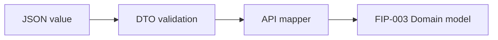
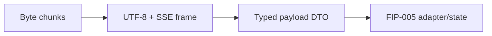

# Project Alice - FIP-004 API Contract Foundation Implementation Plan

## 1. Document Information

| Item | Value |
|---|---|
| Document | `fip-004-api-contract-foundation-plan.md` |
| FIP | FIP-004 API Contract Foundation |
| Status | Draft |
| Draft Planning | In Progress |
| Implementation | Not Started |
| Review Required After Phase 2-4 Design | Yes |
| Target | Phase 1 iOS Frontend |
| Last Updated | 2026-08-19 JST |

本ドキュメントは、Phase 1 Alice APIのJSON、Problem DetailsおよびServer-Sent Events（SSE）をFlutter Frontendの型へ安全に変換するContract Foundationについて、後からGitHub Copilot等のAI Coding Assistantへ実装依頼できる粒度で定義するDraft実装計画である。

本Draft作成時点ではソースコード、Test Code、Fixture、DependencyまたはConfigurationを変更しない。Phase 2〜4設計後のCross-phase ReviewとPhase 0 Final Design Reviewが完了するまで実装しない。

---

## 2. Purpose / Goal

FIP-004の目的は、Backend APIのTransport表現をFrontend Domain / Applicationへ漏らさず、正常Response、Error ResponseおよびSSEを決定論的に検証・変換できる基盤を作ることである。

達成目標:

- API JSONを専用DTOとしてParseできる
- DTOをFIP-003のDomain ModelへMappingできる
- Required Field欠落、型不一致、未知Roleおよび不正TimestampをContract Errorとして検出できる
- RFC 9457 Problem Detailsを安全にParseできる
- HTTP Byte StreamをChunk境界に依存せずSSE Frameへ復元できる
- SSE Event名ごとのPayloadをProvider-independentな型へDecodeできる
- Heartbeatと未知Eventを契約どおり処理できる
- Request / Response BodyやSSE DeltaをLogせずに失敗分類できる
- Fixtureを使ってBackend未完成でもContractを再現できる

---

## 3. Scope

### 3.1 In Scope

- Conversation Response DTO
- Message DTO
- Message Page Response DTO
- Send Message Request DTO
- RFC 9457 Problem Details DTO
- Field Validation Error DTO
- DTOからDomain ModelへのMapping
- JST Offset付きAPI Timestampの形式検証とParse
- API Contract Error Model
- SSE Frame Model / Frame Parser
- `stream.started` Payload DTO
- `assistant.delta` Payload DTO
- `assistant.completed` Payload DTO
- `stream.failed` Payload DTO
- SSE Event名からPayload DTOへのDecoder
- Unknown Response Field / Unknown SSE EventのCompatibility Rule
- JSON / SSE Contract Fixture
- Parser、Mapping、Fixture Unit Test計画

### 3.2 Out of Scope

- 実際のHTTP Request送信
- `http.Client`を使うBackend Client
- Endpoint URL組立て
- HTTP Header設定
- HTTP Statusによる処理分岐
- `ConversationGateway` Port / Adapter
- Riverpod Provider / Notifier
- Screen State、ReducerおよびUI Error Mapping
- UUID v4生成
- Retry、Replay、Idempotency Lifecycle
- Pagination FlowまたはPage Merge
- SSE Event Sequence State Machine
- Temporary Assistant Textの保持
- Automatic Reconnect、Timeout TimerまたはCancellation
- Logging実装
- Backend Integration / E2E Test
- OpenAI固有Event / Model
- Personal Memory、Tool Calling、Agent、Voice Contract
- Phase 2〜4用の汎用Event Framework

---

## 4. Preconditions

実装開始前に次を満たすこと。

- FIP-001 / FIP-002がCompleted / Approvedである
- FIP-003 Draft PlanningがCompletedである
- FIP-003がCross-phase Review後に`Approved / Implementation Ready`である
- FIP-003 Domain Modelの実装が完了している
- FIP-003〜FIP-012 Draft Planningが完了している
- Phase 2〜4 DesignとPhase 1〜4 Cross-phase Reviewが完了している
- 本Draftが必要に応じて修正され、`Approved / Implementation Ready`へ昇格している
- Phase 0 Final Design Reviewが完了している

現時点ではDraft Planningだけを行い、Implementationは開始しない。

---

## 5. Related Design Documents

| Document | Relevant Decision |
|---|---|
| `requirements.md` | P1-FR-001、002、005〜008、NFR-001、002、006〜008 |
| `mvp.md` | Phase 1 Scope / Exclusion |
| `frontend-design.md` | DTO分離、SSE Parser Boundary、Error Handling、Test Level |
| `api-design.md` | Endpoint、Schema、Timestamp、Problem Details、SSE、Error Code、Idempotency |
| `security-design.md` | Response Data、Safe Error、Content / Delta非Logging |
| `test-design.md` | Contract Fixture、Unit TestおよびIntegration Boundary |
| `fip-003-domain-foundation-plan.md` | Domain ModelとValidation Boundary |
| `frontend-implementation-plan.md` | FIP順序、Draft-only方針、AI Coding Assistant Rule |
| `decisions.md` | Accepted Architecture Decision |

API Field、Event名、Error CodeまたはTimestamp Formatに矛盾がある場合、本FIPで推測して変更せず、`api-design.md`を先に整合させる。

---

## 6. Architecture and Dependency Boundary

FIP-004の主要成果物は`conversation/infrastructure/api/`へ置く。

```text
API JSON / SSE Bytes
        ↓
Infrastructure DTO / Parser / Mapper
        ↓
Domain Model
```

Dependency Rules:

- InfrastructureはFIP-003 Domainを利用してよい
- DomainはInfrastructureへ依存しない
- DTOとSSE Payload DTOをPresentationへ直接公開しない
- `http.Response`、`http.StreamedResponse`等のPackage固有TypeをDomainへ渡さない
- FIP-004のParserは`dart:async`と`dart:convert`を利用してよい
- SSE専用Package、JSON Code Generation、Freezed等を追加しない
- FIP-004では新しいPackage Dependencyを追加しない

---

## 7. API Contract Models

### 7.1 ConversationDto

| JSON Field | Dart Type | Required | Mapping Target |
|---|---|---:|---|
| `id` | `String` | Yes | `Conversation.id` |
| `createdAt` | `String` | Yes | Parsed `Conversation.createdAt` |
| `updatedAt` | `String` | Yes | Parsed `Conversation.updatedAt` |

Rules:

- IDはOpaque Stringとして保持する
- Title、Summary、Owner、Message Countを期待しない
- 未知のResponse Fieldは無視する
- Required Field欠落または型不一致はContract Errorとする

### 7.2 MessageDto

| JSON Field | Dart Type | Required | Mapping Target |
|---|---|---:|---|
| `id` | `String` | Yes | `Message.id` |
| `role` | `String` | Yes | `MessageRole` |
| `content` | `String` | Yes | `Message.content` |
| `createdAt` | `String` | Yes | Parsed `Message.createdAt` |

Rules:

- `role`は`user`または`assistant`だけをDomainへMappingする
- 未知RoleはContract Errorとし、将来Roleを自動的に`assistant`へ変換しない
- `content`をTrim、Markdown変換または正規化しない
- AI Provider、Model、Token UsageおよびPersistence Keyを期待しない
- 未知のResponse Fieldは無視する

### 7.3 MessagePageDto

| JSON Field | Dart Type | Required | Meaning |
|---|---|---:|---|
| `messages` | `List<MessageDto>` | Yes | Page内のCanonical Message |
| `nextCursor` | `String?` | Yes | 次Page用Opaque Cursorまたは`null` |
| `hasMore` | `bool` | Yes | 追加Pageの有無 |

Pagination Invariant:

```text
hasMore = true  → nextCursor is non-null and non-empty
hasMore = false → nextCursor is null
```

Invariant違反はContract Errorとする。Cursorの内容を解析、生成または変更しない。Page配列の順序変更、Page MergeおよびMessage ID重複排除はFIP-005 / FIP-011のApplication責務とする。

### 7.4 SendMessageRequestDto

| JSON Field | Dart Type | Required | Source |
|---|---|---:|---|
| `content` | `String` | Yes | `OutgoingMessage.content` |

Rules:

- JSON Objectへ`content`だけを出力する
- Role、Timestamp、Conversation IDまたはIdempotency KeyをBodyへ含めない
- Idempotency Keyは後続FIPでHTTP Headerへ設定する
- ContentをTrimまたは変換しない
- Domainで検証済みの`OutgoingMessage`から作成する
- JSON EncodingやHTTP送信は後続FIPのBackend Client責務とする

---

## 8. API Timestamp Parser

API Response Timestampは次の形式だけを許可する。

```text
YYYY-MM-DDTHH:mm:ss.SSS+09:00
```

例:

```text
2026-08-14T15:00:02.000+09:00
```

Validation Steps:

1. JSON値がStringであることを確認する
2. 年月日、時分秒、ミリ秒3桁および`+09:00`を完全一致で確認する
3. Calendar Dateと時刻が実在することを確認する
4. `DateTime.parse`相当で時点へ変換する
5. 変換結果をDomain Modelへ渡す

次を拒否する。

- `Z`またはUTC表記
- `+00:00`等のJST以外のOffset
- OffsetなしLocal Date-Time
- 小数秒なし、1桁、2桁または4桁以上
- Dateのみ
- 存在しない日付または時刻
- 前後Whitespace

Dartの`DateTime`は元のOffset文字列表現を保持するための型ではなく、時点を表す型として利用する。API ContractとしてのJST形式検証はDTO Mapping時に完了させ、表示時のJST変換はPresentation側の後続FIPで扱う。

Parser ErrorへRaw Timestampを含めない。

---

## 9. DTO to Domain Mapping

### 9.1 Conversation Mapping

```text
ConversationDto
├── id ─────────> Conversation.id
├── createdAt ──> JST validation / DateTime ──> Conversation.createdAt
└── updatedAt ──> JST validation / DateTime ──> Conversation.updatedAt
```

### 9.2 Message Mapping

```text
MessageDto
├── id ─────────> Message.id
├── role ───────> exact mapping ───────> MessageRole
├── content ────> unchanged ───────────> Message.content
└── createdAt ──> JST validation ──────> Message.createdAt
```

一つの`ConversationApiMapper`へConversation / Messageの小規模Mappingを集約し、型ごとに不要なMapper Classを増やさない。DTOの`fromJson`はJSON構造検証を担当し、Domain変換はMapperが担当する。

---

## 10. Problem Details Design

### 10.1 ProblemDetailsDto

| JSON Field | Dart Type | Required |
|---|---|---:|
| `type` | `String` | Yes |
| `title` | `String` | Yes |
| `status` | `int` | Yes |
| `detail` | `String` | Yes |
| `code` | `String` | Yes |
| `requestId` | `String` | Yes |
| `errors` | `List<FieldErrorDto>?` | No |

### 10.2 FieldErrorDto

| JSON Field | Dart Type | Required |
|---|---|---:|
| `field` | `String` | Yes |
| `code` | `String` | Yes |
| `message` | `String` | Yes |

Rules:

- `detail`や`message`の文字列内容で制御分岐しない
- Application ErrorへのMappingでは安定した`code`を利用する
- FIP-004ではHTTP Statusとの一致確認を行わない。実際のHTTP Statusを扱うBackend Clientで確認する
- `errors`が存在する場合はListと各要素のRequired Fieldを検証する
- 未知のResponse Fieldは無視する
- 未知の`code`をJSON Parse Errorにせず、後続のError Mappingで安全なUnknown Categoryとして扱えるよう保持する
- Problem Details、Field ErrorまたはParser ErrorをそのままLogへ出力しない

FIP-004ではUI向け日本語文言の選択、Retry可否およびError Screen Stateを決定しない。

---

## 11. API Contract Error

Transport DataがContractを満たさない場合は、SDKやJSON Decoderの例外をそのまま上位へ公開せず、`ApiContractException`へ分類する。

想定Category:

| Category | Meaning |
|---|---|
| `malformedJson` | JSONとして解析できない |
| `invalidRootType` | Object / List等のRoot型が契約と異なる |
| `missingRequiredField` | Required Fieldが存在しない |
| `invalidFieldType` | Field型が契約と異なる |
| `unknownMessageRole` | Roleが`user` / `assistant`以外 |
| `invalidTimestamp` | API JST Timestamp Contract違反 |
| `invalidPaginationInvariant` | `hasMore`と`nextCursor`が矛盾 |
| `invalidSseFrame` | SSE Frame構造が不正 |
| `invalidSsePayload` | Event Payloadが契約を満たさない |
| `invalidUtf8` | Byte Streamが正しいUTF-8ではない |
| `incompleteSseFrame` | Connection終了時に未確定Frameが残る |

Security Rules:

- ExceptionへRaw JSON、Response Body、SSE Data、DeltaまたはConversation Contentを保持しない
- Exception MessageへField値を含めない
- Field名、Event名および安全なCategoryは保持してよい
- Stack Trace表示やUI文言はこのClassの責務にしない

---

## 12. SSE Frame Parser

### 12.1 Input / Output

Input:

```text
Stream<List<int>> UTF-8 bytes
```

Output:

```text
SseFrame(eventName, data)
```

Parserは`http` Package固有Typeを受け取らず、任意のByte StreamからTestできるPure Infrastructure Componentとする。

### 12.2 Parsing Rules

- Stateful UTF-8 Decoderを使用し、Multi-byte CharacterがChunk途中で分割されても復元する
- 不正UTF-8を置換文字で黙って受理せずContract Errorとする
- `LF`と`CRLF`の両方を受理する
- HTTP Chunk境界をSSE行またはEvent境界として扱わない
- 空行で一つのEventを確定する
- `event:`行からEvent名を取得する
- 一つ以上の`data:`行を受理し、複数行は改行で連結する
- `:`から始まるComment / Heartbeat行は無視する
- `id:`、`retry:`および未知のSSE FieldはFrontend Stateへ公開せず無視する
- Event名またはDataがないAlice Event FrameはContract Errorとする
- Connection終了時に空行で確定していないFrameが残る場合、成功EventとしてDispatchせず`incompleteSseFrame`とする
- ParserはEvent Sequenceの正しさを判定しない

Heartbeat:

```text
: heartbeat
```

HeartbeatはFrame、Message Content、DeltaまたはUI Eventとして出力しない。

### 12.3 Memory Safety Open Point

現在のSource of Truthには、Frontendが受理する単一JSON Response、SSE Frameまたは累積Streaming Responseの最大Byte数が定義されていない。

FIP-004を`Implementation Ready`へ昇格する前に、少なくとも次を`api-design.md`、`security-design.md`または`frontend-design.md`で決定する。

- 単一SSE Frameの最大Byte数
- 単一`assistant.delta`の最大Byte数
- Streaming中の累積Temporary Text上限
- JSON Response Bodyの最大Byte数
- 上限超過時のFrontend Error Category

本Draftでは数値を推測して確定しない。上限未決定のまま無制限Bufferを実装してはならない。

---

## 13. Typed SSE Payload DTO

### 13.1 StreamStartedEventDto

| Field | Type | Required |
|---|---|---:|
| `requestId` | `String` | Yes |

`stream.started`はPersistence完了を意味しない。

### 13.2 AssistantDeltaEventDto

| Field | Type | Required |
|---|---|---:|
| `requestId` | `String` | Yes |
| `delta` | `String` | Yes |

Rules:

- DeltaをTrimまたは正規化しない
- Parser / DTOの`toString()`へDeltaを含めない
- Token Number、Chunk ID、ModelまたはProvider情報を追加しない
- Deltaの連結はFIP-005 / FIP-009のApplication State責務とする

### 13.3 AssistantCompletedEventDto

| Field | Type | Required |
|---|---|---:|
| `requestId` | `String` | Yes |
| `userMessage` | `MessageDto` | Yes |
| `assistantMessage` | `MessageDto` | Yes |

Rules:

- 両MessageをFIP-003のCanonical `Message`へMappingできる
- `userMessage.role`は`user`、`assistantMessage.role`は`assistant`であることをMapping時に確認する
- Streaming Deltaではなく、`assistant.completed`のAssistant Message全文をCanonical Resultとする
- DTOをApplication Stateへ直接渡さない

### 13.4 StreamFailedEventDto

| Field | Type | Required |
|---|---|---:|
| `requestId` | `String` | Yes |
| `code` | `String` | Yes |
| `message` | `String` | Yes |

Rules:

- `message`はBackendが返す安全な説明として保持するが、処理分岐には使用しない
- `retryable` Fieldを期待しない
- Provider固有Errorを追加しない
- Payload全体をLogへ出力しない

---

## 14. SSE Event Decoder

`ConversationSseEventDecoder`は`SseFrame.eventName`を使ってPayload型を選択する。

| Event Name | Decode Result |
|---|---|
| `stream.started` | `StreamStartedEventDto` |
| `assistant.delta` | `AssistantDeltaEventDto` |
| `assistant.completed` | `AssistantCompletedEventDto` |
| `stream.failed` | `StreamFailedEventDto` |
| Unknown Event | Ignore result |

Rules:

- Known EventだけJSON PayloadをParseする
- Known EventのMalformed JSON、Required Field欠落または型不一致はContract Errorとする
- Unknown EventはPayloadを解釈せず無視する
- Unknown Eventを`stream.failed`へ変換しない
- Event Sequence、Terminal Event Exactly OneおよびTerminal後Eventの検証はFIP-005 / FIP-009のApplication State Machine責務とする
- Replayで`assistant.delta`が0件でもDecoder Errorにしない

Unknown EventのIgnoreはAPI v1 Compatibility Ruleであり、未知のRequired Fieldや未知Roleを無視するRuleではない。

---

## 15. State / Data Flow Boundary

### 15.1 JSON Response



### 15.2 SSE



FIP-004は型変換までを担当し、次を行わない。

- Loading / Sending / Streaming Stateへの遷移
- Delta連結
- Canonical Messageとの置換
- Terminal Eventの重複検出
- History再取得判断
- Retry Action選択
- UI表示

---

## 16. Expected File Structure

実装再開時に想定するFileは次のとおり。

```text
frontend/
├── lib/
│   └── conversation/
│       └── infrastructure/
│           └── api/
│               ├── dto/
│               │   ├── conversation_dto.dart
│               │   ├── message_dto.dart
│               │   ├── message_page_dto.dart
│               │   ├── send_message_request_dto.dart
│               │   ├── problem_details_dto.dart
│               │   ├── field_error_dto.dart
│               │   └── conversation_sse_event_dto.dart
│               ├── mapping/
│               │   └── conversation_api_mapper.dart
│               ├── parsing/
│               │   ├── api_contract_exception.dart
│               │   ├── api_timestamp_parser.dart
│               │   ├── sse_frame.dart
│               │   ├── sse_frame_parser.dart
│               │   └── conversation_sse_event_decoder.dart
└── test/
    ├── conversation/
    │   └── infrastructure/
    │       └── api/
    │           ├── dto/
    │           ├── mapping/
    │           └── parsing/
    ├── support/
    │   └── fixture_loader.dart
    └── fixtures/
        └── conversation_api/
            ├── conversation/
            ├── messages/
            ├── problem_details/
            └── sse/
```

`fixture_loader.dart`はTest Supportとして`test/`配下へ置き、Production Buildへ含めない。

空Directory、Barrel File、汎用Network Moduleまたは将来Feature用DTOを先行作成しない。

---

## 17. Component Responsibility Matrix

| Component | Responsibility | Must Not Do |
|---|---|---|
| DTO Classes | JSON構造とRequired Typeの検証 | HTTP、UI、Retryを扱わない |
| `ApiTimestampParser` | API JST Timestampの完全検証とParse | 表示Formatを作らない |
| `ConversationApiMapper` | DTOをDomainへ変換 | JSON Parse、State更新を行わない |
| `ProblemDetailsDto` | RFC 9457 + Alice Field保持 | UI文言やRetryを決定しない |
| `ApiContractException` | 安全な契約違反Category保持 | Raw Payloadを保持しない |
| `SseFrameParser` | ByteからFrameを復元 | Event JSONやSequenceを解釈しない |
| `ConversationSseEventDecoder` | FrameをTyped PayloadへDecode | Delta連結、Terminal管理を行わない |
| Test Fixtures | Backend Contract例を固定 | Secretや実Conversationを含めない |

---

## 18. Contract Fixture Plan

Fixtureはすべて架空のID、Messageおよび安全な内容を使用する。実際のConversation、Credential、EndpointまたはSecretを含めない。

### 18.1 Conversation / Message Fixture

- Conversation正常Response
- Message Page正常Response
- Empty Message Page
- `hasMore=true` / Cursorあり
- `hasMore=false` / Cursorなし
- Unknown Optional Response Fieldあり
- Required Field欠落
- Required Field型不一致
- Unknown Message Role
- JST以外のOffset
- UTC `Z`
- OffsetなしTimestamp
- ミリ秒桁数不正
- Calendar上存在しないTimestamp
- Pagination Invariant違反

### 18.2 Problem Details Fixture

- Common Problem Details
- Validation Error + `errors`
- Empty `errors`
- Unknown Optional Fieldあり
- Unknown Alice Error Code
- Required Field欠落
- Field Error型不一致
- Malformed JSON

### 18.3 SSE Fixture

- Normal: started → multiple delta → completed
- Replay: started → completed without delta
- Failure: started → zero or more delta → failed
- Heartbeat Commentを含むStream
- Unknown Eventを含み、その後Known Eventが継続するStream
- LF Stream
- CRLF Stream
- Multiple `data:` lines
- Japanese Multi-byte Characterを含むStream
- Malformed JSON Payload
- Required Field欠落
- Unknown Message Role in completed payload
- Incomplete Frame at EOF

HTTP Chunk分割はFixture File自体へ固定せず、同じFixture Byte列を1 Byte単位、Multi-byte途中、行途中、Frame途中など複数パターンへTest側で分割する。

---

## 19. Planned Implementation Procedure

Phase 0 Final Design Review後、次の順序で実装する。

1. API / Frontend / Security / Test Designが本Draftと整合しているか再確認する
2. Section 12.3のResponse / SSE Size上限をSource of Truthで確定する
3. `ApiContractException`と安全なCategoryを実装する
4. JSON Field取得用の小規模Private Helper方針を確定する
5. Conversation、Message、Message Page、Request、Problem Details DTOを実装する
6. `ApiTimestampParser`を実装する
7. `ConversationApiMapper`を実装する
8. `SseFrame`とChunk-safe `SseFrameParser`を実装する
9. Typed SSE Payload DTOとEvent Decoderを実装する
10. Contract Fixtureを追加する
11. DTO / Mapping / Parser Unit Testを実装する
12. 禁止Import、Raw Data LoggingおよびScope外実装がないことを確認する
13. Format、Analyze、対象Test、全Frontend Testを実行する

HTTP Client、Gateway、ProviderまたはScreen Stateへ進まない。

---

## 20. Test Plan

### 20.1 DTO Parsing

- 正常JSONから全Required Fieldを取得できる
- Unknown Response Fieldを無視する
- Missing FieldをCategory付きContract Errorにする
- `String`、`int`、`bool`、`List`、Objectの型不一致を検出する
- ContentとSafe Messageを変更しない
- Malformed JSONをRaw Body非保持のContract Errorにする

### 20.2 Timestamp

- 正確なJST + ミリ秒3桁を受理する
- UTC、他Offset、Offsetなし、桁数不正を拒否する
- 存在しない日付・時刻を拒否する
- 前後Whitespaceを拒否する
- ErrorへRaw Timestampを含めない

### 20.3 Domain Mapping

- Conversation DTOを同じIDと時点のDomainへMappingする
- Message DTOを正しいRoleと原文ContentのDomainへMappingする
- Unknown RoleをContract Errorにする
- Completed EventのUser / Assistant Role整合性を確認する
- Message Pageの順序をMapperが変更しない

### 20.4 Pagination DTO

- Empty Pageを受理する
- `hasMore=true`と非空Cursorを受理する
- `hasMore=false`と`null` Cursorを受理する
- 2種類のInvariant違反を拒否する
- Cursor内容を解析または変更しない

### 20.5 Problem Details

- Common FieldとOptional `errors`をParseする
- Unknown Codeを保持してParseを継続する
- `detail` / `message`を条件分岐へ使用しない
- Raw PayloadをExceptionや`toString()`へ露出しない

### 20.6 SSE Framing

- Byte Chunk境界に依存せず同じFrame列を生成する
- Multi-byte Character分割を復元する
- LF / CRLFを同じ意味で扱う
- Multiple `data:` linesを改行結合する
- Heartbeatを出力しない
- Unknown SSE FieldをStateへ公開しない
- Invalid UTF-8とIncomplete EOF FrameをContract Errorにする

### 20.7 SSE Event Decode

- 4種類のKnown Eventを対応DTOへDecodeする
- Unknown Eventを無視して後続Known Eventを処理できる
- Known EventのMalformed / Missing / Wrong Typeを拒否する
- DeltaとSafe Error Messageを変更しない
- ReplayでDeltaなしCompletedを受理する
- Sequence ErrorをDecoderが独自判定しない

### 20.8 Planned Commands

```bash
dart format lib test
flutter analyze
flutter test test/conversation/infrastructure/api
flutter test
```

これらはImplementation再開後に実行するCommandであり、Draft作成時点では実行しない。

---

## 21. Acceptance Criteria

- [ ] API DTOとDomain Modelが分離されている
- [ ] Required Field欠落・型不一致が安全なContract Errorになる
- [ ] Unknown Response FieldがCompatibility Ruleどおり無視される
- [ ] Unknown Message Roleが拒否される
- [ ] API TimestampがJST Offset + ミリ秒3桁で完全検証される
- [ ] Content、Cursor、DeltaおよびSafe Error Messageが変更されない
- [ ] Pagination Invariantが検証される
- [ ] Problem DetailsとField Errorが型安全にParseされる
- [ ] Byte Chunk境界に依存しないSSE Parserになっている
- [ ] HeartbeatとUnknown Eventが契約どおり無視される
- [ ] Known SSE EventがTyped DTOへDecodeされる
- [ ] Sequence State MachineをFIP-004へ実装していない
- [ ] Raw JSON、Response Body、Delta、ContentまたはKeyをLog / Exceptionへ含めていない
- [ ] Contract Fixtureが正常系、境界値、異常系を網羅している
- [ ] Production BuildへFixture Loaderを含めていない
- [ ] 新しいDependency、HTTP Client、GatewayまたはUI Stateを追加していない
- [ ] Response / SSE Size上限が実装前にSource of Truthで確定している
- [ ] 対象Unit Test、`flutter analyze`、全Frontend Testが成功する

---

## 22. Definition of Done

FIP-004 Implementationは次をすべて満たした時点で完了とする。

1. 本DraftがCross-phase Review後に`Approved / Implementation Ready`へ昇格している
2. FIP-003 ImplementationがCompleted / Approvedである
3. Response / SSE Size上限のOpen PointがSource of Truthで解消されている
4. Acceptance Criteriaをすべて満たしている
5. Contract Fixtureが`api-design.md`と一致している
6. Code ReviewでLayer Boundary、Compatibility、SecurityおよびScopeを確認済みである
7. Planned Commandsがすべて成功している
8. 設計との差分がない、または差分が先にDesign / ADRへ反映されている
9. FIP-005が利用できる安定したContract Foundationになっている

Draft計画書作成完了は、FIP-004 Implementation完了を意味しない。

---

## 23. Dependencies

### 23.1 Previous FIPs

| FIP | Dependency |
|---|---|
| FIP-001 | Flutter Project、Analyzer、Test基盤 |
| FIP-002 | Runtime ConfigurationとHTTP Client Lifecycle。FIP-004はClientを使用しない |
| FIP-003 | Conversation、Message、MessageRole、OutgoingMessage、Domain Error / Result |

### 23.2 Subsequent FIPs

| FIP | How FIP-004 Is Used |
|---|---|
| FIP-005 | Application-facing Gateway / StateがDomain ModelとContract Errorを利用する |
| FIP-008 | Initial Conversation / Message Page取得でDTO Mappingを利用する |
| FIP-009 | Send Request DTO、SSE Parser、Typed Eventを利用する |
| FIP-010 | Problem Details、SSE Failure、Protocol ErrorをRetry Stateへ接続する |
| FIP-011 | Message Page DTOとOpaque CursorをPagination Flowで利用する |
| FIP-012 | Error / Streaming状態をAccessible UIへ接続する |
| FIP-013 | Fake BackendとLocal BackendのContract一致をE2Eで確認する |

---

## 24. Phase 2-4 Review Points

### 24.1 Phase 2 Personal Memory

- Memory PayloadやContext情報をPhase 1 Message DTOへ混在させていないか
- Conversation APIとMemory APIのContract Modelを分離できる構成か
- 共通JSON UtilityがFeature間の不自然な依存を作らないか

### 24.2 Phase 3 Tools / External Services

- Tool Call Eventを既存`assistant.delta`へ無理に埋め込まない設計か
- Tool / Approval Event追加時にProvider固有EventをFrontendへ漏らさないか
- Unknown Event Ignore RuleとUser Approval必須EventのCompatibility戦略を再検討する必要があるか

### 24.3 Phase 4 Agent / PC / Browser / Voice

- Agent実行Event、Progress、ApprovalおよびAuditをConversation SSEと分離できるか
- Voice StreamingとText Response SSEを同一Parserへ過剰統合していないか
- Audio、Screenshot、File Content等のSize LimitとSensitive Data Ruleを適用できるか
- Mobile / Desktopで同じDomain Contractを利用しつつTransport Lifecycleを分離できるか

具体的なMemory、Tool、AgentまたはVoice Schemaは本Draftで確定しない。Cross-phase Reviewで必要なBoundary変更だけを評価する。

---

## 25. AI Coding Assistant Constraints

実装再開時、AI Coding Assistantへ次を明示する。

- 本FIPで許可されたFileだけを変更する
- `api-design.md`のField、Event、Error CodeまたはTimestampを独自変更しない
- JSON Code Generation、SSE Package、HTTP Packageまたは新Dependencyを追加しない
- DomainへJSON、HTTP、SSEまたはDTOを漏らさない
- DTOをPresentationへ直接公開しない
- Unknown Response FieldとUnknown SSE EventのRuleを混同しない
- Event Sequence State Machine、Retry、Gateway、ProviderまたはUI Stateを実装しない
- Content、Delta、Cursor、Idempotency Key、Raw BodyまたはSecretをLog / Exceptionへ含めない
- Response / SSE Size上限を推測で決定しない
- Phase 2〜4用Schemaや汎用Transport Frameworkを先行作成しない
- 不明点が実装結果を変える場合は推測せず停止して報告する

---

## 26. Draft Review Checklist

### Scope and Architecture

- [x] API Contract Foundationだけを対象としている
- [x] HTTP通信、Application StateおよびUIを実装対象外としている
- [x] DTOとDomain Modelを分離している
- [x] SSE ParserとEvent State Machineを分離している

### Contract Alignment

- [x] Conversation / Message / Page SchemaがAPI Designと一致している
- [x] JST Offset + ミリ秒3桁を要求している
- [x] Problem DetailsとField Errorを反映している
- [x] 4種類のSSE EventとHeartbeatを反映している
- [x] Unknown Response Field / EventのCompatibility Ruleを反映している

### Reliability and Security

- [x] Chunk境界とMulti-byte Characterを考慮している
- [x] Raw Payload非Loggingを明示している
- [x] Response Size未決定をOpen Pointとして可視化している
- [x] Contract Fixtureに実DataやSecretを使用しない

### Future Boundary

- [x] Phase 2〜4の具体Schemaを確定していない
- [x] Cross-phase Review項目を記録している
- [x] Draft-only方針とImplementation開始条件を明示している

---

## 27. Current Decision and Next Step

現在の状態:

```text
FIP-004 Document: Draft Created
FIP-004 Implementation: Not Started
Cross-phase Review: Required
Blocking Open Point: Response / SSE Size Limits
```

本Draftをユーザーが確認した後、FIP-004のソースコード実装には進まない。採用された場合はDraft PlanningをCompletedとして記録し、次にFIP-005 Application StateのDraft実装計画書作成へ進む。
