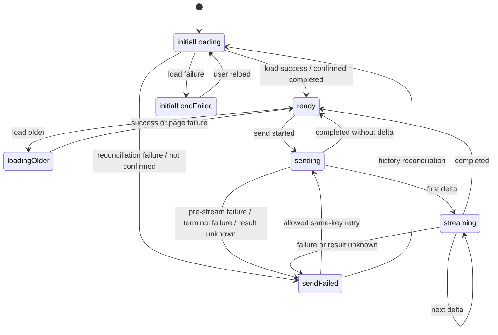
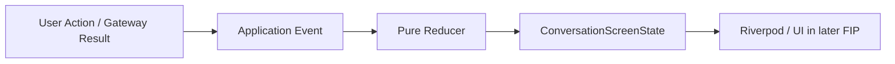
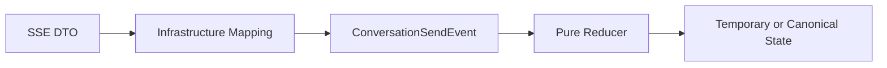

# Project Alice - FIP-005 Application State Implementation Plan

## 1. Document Information

| Item | Value |
|---|---|
| Document | `fip-005-application-state-plan.md` |
| FIP | FIP-005 Application State |
| Status | Approved |
| Draft Planning | Completed / User Approved Revision |
| Implementation | Completed |
| Review Required After Phase 2-4 Design | Yes |
| Target | Phase 1 iOS Frontend |
| Last Updated | 2026-09-12 JST |

本ドキュメントは、Phase 1 FrontendのApplication State、Gateway PortおよびPure Reducerを、後からGitHub Copilot等のAI Coding Assistantへ実装依頼できる粒度で定義するDraft実装計画である。

本Draft作成時点ではソースコード、Test Code、Dependency、AssetまたはXcode設定を変更しない。Phase 2〜4設計後のCross-phase ReviewおよびPhase 0 Final Design Reviewが完了するまで、FIP-005を実装してはならない。

**Revision Note (2026-09-09):** User-approved design clarifications have been incorporated for State × Field invariants, Event payload contracts, reducer failure handling, protocol-violation boundaries, FIP-010 responsibility boundaries, history reconciliation, completed-message merge behavior, immutability, Request ID ownership, pagination cursor matching, and initial-load event boundaries. This revision remains a Draft and is not Implementation Ready until the required Cross-phase Review is completed.

---

## 2. Purpose / Goal

FIP-005の目的は、Conversation画面が持つ状態と状態遷移を、Widget、Riverpod、HTTPおよびSSE Parserから分離したApplication Layerの型として定義することである。

達成目標:

- 画面状態を一つの`ConversationScreenState`で一貫して表現できる
- Canonical Message、Temporary Assistant TextおよびPending Sendを混同しない
- `initialLoading`、`ready`、`loadingOlder`、`sending`、`streaming`、`sendFailed`、`initialLoadFailed`を型で区別できる
- SSE Eventの順序とTerminal EventをPure Reducerで検証できる
- Retry時に同じContentと同じIdempotency Keyを維持できる
- Pagination CursorをOpaque Valueとして安全に保持できる
- HTTPやSSEの失敗をProvider固有ExceptionではなくApplication Errorへ変換できる
- FIP-008〜FIP-011が状態構造を独自判断せず、同じState Machineを利用できる

初心者向けに整理すると、FIP-005は「画面の見た目」を作る作業ではない。Aliceが読込中なのか、返信生成中なのか、失敗して再試行を待っているのかを、アプリ内部で矛盾なく表す設計を作る作業である。

---

## 3. Scope

### 3.1 In Scope

- Application側が所有する`ConversationGateway` Port
- Application向け`MessagePage`
- Provider-independentなSend Stream Event
- `ConversationScreenStatus`
- `ConversationScreenState`
- `ConversationFailure`
- Failure発生OperationとSend Result Certainty
- Pagination State
- Pending Send State
- State Transition Event
- Pure `ConversationStateReducer`
- Canonical Message Merge / Duplicate Rule
- SSE Event Sequence Rule
- RetryとPaginationのApplication Invariant
- Application State Unit Test計画

### 3.2 Out of Scope

- `http.Client`を使うBackend Client実装
- Endpoint URL、HTTP Header、Status Codeの具体的処理
- JSON DTO、Problem Details Parse、SSE Frame Parser
- Riverpod Provider / Notifier実装
- App起動時の実際のHistory取得
- 実際のMessage送信とUUID v4生成
- Retry Button、Error UIおよび日本語表示文言
- Scroll Controller、Follow-latestおよびKeyboard制御
- Widget、Theme、Alice Core、AnimationおよびGolden Test
- Conversation ContentまたはPending Sendの端末永続化
- Automatic HTTP Retry / Automatic SSE Reconnect
- Personal Memory、Tool、Agent、Voice用State
- Phase 2〜4用の汎用Task Stateまたは共通Event Bus

FIP-005では「状態を表す型と純粋な遷移規則」だけを作る。Network I/OとRiverpodによるOrchestrationは後続FIPで実装する。

---

## 4. Preconditions

実装開始前に次を満たすこと。

- FIP-001 / FIP-002がCompleted / Approvedである
- FIP-003 / FIP-004 Draft PlanningがCompletedである
- FIP-003〜FIP-012のDraft Planningが完了している
- Phase 2〜4 Designが完了している
- Phase 1〜4 Cross-phase Reviewが完了している
- FIP-003 / FIP-004が`Approved / Implementation Ready`へ昇格し、実装済みである
- 本Draftが必要に応じて修正され、`Approved / Implementation Ready`へ昇格している
- Phase 0 Final Design Reviewが完了している

現時点ではDraft Planningだけを行い、Implementationは開始しない。

---

## 5. Related Design Documents

| Document | Relevant Decision |
|---|---|
| `requirements.md` | P1-FR-002、005〜008、NFR-002、006〜008 |
| `mvp.md` | Phase 1 Scope / Exclusion |
| `frontend-design.md` | Layer Boundary、Screen State、Initial Load、Send、SSE、Retry、Pagination |
| `frontend-ui-design.md` | 各Stateの表示要件。FIP-005はWidgetを実装しない |
| `api-design.md` | Conversation、Message Page、SSE Sequence、Idempotency、Error Code |
| `security-design.md` | Content、Cursor、Key、Request IDおよびLogの取扱い |
| `test-design.md` | Reducer、Retry State、Pagination MergeのUnit Test |
| `fip-003-domain-foundation-plan.md` | Conversation、Message、OutgoingMessage、Domain Result |
| `fip-004-api-contract-foundation-plan.md` | DTO、Contract Error、Typed SSE Payload、Size Guard |
| `frontend-implementation-plan.md` | FIP順序、Draft-only方針、AI Coding Assistant Rule |
| `decisions.md` | Accepted Architecture Decision |

矛盾が見つかった場合、本FIP内で推測して解消しない。該当するSource of Truthを先に修正する。

---

## 6. Architecture and Dependency Boundary

FIP-005の成果物は`conversation/application/`へ置く。

```text
Presentation / Riverpod（後続FIP）
                ↓
Application State / Reducer / Gateway Port
                ↓
Domain Model
                ↑
Infrastructure Adapter（後続FIP）
```

Dependency Rules:

- ApplicationはFIP-003 Domain Modelを利用してよい
- ApplicationはFlutter Widget、Riverpod、HTTP、JSON、SSE FrameまたはiOS APIへ依存しない
- `ConversationGateway`はApplication側が所有する
- Infrastructureは`ConversationGateway`を実装する
- API DTO、Problem Details DTOおよび`http.Response`をApplication Stateへ保持しない
- Provider固有Exception、OpenAI Model、Token UsageまたはAWS SDK Objectを公開しない
- FIP-005では新しいPackage Dependencyを追加しない

Application StateをPlain Dartに保つことで、Widgetを起動せずに状態遷移を高速かつ決定論的にTestできる。

---

## 7. Application Contract Models

### 7.1 MessagePage

`MessagePage`はAPI DTOではなく、ApplicationがPagination Flowで利用するModelである。

| Field | Dart Type | Meaning |
|---|---|---|
| `messages` | `List<Message>` | 古い順から新しい順のCanonical Message |
| `nextCursor` | `String?` | 次のOlder Page取得に使うOpaque Cursor |
| `hasMore` | `bool` | さらに古いPageが存在するか |

Rules:

- `messages`は防御的Copyを作成したうえで外部から変更できないUnmodifiable Listとして保持する
- StateのConstructor / Factory / `copyWith`も内部Listへの可変参照を外部へ漏らさない
- `hasMore=true`では`nextCursor`が非Nullかつ非Emptyである
- `hasMore=false`では`nextCursor=null`である
- Cursorを解析、生成、Trim、正規化またはLog出力しない
- Page内のMessage順序を変更しない
- DTOからの形式検証はFIP-004、Page Mergeは本FIPのReducerが担当する

### 7.2 ConversationSendEvent

Applicationへ公開するSend Stream EventはProvider-independentな型とする。

```text
ConversationSendEvent
├── streamStarted
├── assistantDelta
├── assistantCompleted
└── sendFailed
```

Payload:

| Event | Required Data |
|---|---|
| `streamStarted` | `requestId` |
| `assistantDelta` | `requestId`, `delta` |
| `assistantCompleted` | `requestId`, Canonical User Message, Canonical Assistant Message |
| `sendFailed` | `requestId?`, `ConversationFailure` |

Rules:

- FIP-004のDTOをそのままApplicationへ公開しない
- DeltaをTrimまたは正規化しない
- Completed EventのMessageをCanonical Resultとする
- Unknown SSE EventはInfrastructureで無視し、Application Eventへ変換しない
- Pre-stream HTTP Failure、Network Failure、Contract FailureおよびSSE `stream.failed`は、すべて安全な`sendFailed`へ変換する
- SSE開始前のFailureでは`requestId`が得られない場合があるためNullを許可する
- 予期可能な通信失敗をDart StreamのRaw Error Channelへ流さず、`sendFailed`として通知してStreamを終了する
- Raw JSON、SSE FrameまたはProvider Eventを保持しない

### 7.3 GatewayResult

Conversation取得とMessage Page取得では、成功と失敗を型で区別する。

```text
GatewayResult<T>
├── GatewaySuccess<T>
└── GatewayFailure<T>
```

`GatewayFailure`は`ConversationFailure`だけを公開し、SDK Exception、Raw ResponseまたはStack Traceを保持しない。

`GET /api/v1/conversation`の`404 CONVERSATION_NOT_FOUND`はPhase 1では正常な未作成状態であるため、`GatewaySuccess<Conversation?>`の`null`へMappingする。`ConversationFailure`へ変換しない。

---

## 8. ConversationGateway Port

Applicationが所有するPortの概念Contract:

```text
ConversationGateway
├── getConversation()
├── getMessages(limit, cursor)
└── sendMessage(outgoingMessage)
```

| Operation | Application Result |
|---|---|
| `getConversation()` | `GatewayResult<Conversation?>` |
| `getMessages(limit, cursor)` | `GatewayResult<MessagePage>` |
| `sendMessage(outgoingMessage)` | `Stream<ConversationSendEvent>` |

Rules:

- Method名の最終Dart Syntaxは上記の意味を維持する範囲で調整できる
- `getMessages`の初回`limit`は50とする
- Cursorは未指定または前回Responseの値を変更せず渡す
- `sendMessage`は検証済み`OutgoingMessage`を受け取る
- Idempotency KeyをRequest BodyではなくInfrastructureがHTTP Headerへ設定できるContractにする
- PortはURL、HTTP Method、Status Code、Header名、DTOまたはClient Typeを公開しない
- POSTを自動Retryしない
- Gateway実装はFIP-008 / FIP-009 / FIP-010で必要な範囲だけ追加する

FIP-005ではPortを定義するが、Backendへ接続するConcrete Adapterは実装しない。

---

## 9. Conversation Screen Status

`ConversationScreenStatus`は次の7値だけを持つ。

| Status | Meaning |
|---|---|
| `initialLoading` | 起動時のConversation / History取得中 |
| `ready` | 入力可能。通常表示またはPagination Failure表示を含む |
| `loadingOlder` | Older Page取得中 |
| `sending` | POST開始から最初のDelta受信前 |
| `streaming` | 一つ以上のDeltaを受信中 |
| `sendFailed` | SendがTerminal FailureまたはResult Unknownへ到達 |
| `initialLoadFailed` | 初期読込に失敗し、Canonical Historyを確定できない |

次の追加StatusをFIP-005で作らない。

- `empty`: Conversation未作成は`ready` + Empty Messagesで表す
- `completed`: 完了後は`ready`へ戻る
- `paginationFailed`: `ready` + Pagination Failureで表す
- `retrying`: Retry開始後は対象Operationの実行Statusで表す
- Phase 2〜4専用Status

Statusを増やさず関連DataとInvariantで意味を補うことで、表示だけの都合でState Machineが分岐し続けることを防ぐ。

---

## 10. ConversationScreenState

### 10.1 Fields

| Field | Type | Meaning |
|---|---|---|
| `status` | `ConversationScreenStatus` | 現在の排他的な主要状態 |
| `conversation` | `Conversation?` | 最後にGETで取得した単一ConversationのSnapshot |
| `messages` | `List<Message>` | 古い順から新しい順のCanonical History |
| `temporaryAssistantText` | `String?` | Streaming中またはPartial Failure時の未確定Text |
| `pagination` | `ConversationPaginationState` | Older Page用Cursorと取得可否 |
| `pendingSend` | `OutgoingMessage?` | Terminal Result確定まで保持するLogical Send |
| `activeRequestId` | `String?` | 現在処理中のSSE Request ID |
| `failure` | `ConversationFailure?` | 現在User Actionが必要なFailure |

### 10.2 General Invariants

- State ObjectはImmutableとする
- `messages`は防御的Copyを作成したうえで外部から変更できないUnmodifiable Listとして保持する
- StateのConstructor / Factory / `copyWith`も内部Listへの可変参照を外部へ漏らさない
- `messages`は古い順から新しい順とする
- `conversation=null`は初期GET時点で未作成だったことを表す。初回Send完了後もAPIにConversation情報が含まれないため、ReducerがConversation IDやTimestampを推測生成してはならない
- Canonical MessageとTemporary Textを同じListへ混在させない
- `temporaryAssistantText`をCanonical `Message`へ変換しない
- `pendingSend`を端末Storageへ保存しない
- `activeRequestId`、Cursor、ContentまたはKeyを`toString()`へ含めない
- 一般的な`Map<String, dynamic>`へStateを格納しない
- 複数の独立BooleanでLoading / Sending / Streamingを表現しない

### 10.3 Status-specific Invariants

| Status | `conversation` | `messages` | `temporaryAssistantText` | `pagination` | `pendingSend` | `activeRequestId` | `failure` |
|---|---|---|---|---|---|---|---|
| `initialLoading` | 初回取得ではNull。Reconciliationでは既存値を保持可能 | 初回取得ではEmpty。Reconciliationでは既存Canonicalを保持可能 | Null | 常に保持 | 初回取得ではNull。Reconciliationでは保持可能 | Null | 初回取得ではNull。Reconciliationでは既存Failureを保持せず開始 |
| `ready` | Nullまたは取得済みSnapshot | Canonical Listを保持。Empty可 | Null | 常に整合した値を保持 | Null | Null | Null、またはPagination Failureの情報のみ許可 |
| `loadingOlder` | 現在のSnapshotを保持 | 既存Canonical Listを保持 | Null | `hasMore=true`かつ`nextCursor`非Null・非Empty | Null | Null | Null |
| `sending` | 現在のSnapshotを保持 | 既存Canonical Listを保持 | Null | 現在値を保持 | 検証済み`OutgoingMessage`を1つ保持 | Null | Null |
| `streaming` | 現在のSnapshotを保持 | 既存Canonical Listを保持 | 非Null。受信Deltaを順序どおり累積 | 現在値を保持 | 1つ保持 | 非Null | Null |
| `sendFailed` | 現在のSnapshotを保持 | Canonical Historyのみ保持 | Partial Textがある場合のみ非Null | 現在値を保持 | Result Unknown等でSame-key Retryが必要な場合のみ保持 | Null | 非Null |
| `initialLoadFailed` | Null | Empty Canonical List | Null | 初期値を保持 | Null | Null | Initial Load Failureを保持 |

**Matrix interpretation rules:**

- `conversation`と`messages`はCanonical Snapshotであり、Streaming途中のTemporary Textを含めない。
- `initialLoading`は初回Initial LoadとHistory Reconciliationの両方に使用する。上表の「保持可能」はReconciliation時に限る。
- `ready`で`failure`を保持できるのはPagination Failureに限る。Initial Load / Send Failureを残したまま`ready`へ遷移しない。
- `sendFailed`の`pendingSend`保持可否は`failure.resultCertainty`とRecovery Policyから決まり、独立Booleanを追加しない。
- `loadingOlder`では取得対象CursorをStateの`pagination.nextCursor`と一致させる。

`sendFailed`では、Same-key Retryが安全な場合に限り`pendingSend`を保持する。既知のTerminal FailureでRetryせずHistory再取得だけを行う場合は、Recovery Policyに従って破棄できる。具体的なUser Action MappingはFIP-010で確定する。

### 10.4 Safe Construction

任意のField組合せを作れるPublic Constructorだけに依存しない。Initial State用FactoryとReducer経由のTransitionを基本とする。

`copyWith`を使用する場合、`null`が「値を維持」なのか「FieldをClear」なのか曖昧なAPIにしてはならない。明示的なClear指定または専用Transitionを使用し、Invalid Stateを作れないことをUnit Testで確認する。

---

## 11. Supporting State Models

### 11.1 ConversationPaginationState

| Field | Type | Meaning |
|---|---|---|
| `hasMore` | `bool` | Older Pageが存在するか |
| `nextCursor` | `String?` | 次回取得でそのまま使用するCursor |

Rules:

- `hasMore=true`ではCursorが非Nullかつ非Empty
- `hasMore=false`ではCursorはNull
- 取得開始時にCursor値を変更しない
- Page取得失敗時も同じCursorを保持する
- Page取得成功時だけResponseの次Cursorへ更新する
- Cursor自体をFailure、Log、AnalyticsまたはUI文言へ含めない
- Pagination Retry可否は`failure.operation`とCursorの有無から導出し、独立Booleanとして保持しない

### 11.2 ConversationFailure

`ConversationFailure`はApplicationが安全に扱える失敗情報であり、次を保持する。

| Field | Type | Meaning |
|---|---|---|
| `category` | `ConversationFailureCategory` | 安定した内部分類 |
| `operation` | `ConversationOperation` | Initial Load、Pagination、Send、Reconciliationのどこで失敗したか |
| `resultCertainty` | `SendResultCertainty?` | Send結果が確定しているか不明か |
| `requestId` | `String?` | 非機密なCorrelation ID |

Phase 1 Category:

- `validation`
- `conversationBusy`
- `requestInProgress`
- `idempotencyConflict`
- `generationFailed`
- `responseTimeout`
- `networkUnavailable`
- `resultUnknown`
- `protocolViolation`
- `responseTooLarge`
- `sseFrameTooLarge`
- `sseStreamTooLarge`
- `assistantContentTooLong`
- `tooManySseEvents`
- `serverFailure`
- `unknown`

Rules:

- Backendの`detail`または`message`文字列でCategoryを決めない
- Provider / SDK Exceptionを保持しない
- Raw Body、Frame、Delta、Message Content、CursorまたはIdempotency Keyを保持しない
- User向け日本語文言をApplication Modelへ固定しない
- CategoryからUI文言とActionへの最終MappingはFIP-010 / Presentation責務とする
- `requestId`は`sending`中に発生した`sendFailed`（Pre-stream Failure）ではNullを許容する
- `requestId`は`streaming`中に発生した`sendFailed`では必須とし、Active Request IDと一致しなければならない。不一致は`protocolViolation`とする

### 11.3 SendResultCertainty

| Value | Meaning |
|---|---|
| `knownFailed` | BackendからTerminal Failureを受け、成功していないことが確定 |
| `resultUnknown` | Connection切断等によりBackend側のTerminal Resultを確認できない |

正常完了はFailure Stateではなく`assistant.completed`によって`ready`へ遷移するため、`knownCompleted`をFailure Modelへ追加しない。

`resultUnknown`では新しいIdempotency Keyを生成しない。History Reconciliationまたは同じPending SendのSame-key Retryだけを候補とする。

---

## 12. State Transition Events

Pure Reducerへ入力するApplication Eventは、Reducerが必要とする最小のDomain/Application型だけをPayloadとして持つ。EventはI/Oを開始せず、HTTP Response、DTO、SSE Frame、Provider Event、Raw BodyまたはSDK Exceptionを保持しない。

### 12.1 Event Contract

| Event | Payload | Reducer Contract |
|---|---|---|
| `initialLoadStarted` | なし | `initialLoading`への遷移を開始する。初回LoadではCanonical Stateを初期化し、Reconciliationでは既存Canonical Messages / Pending Sendを保持する |
| `initialLoadSucceeded` | `Conversation? conversation`, `MessagePage page` | ConversationとPageをCanonical Stateへ反映し`ready`へ遷移する。`conversation=null` + Empty Pageを正常に受理する |
| `initialLoadFailed` | `ConversationFailure failure` | `initialLoadFailed`へ遷移する。初回Load失敗をEmpty Conversationとして扱わない |
| `olderPageLoadStarted` | `String requestedCursor` | 現在の`pagination.nextCursor`と一致する場合だけ`loadingOlder`へ遷移する |
| `olderPageLoadSucceeded` | `String requestedCursor`, `MessagePage page` | Requested Cursorが現在の取得対象と一致する場合だけMergeし、PageのCursor/hasMoreを反映して`ready`へ遷移する |
| `olderPageLoadFailed` | `String requestedCursor`, `ConversationFailure failure` | Requested Cursorが一致する場合、既存MessagesとCursorを維持して`ready`へ戻す。Pagination Failure情報は`ready`に保持可能 |
| `sendStarted` | `OutgoingMessage outgoingMessage` | 検証済みLogical Sendを1つ保持して`sending`へ遷移する。別Send中はInvalid Transition |
| `streamStarted` | `String requestId` | Active Request IDを設定して`streaming`へ遷移する。Request IDをReducerで生成・正規化しない |
| `assistantDeltaReceived` | `String requestId`, `String delta` | Request ID一致を確認し、Temporary Textへdeltaをそのまま順序追加する。Canonical Messagesは変更しない |
| `assistantCompleted` | `String requestId`, `List<Message> messages` | Request ID一致とTerminal未確定を確認し、Completed PayloadのCanonical MessagesをMergeして`ready`へ遷移する |
| `sendFailed` | `ConversationFailure failure` | Terminal Failureを`sendFailed`へ反映する。Partial TextはCanonical化しない。`sending`中は`failure.requestId`のNullを許容し、`streaming`中は`failure.requestId`がActive Request IDと一致することを必須とする。不一致は`protocolViolation`とする |
| `sendResultUnknown` | `ConversationFailure failure` | `resultCertainty=resultUnknown`を保持した`sendFailed`へ遷移し、Pending Sendを失わない |
| `failureDismissed` | なし | `ready`が保持しているPagination Failureをclearする。`sendFailed`からのDismiss遷移はFIP-005で定義しない。具体的な安全Dismiss条件とState遷移はFIP-010の責務とする |
| `historyReconciliationStarted` | なし | `initialLoading`へ遷移し、既存Canonical MessagesとPending Sendを保持する |
| `historyReconciliationSucceeded` | `List<Message> canonicalMessages`, `ReconciliationSendResult sendResult` | 再取得HistoryをCanonical Stateへ反映する。送信結果が確定完了（confirmedCompleted）の場合のみPending SendをClearし`ready`へ遷移する。確認できなかった場合（notConfirmed）はPending Sendを保持したまま`sendFailed`へ遷移する |
| `historyReconciliationFailed` | `ConversationFailure failure` | 元のCanonical MessagesとPending Sendを保持し`sendFailed`へ戻す |

### 12.2 History Reconciliation Result

```text
ReconciliationSendResult
├── confirmedCompleted
└── notConfirmed
```

- `confirmedCompleted`: Reconciliationで対象Logical Sendの完了をCanonical Historyから確認できた状態。Pending SendをClearし`ready`へ遷移する。
- `notConfirmed`: Reconciliationで対象Logical Sendの完了を確認できなかった状態。Pending Sendを維持し、`sendFailed`へ遷移してFIP-010がSame-key Retry等の次のActionを判断する。
- 具体的なMessage Identity判定、再取得回数、Retry UIおよびUser Action MappingはFIP-010で確定する。

### 12.3 Pagination Cursor Contract

`olderPageLoadStarted` / `olderPageLoadSucceeded` / `olderPageLoadFailed`は、取得開始時に使用した`requestedCursor`を必ずPayloadへ持つ。Reducerは現在Stateの`pagination.nextCursor`と完全一致する場合だけ対象Pageを適用する。不一致は`protocolViolation`として扱い、別CursorのPageを黙って適用しない。

### 12.4 Recovery Boundary

Same-key RetryのI/O開始、History再取得、Retry Button、User Actionおよび具体的なRecovery OrchestrationはFIP-010の責務である。本FIPは、ReducerがPending Send、Request ID、Result CertaintyおよびCanonical Stateを安全に維持できるTransition Contractだけを定義する。

## 13. State Transition Rules

### 13.1 Main State Machine



### 13.2 Reducer Result and Invalid Transition

Pure Reducerの返却値は次の型契約とする。

```text
ConversationStateReducerResult
├── StateTransition
│   └── ConversationScreenState nextState
└── StateTransitionFailure
    ├── category: ConversationFailureCategory
    └── operation: ConversationOperation
```

- Valid Eventは`StateTransition`としてNext Stateを返す。
- Invalid Transition、Request ID不一致、Cursor不一致、Terminal重複、Terminal後EventおよびInvariant違反は`StateTransitionFailure`として返す。
- ReducerはInvalid Transitionを例外として外へ投げたりSilent Ignoreしたりしない。
- ReducerはI/O、UUID生成、Clock参照、Gateway呼出し、History Reconciliation開始またはUI Action決定を行わない。
- `StateTransitionFailure`を受けたOrchestratorが、必要に応じてFIP-010のRecovery Flowへ接続する。
- Protocol Violation時の具体的UI表示、Retry、Reconciliation実行可否はFIP-010が決定する。

### 13.3 Concurrent Operation Rule

- `sending`または`streaming`中に新規Sendを開始しない
- `sending`または`streaming`中にOlder Page取得を開始しない
- `loadingOlder`中にSendを開始しない
- 初期読込中にSendまたはPaginationを開始しない
- Invalid TransitionをSilent Ignoreしない
- Invalid Transitionは安全な`protocolViolation`として検出し、必要ならHistory Reconciliationへ接続する

UI ButtonのEnabled / DisabledはこのStateから導出し、Widget独自のBooleanをSource of Truthにしない。

---

## 14. SSE Sequence Reducer Rules

### 14.1 Valid Sequence

```text
sendStarted
    ↓
streamStarted（Pre-stream Failure時は到達しない）
    ↓
assistantDeltaReceived（0回以上）
    ↓
assistantCompleted または sendFailed
```

ReplayではDeltaが0回でも正しい。

HTTP Error、接続開始失敗等のPre-stream Failureでは、`sendStarted → sendFailed`を許可する。この場合、`activeRequestId`はNullでもよい。

### 14.2 Request ID

- Request IDはInfrastructure / Backend Stream Boundaryから`streamStarted` EventのPayloadとして受け取る。
- ReducerはRequest IDを生成、採番、正規化または置換しない。
- `streamStarted`で`activeRequestId`を設定する。
- `streaming`中に発生するDelta / Completed / Failedの`requestId`はActive Requestと一致しなければならない。
- `sending`中（Active Request未設定）に発生するPre-stream`sendFailed`では`failure.requestId`はNullを許容する。
- Request ID不一致は`protocolViolation`として`StateTransitionFailure`を返す。
- Request IDをUIへ表示またはMetric Tagへ使用しない。
- 必要な非機密Traceだけに使用し、ContentやKeyと組み合わせてLogしない。

### 14.3 Delta

- Deltaは受信順にTemporary Text末尾へ追加する
- DeltaをTrim、Normalize、Sortまたは重複除外しない
- Temporary Textは50,000 Unicode Code Pointを超えない
- Size GuardはInfrastructureとReducer境界の双方で防御的に確認する
- 上限超過時は追加を中止し`assistantContentTooLong`へ遷移する
- Delta単位でCanonical Messageを作成しない

### 14.4 Terminal Event

- Terminal Eventは`assistantCompleted`または`sendFailed`のどちらか一つだけ
- Completed後はCanonical User / Assistant Messageを追加または置換し、Temporary Textを破棄する
- 初回Send完了時もConversation IDやTimestampを推測生成せず、`conversation`は次回GETで更新する
- CompletedのAssistant全文を正とし、Delta結合値だけをCanonical化しない
- Failed後はPartial TextをTemporary Failure表示用に保持できるが、Canonical Messageへ追加しない
- Terminal後のEvent、重複TerminalおよびConnection Close前後のContract違反は`protocolViolation`
- Terminal時にPending SendとActive Requestを適切にClearする。ただしResult UnknownでSame-key Retryが必要な場合はPending Sendを保持する

---

## 15. Canonical Message Merge Rules

### 15.1 Initial Page

- Backendから受け取った古い順から新しい順を維持する
- ReducerがTimestampで再Sortしない
- 同一Page内に重複Message IDがある場合はContract / Protocol Failureとする

### 15.2 Older Page

```text
older page messages
        +
existing canonical messages
        ↓
oldest → newest
```

- Older Pageを既存Listの先頭へ結合する
- Message IDで重複を検出する
- 同一IDかつ全Domain Fieldが同じ場合は一件だけ保持する
- 同一IDでRole、ContentまたはTimestampが異なる場合は`protocolViolation`とする
- 重複除外のためにContentやTimestampだけをIdentityとして使用しない
- Page成功時だけ`nextCursor` / `hasMore`をResponse値へ更新する

### 15.3 Completed Messages

`assistant.completed`はDelta結合値ではなく、Event Payloadとして渡されたCanonical Messageを正式結果とする。Mergeは次の順序で決定的に行う。

1. 現在のCanonical Message Listを順序を変えずに基準Listとする。
2. Completed Payload内のMessageを古い順から処理する。
3. IDが存在しないMessageは、Payload内の順序を維持して追加候補とする。
4. 同一IDが既存Listに存在し、全Domain Fieldが一致する場合は既存Entryを維持して重複追加しない。
5. 同一IDでRole、ContentまたはTimestamp等のDomain Identityを構成するFieldが異なる場合は`protocolViolation`としてMerge全体を適用しない。
6. 追加対象は既存Canonical Historyの末尾へ、Completed Payload内の順序どおりに追加する。ReducerはTimestampによる再Sortを行わない。
7. User Message / Assistant Messageの相対順序はBackendのCompleted Payloadを正とし、ReducerがRoleだけを根拠に並べ替えない。
8. Reducerが新しいMessage IDやTimestampを生成・補完しない。

これにより、Completed Payloadと既存Historyの境界重複はIDで一件に統合され、Conflictは部分適用せずProtocol Violationとして検出される。

---

## 16. Retry and Recovery Invariants

FIP-005ではRetry I/Oを実装しないが、後続FIPが破ってはならないRuleを定義する。

### 16.1 Send Retry

- Automatic POST Retryを行わない
- Same Logical Sendでは同じ`OutgoingMessage` Instance相当のContentとKeyを使用する
- Retry時に新しいIdempotency Keyを生成しない
- UserがContentを編集して再送した場合だけ新しいLogical Sendとする
- `REQUEST_IN_PROGRESS`ではBackendの`Retry-After`を後続FIPが扱うが、本FIPでTimerを実装しない
- `IDEMPOTENCY_KEY_CONFLICT`では別Keyを自動生成しない
- Result UnknownではHistory ReconciliationまたはSame-key Retryだけを許可する

### 16.2 Pagination Retry

- Page取得失敗時は既存Canonical Messagesを維持する
- 失敗したCursorを変更せずMemory内に保持する
- User Retryでは同じCursorを再利用する
- Failureを理由に`hasMore=false`へ変更しない
- 別Pageを先に取得しない

### 16.3 Initial Load Retry

- Initial Load Failure後はUser Actionで全初期取得を再実行する
- 失敗ResponseをEmpty Conversationとして扱わない
- `CONVERSATION_NOT_FOUND`だけを正常Empty Stateとして扱う

---

## 17. Error Mapping Boundary

| Source | FIP-005 Responsibility |
|---|---|
| Domain Validation | `ConversationFailure.validation`へ接続可能な型を受ける |
| Problem Details Code | Infrastructureが安定CategoryへMappingし、Applicationへ渡す |
| SSE `stream.failed` | Safe CodeをApplication FailureへMappingする |
| Contract / Protocol Error | `protocolViolation`またはSize Categoryへ分類する |
| Network / Disconnect | Result Certaintyを区別してFailureへ変換する |

FIP-005はBackend Error CodeとApplication Failure Categoryの境界、`operation`、`resultCertainty`およびStateへの反映方法を定義する。FIP-010はCategoryをUser Action、Retry、History Reconciliation等の具体的Recovery ActionへMappingする。FIP-005はUI文言、Retry Button、再取得回数、Timerまたは具体的Orchestrationを決定しない。

`ConversationFailure.unknown`はForward Compatibility用の安全なFallbackであり、未知Errorを成功扱いしたり自動Retryしたりするために使用しない。

---

## 18. Expected File Structure

実装再開時に想定するFileは次のとおり。

```text
frontend/
├── lib/
│   └── conversation/
│       └── application/
│           ├── model/
│           │   ├── message_page.dart
│           │   └── conversation_send_event.dart
│           ├── port/
│           │   └── conversation_gateway.dart
│           ├── error/
│           │   └── conversation_failure.dart
│           └── state/
│               ├── conversation_screen_state.dart
│               ├── conversation_state_event.dart
│               └── conversation_state_reducer.dart
└── test/
    └── conversation/
        └── application/
            ├── model/
            ├── state/
            └── port/
```

小規模Enumや密接に関連するPrivate Typeは、Readabilityを損なわない範囲で上記Fileへ同居させてよい。Class一つごとに機械的にFileを増やさない。

空Directory、Barrel File、共通State Framework、汎用Event BusまたはPhase 2〜4用Stateを先行作成しない。

---

## 19. Component Responsibility Matrix

| Component | Responsibility | Must Not Do |
|---|---|---|
| `MessagePage` | Domain MessageとOpaque Cursorを保持 | JSON Parse、Page取得を行わない |
| `ConversationSendEvent` | Provider-independentなSend Eventを表す | SSE Frame、Provider Eventを保持しない |
| `ConversationGateway` | Applicationが必要とする外部能力を定義 | HTTP / DTO / UIへ依存しない |
| `ConversationScreenState` | 画面の単一State Snapshotを保持 | Network I/O、Widget描画を行わない |
| `ConversationFailure` | 安全な失敗CategoryとRecovery判断材料を保持 | Raw Data、UI文言を保持しない |
| `ConversationStateEvent` | State変更の入力事実を表す | I/Oを開始しない |
| `ConversationStateReducer` | Current State + EventからNext Stateを返す | Clock、UUID、HTTP、Riverpodへ依存しない |

---

## 20. State / Data Flow Boundary



Streaming:



ReducerはI/Oを行わない。同じCurrent Stateと同じEventから、必ず同じNext Stateを返す。

---

## 21. Planned Implementation Procedure

Phase 0 Final Design Review後、次の順序で実装する。

1. FIP-003 / FIP-004の実装済みModelと本Draftの型名を照合する
2. `MessagePage`とPagination Invariantを実装する
3. `ConversationSendEvent`とGateway Resultを実装する
4. `ConversationGateway` Portを実装する
5. `ConversationFailure`、Operation、Result Certaintyを実装する
6. `ConversationScreenState`と安全なInitial Factoryを実装する
7. `ConversationStateEvent`を実装する
8. Pure ReducerのInitial Load Transitionを実装する
9. Pagination TransitionとCanonical Mergeを実装する
10. Send / Streaming / Terminal Transitionを実装する
11. `ConversationStateReducerResult`、Invalid TransitionおよびProtocol Violationを実装する
12. Boundary / Transition / Security Unit Testを実装する
13. Format、Analyze、対象Testおよび全Frontend Testを実行する

HTTP Adapter、Riverpod Notifier、Widgetまたは実際のUser Flowへ進まない。

---

## 22. Test Plan

### 22.1 MessagePage

- Empty Pageを受理する
- `hasMore=true` + 非Empty Cursorを受理する
- `hasMore=false` + Null Cursorを受理する
- Invariant違反を拒否する
- Cursorを変更しない
- Message Listを外部から変更できない

### 22.2 Initial State and Initial Load

- Initial Stateが`initialLoading`である
- Conversation未作成を`ready` + Empty Messagesへ遷移する
- Historyありを順序維持して`ready`へ遷移する
- Failureを`initialLoadFailed`へ遷移する
- Reloadで安全に`initialLoading`へ戻る

### 22.3 Pagination

- `ready` + `hasMore=true`からだけ`loadingOlder`へ遷移できる
- SuccessでOlder Pageを先頭へMergeする
- 同一ID・同一内容の境界重複を一件にする
- 同一ID・異なる内容をProtocol Violationにする
- Failureで既存MessagesとCursorを維持する
- Send中のPagination開始を拒否する

### 22.4 Send and Streaming

- `sendStarted`でPending Sendを一つ保持する
- `streamStarted`でRequest IDを設定する
- Deltaを順番どおりTemporary Textへ連結する
- DeltaをCanonical Messagesへ追加しない
- DeltaなしCompleted Replayを受理する
- CompletedでCanonical User / Assistant Messageへ置換しTemporary StateをClearする
- FailedでPartial TextをCanonical化しない
- Request ID不一致、重複Terminal、Terminal後EventをProtocol Violationにする
- 50,000 Code Pointちょうどを受理し、50,001を拒否する

### 22.5 Retry Invariants

- Result UnknownでPending SendのContentとKeyを維持する
- Same-key Retryで新しいKeyを生成しない
- Known Terminal Result後に不要なPending SendをClearする
- Pagination Retryで同じCursorを維持する
- Initial Load FailureをEmpty Conversationへ変換しない

### 22.6 Security and Boundary

- Application SourceがFlutter、Riverpod、HTTP、JSONまたはInfrastructureをImportしない
- State / Failureの`toString()`がContent、Delta、Cursor、KeyまたはRequest IDを露出しない
- Provider / SDK ExceptionをApplication Modelへ保持しない
- Stateを端末StorageへSerializationするCodeが存在しない
- Phase 2〜4のField、Role、EventまたはPackageが存在しない

### 22.7 Planned Commands

```bash
dart format lib test
flutter analyze
flutter test test/conversation/application
flutter test
```

これらはImplementation再開後に実行するCommandであり、Draft作成時点では実行しない。

---

## 23. Acceptance Criteria

- [x] ApplicationがPlain DartでありFlutter / Riverpod / HTTP / JSONへ依存していない
- [x] `ConversationGateway`をApplication側が所有している
- [x] API DTOやSDK ExceptionをGateway Contractへ公開していない
- [x] 7つのScreen Statusだけを定義している
- [x] Canonical Messages、Temporary Text、Pending Sendを分離している
- [x] 一つのImmutable State Objectが画面状態のSource of Truthになっている
- [x] Status × Field Invariant Matrixで矛盾Stateを防いでいる
- [x] 全ConversationStateEventのPayloadとTransition Contractが定義されている
- [x] Reducerが`StateTransition` / `StateTransitionFailure`を返し、Invalid TransitionをSilent Ignoreしない
- [x] ReducerがPureかつ決定論的である
- [x] SSE Event順序、Request IDおよびTerminal Exactly Onceを検証している
- [x] Completed EventのCanonical Messageを正式結果としている
- [x] Partial TextをCanonical Messageとして確定していない
- [x] Message Mergeが順序維持、ID重複除外およびConflict検出を行う
- [x] Same-key RetryとSame-cursor RetryのInvariantを維持している
- [x] Automatic POST RetryまたはAutomatic Reconnectを追加していない
- [x] State、FailureおよびLogへSensitive Dataを露出していない
- [x] 新しいDependency、Riverpod Provider、HTTP AdapterまたはWidgetを追加していない
- [x] Phase 2〜4用Stateを先行追加していない
- [x] 対象Unit Test、`flutter analyze`および全Frontend Testが成功する

---

## 24. Definition of Done

FIP-005 Implementationは次をすべて満たした時点で完了とする。

1. [x] 本DraftがCross-phase Review後に`Approved / Implementation Ready`へ昇格している
2. [x] FIP-003 / FIP-004 ImplementationがCompleted / Approvedである
3. [x] Acceptance Criteriaをすべて満たしている
4. [x] Reducer Unit Testが全Status、正常遷移、Invalid Transition、Request ID不一致、Cursor不一致およびTerminal重複を網羅している
5. [x] Code ReviewでDependency、State Invariant、SecurityおよびScopeを確認済みである
6. [x] Planned Commandsがすべて成功している
7. [x] 設計との差分がない、または差分が先にDesign / ADRへ反映されている
8. [x] FIP-008〜FIP-011が独自Stateを追加せず利用できるFoundationになっている

Draft計画書作成完了は、FIP-005 Implementation完了を意味しない。

---

## 25. Dependencies

### 25.1 Previous FIPs

| FIP | Dependency |
|---|---|
| FIP-001 | Flutter Project、Analyzer、Test基盤 |
| FIP-002 | App ConfigurationとHTTP Client Lifecycle。FIP-005はClientを直接利用しない |
| FIP-003 | Conversation、Message、OutgoingMessage、Domain Error / Result |
| FIP-004 | DTO Mapping、Contract Error、Typed SSE Payload、Resource Limit |

### 25.2 Later FIPs

| FIP | How FIP-005 Is Used |
|---|---|
| FIP-006 | Visual FoundationはStateへ依存しない |
| FIP-007 | Screen ShellがStateを描画するPresentation Boundaryを用意する |
| FIP-008 | Gatewayを使ってInitial Loadを実行しStateへEventを渡す |
| FIP-009 | Send / SSE EventをReducerへ接続する |
| FIP-010 | Failure CategoryをUI Action、Same-key Retry、Reconciliationへ接続する |
| FIP-011 | Pagination Gateway結果とScroll BehaviorをStateへ接続する |
| FIP-012 | StatusとFailureのSemantics / Visual Gateを検証する |

FIP-006 / FIP-007はApplication StateのI/O処理を追加してはならない。

---

## 26. Phase 2-4 Cross-phase Review Points

### 26.1 Phase 2 Personal Memory

- Memory StateをConversation Message Listへ混在させていないか
- Memory取得中状態をPhase 1 Screen Statusへ無理に追加する必要がないか
- Conversation GatewayがMemory Gatewayの責務を吸収していないか

### 26.2 Phase 3 Tools / External Services

- Tool Call、ApprovalおよびExecution ResultをTemporary Assistant Textへ埋め込む設計になっていないか
- Tool Eventを追加する場合、Conversation Stream EventのVersioningとState Machineをどう分離するか
- Permission Required Stateを単なる`sendFailed`へ誤変換しないか

### 26.3 Phase 4 Agent / PC / Browser / Voice

- Long-running Agent Task StateをConversation Screen Stateへ過剰統合していないか
- Voice Listening / Speaking StateをText Sending / Streamingと同一Statusへ無理に統合しないか
- Mobile / Desktopで共有するApplication StateとPlatform固有Presentationを分離できるか
- Cancellation、ApprovalおよびAudit Stateを安全に拡張できるか

本DraftではPhase 2〜4の具体State、Event、Permission ModelまたはGatewayを確定しない。Cross-phase Reviewで必要なBoundary変更だけを評価する。

---

### 26.x Formal Cross-phase Review Result

FIP-005 Cross-phase Review has been completed against the approved Phase 0–4 design baseline.

- Phase 2 Personal Memory boundary: **PASS**
- Phase 3 Tool / Permission / Approval / Execution boundary: **PASS**
- Phase 4 Agent / PC / Browser / Application / Voice boundary: **PASS**
- Presentation / Application boundary: **PASS**
- Future extension safety / no premature framework introduction: **PASS**
- Critical findings: **0**
- High findings: **0**
- Blocking Medium findings: **0**
- Low findings: **0**

No design contradiction or blocking cross-phase issue was identified. No redesign is required as a result of this review.


## 27. AI Coding Assistant Constraints

実装再開時、AI Coding Assistantへ次を明示する。

- 本FIPで許可されたFileだけを変更する
- Screen Status、State Field、TransitionおよびFailure Categoryを独自追加しない
- HTTP、JSON、SSE Frame、RiverpodまたはWidgetをApplicationへ持ち込まない
- `ConversationGateway`をInfrastructure側で所有しない
- DTO、Problem DetailsまたはSDK ExceptionをApplicationへ公開しない
- Canonical MessageとTemporary Textを同じListへ入れない
- DeltaをCanonical Messageとして逐次保存しない
- Completed全文よりDelta結合値を優先しない
- Invalid TransitionをSilent Ignoreしない
- Same-key RetryでKeyを再生成しない
- Pagination FailureでCursorまたは既存Messagesを破棄しない
- Raw Content、Delta、Cursor、KeyまたはRequest IDを`toString()` / Logへ出力しない
- Stateを端末Storageへ永続化しない
- Phase 2〜4用の汎用State Framework、Event Busまたは空Packageを追加しない
- 不明点がState遷移またはRetry安全性を変える場合は推測せず停止して報告する

---

## 28. Draft Review Checklist

### Scope and Architecture

- [x] Gateway Port、Application StateおよびPure Reducerだけを対象としている
- [x] HTTP Adapter、Riverpod、Widgetおよび実User Flowを対象外としている
- [x] ApplicationがDomainへだけ依存する構成である
- [x] Gateway PortをApplication側が所有している

### State Integrity

- [x] 7つのScreen StatusがFrontend Designと一致している
- [x] Canonical、Temporary、Pendingを分離している
- [x] Status × Field Invariant Matrixを定義している
- [x] SSE SequenceとTerminal Exactly Onceを定義している
- [x] Invalid Transitionを`StateTransitionFailure`として返す契約を定義している

### Retry and Pagination

- [x] Same-key Retry Ruleを維持している
- [x] Result UnknownをKnown Failureと分離している
- [x] Same-cursor Pagination Retryを維持している
- [x] Message MergeとID Conflict Ruleを定義している

### Security and Future Boundary

- [x] Sensitive Data非Loggingを明示している
- [x] Stateの端末永続化を禁止している
- [x] Phase 2〜4の具体仕様を確定していない
- [x] Cross-phase Review項目を記録している

---
- Cross-phase Review: PASS
- Implementation Ready: YES
## 29. Formal Cross-phase Review Resolution

### 29.1 Decision

**FIP-005 Cross-phase Review: PASS**

**FIP-005 Status: Approved / Implementation Ready**

### 29.2 Review Findings

- Critical: 0
- High: 0
- Blocking Medium: 0
- Low: 0

### 29.3 Resolution

The cross-phase review confirmed that the FIP-005 Application State design remains consistent with the approved Phase 0–4 architecture and its boundary invariants.

The review confirmed:
- Conversation History / Application State remains distinct from Personal Memory.
- Conversation state does not become Tool / Approval / Execution state.
- Message retry / reconciliation remains distinct from Tool / Agent side-effect retry.
- Failure and Result Unknown semantics remain explicit and are not guessed.
- Phase 4 Agent / PC / Browser / Voice concepts are not prematurely introduced into Phase 1 Application State.
- Presentation concerns remain outside the Application State responsibility.

No redesign or corrective change is required from the cross-phase review.

### 29.4 Current Gate State

```text
FIP-005 Document: Approved
FIP-005 Planning: Completed
Cross-phase Review: PASS
Implementation Re-review: PASS
G1 Gate: APPROVED
Blocking Finding: 0
Implementation: Completed
```

FIP-005 application state implementation has been completed and verified according to the approved implementation procedure.

