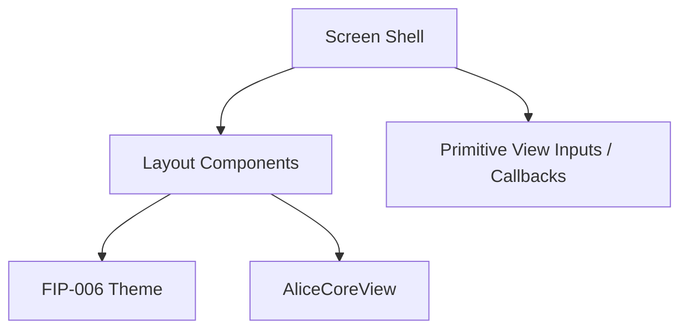
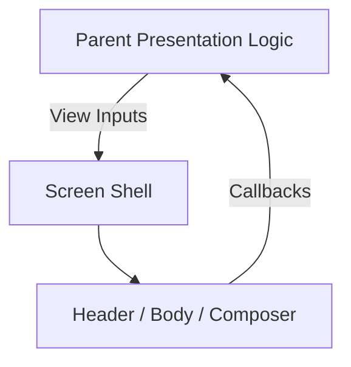

# Project Alice - FIP-007 Screen Shell Implementation Plan

## 1. Document Information

| Item | Value |
|---|---|
| Document | `fip-007-screen-shell-plan.md` |
| FIP | FIP-007 Screen Shell |
| Status | Draft |
| Draft Planning | In Progress / User Review Pending |
| Implementation | Not Started |
| Review Required After Phase 2-4 Design | Yes |
| Target | Phase 1 iOS Frontend |
| Last Updated | 2026-08-19 JST |

本ドキュメントは、Phase 1の単一Conversation画面を構成するHeader、Responsive Alice Core Region、Message ViewportおよびComposerの画面骨格を、後からGitHub Copilot等のAI Coding Assistantへ実装依頼できる粒度で定義するDraft実装計画である。

本Draft作成時点では、ソースコード、Test Code、Dependency、AssetまたはXcode設定を変更しない。Phase 2〜4設計後のCross-phase ReviewおよびPhase 0 Final Design Reviewが完了するまで、FIP-007を実装してはならない。

---

## 2. Purpose / Goal

FIP-007の目的は、Phase 1 Conversation Screenの視覚的・構造的な骨格を作り、後続FIPが同じLayout Boundaryへ履歴、Streaming、ErrorおよびPaginationを安全に組み込める状態にすることである。

達成目標:

- Top Safe Area直下へ固定Headerを配置する
- Header中央へ正確に`Alice`を表示する
- HeaderとComposerの間を、非ScrollのAlice Core Regionと単一のMessage Viewportへ分ける
- Bottom Safe Area直上へComposerを配置する
- Keyboard表示時にComposerを追従させ、Coreより入力とMessageを優先する
- iPhone幅375 / 390 / 430 logical pixelsでOverflowしない
- Dynamic Type拡大時もHeader、Message領域およびComposer操作を失わない
- Pure Presentation Componentとして、Backend、SSEおよびApplication Orchestrationから分離する
- FIP-008〜FIP-011が画面構造を独自に再定義しないようにする

初心者向けに整理すると、FIP-007は家に例えると「部屋割りと柱」を作る段階である。まだ会話履歴を取得したりMessageを送信したりはせず、Alice Core、会話欄、入力欄がどこにあり、Keyboardが開いたときにどう縮むかを決める。

---

## 3. Scope

### 3.1 In Scope

- `ConversationScreenShell`
- `AliceHeader`
- `ConversationBody`
- `AliceCoreRegion`
- `MessageViewport`
- `ComposerPanel`
- `MessageTextField`
- `SendButton`
- Screen Layout Metric
- Safe Area対応
- Keyboard Insets対応
- Alice Core Regionの通常時 / Keyboard時Size計算
- Message Viewportを唯一の主要縦Scroll領域とする構造
- Composerの1〜5行Layout
- Screen Shell用Fixture / Widget / Golden Test計画
- Pure callbackによるDraft変更・Send操作の境界

### 3.2 Out of Scope

- Initial History取得
- Conversation MessageのDomain / API Mapping
- User / Alice Message Bubbleの最終実装
- Markdown Rendererの実装
- Date Separator、History Loading、Inline Errorの実装
- Send Validation、Unicode Code Point計数およびCharacter Counter Logic
- UUID生成、HTTP POSTおよびSSE接続
- Pending Message、Streaming MessageおよびCanonical置換
- Retry / Result Unknown / Partial Failure
- Older History Pagination
- Follow-latest、Scroll Anchorおよび`最新へ`Button
- Riverpod Provider / Notifier / Controller
- Application StateからScreen表示へのMapping
- App起動時の`AliceApp.home`への本番接続
- Navigation、Conversation Listおよび複数Conversation
- Voice、Attachment、Tool、Model選択
- Ambient / TOP Screen
- Desktop / iPad / Landscape Layout
- Phase 2〜4固有のMemory、Tool、AgentまたはVoice UI

FIP-007は表示領域と入力Componentの外形だけを作る。実DataとApplication Stateを結び付ける処理は後続FIPで追加する。

---

## 4. Preconditions

実装開始前に次を満たすこと。

- FIP-001 / FIP-002がCompleted / Approvedである
- FIP-003〜FIP-012のDraft Planningが完了している
- Phase 2〜4 Designが完了している
- Phase 1〜4 Cross-phase Reviewが完了している
- FIP-003〜FIP-006が必要に応じて修正され、`Approved / Implementation Ready`へ昇格している
- FIP-003〜FIP-006のImplementationが完了している
- 本Draftが必要に応じて修正され、`Approved / Implementation Ready`へ昇格している
- Phase 0 Final Design Reviewが完了している

現時点ではDraft Planningだけを行い、Implementationは開始しない。

---

## 5. Related Design Documents

| Document | Relevant Decision |
|---|---|
| `requirements.md` | Single Conversation、Text Chat、StreamingおよびHistory表示 |
| `mvp.md` | Phase 1 Scope / Exclusion |
| `frontend-design.md` | Presentation Boundary、State Management、iOS Portrait Scope |
| `frontend-ui-design.md` | UI-002〜UI-006、UI-012〜UI-016、特にUI-014 Component Structure |
| `security-design.md` | Secret / Provider Detail非表示、Content非Logging |
| `test-design.md` | Widget、Golden、AccessibilityおよびResponsive Test |
| `fip-005-application-state-plan.md` | Screen StateはApplicationで管理し、Widgetは判断を持たない |
| `fip-006-visual-foundation-plan.md` | Theme Token、Alice Core View、Visual State |
| `frontend-implementation-plan.md` | FIP順序、Draft-only方針、AI Coding Assistant Rule |
| `decisions.md` | Accepted Architecture Decision |

Screen LayoutのSource of Truthは`frontend-ui-design.md`のUI-003およびUI-014である。矛盾が見つかった場合、本FIP内で推測して解消せず、Source of Truthを先に修正する。

---

## 6. Confirmed Screen Structure

```text
ConversationScreenShell
├── AliceHeader
├── ConversationBody
│   ├── AliceCoreRegion
│   │   └── AliceCoreView
│   └── MessageViewport
└── ComposerPanel
    ├── MessageTextField
    ├── ComposerValidationMessage Slot
    └── SendButton
```

Rules:

- Phase 1の主要Screenはこの一画面だけとする
- Screen内へConversation List、Tab、SidebarまたはSettingsを追加しない
- Alice CoreとMessageを同じScroll Contentへ入れない
- ComposerをMessage Viewport内へ入れない
- Alice Core、Message、ErrorおよびComposerを重ねて表示しない
- Message Viewportだけを主要な縦Scroll領域とする
- Code / Table / Text Field内部Scrollは局所的な例外として後続FIPで扱う

---

## 7. Target File Structure

Implementation Resume後に、必要なFileだけを次の構成で追加する。

```text
frontend/
├── lib/
│   └── conversation/
│       └── presentation/
│           ├── layout/
│           │   └── conversation_layout_metrics.dart
│           ├── screen/
│           │   └── conversation_screen_shell.dart
│           └── widget/
│               ├── alice_header.dart
│               ├── conversation_body.dart
│               ├── alice_core_region.dart
│               ├── message_viewport.dart
│               └── composer/
│                   ├── composer_panel.dart
│                   ├── message_text_field.dart
│                   └── send_button.dart
└── test/
    └── conversation/
        └── presentation/
            ├── screen/
            │   ├── conversation_screen_shell_test.dart
            │   └── conversation_screen_shell_golden_test.dart
            └── widget/
                └── composer/
                    └── composer_panel_test.dart
```

FIP-007ではMessage Bubble、Error View、Loading IndicatorまたはProvider Fileを先行作成しない。

---

## 8. Dependency Boundary



Dependency Rule:

- Screen ShellとChild ComponentはPresentation Layerへ置く
- FIP-006 Theme Tokenと`AliceCoreView`を利用してよい
- Domain Entity、API DTOまたはInfrastructure Clientを直接受け取らない
- HTTP / SSE / OpenAI / DynamoDBへ依存しない
- Riverpod ProviderをComponent内部で監視しない
- User Actionはcallbackで上位へ通知する
- Screen ShellはApplication State Transitionを判断しない
- Widget TypeをDomain / Application Layerへ漏らさない

---

## 9. ConversationScreenShell Contract

`ConversationScreenShell`は画面領域を組み合わせるPure Presentation Widgetとする。

Conceptual Input:

| Input | Meaning |
|---|---|
| `coreVisualState` | FIP-006の`AliceCoreVisualState` |
| `messageItems` | Message Viewportへ表示するPresentation Widget群 |
| `draftController` | Parentが所有する入力Controller |
| `focusNode` | Parentが所有するComposer Focus |
| `composerEnabled` | Send可能状態ではなく、Composer全体の操作可能状態 |
| `sendEnabled` | Send Buttonの有効状態 |
| `validationMessage` | Input直下へ表示する説明。Nullなら非表示 |
| `onDraftChanged` | 入力変更通知 |
| `onSend` | Send Button Tap通知 |
| `scrollController` | Parentが所有するMessage Scroll Controller |

Rules:

- FIP-007ではこれらの値をApplication Stateから生成しない
- Widget TestではFixture値を直接渡す
- `TextEditingController`、`FocusNode`および`ScrollController`の所有者とDispose責務を明確にし、Shell内部で勝手に再生成しない
- ShellはInput ContentをTrim、Normalize、PersistまたはLogしない
- `onSend`を呼んだだけでDraftをClearしない。Clear TimingはFIP-009が決定する
- Shell自身を`ConsumerWidget`へする必要はない

---

## 10. Root Layout and Safe Area

### 10.1 Root Structure

- Rootは既存`MaterialApp`配下の`Scaffold`として構成する
- Screen BackgroundはFIP-006の`background`
- Background Colorは画面端まで描画してよい
- Interactive ContentはiOS Safe Area内へ置く
- `Scaffold`の標準Keyboard Insets Behaviorを利用する
- Device名、Dynamic Island HeightまたはHome Indicator HeightをHard Codeしない

### 10.2 Vertical Allocation

```text
Available Screen Height
- Top Safe Area
- Header
- Composer
- Bottom Safe Area
= Conversation Body
```

HeaderとComposerは必要な高さを使用し、Conversation Bodyが残りを受け取る。Conversation Body内でCore Regionを計算し、Message Viewportが残りの全領域を使用する。

---

## 11. AliceHeader

| Item | Decision |
|---|---|
| Position | Top Safe Area直下 |
| Content Height | 44 logical pixels |
| Title | `Alice` |
| Alignment | Horizontal / Vertical Center |
| Typography | FIP-006 `title` |
| Background | `backgroundElevated`または承認済みTheme Default |

Headerへ追加しないもの:

- Back Button
- Hamburger Menu
- Edit / New Conversation
- Settings
- Provider / Model名
- Online / Offline表示
- Sending / Streaming / Error状態
- User名`楠瑛`

HeaderはNavigation、Conversation StateまたはActionを所有しない。

---

## 12. ConversationBody

`ConversationBody`は`LayoutBuilder`等で利用可能なBody Heightを取得し、Core RegionとMessage Viewportへ縦分割する。

### 12.1 Normal Core Height

```text
clamp(ConversationBody Height × 0.34, 180, 260)
```

### 12.2 Keyboard Core Height

Keyboard表示中は次の範囲へ縮小する。

```text
clamp(ConversationBody Height × 0.22, 96, 120)
```

Keyboard表示判定は`MediaQuery.viewInsets.bottom > 0`等の利用可能なFramework情報を使用し、特定KeyboardのHeightをHard Codeしない。

### 12.3 Core Visibility Boundary

標準Text Scaleでは、Core配置後のMessage Viewport Heightが160 logical pixels未満になる場合、Core Regionを一時非表示にする。

Dynamic Type拡大時は固定160だけを絶対条件とせず、Focused Input、最低一つのMessage / State表示および操作可能なComposerを優先する。正確なAccessibility FixtureはFIP-012で最終検証し、必要な補正をCross-phase Reviewで本FIPへ反映する。

Rules:

- Device Model名で分岐しない
- Body全体をScroll Viewにしない
- Core縮小によってMessage Scroll Offsetを直接変更しない
- Core表示・非表示でComposer Focusを失わない
- Core表示を守るためにComposerまたは最新Messageを画面外へ押し出さない

---

## 13. AliceCoreRegion

`AliceCoreRegion`はFIP-006の`AliceCoreView`だけを配置する。

Responsibilities:

- 計算済みHeight内でCoreを中央配置する
- Core SizeをRegion Boundsへ収める
- 通常 / Keyboard Size Transitionを300 msで行う
- Core描画がRegion外へOverflowしないようClipする
- Hidden Boundary時はLayout Spaceも解放する

Not Responsibilities:

- Tap、Long Press、DragまたはVoice起動
- Loading / Error Text
- Provider / Model表示
- Conversation State判断
- Scroll Offset管理
- Domain Data受領

FIP-006のReduce Motionが有効でも、RegionのKeyboard Layout TransitionはiOS標準Keyboard追従と操作性を優先する。ただし不要な装飾Motionは追加しない。

---

## 14. MessageViewport

`MessageViewport`は画面内で唯一の主要な縦Scroll領域とする。

### 14.1 Structural Contract

- Canonicalな表示順は古いMessageから新しいMessage
- `reverse: true`を前提にしない
- Horizontal Paddingは`space4` = 16
- Message間Spacingは後続FIPで`space4` = 16を使用する
- Core RegionをScroll Childへ含めない
- ComposerをScroll Childへ含めない
- Streaming / Errorは対象Messageに続くReading Order内へ入れる

### 14.2 FIP-007 Implementation Boundary

FIP-007では、Message Viewportが一つのScroll Containerであることと、外部からFixture Itemを受け取って表示できることだけを実装する。

次は後続FIPへ委ねる。

- FIP-008: Initial Loading / Empty / History Item
- FIP-009: Pending / Streaming Item
- FIP-010: Inline Error / Recovery Action
- FIP-011: Older Loading / Scroll Anchor / Follow-latest / `最新へ`

### 14.3 Controller Boundary

- `ScrollController`は上位Presentation Logicが所有する
- FIP-007はControllerを利用するがPaginationまたはAuto-scrollを実行しない
- Scroll ListenerからNetwork Requestを開始しない
- Scroll Positionを端末Storageへ保存しない

---

## 15. ComposerPanel

`ComposerPanel`はBottom Safe Area直上へ配置し、Software Keyboardへ追従する。

### 15.1 Layout

| Item | Decision |
|---|---|
| Minimum Height | 56 logical pixels |
| Maximum Height | 136 logical pixels |
| Horizontal Padding | 16 logical pixels |
| Input Lines | 1〜5 |
| Send Button | 44 x 44 logical pixels以上 |
| Send Icon | 上向きArrow |
| Placeholder | `メッセージを入力` |

- Text Fieldを左側、Send Buttonを右側へ配置する
- 5行を超えるTextはText Field内部でScrollする
- Composer全体をMessage Viewportへ含めない
- App起動時に自動Focusしない
- Keyboardを閉じてもDraftを消さない
- Return Keyは改行であり、FIP-007でSend Shortcutを追加しない

### 15.2 Conceptual Contract

```text
ComposerPanel
├── draftController
├── focusNode
├── enabled
├── sendEnabled
├── validationMessage
├── onDraftChanged
└── onSend
```

### 15.3 State Boundary

Composerは受け取った状態を表示するだけとする。

- Empty / Whitespace / 10,000 Code Point Validationを実行しない
- UUIDを生成しない
- DraftをClearまたはRestoreしない
- HTTP RequestまたはSSE接続を開始しない
- Sending / Streaming中かを独自判定しない
- Validation Message文言を独自生成しない

これらはFIP-005のStateおよびFIP-009のOrchestrationから与えられる。

---

## 16. MessageTextField

Responsibilities:

- 1〜5行のText入力
- Placeholder `メッセージを入力`
- FIP-006 Theme / Typography適用
- `enabled`状態反映
- `onChanged`通知
- Parent所有Controller / FocusNodeの利用
- Dynamic Typeに応じたHeight再計算
- 5行超過時の内部Scroll

Rules:

- Input Textを加工しない
- ContentをLogしない
- 端末Storageへ保存しない
- 10,000文字で強制切断しない
- Voice / Attachment / Tool Buttonを内包しない
- AutofillまたはSuggestionへSecretを渡さない

---

## 17. SendButton

| Item | Decision |
|---|---|
| Shape | Circle |
| Hit Target | 44 x 44 logical pixels以上 |
| Icon | Upward Arrow |
| Semantic Label | `送信` |
| Enabled State | `sendEnabled`入力に従う |

Rules:

- 無効状態はColorだけでなくTap不可とSemanticsへ反映する
- Button内部でValidationまたはSend処理を行わない
- 有効時のTapで`onSend`を一度通知する
- Long Press、Double TapまたはReturn Keyを別Send Triggerとして追加しない
- Loading SpinnerをButtonへ先行追加しない

多重送信防止はApplication State / FIP-009が`sendEnabled`をfalseにすることで保証する。

---

## 18. Keyboard Behavior

### 18.1 Expected Flow

1. UserがMessage Text FieldへFocusする
2. iOS Keyboardが表示される
3. ComposerがKeyboard直上へ移動する
4. Conversation Bodyの利用可能Heightが縮小する
5. Alice Core Regionが96〜120へ縮小する
6. Message Viewportの最低領域を確保できなければCoreを非表示にする
7. FocusとDraftを維持する
8. Keyboardを閉じると現在状態のままCoreを通常Sizeへ戻す

### 18.2 Prohibited Behavior

- Keyboardを固定Heightとして計算する
- Keyboard表示のたびにScroll Controllerを作り直す
- Core縮小だけを理由に最新Messageへ強制Scrollする
- Core Transition中にFocusを解除する
- ComposerをKeyboardの背面へ残す
- Screen全体を二重Scrollにする

FIP-011でFollow-latest Ruleを追加するまで、FIP-007はKeyboard表示による自動Scroll方針を独自実装しない。

---

## 19. Responsive Boundary

### 19.1 Phase 1 Target

| Item | Scope |
|---|---|
| Platform | iOS Smartphone |
| Orientation | Portrait only |
| Width Fixtures | 375 / 390 / 430 logical pixels |
| Reference Canvas | 390 x 844 logical pixels |
| Minimum iOS | iOS 15 |

### 19.2 Required Behavior

- Horizontal Overflowがない
- Header Titleが切れない
- Send Buttonが欠落しない
- Text Fieldが利用可能幅を受け取る
- CoreがMessageまたはComposerへ重ならない
- Safe Areaを侵害しない
- Dynamic Type標準 / 拡大で主要操作が残る

### 19.3 Out of Scope

- Landscape
- iPad
- macOS / Windows / Linux Desktop
- Foldable / Multi-window
- Desktop Keyboard Shortcut
- Desktop Minimum Window Size

将来Desktop Referenceは、上端中央の`Alice`、左PaneのCore、右PaneのHistory + Composerである。ただしFIP-007にBreakpoint、Two-pane WidgetまたはDesktop Stateを追加しない。

---

## 20. Accessibility

### 20.1 Reading Order

1. Header `Alice`
2. Conversation History
3. 現在のStreaming / Error State
4. Message Input
5. Send Button

Visual上CoreがHeaderとHistoryの間にあっても、装飾要素としてReading Orderへ割り込ませない。

### 20.2 Required Behavior

- Alice CoreはFIP-006どおりDecorative Semantics
- Header Titleは理解可能なTextとして公開する
- Message Text FieldとSend ButtonへLabel / Stateを提供する
- Dynamic Typeを独自Clampしない
- 固定HeightでTextを切らない
- Send ButtonのHit Targetを44 x 44以上にする
- ColorだけでEnabled / Disabledを表さない
- Focused InputとValidation領域をCoreより優先する

FIP-012でVoiceOver、Reduce Motion、Contrastおよび拡大Textを横断検証する。

---

## 21. State and Data Flow

FIP-007では、上位から渡された表示値とcallbackだけを扱う。



禁止Flow:

- `Widget → ConversationGateway`
- `Widget → API DTO Mapper`
- `Composer → UUID Generator`
- `MessageViewport → Pagination HTTP`
- `AliceCoreRegion → Application Reducer`

---

## 22. Error and Fallback Boundary

FIP-007は具体的Error UIを実装しないが、後続Error Componentを配置できる領域を壊さない。

| Condition | Shell Behavior |
|---|---|
| Message Itemなし | Message Viewportを空のまま維持できる |
| Validation Messageあり | Composer内のInput直下Slotへ表示する |
| Core非表示 | Message ViewportへSpaceを返す |
| Keyboard表示 | Composer、Focus、Message領域を優先する |
| Extremely small available height | Coreを非表示にし、操作領域を維持する |

Initial Load Failure、Send FailureおよびStreaming Failureの文言・ActionはFIP-008 / FIP-010で実装する。

---

## 23. Test Strategy

### 23.1 Component Widget Tests

#### AliceHeader

- `Alice`を一度だけ中央表示する
- Content Heightが44である
- Back / Menu / Settings等が存在しない

#### AliceCoreRegion

- 通常時に計算式の180〜260へ収まる
- Keyboard時に96〜120へ収まる
- Viewport最低領域を割る場合に非表示となる
- Size変更でOverflowしない
- Scroll Childではない

#### MessageViewport

- 主要な縦Scroll領域が一つだけである
- Fixture Itemを古い順から新しい順で表示する
- Core / ComposerをScroll Childに含めない
- 受け取ったScroll Controllerを勝手に置換しない

#### ComposerPanel

- Placeholderが`メッセージを入力`
- 1〜5行でHeightが拡張する
- 5行超過時にField内部でScrollする
- Send Button Hit Targetが44 x 44以上
- Send Button Semanticsが`送信`
- Disabled時にcallbackを呼ばない
- `onChanged`で元のTextを通知する
- Return Keyで`onSend`を呼ばない

### 23.2 Screen Layout Tests

次のWidthで検証する。

- 375 logical pixels
- 390 logical pixels
- 430 logical pixels

各Widthで次を確認する。

- Horizontal Overflowなし
- Header / Core / Message / Composerの順序
- CoreとMessageの重なりなし
- ComposerがBottom Safe Area内
- Portraitで操作欠落なし

### 23.3 Height / Keyboard Fixtures

最低限次を用意する。

- 390 x 844、Keyboardなし
- 375 x 667、Keyboardなし
- 390 x 844、Keyboardあり
- 小さいBody HeightでCore非表示
- Composer 1行 / 5行
- Dynamic Type標準 / 拡大

Keyboard Testは特定iPhone名ではなく`MediaQuery.viewInsets`と利用可能SizeをFixtureとして与える。

### 23.4 Golden Tests

- `screen_shell_375_empty.png`
- `screen_shell_390_empty.png`
- `screen_shell_430_empty.png`
- `screen_shell_390_keyboard.png`
- `screen_shell_390_core_hidden.png`
- `screen_shell_390_composer_five_lines.png`
- `screen_shell_390_large_text.png`

Message ContentはLayout確認用の明示的Fixtureとし、本番固定文言として実装しない。

### 23.5 Isolation Tests

- TestがNetworkを要求しない
- Riverpod Provider overrideを要求しない
- OpenAI、BackendまたはDynamoDBを要求しない
- Timerまたは実時間へ依存しない
- Conversation ContentをLogしない

---

## 24. Implementation Steps

Phase 0 Final Design Review後に次の順序で実装する。

1. UI-003 / UI-014とFIP-006 Themeを再確認する
2. `ConversationLayoutMetrics`へ確定Layout値とCore Size計算を追加する
3. `AliceHeader`を実装しWidget Testを追加する
4. `AliceCoreRegion`を実装しFIP-006 `AliceCoreView`を配置する
5. `MessageViewport`を一つの縦Scroll Containerとして実装する
6. `MessageTextField`と`SendButton`をPure Componentとして実装する
7. `ComposerPanel`を組み立てる
8. `ConversationBody`でCore RegionとMessage Viewportを分割する
9. `ConversationScreenShell`でSafe Area、Header、Body、Composerを組み立てる
10. Keyboard InsetsとCore縮小 / 非表示を実装する
11. 375 / 390 / 430幅のWidget Testを追加する
12. Keyboard、5行Composer、Core非表示、Dynamic Type Testを追加する
13. Deterministic Goldenを追加する
14. `dart format lib test`を実行する
15. `flutter analyze`を実行する
16. `flutter test`を実行する
17. Scope外Provider、Network、Message Behavior、Desktop UIが追加されていないことを確認する

FIP-007では`AliceApp.home`を本番Conversation Stateへ接続しない。実Data接続はFIP-008以降で行う。

---

## 25. AI Coding Assistant Task Boundary

### 25.1 Allowed Files

- Section 7で定義したScreen Shell / Layout Component File
- 対応するWidget / Golden Test
- Test Fixtureに必要なPresentation-only Helper

### 25.2 Prohibited Changes

- FIP-003〜FIP-006のDomain / Application / API / Visual Contract
- `AliceApp.home`への本番State接続
- HTTP、SSE、UUID、Retry、PaginationまたはRiverpod Orchestration
- Message Bubble / Markdown / Error UIの先行実装
- Approved Layout値、Text、Safe Area Ruleの独自変更
- Navigation、Conversation List、Settingsまたは複数Screen
- Voice、Attachment、ToolまたはModel選択
- iPad、LandscapeまたはDesktop Layout
- 新しいPackage Dependency
- Conversation ContentのStorage / Logging

### 25.3 Local Decisions Allowed

Source of Truthと矛盾しない範囲で、AI Coding Assistantは次を合理的に決定してよい。

- private Layout Helper名
- `Row` / `Column` / `Expanded`等の標準的な組合せ
- Test Description名
- Keyの局所的な付与
- PainterやCoreの外側に必要なClip Widgetの標準的選択

---

## 26. Acceptance Criteria

FIP-007 Implementationは次をすべて満たすこと。

- [ ] Screen ShellがHeader、Body、Composerの順で構成される
- [ ] Header中央へ`Alice`を正確に表示する
- [ ] HeaderへScope外Action / Statusを追加していない
- [ ] Alice Core Regionが非Scrollである
- [ ] Message Viewportが唯一の主要縦Scroll領域である
- [ ] ComposerがBottom Safe Area直上に固定される
- [ ] Keyboard表示時にComposerが隠れない
- [ ] Keyboard時にCoreが96〜120へ縮小する
- [ ] 必要時にCoreを非表示としてMessage / Composerを優先する
- [ ] Core縮小でFocusまたはDraftを失わない
- [ ] 375 / 390 / 430幅でOverflowしない
- [ ] Portrait以外のLayoutを先行実装していない
- [ ] Composerが1〜5行で動作する
- [ ] Send Buttonが44 x 44以上である
- [ ] Return KeyがSend Triggerになっていない
- [ ] ComponentがApplication / Infrastructureへ依存しない
- [ ] HTTP、SSE、UUID、Retry、Paginationを実装していない
- [ ] Widget / Golden TestがBackendなしで成功する
- [ ] `dart format lib test`が成功する
- [ ] `flutter analyze`が成功する
- [ ] `flutter test`が成功する
- [ ] 新しいDependencyを追加していない

---

## 27. Definition of Done

FIP-007 Implementation完了条件:

1. Section 24の実装と検証が完了している
2. Section 26のAcceptance Criteriaをすべて満たしている
3. 375 / 390 / 430幅とKeyboard FixtureのGoldenがReviewされている
4. Core非表示BoundaryがFixtureで再現可能である
5. Source of Truthとの不整合がない
6. Completion Reportに変更File、Test結果、Visual Review結果、Scope外変更なしが記録されている

Draft計画書作成完了は、FIP-007 Implementation完了を意味しない。

---

## 28. Dependencies with Other FIPs

### 28.1 Inputs

| FIP | Dependency |
|---|---|
| FIP-001 | Flutter / iOS Project Baseline、Portrait設定 |
| FIP-002 | App起動、Configuration、Riverpod Root Scope |
| FIP-003 | Domain ModelをPresentationから分離 |
| FIP-004 | API ContractをPresentationから分離 |
| FIP-005 | Application StateとWidget StateのBoundary |
| FIP-006 | Theme Token、Alice Core View、Visual State |

### 28.2 Consumers

| FIP | How FIP-007 Is Used |
|---|---|
| FIP-008 | Initial Loading / Empty / HistoryをMessage Viewportへ配置する |
| FIP-009 | Draft、Send Enabled、Pending / Streamingを接続する |
| FIP-010 | Inline ErrorとRecovery ActionをReading Order内へ配置する |
| FIP-011 | Pagination、Scroll Anchor、Follow-latest、Keyboard Scrollを追加する |
| FIP-012 | Semantics、Dynamic Type、Reduce Motion、Contrast、Goldenを横断検証する |

後続FIPはHeader、Core / Message分割、Safe AreaまたはComposer位置を独自再設計しない。

---

## 29. Phase 2-4 Extension Boundary

### Phase 2: Personal Memory

- Memory Indicator、Memory管理ScreenまたはMemory ActionをPhase 1 Shellへ追加しない
- Memory ContextがConversation表示へ影響する場合も、具体UIはPhase 2 Designで決定する

### Phase 3: Tools / External Services

- Tool Button、Approval、Execution StatusまたはResult CardをComposerへ先行追加しない
- Tool UIが必要になった時点でMessage Viewport内表示と別Panelの責務を再評価する

### Phase 4: Agent / PC / Browser / Voice

- Voice Button、Listening State、Agent TimelineまたはPC操作Approvalを先行追加しない
- Mobile Ambient / TOPおよびDesktop Two-pane LayoutはPhase 4 Requirementを入力として設計する
- Phase 1 Screen Shellを無理に一つのUniversal Responsive Widgetへしない

Phase 1では将来用Slot、Sidebar、ToolbarまたはNavigation Railを空のまま追加しない。

---

## 30. Cross-phase Review Checklist

Phase 2〜4 Design完了後に次を再確認する。

- [ ] Single Conversation Screen BoundaryがPhase 1実装として維持できる
- [ ] Personal Memory UI追加がPhase 1 Shellへ不要な依存を要求しない
- [ ] Tool / Approval UIをMessage Reading Orderへ安全に統合できる
- [ ] Voice利用時にComposerとAmbient Screenを明確に分離できる
- [ ] Agent状態をHeaderへ無制限に追加しない
- [ ] Desktop Two-pane LayoutをMobile固定値から派生させていない
- [ ] Permission / Security状態を装飾だけで表現しない
- [ ] Screen ShellがDomain / Application / Infrastructureから分離されている
- [ ] Future Slotや空Widgetを先行作成していない

---

## 31. Draft Review Checklist

### Scope and Boundary

- [x] Screen ShellとLayoutだけに限定している
- [x] History / Send / SSE / Error / Paginationを後続FIPへ分離している
- [x] WidgetがApplication / Infrastructureへ依存しない
- [x] Phase 2〜4の具体仕様を確定していない

### Layout Contract

- [x] Header、Core、Message、Composerの順序を明記している
- [x] Safe AreaとKeyboard Behaviorを明記している
- [x] Core通常Size / Keyboard Size / Hidden Boundaryを明記している
- [x] Message Viewportを単一主要Scrollとしている
- [x] Composer 1〜5行と44 x 44 Sendを明記している

### Quality

- [x] 375 / 390 / 430幅のTestを明記している
- [x] Dynamic TypeとReading Orderを明記している
- [x] Golden / Isolation Testを明記している
- [x] AI Coding AssistantのAllowed / Prohibited Changesを明記している

---

## 32. Current Decision and Next Step

現在の状態:

```text
FIP-007 Document: Draft Created
FIP-007 Draft Planning: In Progress / User Review Pending
FIP-007 Implementation: Not Started
Cross-phase Review: Required
```

本Draftをユーザーが確認・採用した後、Draft Planningを`Completed / User Confirmed`へ更新する。ソースコード実装には進まず、次にFIP-008 Initial HistoryのDraft実装計画書作成へ進む。
