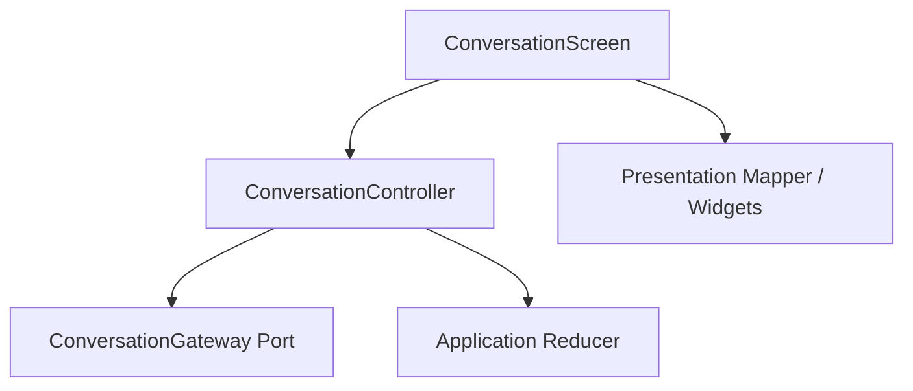
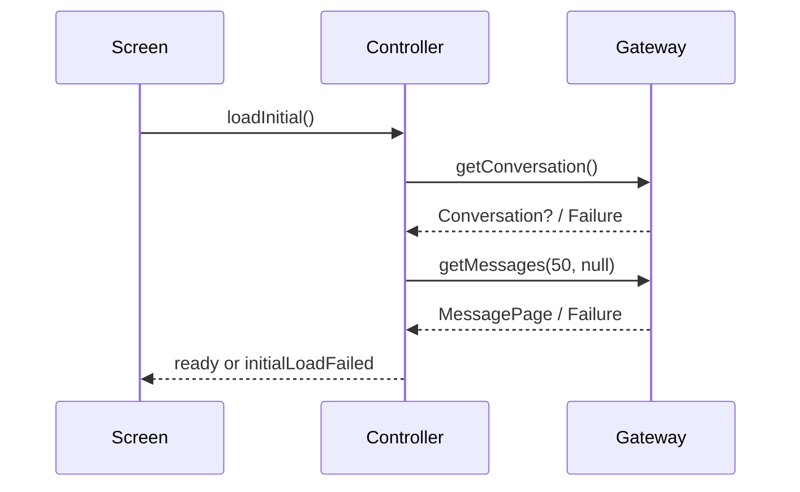

# Project Alice - FIP-008 Initial History Implementation Plan

## 1. Document Information

| Item | Value |
|---|---|
| Document | `fip-008-initial-history-plan.md` |
| FIP | FIP-008 Initial History |
| Status | Draft |
| Draft Planning | In Progress / User Review Pending |
| Implementation | Not Started |
| Review Required After Phase 2-4 Design | Yes |
| Target | Phase 1 iOS Frontend |
| Last Updated | 2026-08-20 JST |

本ドキュメントは、Phase 1 Frontendの起動時Conversation / Message History取得、Initial Loading、Empty State、Canonical History表示およびInitial Load Failureを、後からGitHub Copilot等のAI Coding Assistantへ実装依頼できる粒度で定義するDraft実装計画である。

本Draft作成時点では、ソースコード、Test Code、Dependency、AssetまたはXcode設定を変更しない。Phase 2〜4設計後のCross-phase ReviewおよびPhase 0 Final Design Reviewが完了するまで、FIP-008を実装してはならない。

---

## 2. Purpose / Goal

FIP-008の目的は、AppがConversation Screenを開いたとき、BackendをSource of Truthとして最新50件のCanonical Historyを安全に取得し、排他的な画面状態として表示できるようにすることである。

達成目標:

- Initial Loadを一度だけ開始する
- Conversation基本情報と最新Message Pageを確定順序で取得する
- `CONVERSATION_NOT_FOUND`をErrorではなく正常な未作成状態として扱う
- Loading、Empty、History、Initial Load Failureを同時表示しない
- APIの古い順から新しい順を維持する
- JSTの日付境界を端末Timezoneに依存せず表示する
- Initial Load FailureからUser操作でFlow全体を再実行できる
- ComposerをInitial Loading / Failure中は無効、Ready時は利用可能にする
- Application State、Presentation MappingおよびWidgetを分離する
- FIP-009〜FIP-011がCanonical Historyを共通の基盤として利用できるようにする

初心者向けに整理すると、FIP-008はAliceを開いた直後に「過去の会話を読み込む」作業である。まだ新しいMessageは送らず、保存済み履歴があるか、初回利用で空なのか、通信に失敗したのかを正しく見分けて表示する。

---

## 3. Scope

### 3.1 In Scope

- Initial Load Orchestration
- `ConversationGateway.getConversation()`利用
- `ConversationGateway.getMessages(limit: 50, cursor: null)`利用
- Manual Riverpod Provider / Controller
- Application ReducerへのInitial Load Event入力
- Initial Loading Presentation
- 300 ms Loading Indicator表示Delay
- Empty Conversation Presentation
- Canonical Message History Presentation
- User / Alice Message Bubble
- Safe Alice Markdown Rendering
- JST Date Separator
- Initial Load Failure Presentation
- `再読み込み`Action
- Initial Page受信時の一回限りのLatest位置表示
- Initial History用Unit / Widget / Golden Test計画
- `flutter_markdown_plus 1.0.12`の導入

### 3.2 Out of Scope

- Message送信
- UUID v4生成
- POST / SSE接続
- Pending User Message
- `thinking` / `streaming` Presentation
- Send Failure / Result Unknown
- Older Page取得
- Cursorを使った追加Request
- Pagination Error / Retry
- Follow-latest、User Scroll判定および`最新へ`Button
- Scroll Anchor復元
- Conversation ContentまたはScroll Positionの端末永続化
- Automatic Retry
- Background Refresh / Polling
- Pull-to-refresh
- Conversation List / Navigation
- Personal Memory、Tool、AgentまたはVoice UI
- Concrete HTTP `ConversationGateway` Adapter
- Production `AliceApp.home`への接続

FIP-008ではApplication Flowと表示をFake Gatewayで完成・検証する。Concrete HTTP GatewayとProduction Wiringは、GET / POST / SSEを一つのAdapterとして不完全なく実装できるFIP-009で追加する。FIP-008で`sendMessage()`だけが未実装のGateway Adapterを作ってはならない。

---

## 4. Preconditions

実装開始前に次を満たすこと。

- FIP-001 / FIP-002がCompleted / Approvedである
- FIP-003〜FIP-012のDraft Planningが完了している
- Phase 2〜4 Designが完了している
- Phase 1〜4 Cross-phase Reviewが完了している
- FIP-003〜FIP-007が必要に応じて修正され、`Approved / Implementation Ready`へ昇格している
- FIP-003〜FIP-007のImplementationが完了している
- 本Draftが必要に応じて修正され、`Approved / Implementation Ready`へ昇格している
- Phase 0 Final Design Reviewが完了している

現時点ではDraft Planningだけを行い、Implementationは開始しない。

---

## 5. Related Design Documents

| Document | Relevant Decision |
|---|---|
| `requirements.md` | Single Conversation、History保存・参照、Streaming前提 |
| `mvp.md` | Phase 1 Scope / Exclusion |
| `frontend-design.md` | Initial Load順序、Screen State、JST Parse、Pagination Boundary |
| `frontend-ui-design.md` | UI-004、UI-005、UI-007、UI-008、UI-009、UI-014、UI-015 |
| `api-design.md` | GET Conversation、GET Messages、limit、Ordering、Empty、Problem Details |
| `security-design.md` | Content / Cursor / Internal Detail非Logging、端末非永続化 |
| `test-design.md` | Unit、Contract Fixture、Widget、Golden、Failure Test |
| `fip-003-domain-foundation-plan.md` | Conversation、Message、Role、JST Timestamp |
| `fip-004-api-contract-foundation-plan.md` | DTO、Mapper、Problem Details、Size Guard |
| `fip-005-application-state-plan.md` | Gateway Port、Initial State、Reducer、Failure Category |
| `fip-006-visual-foundation-plan.md` | Theme、Alice Core Visual State |
| `fip-007-screen-shell-plan.md` | Header、Core Region、Message Viewport、Composer |
| `frontend-implementation-plan.md` | FIP順序、Draft-only方針 |

API Field、Error Code、StateまたはUI文言に矛盾がある場合、本FIPで推測せずSource of Truthを先に修正する。

---

## 6. Architecture and Dependency Boundary



Dependency Rules:

- ControllerはApplication StateとGateway Portを利用する
- WidgetはControllerから公開されたStateとcallbackだけを利用する
- WidgetはGateway、DTO、HTTPまたはJSONへ依存しない
- ControllerはAPI DTOまたは`http.Response`を受け取らない
- InfrastructureのDTO / Mapper / Size GuardはFIP-004の責務を維持する
- Domain / ApplicationはFlutter WidgetまたはRiverpod Typeへ依存しない
- ProviderはPresentation Composition Rootへ置き、PortをApplication側が所有する
- FIP-008はConcrete HTTP Gatewayを作らない

---

## 7. Target File Structure

Implementation Resume後に必要なFileだけを追加する。

```text
frontend/
├── pubspec.yaml
├── pubspec.lock
├── lib/
│   └── conversation/
│       └── presentation/
│           ├── controller/
│           │   └── conversation_controller.dart
│           ├── mapper/
│           │   └── conversation_message_view_mapper.dart
│           ├── model/
│           │   └── conversation_message_view_data.dart
│           ├── provider/
│           │   └── conversation_providers.dart
│           ├── screen/
│           │   └── conversation_screen.dart
│           └── widget/
│               └── history/
│                   ├── initial_history_loading_view.dart
│                   ├── empty_conversation_view.dart
│                   ├── initial_load_error_view.dart
│                   ├── conversation_message_item.dart
│                   ├── user_message_bubble.dart
│                   ├── alice_message_bubble.dart
│                   ├── alice_markdown_body.dart
│                   └── date_separator.dart
└── test/
    └── conversation/
        └── presentation/
            ├── controller/
            │   └── conversation_controller_test.dart
            ├── mapper/
            │   └── conversation_message_view_mapper_test.dart
            ├── screen/
            │   ├── conversation_screen_test.dart
            │   └── conversation_screen_golden_test.dart
            └── widget/
                └── history/
                    └── alice_markdown_body_test.dart
```

FIP-008ではConcrete Gateway、Send Widget、Pagination WidgetまたはFuture Feature Fileを作らない。

---

## 8. Dependency Addition

FIP-008 Implementation時に、承認済みMarkdown Rendererだけを追加する。

```yaml
dependencies:
  flutter_markdown_plus: 1.0.12
```

Rules:

- Exact Versionを指定する
- `pubspec.lock`を更新・Commit対象とする
- 実装時にFlutter 3.47.0 / Dart 3.13.0とのCompatibility、Security IssueおよびLicenseを再確認する
- 問題がある場合、AIがVersionを独自変更せずDesign Documentを先に更新する
- Syntax Highlight、URL Launcher、HTML RendererまたはImage Loader用Dependencyを追加しない

---

## 9. ConversationGateway Provider Boundary

FIP-005で定義した`ConversationGateway`をProvider経由でControllerへ注入する。

```text
conversationGatewayProvider
        ↓
conversationControllerProvider
        ↓
ConversationScreen
```

Rules:

- `conversationGatewayProvider`は未Override / 未Wiring時に明示的に失敗する
- FIP-008 TestではFake GatewayへOverrideする
- Production Concrete GatewayはFIP-009でProviderへ接続する
- Test用FakeをProduction CodeのDefaultへしない
- Gateway InstanceをWidgetの`build()`ごとに生成しない
- Controller Testから成功、404相当、Failureおよび遅延を制御できるようにする

FIP-008完了時点では`ConversationScreen`をProduction Homeへ接続しない。これにより未実装の`sendMessage()`を持つ不完全Adapterや、開発用Fakeが製品起動経路へ混入することを防ぐ。

---

## 10. ConversationController

### 10.1 Responsibility

- Initial `ConversationScreenState`を`initialLoading`で生成する
- Initial Loadを明示的に開始する
- Gateway Operationを確定順序で呼ぶ
- ResultをFIP-005 Reducer Eventへ変換する
- 同時Initial Loadを一つに制限する
- Userの`再読み込み`を受け付ける
- Dispose後または古いGenerationのResultをStateへ反映しない

### 10.2 Non-responsibility

- JSON Parse / DTO Mapping
- HTTP Header / Endpoint組立て
- UI文言生成
- Message Widget生成
- Scroll操作
- Automatic Retry
- Timestamp Format
- Conversation Content Logging

### 10.3 Riverpod Form

Code Generationを使わないManual Riverpod Providerを採用する。Application State自体がLoading / Failureを表すため、`AsyncValue<ConversationScreenState>`を重ねて二重State Machineにしない。

Controllerは一つの`ConversationScreenState`をSource of Truthとして公開する。

---

## 11. Initial Load Flow

### 11.1 Request Sequence



### 11.2 Detailed Rules

1. Screen初回表示後に`loadInitial()`を一度だけ呼ぶ
2. Stateはすでに`initialLoading`である
3. `getConversation()`を呼ぶ
4. `CONVERSATION_NOT_FOUND`はGatewayが`Success(null)`へMappingする
5. Conversation取得がFailureならMessage取得を開始しない
6. Conversation取得成功後、`getMessages(limit: 50, cursor: null)`を呼ぶ
7. Message Page成功時、Conversation Snapshot、Messages、PaginationをReducerへ渡す
8. Reducerは`ready`へ遷移する
9. いずれかのFailureでは`initialLoadFailed`へ遷移する

Conversationが未作成で`conversation=null`でも、Messages Endpointの空Collection Contractを確認するためInitial Message Page取得を行う。

### 11.3 Concurrency Guard

- 同じControllerでInitial Loadを同時に二つ開始しない
- Retry Button連打による二重Requestを防ぐ
- Rebuildだけで再取得しない
- 古いRequest完了が新しいRetry結果を上書きしない
- Invalid TransitionをSilent IgnoreせずReducer Ruleへ従う
- FIP-008ではRequest Cancellation Packageを追加しない

---

## 12. Initial State Presentation

| Application State | Main View | Composer | Alice Core |
|---|---|---|---|
| `initialLoading` 0〜299 ms | Message Areaは空白 | 入力・送信無効 | Static `idle` |
| `initialLoading` 300 ms以降 | Progress + Loading Label | 入力・送信無効 | Static `idle` |
| `ready` + 0 Messages | Empty State | 入力可能 | `idle` |
| `ready` + History | Canonical History | 入力可能 | `idle` |
| `initialLoadFailed` | Initial Load Error | 入力・送信無効 | `unavailable` |

Static `idle`はFIP-006の`AliceCoreView`を`TickerMode(enabled: false)`配下で表示する。Reduce Motion FlagをInitial Loading制御へ流用しない。

Loading、Empty、HistoryおよびInitial Load Errorを同時表示してはならない。

---

## 13. Loading Indicator Delay

Initial Loading IndicatorはRequest開始から300 ms経過しても完了していない場合だけ表示する。

Rules:

- 300 msはUIのちらつきを防ぐDelayでありNetwork Timeoutではない
- Request開始自体を300 ms遅らせない
- 299 msまでに完了した場合はIndicatorを一度も表示しない
- 300 ms以降はIndeterminate Progress Indicatorと`会話を読み込んでいます`を表示する
- Loading開始時のAccessibility Announcementは一度だけにする
- RebuildごとにTimerを作成しない
- Load完了、FailureまたはDispose時にPending Timerを無効化する
- 新しいPackageを使わずFlutter / Dart標準機能で実装する

---

## 14. Empty Conversation State

### 14.1 Display Condition

次のすべてを満たす場合だけEmpty Stateを表示する。

1. Initial Loadが正常完了している
2. Canonical Messagesが0件である
3. Pending User Messageが存在しない
4. Temporary Alice Messageが存在しない
5. Initial Load Failureが存在しない

Phase 1では、Conversation未作成と作成済み0件を同じEmpty Stateとして扱う。

### 14.2 Text

```text
何から始めましょうか？

相談したいことや、聞きたいことを入力してください。
```

Rules:

- User名`楠瑛`を固定表示しない
- `Aliceです`等の自己紹介を重複表示しない
- Suggestion Chipを追加しない
- Empty StateをMessage、Domain EntityまたはHistoryとして扱わない
- ID、RoleまたはTimestampを付与しない
- Backendへ保存しない
- FIP-007のCore Regionが存在するため、Message Viewport内へ二つ目のAlice Coreを追加しない
- Message Viewportの利用可能領域内でWelcome Textを中央寄せにする
- Keyboard表示時は完全な中央よりComposer非重複を優先する

---

## 15. Canonical Message Presentation Model

Presentation Layerで次を定義する。

```text
ConversationMessageViewData
├── messageId
├── role
├── content
├── createdAt
├── jstCalendarDate
└── presentationState = canonical
```

Rules:

- Domain `Message`からPresentation Mapperで生成する
- API DTOを直接受け取らない
- ContentをTrim、NormalizeまたはMarkdown変換した値で上書きしない
- Message IDをWidget Keyに利用できる
- API配列の古い順から新しい順を維持する
- Reducer / MapperがTimestampで再Sortしない
- FIP-008では`canonical`だけを生成する
- Pending / Streaming / Partial FailedはFIP-009 / FIP-010で追加する

---

## 16. Date and Time Presentation

Backendの`createdAt`はJST Offset付きCanonical値であり、FIP-004で検証済みの`DateTime`として受け取る。

### 16.1 JST Conversion

表示用Calendar Dateは、端末Timezoneに関係なくUTC+09:00へ変換する。

```text
JST = UTC instant + 09:00
```

端末のLocal Timezoneへ単純変換してはならない。

### 16.2 Date Separator

- 最初のMessage前にそのMessageの日付を表示する
- 直前MessageとJST Calendar Dateが変わる位置へ表示する
- Formatは`yyyy年M月d日`
- Messageごとの時刻は通常状態で表示しない
- Streaming Temporary MessageにはCanonical Timestampがない
- `intl` PackageをFIP-008のためだけに追加しない

Example:

```text
2026年8月19日
```

---

## 17. User Message Bubble

- 右寄せ
- Message Area有効幅の最大78%
- Backgroundは`surfaceStrong`
- Textは`textPrimary`
- Horizontal Padding 14、Vertical Padding 10
- Corner Radius 16〜18
- 強いShadowを使用しない
- User Label、Avatar、Delivery Status、Read Receipt、Timestampを常時表示しない
- Textを選択・コピー可能にする
- 改行と連続する空行を保持する
- RoleをColorだけでなくAlignmentとSemanticsでも識別可能にする

---

## 18. Alice Message Bubble and Safe Markdown

### 18.1 Layout

- 左寄せ
- Message Area有効幅の最大88%
- Backgroundは`surface`
- Textは`textPrimary`
- Horizontal Padding 14、Vertical Padding 10
- Corner Radius 16〜18
- Role Label `Alice`、Avatar、Monogram、Core Thumbnail、Timestampを常時表示しない

### 18.2 Markdown

`flutter_markdown_plus 1.0.12`のNon-scrolling `MarkdownBody`相当をPresentation Layer内だけで利用する。

Supported:

- Paragraph / Line Break
- Heading
- Bullet / Numbered List
- Bold / Italic
- Inline Code
- Fenced Code Block
- Table
- Linkの識別・選択・コピー

Security Rules:

- `selectable: true`
- ImageをNetwork、FileまたはAssetから読み込まない
- Raw HTMLを実行しない
- Link Tapで外部遷移しない
- `javascript:`、`data:`、`file:`およびUnknown Schemeを開かない
- Renderer Error時は安全なPlain Text Fallbackを表示する
- ContentをLogへ出力しない
- Package固有TypeをDomain / Applicationへ漏らさない

Code BlockとTableの横Scrollは、Message Viewportの縦Scrollを置き換えない局所Scrollとする。

---

## 19. Initial Page and Initial Scroll Position

### 19.1 Page Contract

```text
GET /api/v1/conversation/messages?limit=50
```

- Cursorは指定しない
- Responseは最新Page
- Page内Messageは古い順から新しい順
- `hasMore=true`の場合だけOpaque `nextCursor`をApplication Stateへ保持する
- Cursorを解析、生成、Trim、表示、永続化またはLog出力しない
- `hasMore=false`ではCursorがNullでなければならない

### 19.2 Initial Position

Initial Page表示時は、Layout完了後に一度だけ最新Messageが見える位置へ移動する。

- `reverse: true`へ変更しない
- 一回限りの初期位置設定とする
- Animationを必須にしない
- User操作開始後に強制位置変更しない
- Core ResizeによってScroll Offsetを再初期化しない
- Follow-latestやKeyboard ScrollはFIP-011で実装する

---

## 20. Initial Load Failure

### 20.1 Presentation

```text
会話を読み込めませんでした
接続を確認して、もう一度お試しください。

[ 再読み込み ]
```

- Message Area中央へ表示する
- HeaderとComposerの外観は維持する
- Composerの入力・送信は無効にする
- Alice Coreは`unavailable`
- Empty StateまたはHistoryを正常状態として同時表示しない
- Stack Trace、Endpoint、Provider、Model、AWS情報またはRaw Errorを表示しない

### 20.2 Reload

- Accessible Labelは`会話を再読み込み`
- User TapでInitial Load Flow全体を再実行する
- Conversation GETからやり直す
- Retry中はButtonを無効にして二重Requestを防ぐ
- Automatic Retryを行わない
- Retry失敗後も同じ画面で再実行可能にする
- Composer Draftが存在する将来状態でもReloadを理由に消去しない

### 20.3 Not Found Boundary

`CONVERSATION_NOT_FOUND`だけはInitial Load Failureへしない。Gatewayが`Conversation? = null`へMappingし、Message Pageが空なら正常なEmpty Stateへ遷移する。

その他の404、Network、Server、Contract、ProtocolまたはResponse Size FailureをEmptyとして扱わない。

---

## 21. Screen Composition

`ConversationScreen`はFIP-007 `ConversationScreenShell`へStateをMappingするComposition Widgetとする。

Responsibilities:

- Providerから`ConversationScreenState`を監視する
- 初回だけ`loadInitial()`を開始する
- Statusに対応するMessage Viewport Contentを選ぶ
- Composer Enabled / Send Enabledを設定する
- Alice Core Visual StateとTickerModeを設定する
- Reload callbackをControllerへ渡す
- Canonical MessagesをView DataへMappingする

Not Responsibilities:

- HTTP / DTO処理
- State Transition Rule
- Error Category生成
- UUID / Send / SSE
- Pagination
- Conversation Content Logging

---

## 22. State Mapping Table

| State | Viewport | Core | Composer | Primary Action |
|---|---|---|---|---|
| `initialLoading` < 300 ms | Blank | Static idle | Disabled | None |
| `initialLoading` ≥ 300 ms | Loading View | Static idle | Disabled | None |
| `ready`, 0 Messages | Empty View | idle | Enabled | SendはFIP-009 |
| `ready`, Messagesあり | History List | idle | Enabled | SendはFIP-009 |
| `initialLoadFailed` | Error View | unavailable | Disabled | Reload |

FIP-008では`loadingOlder`、`sending`、`streaming`または`sendFailed`の完成表示を実装しない。Test Fixtureがこれらを渡した場合、未対応状態をEmptyとして誤表示せず、Development時に明示的に検出する。

---

## 23. Security and Privacy

- Conversation ContentをLog、AnalyticsまたはExceptionへ含めない
- CursorをLog、UIまたはPersistent Storageへ含めない
- Request IDを通常UIへ表示しない
- Raw Response Body、Problem Details `detail`またはStack Traceを表示しない
- OpenAI API Key、AWS Credential、Provider名またはModel名をFrontendへ渡さない
- History、Draft、Scroll Positionを端末へ永続化しない
- Screenshot Prevention等の未決定Security機能を追加しない
- Markdown ImageによるNetwork Requestを発生させない
- External Linkを開かない
- Test Fixtureに実Conversation ContentやSecretを使わない

---

## 24. Accessibility

- Initial Loading開始を`会話を読み込んでいます`として一度だけ通知する
- Indicator表示前に過剰なBlank Announcementを行わない
- Empty Welcome Textを自然なReading Orderで読む
- Messageごとに発言者をSemanticsで伝える
- Date Separatorを見出し相当として識別可能にする
- Initial Load ErrorはTitle → Description → Reload Actionの順で読む
- Reload ButtonのLabelは`会話を再読み込み`
- Same ErrorのRebuildごとにAnnouncementを繰り返さない
- Focusを新しいMessageまたはCoreへ自動移動しない
- Dynamic TypeでMessage、ErrorまたはButtonを切らない
- ColorだけでRoleまたはErrorを表現しない

FIP-012でVoiceOver、ContrastおよびDynamic Typeを横断検証する。

---

## 25. Test Strategy

### 25.1 Controller Unit Tests

- Initial Stateが`initialLoading`
- `loadInitial()`がConversation → Messagesの順に一度ずつ呼ぶ
- Conversation Failure時にMessagesを呼ばず`initialLoadFailed`
- Conversation Null + Empty Pageで`ready` + Empty
- Conversationあり + Empty Pageで`ready` + Empty
- Conversationあり + Messagesで`ready` + Canonical History
- Message Page Failureで`initialLoadFailed`
- `hasMore=true` + Cursorを変更せず保持する
- `hasMore=false` + Null Cursorを保持する
- Concurrent `loadInitial()`で二重Requestがない
- ReloadがFlow全体を再実行する
- 古いGenerationの完了が新しいStateを上書きしない
- FailureをEmptyへ変換しない
- Content / CursorをDebug Stringへ含めない

### 25.2 Loading Delay Tests

- 299 ms完了でIndicatorを表示しない
- 300 ms継続でIndicatorとLabelを表示する
- Load完了後にTimerがStateを変更しない
- Failure後にIndicatorが残らない
- Dispose後にTimer callbackが実行されても例外にならない

### 25.3 Empty State Tests

- Ready + 0件だけでWelcome Textを表示する
- Initial Loading中は表示しない
- Initial Load Failure中は表示しない
- Empty StateをMessageとして扱わない
- User名、Suggestion、二つ目のCoreを表示しない

### 25.4 History and Mapping Tests

- Page順序を変更しない
- User / Alice Alignmentが正しい
- Message IDをKeyへ利用する
- JST日付境界だけにDate Separatorを表示する
- 端末Timezoneを変えてもJST日付が同じ
- Message Timestampを常時表示しない
- 同一Role連続でも各Message境界を維持する

### 25.5 Markdown Security Tests

- Paragraph、List、Code、Tableを表示する
- Textを選択可能にする
- Image SyntaxでNetwork Accessが発生しない
- Raw HTMLを実行しない
- Dangerous / Unknown Link Schemeを開かない
- Link Tapで外部遷移しない
- Invalid MarkdownでCrashせずPlain Textを維持する
- Renderer ErrorにContentをLogしない

### 25.6 Failure Tests

- Initial Load FailureでError、Empty、Historyを同時表示しない
- `CONVERSATION_NOT_FOUND`がEmptyになる
- Reload連打で二重Requestを開始しない
- Reload中はActionが無効
- Retry失敗後もReload可能
- Raw Error、Endpoint、SecretまたはProvider情報を表示しない

### 25.7 Golden Tests

- `initial_history_loading_390.png`
- `initial_history_empty_390.png`
- `initial_history_messages_375.png`
- `initial_history_messages_390.png`
- `initial_history_messages_430.png`
- `initial_history_failure_390.png`
- `initial_history_large_text_390.png`
- `initial_history_long_markdown_390.png`

Fixtureは日本語、英語、Emoji、Code、Table、複数日付および同一Role連続を含める。実User Contentを使用しない。

---

## 26. Implementation Steps

Phase 0 Final Design Review後に次の順序で実装する。

1. FIP-003〜FIP-007の実装とSource of Truthを再確認する
2. `flutter_markdown_plus 1.0.12`のCompatibility / Security / Licenseを再確認する
3. Exact DependencyとLockfileを更新する
4. Manual `conversationGatewayProvider`とController Providerを追加する
5. `ConversationController`のInitial Load / ReloadをTest-firstで実装する
6. Conversation Message View DataとJST Mapperを実装する
7. Initial Loading Viewと300 ms Delayを実装する
8. Empty Conversation Viewを実装する
9. User / Alice Message Bubbleを実装する
10. Safe Markdown Bodyを実装する
11. Date SeparatorとCanonical History Listを実装する
12. Initial Load Error / Reload Actionを実装する
13. `ConversationScreen`でFIP-007 ShellへStateをMappingする
14. Initial Pageの一回限りLatest位置設定を実装する
15. Unit / Widget / Golden / Security Testを追加する
16. `dart format lib test`を実行する
17. `flutter analyze`を実行する
18. 対象Testと全`flutter test`を実行する
19. Concrete Gateway、Send、PaginationまたはProduction Wiringが追加されていないことを確認する

---

## 27. AI Coding Assistant Task Boundary

### 27.1 Allowed Files

- Section 7で定義したPresentation File
- 対応するUnit / Widget / Golden Test
- `pubspec.yaml` / `pubspec.lock`のMarkdown Dependency変更

### 27.2 Prohibited Changes

- FIP-003〜FIP-007の確定Contract
- Concrete HTTP Gateway / Endpoint実装
- `AliceApp.home`へのProduction Wiring
- POST、SSE、UUIDまたはIdempotency
- Older Page Request、Cursor処理、Pagination UI
- Automatic Retry / Polling / Pull-to-refresh
- Conversation ContentまたはScroll位置の永続化
- Approved UI文言、Layout、Themeの独自変更
- External Link / Image Load
- Code Generationまたは追加Dependency
- Phase 2〜4 Feature / State / Screen

### 27.3 Local Decisions Allowed

Source of Truthと矛盾しない範囲で、AI Coding Assistantは次を合理的に決定してよい。

- private Method / Widget名
- Small Presentation Mapperの分割
- Widget Keyの局所的な配置
- Loading Delay Timerの標準的なLifecycle実装
- MarkdownStyleSheetへのToken Mappingの局所表現
- Test Description名

---

## 28. Acceptance Criteria

FIP-008 Implementationは次をすべて満たすこと。

- [ ] Initial LoadがConversation → Messagesの順に一度だけ実行される
- [ ] Initial Pageは`limit=50`、Cursorなしで要求される
- [ ] `CONVERSATION_NOT_FOUND`が正常なEmpty Stateになる
- [ ] その他FailureをEmptyとして扱わない
- [ ] Loading / Empty / History / Failureが排他的に表示される
- [ ] 300 ms未満のLoadでIndicatorが点滅しない
- [ ] 300 ms以上でIndicatorと正確なLabelが表示される
- [ ] Initial Loading / Failure中にComposerが無効である
- [ ] Ready時にComposerが利用可能である
- [ ] Page内Orderingを維持する
- [ ] JST日付境界が端末Timezoneに依存しない
- [ ] User / Alice Bubbleが承認済みAlignmentと幅で表示される
- [ ] Safe MarkdownがImage / HTML / External Linkを実行しない
- [ ] ReloadがFlow全体を一度だけ再実行する
- [ ] Cursor、Content、Raw ErrorまたはSecretをLog / UIへ出さない
- [ ] History / Draft / Scroll Positionを永続化しない
- [ ] Concrete Gateway、SendまたはPaginationを実装していない
- [ ] `flutter_markdown_plus`以外のDependencyを追加していない
- [ ] Unit / Widget / Golden / Security Testが成功する
- [ ] `dart format lib test`が成功する
- [ ] `flutter analyze`が成功する
- [ ] `flutter test`が成功する

---

## 29. Definition of Done

FIP-008 Implementation完了条件:

1. Section 26の実装と検証が完了している
2. Section 28のAcceptance Criteriaをすべて満たしている
3. Loading / Empty / History / Failure GoldenがReviewされている
4. Fake Gatewayで全Initial Load分岐が決定論的にTestされている
5. Source of Truthとの不整合がない
6. Completion Reportに変更File、Dependency、Test結果、Visual Review、Scope外変更なしが記録されている

Draft計画書作成完了は、FIP-008 Implementation完了を意味しない。

---

## 30. Dependencies with Other FIPs

### 30.1 Inputs

| FIP | Dependency |
|---|---|
| FIP-003 | Conversation / Message Domain Model |
| FIP-004 | DTO、Mapper、Problem Details、Size Guard |
| FIP-005 | Gateway Port、Screen State、Reducer |
| FIP-006 | Theme、Alice Core Visual State |
| FIP-007 | Screen Shell、Message Viewport、Composer |

### 30.2 Consumers

| FIP | How FIP-008 Is Used |
|---|---|
| FIP-009 | Concrete Gateway、Production Wiring、Send / Streamingを追加する |
| FIP-010 | Initial以外のFailure / RecoveryをMessage Reading Orderへ追加する |
| FIP-011 | Older Page、Scroll Anchor、Follow-latestを既存Historyへ追加する |
| FIP-012 | Accessibility、Golden、Long Content、Performanceを横断検証する |

FIP-009はFIP-008のInitial Load順序、Empty判定またはCanonical Message表示を独自変更しない。

---

## 31. Phase 2-4 Extension Boundary

### Phase 2: Personal Memory

- Initial LoadでPersonal Memoryを取得しない
- Empty StateにMemory SuggestionやProfile情報を先行表示しない
- Memory ContextとConversation Historyを同じMessage Collectionへ混在させない

### Phase 3: Tools / External Services

- Tool ResultをPhase 1 Canonical Messageとして推測表示しない
- Tool History、ApprovalまたはExternal Service StateをInitial Loadへ追加しない

### Phase 4: Agent / PC / Browser / Voice

- Agent Task Timeline、Voice SessionまたはPC Operation HistoryをConversation Messageへ先行統合しない
- Background Sync、Multi-deviceまたはPush UpdateをPhase 1へ追加しない
- Desktop Initial LayoutはDesktop Phaseで再設計する

---

## 32. Cross-phase Review Checklist

Phase 2〜4 Design完了後に次を再確認する。

- [ ] Conversation HistoryとPersonal Memoryが分離されている
- [ ] Tool / Agent ResultのCanonical表現をPhase 1 Messageへ推測追加していない
- [ ] Future Message Type追加でDomain / API Contractを無断変更しない
- [ ] Initial Loadが不要なFuture APIを呼ばない
- [ ] Permission / Sensitive MemoryをEmpty Stateへ表示しない
- [ ] Voice / Desktopの起動FlowをMobile Initial Loadへ固定していない
- [ ] Concrete GatewayをFIP-009まで遅延するBoundaryが妥当である
- [ ] ProviderとControllerが将来Feature共通Stateへ過剰抽象化されていない

---

## 33. Draft Review Checklist

### Initial Load

- [x] Request順序とPage Sizeを明記している
- [x] Not FoundとFailureを分離している
- [x] Concurrent Loadを防止している
- [x] ReloadがFlow全体を再実行する

### Presentation

- [x] Loading / Empty / History / Failureを排他的にしている
- [x] 300 ms Indicator Delayを明記している
- [x] Empty State文言と条件を明記している
- [x] JST Date Separatorを明記している
- [x] Safe Markdown Boundaryを明記している

### Scope and Quality

- [x] Send / SSE / Paginationを含めていない
- [x] Concrete GatewayとProduction WiringをFIP-009へ分離している
- [x] Content / Cursor非Logging、端末非永続化を明記している
- [x] Unit / Widget / Golden / Security Testを明記している
- [x] Phase 2〜4の具体仕様を確定していない

---

## 34. Current Decision and Next Step

現在の状態:

```text
FIP-008 Document: Draft Created
FIP-008 Draft Planning: Completed / User Confirmed
FIP-008 Implementation: Not Started
Cross-phase Review: Required
```

本Draftはユーザー確認済みであり、Draft Planningを`Completed / User Confirmed`として記録する。ソースコード実装には進まず、次にFIP-009 Send and StreamingのDraft実装計画書作成へ進む。
