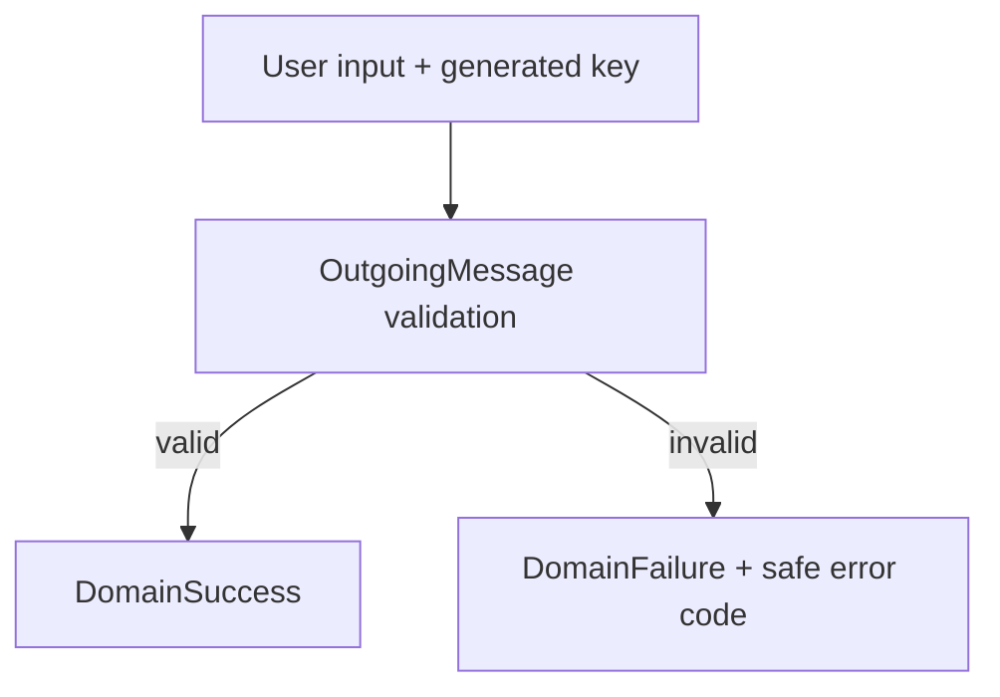

# Project Alice - FIP-003 Domain Foundation Implementation Plan

## 1. Document Information

| Item | Value |
|---|---|
| Document | `fip-003-domain-foundation-plan.md` |
| FIP | FIP-003 Domain Foundation |
| Status | Draft |
| Draft Planning | Completed / User Confirmed |
| Implementation | Not Started |
| Review Required After Phase 2-4 Design | Yes |
| Target | Phase 1 iOS Frontend |
| Last Updated | 2026-08-19 JST |

本ドキュメントは、Phase 1 FrontendのDomain Foundationを後からGitHub Copilot等のAI Coding Assistantへ実装依頼できる粒度まで具体化するDraft実装計画である。

本Draft作成時点ではソースコード、Test Code、Dependency、AssetまたはXcode設定を変更しない。Phase 2〜4の設計結果を反映したCross-phase ReviewおよびPhase 0 Final Design Reviewが完了するまで、FIP-003を実装してはならない。

---

## 2. Purpose / Goal

FIP-003の目的は、Phase 1のConversationで利用する中核概念をTransport、UIおよびFrameworkから独立したPlain Dart Modelとして定義することである。

達成目標:

- ConversationとMessageをFrontend内部で一貫して表現できる
- User MessageとAssistant MessageのRoleを型で制限できる
- Logical Message SendのContentとIdempotency Keyを一つの不変Modelとして扱える
- 送信前ValidationをUIやHTTP Clientへ分散させない
- Domain ErrorへConversation ContentやIdempotency Keyを含めない
- FIP-004以降がJSONやHTTP固有TypeをDomainへ持ち込まずに実装できる

FIP-003は「データを保持するだけのClassを作る作業」ではない。Phase 1で成立させるConversationの意味と、外部Technologyから守るBoundaryを最初に固定する作業である。

---

## 3. Scope

### 3.1 In Scope

- `Conversation`
- `Message`
- `MessageRole`
- `OutgoingMessage`
- 送信ContentのDomain Validation
- Idempotency Keyの形式Validation
- Domain Validation結果を表すResult型
- 安全なDomain Error Code / Error Model
- Domain Modelの不変性と値比較
- Plain Dart Unit Test計画

### 3.2 Out of Scope

- Widget、Screen、ThemeおよびAnimation
- Riverpod Provider / Notifier / Screen State
- `ConversationGateway`およびUse Case Flow
- HTTP Request、Response、HeaderまたはStatus Code
- API DTO、JSON Parse、MappingおよびProblem Details
- SSE Event、ParserおよびStreaming State
- UUIDの生成処理
- Pagination、Cursor、RetryまたはReplay Flow
- Temporary Assistant Messageおよび送信中の表示Model
- Conversation Historyの端末永続化
- Logging実装
- Personal Memory、Tool、Agent、Voice用Model
- `system`、`tool`等のPhase 1で不要なMessage Role
- Backend、DynamoDBまたはOpenAI固有Model

---

## 4. Preconditions

実装開始前に次を満たすこと。

- FIP-001がCompleted / Approvedである
- FIP-002がCompleted / Approvedである
- FIP-003〜FIP-012のDraft作成が完了している
- Phase 2〜4 Designが完了している
- Phase 1〜4 Cross-phase Reviewが完了している
- 本Draftが必要に応じて修正され、`Approved / Implementation Ready`へ昇格している
- Phase 0 Final Design Reviewが完了している

現時点では前半2項目だけが完了しているため、Implementationは開始しない。

---

## 5. Related Design Documents

| Document | Relevant Decision |
|---|---|
| `requirements.md` | P1-FR-001、002、005〜008、NFR-002、004〜007 |
| `mvp.md` | Phase 1 Scope / Exclusion |
| `frontend-design.md` | Layer Boundary、Core Models、Input Validation、Timestamp取扱い |
| `api-design.md` | Message / Conversation Schema、Content Rule、Idempotency Contract |
| `security-design.md` | Conversation Content、IdentifierおよびLogの取扱い |
| `test-design.md` | Domain Unit Test原則と品質Gate |
| `frontend-implementation-plan.md` | FIP順序、Draft-only方針、AI Coding Assistant Rule |
| `decisions.md` | Accepted Architecture Decision |

矛盾が見つかった場合、本FIP内で推測して解消しない。該当するSource of Truthを先に修正する。

---

## 6. Architecture and Dependency Boundary

Domainは次の位置に置く。

```text
Presentation ──> Application ──> Domain
Infrastructure ────────────────> Domain
```

Domainは次へ依存しない。

- Flutter SDK
- Riverpod
- `http`
- JSON Library / API DTO
- SSE Transport
- Xcode / iOS API
- OpenAI / AWS SDK
- Persistence Technology

Domain Sourceから許可するImportは、Dart SDKと同じ`conversation/domain/`配下のFileだけとする。FIP-003では新しいPackage Dependencyを追加しない。

---

## 7. Domain Model Design

### 7.1 Conversation

責務:

- Backendで作成された単一ConversationのIdentityと時刻を保持する
- API DTOやJSON表現から独立したFrontend Domain Modelとなる

Fields:

| Field | Dart Type | Meaning |
|---|---|---|
| `id` | `String` | Backendが生成したOpaque Conversation ID |
| `createdAt` | `DateTime` | Conversation作成時刻 |
| `updatedAt` | `DateTime` | 最後にMessageが正常保存された時刻 |

Rules:

- 全Fieldを`final`とする
- DomainはIDをUUIDとして解析しない。Conversation IDはOpaque Valueとして扱う
- Conversation Title、Summary、Owner、Message Countを追加しない
- Personal Memoryを保持しない
- `updatedAt`のAPI上の意味は`api-design.md`から変更しない
- API Timestamp文字列のJST形式検証とParseはFIP-004のDTO Mapping責務とする
- Domainは`DateTime`を時点として保持し、表示用FormatやTimezone変換を行わない

### 7.2 MessageRole

Phase 1では次の2値だけを定義する。

```text
user
assistant
```

Rules:

- Dart `enum`として表現する
- `system`、`tool`、`developer`等を先行追加しない
- API文字列との変換はFIP-004 Infrastructure責務とする
- Alice人格は`assistant` RoleのMessageとして表現し、Provider固有RoleをDomainへ公開しない

### 7.3 Message

責務:

- Backendへ保存され、Conversation Historyとして確定したCanonical Messageを表す

Fields:

| Field | Dart Type | Meaning |
|---|---|---|
| `id` | `String` | Backendが生成したOpaque Message ID |
| `role` | `MessageRole` | `user`または`assistant` |
| `content` | `String` | Backendが返したMessage本文 |
| `createdAt` | `DateTime` | Message作成時刻 |

Rules:

- 全Fieldを`final`とする
- Message IDをUUIDとして解析しない
- `content`をTrim、正規化またはMarkdown変換しない
- AI Provider、Model、Token Usage、Conversation ID、Persistence Keyを追加しない
- Temporary Streaming TextをCanonical `Message`として扱わない
- Messageの並び替え、Page結合およびID重複排除はFIP-005以降のApplication責務とする

### 7.4 OutgoingMessage

責務:

- Userによる一回のLogical Message Sendを表す
- Retry時に同じContentと同じIdempotency Keyを保持する
- Backendへ渡す前にDomain上の送信条件を満たしていることを保証する

Fields:

| Field | Dart Type | Meaning |
|---|---|---|
| `idempotencyKey` | `String` | Logical Message Sendを識別するUUID |
| `content` | `String` | Userが入力した原文 |

Creation Rules:

- Public Generative Constructorで無検証生成させず、検証Factoryを入口とする
- Empty Stringを拒否する
- Space、Tab、Line Break等のWhitespaceだけのContentを拒否する
- 10,000 Unicode Code Pointを超えるContentを拒否する
- 長さはUTF-8 Byte、UTF-16 Code UnitまたはGrapheme Clusterではなく`runes.length`相当で判定する
- Validation判定にTrim相当を利用してよいが、成功時の`content`は変更しない
- Idempotency KeyはUUIDの基本形式（8-4-4-4-12桁の16進数）を満たすこと
- UUID生成は行わない。新規User Action時のUUID v4生成はFIP-009のApplication責務とする
- Retry用の新しいKeyを自動生成しない

`OutgoingMessage`はMemory内だけに保持し、端末Storageへ永続化しない。このFIPではStorage処理自体を実装しない。

---

## 8. Domain Result and Error Design

### 8.1 DomainResult

送信前Validationの結果はExceptionによる通常制御ではなく、型で成功・失敗を区別する。

想定構造:

```text
DomainResult<T>
├── DomainSuccess<T>
└── DomainFailure<T>
```

Responsibilities:

- `DomainSuccess<T>`は生成済みの値を保持する
- `DomainFailure<T>`は`ConversationDomainError`を保持する
- HTTP Status、API Error Code、画面表示文言を保持しない
- Presentationが直接この型へ依存して表示文言を決めず、Applicationを介して扱う

### 8.2 ConversationDomainError

想定Error Code:

| Code | Condition |
|---|---|
| `emptyContent` | ContentがEmpty String |
| `whitespaceOnlyContent` | ContentがWhitespaceのみ |
| `contentTooLong` | 10,000 Unicode Code Point超過 |
| `invalidIdempotencyKey` | UUID基本形式を満たさない |

Security Rules:

- ErrorへRaw Contentを保持しない
- ErrorへIdempotency Keyを保持しない
- URL、Credential、SecretまたはStack Traceを保持しない
- User向け日本語文言をDomainへ持たせない

API Contract Error、HTTP Error、SSE Protocol ErrorおよびPersistence ErrorはこのErrorへ混在させない。それぞれFIP-004以降のBoundaryで定義する。

---

## 9. Immutability and Equality

Domain Modelは生成後に変更できない値として扱う。

- Fieldはすべて`final`
- Collection FieldはFIP-003では導入しない
- Setter、可変Public Fieldおよび`copyWith`を追加しない
- Code Generation Packageを導入しない
- `Conversation`、`Message`、`OutgoingMessage`および`ConversationDomainError`はField単位の値比較を提供する
- `hashCode`は`operator ==`と同じField集合から生成する
- `toString()`へConversation ContentまたはIdempotency Keyを含めない

値比較はUnit Test、State更新および重複判定を安定させるために採用する。ただしMessageの履歴重複排除はObject全体のEqualityではなく、FIP-005でMessage IDを基準に設計する。

---

## 10. State / Data Flow Boundary

FIP-003が担当する範囲だけを示す。



次のFlowは後続FIPの責務であり、FIP-003では実装しない。

- UI InputからApplicationへの委譲
- UUID v4生成
- Domain ErrorからUI表示へのMapping
- OutgoingMessageからRequest DTOへのMapping
- HTTP / SSE処理
- Canonical Messageへの確定
- State更新と画面描画

---

## 11. API Boundary

Domain ModelとAPI DTOは分離する。

| Concern | FIP-003 Domain | FIP-004 Infrastructure |
|---|---|---|
| Conversation / Messageの意味 | Owns | Uses |
| JSON Field Name | Does not know | Owns |
| `user` / `assistant`文字列変換 | Does not know | Owns |
| JST Offset付きTimestamp文字列検証 | Does not know | Owns |
| `DateTime.parse`とMapping | Receives parsed value | Owns |
| Unknown / Missing Field | Does not know | Owns Contract Error |
| SSE Event | Does not know | Owns Parser Model |

Domainへ`Map<String, dynamic>`、HTTP Response、SSE EventまたはJSON Annotationを渡してはならない。

---

## 12. Expected File Structure

実装再開時に想定するFileは次のとおり。

```text
frontend/
├── lib/
│   └── conversation/
│       └── domain/
│           ├── conversation.dart
│           ├── message.dart
│           ├── message_role.dart
│           ├── outgoing_message.dart
│           ├── domain_result.dart
│           └── conversation_domain_error.dart
└── test/
    └── conversation/
        └── domain/
            ├── conversation_test.dart
            ├── message_test.dart
            ├── outgoing_message_test.dart
            └── conversation_domain_error_test.dart
```

実装時に必要性がないBarrel File、Mapper、Extension、Utility、Repository、Providerまたは将来用Directoryを追加しない。

---

## 13. Class Responsibility Matrix

| Class / Enum | Responsibility | Must Not Do |
|---|---|---|
| `Conversation` | 単一ConversationのCanonical Metadata保持 | HTTP、JSON、Message Collection、Memoryを扱わない |
| `MessageRole` | Phase 1のMessage Roleを型で制限 | API文字列Parseや将来Roleを先行追加しない |
| `Message` | Canonical History Message保持 | Streaming中TextやProvider Metadataを保持しない |
| `OutgoingMessage` | Logical Sendと送信前Invariantを保持 | UUID生成、HTTP送信、Retry判断を行わない |
| `DomainResult<T>` | Domain Validation成功・失敗の型表現 | UI文言、HTTP Status、API Codeを保持しない |
| `ConversationDomainError` | 安全なDomain Error Code保持 | Raw入力、Key、Secretを保持しない |

---

## 14. Planned Implementation Procedure

Phase 0 Final Design Review後、次の順序で実装する。

1. Source of Truthが本Draft承認時点から変更されていないか確認する
2. `conversation/domain/`と対応Test Pathへ必要なFileだけを追加する
3. `MessageRole`を`user` / `assistant`の2値で実装する
4. `Conversation`と`Message`を不変なPlain Dart Modelとして実装する
5. `ConversationDomainError`と`DomainResult<T>`を実装する
6. `OutgoingMessage`の検証Factoryを実装する
7. Content Preservation、Unicode Code Point上限およびUUID形式をUnit Testする
8. Equality、`hashCode`および安全な`toString()`をTestする
9. Domain Sourceに禁止Importがないことを確認する
10. Format、Analyze、Domain Test、全Frontend Testを実行する
11. Scope外File、DependencyまたはGenerated Codeが追加されていないことを確認する

一つのStepでAPI DTO、Application StateまたはWidget実装へ進まない。

---

## 15. Test Plan

### 15.1 Conversation

- 指定したID、`createdAt`、`updatedAt`を変更せず保持する
- 同一FieldのInstanceが値として等しい
- 異なるFieldを持つInstanceが等しくない
- `toString()`が不要な内部情報を露出しない

### 15.2 MessageRole / Message

- Roleが`user`と`assistant`だけである
- MessageがID、Role、Content、時刻を変更せず保持する
- Leading / Trailing Whitespace、Line Break、Markdown、Code Indentationを保持する
- Messageの値比較がField差分を反映する
- `toString()`がContentを出力しない

### 15.3 OutgoingMessage Success

- 通常Textを受理する
- 前後Whitespaceを含む非空Contentを原文のまま保持する
- Line Break、MarkdownおよびIndentationを保持する
- 正確に10,000 Unicode Code PointのContentを受理する
- Supplementary CharacterをUnicode Code Point単位で数える
- UUID基本形式のIdempotency Keyを保持する

### 15.4 OutgoingMessage Failure

- Empty Stringを`emptyContent`で拒否する
- Spaceのみ、Tabのみ、Line Breakのみ、およびそれらの組合せを`whitespaceOnlyContent`で拒否する
- 10,001 Unicode Code Pointを`contentTooLong`で拒否する
- 不正形式のIdempotency Keyを`invalidIdempotencyKey`で拒否する
- FailureがRaw ContentまたはKeyを保持・表示しない

### 15.5 Boundary Tests

- Domain SourceがFlutter、Riverpod、HTTP、JSONまたはInfrastructureをImportしない
- UUID Packageによる生成処理がDomainに存在しない
- Phase 1外RoleやPersonal Memory Fieldが存在しない

### 15.6 Planned Commands

```bash
dart format lib test
flutter analyze
flutter test test/conversation/domain
flutter test
```

これらはImplementation再開後に実行するCommandであり、Draft作成時点では実行しない。

---

## 16. Acceptance Criteria

- [ ] 想定したDomain Fileだけが追加されている
- [ ] DomainがPlain Dartであり、Flutter / Riverpod / HTTP / JSONへ依存していない
- [ ] `Conversation`が3つの確定Fieldだけを保持する
- [ ] `Message`が4つの確定Fieldだけを保持する
- [ ] `MessageRole`が`user` / `assistant`だけを持つ
- [ ] `OutgoingMessage`がContentとIdempotency Keyを変更せず保持する
- [ ] Empty、Whitespace-only、10,000 Code Point超過を区別して拒否する
- [ ] UUID基本形式を満たさないIdempotency Keyを拒否する
- [ ] Domain Errorおよび`toString()`がContentやKeyを露出しない
- [ ] Modelの値比較と`hashCode`が一貫している
- [ ] 新しいDependency、Generated CodeまたはScope外Featureが追加されていない
- [ ] Domain Unit Testが成功する
- [ ] `flutter analyze`と全Frontend Testが成功する

---

## 17. Definition of Done

FIP-003 Implementationは、次をすべて満たした時点で完了とする。

1. 本DraftがCross-phase Review後に`Approved / Implementation Ready`へ昇格している
2. Acceptance Criteriaをすべて満たしている
3. Code ReviewでLayer Boundary、Immutability、SecurityおよびScopeを確認済みである
4. Planned Commandsがすべて成功している
5. 設計との差分がない、または差分が先にDesign / ADRへ反映されている
6. FIP-004が利用できる安定したDomain Boundaryになっている

Draft作成の完了は、FIP-003 Implementationの完了を意味しない。

---

## 18. Dependencies

### 18.1 Previous FIPs

| FIP | Dependency |
|---|---|
| FIP-001 | Flutter Project、Directory、Analyzer、Test基盤 |
| FIP-002 | App ConfigurationとHTTP Client Lifecycle。Domainはこれらへ依存しない |

### 18.2 Subsequent FIPs

| FIP | How FIP-003 Is Used |
|---|---|
| FIP-004 | API DTOから`Conversation` / `Message`へMappingする |
| FIP-005 | `Conversation`、Canonical `Message`、`OutgoingMessage`、Domain ErrorをState Flowで利用する |
| FIP-007〜008 | Canonical Domain DataをApplication経由で表示する |
| FIP-009 | New User ActionでUUID v4を生成し`OutgoingMessage`を作成する |
| FIP-010 | 同じ`OutgoingMessage`をRetry / Replayで再利用する |
| FIP-011 | Message IDを基準にPageを結合・重複排除する |
| FIP-012 | Domain情報を安全なSemantics / Visualへ接続する |

---

## 19. Phase 2-4 Review Points

Phase 2〜4設計後、少なくとも次を再レビューする。

### 19.1 Phase 2 Personal Memory

- `Message`または`Conversation`へPersonal Memoryを直接追加していないか
- Conversation HistoryとPersonal MemoryのModel / Lifecycleが分離されているか
- Memory Context追加のためにPhase 1 Domainを不自然に変更する必要がないか

### 19.2 Phase 3 Tools / External Services

- Tool Call / Tool ResultをPhase 1の`MessageRole`へ安易に追加すべきでないことを維持できるか
- Tool Execution ModelをConversation Domainから分離できるBoundaryになっているか
- Permission / Approval情報をCanonical Messageへ混在させずに扱えるか

### 19.3 Phase 4 Agent / PC / Browser / Voice

- Agent Task、Execution StateおよびApproval Stateを`Message`へ押し込まずに表現できるか
- Voice TranscriptをUser Messageへ変換する責務がDomain外で明確になるか
- Audio、Screenshot、File Content等のSensitive Dataを安全に分離できるか
- Desktop UI追加がDomain Modelへ影響しないか

これらの具体仕様は本Draftでは決定しない。必要な変更がArchitecture Decisionに該当する場合は、実装より先にDesign / ADRを更新する。

---

## 20. AI Coding Assistant Constraints

実装再開時、AI Coding Assistantへ次を明示する。

- 本FIPで許可されたFileだけを変更する
- Source of TruthにないField、Role、ErrorまたはValue Objectを追加しない
- Flutter、Riverpod、HTTP、JSON、UUID生成PackageをDomainへImportしない
- DTO、Mapper、Gateway、Provider、Notifier、WidgetまたはSSE Parserを作成しない
- ContentをTrimまたは正規化しない
- Content、Idempotency KeyまたはSecretをError / Log / `toString()`へ含めない
- Phase 2〜4用Modelや共通Moduleを先行作成しない
- 不明点が実装結果を変える場合は推測せず停止して報告する

---

## 21. Draft Review Checklist

### Scope and Architecture

- [x] Phase 1 Domain Foundationだけを対象としている
- [x] Feature-based StructureとLayer Separationに従っている
- [x] DomainがExternal Technologyから分離されている
- [x] Conversation HistoryとPersonal Memoryを分離している

### Contract Alignment

- [x] Conversation / Message FieldがFrontendおよびAPI Designと一致している
- [x] Message Roleを`user` / `assistant`へ限定している
- [x] Content上限を10,000 Unicode Code Pointとしている
- [x] Content PreservationとIdempotency Ruleを維持している
- [x] TimestampのParse / JST検証をFIP-004へ委譲している

### Future Boundary

- [x] Phase 2〜4の具体仕様を確定していない
- [x] Cross-phase Review項目を記録している
- [x] 実装開始条件とDraft-only方針を明示している

---

## 22. Current Decision and Next Step

現在の状態:

```text
FIP-003 Document: Draft Planning Completed
FIP-003 Implementation: Not Started
Cross-phase Review: Required
```

本Draftは2026-08-19 JSTにユーザー確認済みであり、Draft計画書作成を完了した。FIP-003のソースコード実装には進まず、次はFIP-004 API Contract FoundationのDraft実装計画書を作成する。
