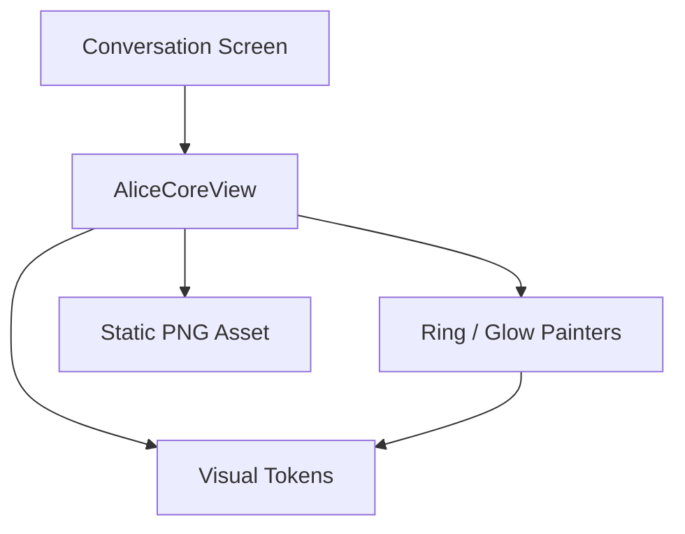
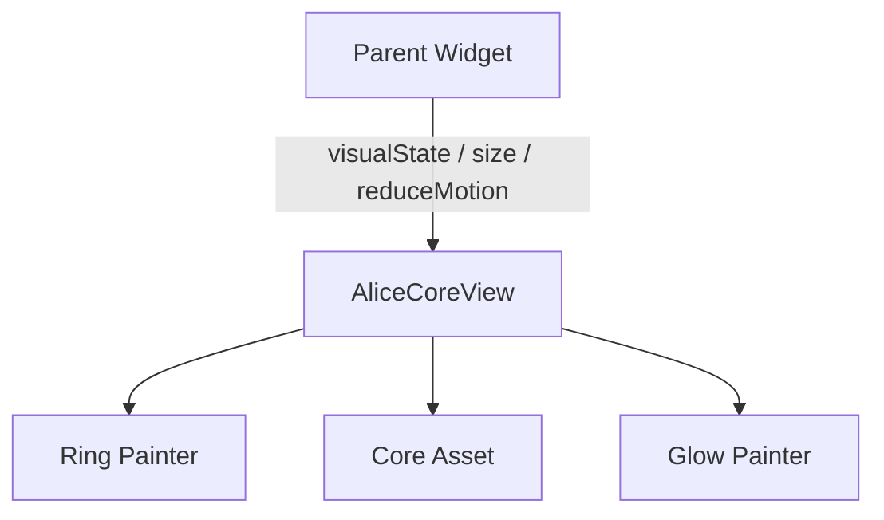

# Project Alice - FIP-006 Visual Foundation Implementation Plan

## 1. Document Information

| Item | Value |
|---|---|
| Document | `fip-006-visual-foundation-plan.md` |
| FIP | FIP-006 Visual Foundation |
| Status | Draft |
| Draft Planning | Completed / User Confirmed |
| Implementation | Not Started |
| Review Required After Phase 2-4 Design | Yes |
| Target | Phase 1 iOS Frontend |
| Last Updated | 2026-08-19 JST |

本ドキュメントは、Phase 1 Frontendで共通利用するVisual Token、Dark ThemeおよびAlice Coreの静的表現を、後からGitHub Copilot等のAI Coding Assistantへ実装依頼できる粒度で定義するDraft実装計画である。

本Draft作成時点では、ソースコード、Test Code、Dependency、AssetまたはXcode設定を変更しない。Phase 2〜4設計後のCross-phase ReviewおよびPhase 0 Final Design Reviewが完了するまで、FIP-006を実装してはならない。

---

## 2. Purpose / Goal

FIP-006の目的は、Phase 1のConversation UIが同じVisual Languageを一貫して利用できる基盤を作ることである。

達成目標:

- 承認済みSemantic Colorを一箇所で管理する
- Typography、SpacingおよびRadiusをTokenとして再利用できるようにする
- Phase 1をDark-only Themeとして構成する
- Alice Coreを、静的なParticle Mesh PNGと標準Flutterの`CustomPainter`によるRing / Glowで表現する
- `idle`、`thinking`、`streaming`および`unavailable`のVisual Stateを、Application Stateから分離したPresentation型で表す
- Reduce Motion、Dynamic Type、ContrastおよびDecorative Semanticsへ対応する
- Alice Core Animationによる全画面の不要なRebuild / Repaintを防ぐ
- FIP-007以降が色、文字、余白またはCore表現を独自定義しない状態にする

初心者向けに整理すると、FIP-006はチャット画面全体を完成させる作業ではない。画面を組み立てる前に、Project Aliceで共通して使う「色見本」「文字の大きさ」「余白の単位」と、Aliceを象徴する球体Componentを用意する作業である。

---

## 3. Scope

### 3.1 In Scope

- Phase 1で利用するSemantic Color Token
- Phase 1で利用するTypography Token
- Spacing TokenおよびRadius Token
- Dark-only `ThemeData`
- Alice Core Asset Pathの一元管理
- `alice_core_base.png`のAsset登録と品質確認
- Presentation専用の`AliceCoreVisualState`
- `AliceCoreView`
- Interface Ring Painter
- Inner / Outer Glow Painter
- Visual StateごとのMotion Parameter
- Reduce Motion対応
- App LifecycleおよびVisibilityに応じたAnimation停止
- Repaint BoundaryおよびPainter Cache方針
- Theme / Painter / Widget / Golden Test計画

### 3.2 Out of Scope

- Conversation Screen全体のLayout
- Header、Message List、Message Bubble、ComposerおよびSend Button
- Initial History、Send、SSE、Retry、Paginationの処理
- Application Stateから`AliceCoreVisualState`への実際のMapping
- Error Message、Loading LabelまたはStatus Textの表示
- HTTP、SSE、Repository、GatewayおよびRiverpod Orchestration
- Light Theme
- Custom Font AssetまたはFont Package
- Rive、Fragment Shader、3D Renderer、Videoおよび第三者Animation Package
- Particle Meshの流動変形、呼吸表現または状態別Particle再配置
- Personal Memory、Tool、AgentおよびVoice固有のCore State
- Desktop用LayoutとDesktop固有Theme
- 将来用Renderer Interface、Plugin Architectureまたは空Package
- Core Assetの再生成またはデザイン変更

Phase 1では、すでに確定した静的Particle Mesh Assetへ軽量なRing / Glowを重ねる。球体そのものの流動表現はPhase 2〜4の設計と実装で扱う。

---

## 4. Preconditions

実装開始前に次を満たすこと。

- FIP-001 / FIP-002がCompleted / Approvedである
- FIP-003〜FIP-012のDraft Planningが完了している
- Phase 2〜4 Designが完了している
- Phase 1〜4 Cross-phase Reviewが完了している
- FIP-003〜FIP-005が必要に応じて修正され、`Approved / Implementation Ready`へ昇格している
- 本Draftが必要に応じて修正され、`Approved / Implementation Ready`へ昇格している
- Phase 0 Final Design Reviewが完了している
- `frontend/assets/images/alice_core/alice_core_base.png`が承認済みAssetとして配置されている

現時点ではDraft Planningだけを行い、Implementationは開始しない。

---

## 5. Related Design Documents

| Document | Relevant Decision |
|---|---|
| `requirements.md` | Phase 1 Conversation、StreamingおよびNon-functional Requirement |
| `mvp.md` | Phase 1 Scope / Exclusion |
| `frontend-design.md` | Presentation Boundary、Approved Technology、ThemeのSource of Truth |
| `frontend-ui-design.md` | UI-012、UI-013、UI-016、Color、Typography、Spacing、Motion、Accessibility |
| `security-design.md` | Asset、Log、Local DataおよびDependency Rule |
| `test-design.md` | Widget、Golden、AccessibilityおよびPerformance Test |
| `fip-005-application-state-plan.md` | Application StateとVisual Stateを分離するBoundary |
| `frontend-implementation-plan.md` | FIP順序、Draft-only方針、AI Coding Assistant Rule |
| `decisions.md` | Accepted Architecture Decision |

Visual DetailのSource of Truthは`frontend-ui-design.md`である。矛盾が見つかった場合、本FIP内で推測して解消せず、Source of Truthを先に修正する。

---

## 6. Design Principles

### 6.1 Semantic First

Widgetは`#1677E8`のような色値を直接使わず、`primary`のような役割名で参照する。

これにより、将来Color値が変わっても各Widgetを個別修正せずに済む。ただし、Phase 1でLight Themeを先行作成することを意味しない。

### 6.2 Presentation-only Alice Core

`AliceCoreView`はVisual Stateを受け取り描画するだけとする。次を判断してはならない。

- Backend Requestの開始または停止
- SSE Eventの解釈
- Error Categoryの判定
- Retry可否
- Conversation Stateの遷移
- Personal Memory、ToolまたはAgentの状態

### 6.3 Minimum Phase 1 Implementation

Phase 1で必要なTokenと表現だけを実装する。将来利用する可能性だけを理由に、Light Theme、Voice State、Tool StateまたはRenderer抽象化を追加しない。

### 6.4 Accessible Motion

MotionはAliceの存在感を補助するものであり、状態を伝える唯一の手段にしない。Reduce Motionが有効でもConversation操作と状態理解が成立する設計とする。

---

## 7. Target File Structure

Implementation Resume後に、必要なFileだけを次の構成で追加する。

```text
frontend/
├── assets/
│   └── images/
│       └── alice_core/
│           └── alice_core_base.png
├── lib/
│   ├── app/
│   │   ├── alice_app.dart
│   │   └── theme/
│   │       ├── alice_color_tokens.dart
│   │       ├── alice_design_tokens.dart
│   │       ├── alice_text_styles.dart
│   │       └── alice_theme.dart
│   └── conversation/
│       └── presentation/
│           └── widget/
│               └── alice_core/
│                   ├── alice_core_assets.dart
│                   ├── alice_core_visual_state.dart
│                   ├── alice_core_view.dart
│                   ├── alice_core_ring_painter.dart
│                   └── alice_core_glow_painter.dart
└── test/
    ├── app/
    │   └── theme/
    │       └── alice_theme_test.dart
    └── conversation/
        └── presentation/
            └── widget/
                └── alice_core/
                    ├── alice_core_view_test.dart
                    └── alice_core_golden_test.dart
```

File数を減らすためだけにColor、Typography、PainterおよびWidgetを一つの巨大Fileへ統合しない。一方、Painterごとに細かいHelper Fileを先行作成しない。

---

## 8. Dependency Boundary



Dependency Rule:

- `app/theme/`はFlutter UIへ依存してよい
- `conversation/presentation/`はTheme Tokenを利用してよい
- ThemeまたはAlice CoreはApplication / Infrastructureへ依存しない
- Domain / ApplicationはTheme、Widget、PainterまたはAsset Pathへ依存しない
- `AliceCoreVisualState`はPresentation専用型とし、FIP-005のApplication Enumへ追加しない
- PainterはWidget Tree、Provider、HTTP ClientまたはBuild Configurationを参照しない

---

## 9. Semantic Color Tokens

承認済みColor Tokenを次のとおり定義する。

| Token | Hex | Purpose |
|---|---:|---|
| `background` | `#020812` | Screen全体の最背面 |
| `backgroundElevated` | `#07111F` | Header等のわずかに浮いた背景 |
| `surface` | `#0D1828` | Input、Assistant Bubble等のSurface |
| `surfaceStrong` | `#0D3A73` | 強調されたSurface |
| `textPrimary` | `#F5F8FF` | 本文、Title、主要Label |
| `textSecondary` | `#AEB9CA` | 補助文、Placeholder、Metadata |
| `border` | `#1B304A` | Border、Divider |
| `primary` | `#1677E8` | Main Action |
| `coreCyan` | `#00D9FF` | Alice Core Cyan Light |
| `coreBlue` | `#176BFF` | Alice Core Blue Light |
| `coreViolet` | `#6C45FF` | Alice Core Violet Light |
| `coreAmber` | `#F6A623` | Core Ringの限定Accent |
| `error` | `#FFB4AB` | Error Text / Icon |
| `errorSurface` | `#3B1D1C` | Error Surface |

Rules:

- WidgetへRaw Hexを散在させない
- Color Token名はVisual Roleを表し、具体的な画面名を含めない
- `coreAmber`はCore Ring Accentだけに限定し、一般的なWarning Colorとして流用しない
- Glowの透明度はTokenのAlpha VariantとしてPainter内の確定Parameterから生成する
- Phase 1でLight用Token Setを作成しない
- Token値の変更はVisual Design Review対象とする

---

## 10. Typography Tokens

iOS System Fontを使用し、Custom Font AssetやFont Packageを追加しない。`San Francisco`等のFont Family名を直接指定せず、PlatformのSystem Font選択へ委ねる。

Phase 1で実装するTypography:

| Token | Size | Weight | Purpose |
|---|---:|---|---|
| `title` | 22 | Regular | Screen Title `Alice` |
| `body` | 17 | Regular | Message / Input |
| `bodyEmphasis` | 17 | Semibold | 強調Label / Action |
| `supporting` | 14 | Regular | Status / Supporting Text |
| `caption` | 12 | Regular | 補助情報 |
| `code` | 14 | Regular Monospace | Code表示の基準 |

Rules:

- `body`のLine Heightはおおむね`1.45`を基準とする
- Dynamic TypeによるText Scaleを妨げない
- 固定HeightでTextを切らない
- 不自然なLetter Spacingを追加しない
- Product Nameは常に`Alice`と表示し、`A.L.I.C.E`へ変更しない
- ユーザー名`楠瑛`をThemeまたは固定UI Labelへ埋め込まない
- 将来Ambient-only画面で利用する`ambientTitle 40 / Light`はPhase 1で未使用のため先行実装しない。値は`frontend-ui-design.md`に保持する

---

## 11. Spacing and Radius Tokens

### 11.1 Spacing

| Token | Value |
|---|---:|
| `space1` | 4 |
| `space2` | 8 |
| `space3` | 12 |
| `space4` | 16 |
| `space6` | 24 |
| `space8` | 32 |

### 11.2 Radius

| Token | Value |
|---|---:|
| `radiusSmall` | 4 |
| `radiusMedium` | 12 |
| `radiusLarge` | 18 |
| `radiusPill` | 999 |

Rules:

- Layout上意味のある余白とRadiusはTokenを利用する
- Painter内部の幾何学Parameterまで無理にSpacing Tokenへ置き換えない
- 44 x 44 logical pixels以上のTouch Targetは後続Widget FIPで保証する
- Widgetごとの例外値が必要な場合、`frontend-ui-design.md`または該当FIPで理由を明記する

---

## 12. Dark Theme Construction

`AliceTheme`はPhase 1用のDark `ThemeData`を提供する。

Required Configuration:

- BrightnessはDark固定
- Scaffold Backgroundへ`background`
- Primary Actionへ`primary`
- Surfaceへ`surface`
- Errorへ`error` / `errorSurface`
- Text ThemeへPhase 1 Typography Token
- iOS System Fontを維持
- Material ComponentのDefault Colorが承認済みThemeと衝突しないよう最小限設定
- 既存の`MaterialApp`構成を維持し、FIP-006内でUI Frameworkを変更しない
- `AliceApp`へDark Themeを適用し、System設定によるLight Themeへの切替を行わない

`AliceTheme`はVisual Defaultを提供するが、Message BubbleやComposerの具体的StyleはFIP-007で定義する。

Contrast Gate:

- Normal Text: 4.5:1以上
- Large TextおよびNon-text UI: 3:1以上
- Glowや背景画像をText可読性の根拠にしない
- Core GlowをMessageまたはAction Textの背面へ重ねない

---

## 13. Alice Core Asset Contract

### 13.1 Canonical Asset

| Item | Decision |
|---|---|
| Path | `assets/images/alice_core/alice_core_base.png` |
| Format | PNG |
| Size | 1024 x 1024 px |
| Color Space | sRGB |
| Background | Full Transparency |
| Display Range | 96〜260 logical pixels |
| Target File Size | 2 MB以下 |

承認済みAssetは、中心にCyan Glowを持つ不定形のParticle Mesh Sphereであり、Cyan、Electric BlueおよびVioletを主要色とする。

Assetへ含めないもの:

- Interface RingまたはTick
- Amber Accent
- Background
- Text、Status、人物、LogoまたはWatermark
- 外周Glow
- Directional Shadow

### 13.2 Asset Registration

`pubspec.yaml`へ次のCanonical Pathだけを登録する。

```yaml
flutter:
  assets:
    - assets/images/alice_core/alice_core_base.png
```

Rules:

- Network ImageまたはBase64埋込みを使わない
- Presentation用Asset ConstantでPathを一元管理する
- Phase 1で状態別PNGやAnimation Frameを追加しない
- AssetをSilent Fallbackで別画像へ置き換えない
- Missing、Decode ErrorまたはWrong SizeはBuild / Testで検出する
- EXIF等の不要Metadataを保持しない

---

## 14. Alice Core Component Structure

```text
AliceCoreView
└── RepaintBoundary
    └── Stack
        ├── RingPainter
        ├── Core Image Asset
        └── GlowPainter
```

Conceptual Input:

| Input | Type | Meaning |
|---|---|---|
| `visualState` | `AliceCoreVisualState` | CoreのPresentation State |
| `size` | logical pixels | Square描画領域の一辺 |
| `reduceMotion` | boolean | Continuous Motion抑制 |

Component Rules:

- `size`は96〜260を想定し、正方形のBounds内だけで描画する
- Core Assetは中央揃えとし、Aspect Ratioを維持する
- Ring / GlowはAssetへ焼き込まず、Painterで重ねる
- Decorative ComponentとしてSemantics Treeから除外する
- Text、Loading IndicatorまたはError LabelをComponent内部へ含めない
- State変更でComponent外側のLayout Sizeを変えない
- Asset読込失敗をConversation操作全体のCrashへ連鎖させない一方、Development / Testでは明示的に検出する

---

## 15. AliceCoreVisualState

Presentation専用Enumとして次を定義する。

| State | Visual Behavior | Intended Mapping |
|---|---|---|
| `idle` | Normal Glow、非常に遅いRing回転 | Ready / Initial LoadingのCore表現 |
| `thinking` | Center Pulse、やや速いRing回転 | Send開始から最初のDeltaまで |
| `streaming` | Stable Glow、穏やかなRing回転 | 一つ以上のDelta受信中 |
| `unavailable` | Dim、Continuous Animation停止 | Core表現を抑えるFailure状態 |

Important Boundary:

- FIP-006はApplication StateとのMappingを実装しない
- `initialLoading`は`thinking`ではない。Coreは静的または`idle`相当とし、読込状態は別のLabelで伝える
- Failureすべてを自動的に`unavailable`へMappingしない。MappingはFIP-007 / FIP-008 / FIP-010で確定する
- Phase 2〜4のListening、Speaking、Tool ExecutionまたはAgent Stateを追加しない

---

## 16. Motion Specification

### 16.1 Baseline Parameters

| Behavior | Value |
|---|---:|
| Idle Ring Rotation | 12 sec / revolution |
| Thinking Ring Rotation | 6 sec / revolution |
| Streaming Ring Rotation | 8 sec / revolution |
| Thinking Pulse Cycle | 2 sec |
| Pulse Scale | 0.98〜1.02 |
| Visual State Transition | 300 ms |

### 16.2 Motion Rules

- 突然のStart / Stopまたは不自然なLinear切替を避ける
- State遷移は現在値から次のTargetへ連続的に補間する
- `idle` / `thinking` / `streaming`でCoreのLayout Sizeを変えない
- Random値をFrameごとに生成しない
- Particle Meshを変形または再配置しない
- PathやTick GeometryをFrameごとに再構築しない
- `unavailable`ではContinuous Animationを停止する
- Reduce Motion時はRotation、PulseおよびContinuous Scaleを停止する
- Motion Parameterの変更はGolden / Performance確認を伴うVisual Review対象とする

---

## 17. Ring Painter Specification

### 17.1 Geometry

| Element | Baseline |
|---|---|
| Ring Count | 3 |
| Diameter | Coreの約106% / 116% / 126% |
| Line Width | 1.0 / 0.75 / 0.75 px |
| Outer Ticks | 48 |
| Long Tick | 4本ごと |
| Amber Arc | 最大2本 |
| Amber Arc Length | 12〜18 degrees |

### 17.2 Painter Rules

- Ringは`coreCyan`、`coreBlue`および控えめな透明度を用いる
- Amberは最大2 Arcに限定し、点滅させない
- Tick数、角度およびRing PathはSize変更時に計算し、Frameごとに作り直さない
- `shouldRepaint`はVisual State、Animation Value、SizeまたはToken変更に必要な場合だけ`true`となるようにする
- Painterは与えられたBounds外へ無制限に描画しない
- Device Pixel Ratio依存で極端に太く見えないようlogical pixel基準を維持する

---

## 18. Glow Painter Specification

Inner GlowとOuter Glowを、Coreの存在感を補助する範囲で描画する。

| Parameter | Baseline |
|---|---:|
| Outer Glow Maximum Opacity | 0.22 |
| Thinking Pulse Maximum Opacity | 0.35 |
| Main Colors | `coreCyan` / `coreBlue` / `coreViolet` |

Rules:

- GlowはCore周辺のBounds内へ制限する
- 過大なBlur Radiusで広範囲をRepaintしない
- TextやActionの可読性をGlowに依存させない
- `unavailable`ではOpacityを下げ、Animationを停止する
- Reduce Transparency相当の環境設定を取得できる範囲で、透明効果を弱めても識別できる構成にする
- Glowの差だけで状態を伝えない

---

## 19. Lifecycle and Visibility

Continuous Animationは次の場合に停止する。

- AppがBackgroundまたはInactiveになった
- Route / Widgetが非表示になった
- `TickerMode`が無効になった
- Reduce Motionが有効になった
- Visual Stateが`unavailable`である

再表示時は現在のVisual Stateに対応するAnimationへ安全に復帰する。WidgetがDispose済みのControllerを再利用してはならない。

FIP-006実装時は標準Flutter Lifecycle APIだけを利用し、追加Lifecycle Packageを導入しない。

---

## 20. Performance Boundary

### 20.1 Required Techniques

- `AliceCoreView`を`RepaintBoundary`で分離する
- AnimationはPainterの`repaint` Listenableを利用し、全画面`setState`をFrameごとに発生させない
- GeometryをSize変更時にCacheする
- Image AssetをFrameごとにDecodeしない
- 描画範囲をClip / Boundsで制限する
- Background / OffscreenでTickerを停止する

### 20.2 Performance Gate

代表的なPhase 1最小対象DeviceのProfile Modeで、Animation中も60 Hzを基準とする。

| Metric | Target |
|---|---:|
| UI Frame Time p95 | 16.7 ms以下 |
| Raster Frame Time p95 | 16.7 ms以下 |
| Unexpected Full-screen Repaint | なし |

Gateを満たさない場合、次の順で設計レビューを行う。

1. Glow Blur / Layer範囲を縮小
2. Ring DetailまたはTick描画量を縮小
3. Animation更新頻度を見直す

Particle CountをRuntimeで端末ごとに変える処理は、Phase 1にParticle Animationがないため追加しない。

---

## 21. Accessibility

### 21.1 Reduce Motion

Reduce Motion有効時:

- Ring Rotationを停止する
- Thinking Pulseを停止する
- Continuous Scaleを停止する
- 現在Stateに対応する静的なColor / Opacityで表示する
- Conversation操作およびStatus Textは通常どおり利用できる

### 21.2 Semantics

- Alice Coreは装飾要素としてSemantics Treeから除外する
- StateはCoreの色または動きだけで伝えない
- DeltaごとまたはFrameごとのAccessibility Announcementを行わない
- Loading、StreamingおよびFailureのAnnouncementは後続FIPでText Stateとして設計する

### 21.3 Dynamic Type and Contrast

- Alice Coreの固定描画領域がDynamic TypeのTextを覆わない
- Text拡大時のScreen LayoutはFIP-007 / FIP-012で確認する
- TokenのContrastはSection 12の基準を満たす

---

## 22. State and Data Flow

FIP-006時点のData FlowはPresentation入力だけに限定する。



禁止Flow:

- `AliceCoreView → ConversationGateway`
- `AliceCoreView → HTTP / SSE`
- `Painter → Riverpod Provider`
- `Theme → Conversation State`
- `Domain / Application → Flutter Theme`

---

## 23. Failure and Fallback

| Failure | Expected Behavior |
|---|---|
| Reduce Motion | Static Core / Ringを表示する |
| Animation Controller初期化失敗 | Static Coreを維持し、Conversation操作を壊さない |
| App Background | Animationを停止する |
| Asset Missing / Decode Failure | Development / Testで明示的に失敗させ、Silent Replacementしない |
| Unexpected Size | Safe Boundsへ制約し、Overflowさせない |

RuntimeでAssetが欠落した状態を製品仕様上の通常Fallbackとして許容しない。Assetの存在、Dimensions、AlphaおよびFile SizeをBuild / Test Gateで検出する。

---

## 24. Test Strategy

### 24.1 Unit / Theme Tests

- 全Semantic Color Tokenが承認済み値と一致する
- Phase 1 TypographyのSize / Weightが一致する
- Spacing / Radius Tokenが一致する
- `AliceTheme`がDark Brightnessである
- Themeが指定されたBackground、Surface、Primary、Error Colorを利用する
- Light ThemeまたはCustom Fontが追加されていない

### 24.2 Widget Tests

- 96 / 180 / 260 logical pixelsでLayout Errorが発生しない
- `idle` / `thinking` / `streaming` / `unavailable`を描画できる
- State遷移でWidget Sizeが変わらない
- Reduce Motion有効時にContinuous Animationが進行しない
- `unavailable`でContinuous Animationが停止する
- App Lifecycle / `TickerMode`無効時にTickerが停止する
- Alice CoreがDecorative Semanticsとして除外される
- Asset PathがCanonical Pathを利用する

### 24.3 Golden Tests

最低限次のGoldenを作成する。

- `alice_core_idle_180.png`
- `alice_core_thinking_180.png`
- `alice_core_streaming_180.png`
- `alice_core_unavailable_180.png`
- `alice_core_reduce_motion_180.png`
- 96 / 260 logical pixelsのSize Boundary

Animation StateのGoldenは、時間を固定したDeterministic Frameを撮影する。実時間やRandom値に依存させない。

Golden更新はVisual変更としてReviewし、Testを通すためだけに無条件更新しない。

### 24.4 Asset Validation

- 1024 x 1024である
- PNG / sRGBである
- Alpha Channelを持つ
- 四隅が透明である
- 背景Rectangle、WatermarkまたはTextがない
- Sphereが中央にあり、約10%以上の透明Marginを持つ
- 96 / 180 / 260 logical pixelsで識別可能である
- 2 MB以下である

### 24.5 Performance Validation

- Profile ModeでFrame Timingを採取する
- Alice Core Animationだけで全ScreenがRepaintされていないことを確認する
- Background / OffscreenでAnimationが停止することを確認する
- UI / Raster p95が16.7 ms以下であることを確認する

---

## 25. Implementation Steps

Phase 0 Final Design Review後に次の順序で実装する。

1. Source of TruthのVisual TokenとAsset Contractを再確認する
2. `alice_color_tokens.dart`を追加する
3. `alice_design_tokens.dart`へSpacing / Radiusを追加する
4. `alice_text_styles.dart`へPhase 1 Typographyを追加する
5. `alice_theme.dart`でDark Themeを構成する
6. 既存`AliceApp`へDark Themeを適用する
7. Theme Unit / App Widget Testを追加する
8. Canonical AssetのDimensions、Alpha、MetadataおよびFile Sizeを確認する
9. `pubspec.yaml`へCanonical Asset Pathを登録する
10. `alice_core_assets.dart`へAsset Pathを一元化する
11. `AliceCoreVisualState`を追加する
12. Ring / Glow Painterを固定Geometryで実装する
13. `AliceCoreView`へAsset、PainterおよびMotionを組み合わせる
14. Reduce Motion、TickerMode、LifecycleおよびDisposeを実装する
15. Widget / Golden Testを追加する
16. `dart format lib test`を実行する
17. `flutter analyze`を実行する
18. `flutter test`を実行する
19. Profile ModeでPerformance Gateを確認する
20. Scope外Dependency、Screen、State MappingまたはFuture Featureが追加されていないことを確認する

---

## 26. AI Coding Assistant Task Boundary

### 26.1 Allowed Files

- Section 7で定義したTheme File
- 既存`lib/app/alice_app.dart`のTheme適用部分
- Section 7で定義したAlice Core Presentation File
- 対応するTest / Golden File
- `pubspec.yaml`のCanonical Asset登録部分

### 26.2 Prohibited Changes

- FIP-003〜FIP-005のDomain / Application / API Contract
- HTTP、SSE、Retry、PaginationおよびRiverpod Orchestration
- `alice_core_base.png`の再生成または画像内容の変更
- Approved Color、Typography、Spacing、Radius、Motion値の独自変更
- Light Themeの追加
- Rive、Shader、Video、3DまたはAnimation Dependencyの追加
- Memory、Tool、Agent、Voice用Stateの追加
- Renderer Interfaceまたは将来用抽象化の追加
- Conversation Screen全体の実装

### 26.3 Local Decisions Allowed

Source of Truthと矛盾しない範囲で、AI Coding Assistantは次を合理的に決定してよい。

- private Helper Method名
- Painter内部の局所的な計算分割
- Test Description名
- Cache実装の標準的なFlutter表現
- `AnimationController`と`Tween`の局所的な組み合わせ

---

## 27. Acceptance Criteria

FIP-006 Implementationは次をすべて満たすこと。

- [ ] 承認済みColor、Typography、Spacing、RadiusがToken化されている
- [ ] Phase 1 Dark Themeが構成されている
- [ ] Raw Hexが対象Widgetへ散在していない
- [ ] Custom Font、Light Themeまたは未承認Dependencyが追加されていない
- [ ] Canonical Alice Core Assetだけが登録されている
- [ ] `AliceCoreVisualState`がPresentation Layerにある
- [ ] `AliceCoreView`がApplication / Infrastructureへ依存していない
- [ ] Ring / Glowが標準Flutter Painterで描画される
- [ ] Motion Parameterが承認済みBaselineと一致する
- [ ] Reduce Motion時にContinuous Motionが停止する
- [ ] Background / Offscreen / `TickerMode`無効時にAnimationが停止する
- [ ] CoreがDecorative Semanticsとして扱われる
- [ ] State遷移でLayout Sizeが変化しない
- [ ] Full-screen Repaintを発生させない
- [ ] Asset Validationが成功する
- [ ] Theme / Widget / Golden / Performance Gateが成功する
- [ ] `dart format lib test`が成功する
- [ ] `flutter analyze`が成功する
- [ ] `flutter test`が成功する
- [ ] Conversation Screen、API、SSEまたはPhase 2〜4機能を実装していない

---

## 28. Definition of Done

FIP-006 Implementation完了条件:

1. Section 25の実装と検証が完了している
2. Section 27のAcceptance Criteriaをすべて満たしている
3. Visual DiffとGolden更新がReviewされている
4. Performance測定結果が記録されている
5. Source of Truthとの不整合がない
6. AI Coding Assistant Completion Reportに変更File、Test結果、Performance結果、Scope外変更なしが記録されている

Draft計画書作成完了は、FIP-006 Implementation完了を意味しない。

---

## 29. Dependencies with Other FIPs

### 29.1 Inputs

| FIP | Dependency |
|---|---|
| FIP-001 | Flutter / iOS Project Baseline |
| FIP-002 | App起動、Riverpod ScopeおよびConfiguration Baseline |
| FIP-003 | Visual層から分離されたDomain Model |
| FIP-004 | Visual層から分離されたAPI Contract |
| FIP-005 | Application StateとPresentation Visual Stateの境界 |

### 29.2 Consumers

| FIP | How FIP-006 Is Used |
|---|---|
| FIP-007 | Screen ShellがTheme、SpacingおよびAlice Coreを配置する |
| FIP-008 | Initial History Stateを既存Visual Foundationで表示する |
| FIP-009 | Sending / Streaming Stateを`AliceCoreVisualState`へMappingする |
| FIP-010 | Failure StateとCoreの`unavailable`利用条件を確定する |
| FIP-011 | Scroll / Keyboard LayoutでCore Regionを保護する |
| FIP-012 | Accessibility、GoldenおよびVisual Regression Gateを横断検証する |

後続FIPはToken値、Asset Path、Painter GeometryまたはMotion Parameterを独自変更しない。

---

## 30. Phase 2-4 Extension Boundary

### Phase 2: Personal Memory

- Memoryの存在をCoreへどう表現するかはPhase 2 Designで決定する
- Phase 1の`AliceCoreVisualState`へMemory Stateを先行追加しない
- Context利用中等の内部処理をCore Animationだけで公開しない

### Phase 3: Tools / External Services

- Tool実行、Permission待ち、Success / FailureのVisual表現はPhase 3 Designで決定する
- Phase 1でTool Color、IconまたはCore Stateを予約しない

### Phase 4: Agent / PC / Browser / Voice

- Phase 4で確定したAmbient / Voice、Agent Running、Approval Required、Permission Required、Unknown Outcome / Verifying、Emergency Stop等のPresentation StateはUI-XP-001 / AGENT4-098-R〜104-RをSource of Truthとする。FIP-006ではそれらをPhase 1へ先行実装しない
- Phase 4のAlice Core Visual DirectionはFluid / Organic / Particle MeshをCross-phase方向性として保持する。ただしPhase 1 RendererはUI-012/UI-013/UI-016の静的Base + Ring/Glow契約を維持し、Phase 4 Rendererを先行実装しない
- Rendererは交換可能なPresentation Concernとし、Phase 4実装時の具体技術選択は実装準備・Performance検証で確定する。Renderer変更でDomain / Authority Contractを変更しない
- DesktopでのCore Size、LayoutおよびRendering BudgetをPhase 1のMobile値から推測しない

Phase 1では将来のRenderer Interface、State UnionまたはPlugin構造を先行実装しない。

---

## 31. Cross-phase Review Checklist

Phase 2〜4 Design完了後に次を再確認する。

- [ ] Phase 1 Token命名が将来Theme拡張を不自然に妨げない
- [ ] Alice CoreのPresentation-only Boundaryが維持できる
- [ ] Future State追加によりApplication LayerがFlutterへ依存しない
- [ ] Personal Memoryの利用有無を不必要に可視化してPrivacyを損なわない
- [ ] Tool / Agent Permission StateがMotionだけに依存しない
- [ ] Voice StateでAccessibilityとReduce Motionを維持できる
- [ ] Desktop LayoutへMobile固定Sizeを流用していない
- [ ] Renderer選定をPhase 1の抽象化で固定していない
- [ ] Performance / Battery Budgetを再評価できる
- [ ] Phase 1で不要なFuture File / Interfaceが追加されていない

---

## 32. Draft Review Checklist

### Scope and Boundary

- [x] Visual Foundationだけに限定している
- [x] Conversation Screen、API、SSEおよびApplication Orchestrationを含めていない
- [x] Phase 2〜4の具体仕様を確定していない
- [x] Future Renderer抽象化を先行実装しない

### Visual Contract

- [x] Color、Typography、SpacingおよびRadiusを明記している
- [x] Dark-only Themeを明記している
- [x] Alice Core Asset Contractを明記している
- [x] Painter GeometryとMotion Baselineを明記している

### Quality

- [x] Reduce MotionとSemanticsを明記している
- [x] Repaint、LifecycleおよびPerformance Gateを明記している
- [x] GoldenおよびAsset Validationを明記している
- [x] AI Coding AssistantのAllowed / Prohibited Changesを明記している

---

## 33. Current Decision and Next Step

現在の状態:

```text
FIP-006 Document: Draft Created
FIP-006 Draft Planning: Completed / User Confirmed
FIP-006 Implementation: Not Started
Cross-phase Review: Completed / Passed — 2026-09-04
```

本Draftはユーザー確認済みであり、Draft Planningを`Completed / User Confirmed`として記録する。ソースコード実装には進まず、次にFIP-007 Screen ShellのDraft実装計画書作成へ進む。

---

## Cross-Phase Re-review Resolution — 2026-09-04

**Result:** PASS — Approved / Implementation Ready  
**Implementation Gate:** Phase 0 Final Design Review must PASS before this FIP may be implemented.

This FIP was re-reviewed after completion of Phase 2 Personal Memory, Phase 3 Tools / External Services, and Phase 4 Agent / PC / Browser / Voice formal design.

Cross-phase findings:
- Critical: 0
- High: 0
- Blocking Medium: 0

Confirmed constraints:
- Phase 1 scope remains unchanged; Phase 2〜4 capability code, empty packages, generic frameworks, routes, states, permissions, or executors are not implemented early.
- Conversation History remains distinct from Personal Memory.
- Memory, Tool, Agent, Permission, Approval, Execution, Voice, and Executor ownership remain outside this Phase 1 FIP except where an explicit Phase 1 contract already exists.
- AI Proposal / Goal / Memory never become Execution Authority.
- Phase 3 / 4 retry, Unknown Outcome, Permission, Approval, Risk, Durable Intent, Fence, Recovery, and Executor semantics are not collapsed into Phase 1 Conversation retry/state semantics.
- UI-XP-001 → UI-012 → Phase-specific UI → Screen / Component / FIP is the visual hierarchy.
- Capability Growth does not imply Dashboard Growth; Conversation + Alice Core remain the primary Alice experience.
- Alice Core renderer remains Presentation-only and replaceable; Phase 1 does not pre-implement the Phase 4 renderer.
- No implementation starts until Phase 0 Final Design Review passes.

**Cross-phase Review Status:** Completed / Passed  
**Plan Status:** Approved / Implementation Ready  
**Implementation:** Not Started


---

## Visual Source-of-Truth Integration Resolution — 2026-09-05

**Status:** Accepted / Integrated  
**Source:** UI-BL-001 / UI-VIS-SOT-001 / accepted Visual Detailed Design / CVD / Golden View decisions

Normative visual hierarchy for all implementation and review work:

`UI-BL-001 → UI-VIS-SOT-001 → accepted CVD / Golden View → UI-XP-001 / UI-012 → Phase-specific UI → Component / FIP → Implementation → Generated Mockup`

Rules:
- Conversation + Alice Core remain the primary Alice experience.
- Alice Core represents Presence, never execution authority.
- `AliceCoreState → Presentation Contract → AliceCoreRenderer → Visual Expression`.
- Renderer technology remains Presentation-only and replaceable.
- Application / Domain logic must not depend on particle, shader, asset, geometry, animation-controller, or canvas implementation details.
- Phase 1 does not pre-implement speculative Phase 2–4 renderer frameworks. Replaceability is achieved through Presentation isolation and dependency direction within the implemented scope.
- Capability Growth must not become permanent Dashboard / Primary Navigation Growth.
- Generated mockups never override the accepted visual Source of Truth.
- Any visual mismatch is Visual Drift and blocks UI approval until corrected or explicitly superseded by a new user-approved baseline decision.
