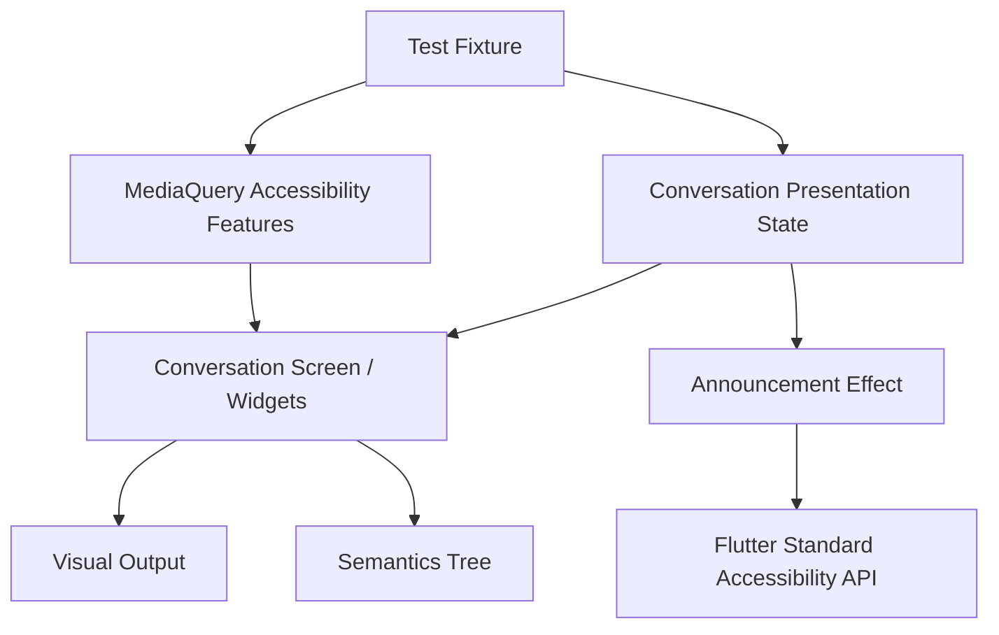

# Project Alice - FIP-012 Accessibility and Visual Gate Implementation Plan

## 1. Document Information

| Item | Value |
|---|---|
| Document | `fip-012-accessibility-and-visual-gate-plan.md` |
| FIP | FIP-012 Accessibility and Visual Gate |
| Status | Draft |
| Draft Planning | Completed / User Confirmed |
| Implementation | Not Started |
| Review Required After Phase 2-4 Design | Yes |
| Target | Phase 1 iOS Frontend |
| Last Updated | 2026-08-21 JST |

本ドキュメントは、FIP-006〜FIP-011で構築するPhase 1 Conversation UIを横断し、Semantics、VoiceOver、Dynamic Type、Reduce Motion、Contrast、Focus、Touch TargetおよびGolden Testの最終Gateを、後からGitHub Copilot等のAI Coding Assistantへ実装依頼できる粒度で定義するDraft実装計画である。

本Draft作成時点では、ソースコード、Test Code、Dependency、AssetまたはXcode設定を変更しない。Phase 2〜4設計後のCross-phase ReviewおよびPhase 0 Final Design Reviewが完了するまで、FIP-012を実装してはならない。

---

## 2. Purpose / Goal

FIP-012の目的は、Phase 1のConversation UIが視覚的に一致するだけでなく、iOSの支援機能を利用する場合にも同じ主要操作を完了できることを、再現可能なGateとして確立することである。

達成目標:

- Header、Conversation History、状態表示、Composer、主要ActionのSemantics順序を固定する
- Messageの発言者、送信中、Streaming中およびPartial FailureをVoiceOverで区別できるようにする
- 状態変化のAnnouncementを必要な時に一度だけ行い、SSE Deltaごとの過剰通知を防ぐ
- Dynamic Type拡大時もText、InputおよびRecovery Actionを欠落させない
- Reduce Motion時に継続Animationを停止しながら、状態理解を維持する
- Touch Target、Contrast、Focus維持およびHardware Keyboard操作を確認する
- 画面幅、状態、文字倍率およびAlice Core境界をDeterministicなGoldenで固定する
- Automated TestとManual Reviewの責務を分け、どちらか一方だけで完了扱いにしない
- FIP-013のLocal Integrationへ進む前に、UI / AccessibilityのRegressionを検出できる状態にする

初心者向けに整理すると、FIP-012は新しい画面を追加する作業ではない。これまで作った画面を、文字を大きくする人、VoiceOverで読み上げる人、動きを減らす設定を使う人にも利用できるか確認し、将来の変更で壊れたことをTestで見つけられるようにする作業である。

---

## 3. Scope

### 3.1 In Scope

- Phase 1 `ConversationScreen`全体のSemantics構造
- Reading OrderとFocus Order
- User / Alice / Pending / Streaming / Partial Failure MessageのAccessible Label
- Initial Loading、Sending、Completion、FailureのAnnouncement制御
- Icon-only ButtonのLabel、Enabled / Disabled State
- InputとValidation Errorの関連付け
- Alice CoreのDecorative Semantics除外
- Dynamic Type標準・拡大・最大付近のLayout検証
- Reduce Motion時のCore、IndicatorおよびProgrammatic Scroll検証
- Increase Contrast時の識別性確認
- 44 x 44 logical pixels以上のTouch Target確認
- Hardware KeyboardによるInput、FocusおよびAction確認
- Conversation UIのWidget / Semantics Test
- Golden Test MatrixとBaseline Review Rule
- Alice Core Asset / Visual Boundary確認
- Phase 1 UI Accessibility Manual Review Checklist
- FIP-006〜FIP-011で定義したAccessibility Ruleの横断Traceability

### 3.2 Out of Scope

- 新しいScreen、Navigation、SettingまたはAccessibility専用画面
- Phase 1のVisual Design、Color Token、Typography、Layoutまたは文言の再設計
- Conversation Domain、API、SSE、RetryまたはPagination Contractの変更
- FlutterからLocal Backendへ接続するHappy-path E2E
- Spring Boot、Fake AIまたはDynamoDB Localを含むLocal Integration
- Real OpenAI APIを利用するTest
- CI Providerの選定またはGitHub Actions等のWorkflow作成
- Light Theme
- Landscape、iPadおよびDesktop Layout
- Voice Input / Output固有のAccessibility
- Personal Memory、Tool、ApprovalまたはAgent固有のSemantics
- Screen Reader Package、Golden専用Packageまたは追加Animation Packageの導入
- Accessibilityを理由としたPhase 2〜4仕様の先取り

Flutter → Local Backend → Fake AI → DynamoDB LocalのE2EはFIP-013の責務である。FIP-012はBackendを必要としないFixture / Fake State中心のUI Gateを構築する。

---

## 4. Preconditions

実装開始前に次を満たすこと。

- FIP-001 / FIP-002がCompleted / Approvedである
- FIP-003〜FIP-012のDraft Planningが完了している
- Phase 2〜4 Designが完了している
- Phase 1〜4 Cross-phase Reviewが完了している
- FIP-003〜FIP-011が必要に応じて修正され、`Approved / Implementation Ready`へ昇格している
- 本Draftが必要に応じて修正され、`Approved / Implementation Ready`へ昇格している
- Phase 0 Final Design Reviewが完了している
- FIP-006〜FIP-011の対象実装と各Slice Testが完了している
- `alice_core_base.png`がCanonical Asset Contractを満たしている

現時点ではDraft Planningだけを行い、Implementationは開始しない。

---

## 5. Related Design Documents

| Document | Relevant Decision |
|---|---|
| `requirements.md` | Phase 1機能・非機能RequirementとSuccess Criteria |
| `mvp.md` | Phase 1 Scope / Exclusion |
| `frontend-design.md` | Presentation、Accessibility、SecurityおよびTest Boundary |
| `frontend-ui-design.md` | UI-001〜UI-016、特にUI-015 AccessibilityとUI-016 Asset Contract |
| `api-design.md` | Error Code、Streaming EventおよびUIへ公開可能なContract |
| `security-design.md` | Content非Logging、Local Data、ATSおよびClient Secret Rule |
| `test-design.md` | Frontend Widget、Golden、Accessibility、PerformanceおよびUI Gate |
| `frontend-implementation-plan.md` | FIP順序、Draft-only方針およびAI Coding Assistant Rule |
| `fip-006-visual-foundation-plan.md` | Theme、Alice Core、Motion、Reduce Motion、Asset / Performance Gate |
| `fip-007-screen-shell-plan.md` | Screen Region、Responsive Layout、Composer、Semanticsの土台 |
| `fip-008-initial-history-plan.md` | Loading / Empty / History / Initial Failure Accessibility |
| `fip-009-send-and-streaming-plan.md` | Pending / Streaming / Completion StateとAnnouncement |
| `fip-010-retry-and-failure-plan.md` | Error、Recovery Action、Partial ContentのSemantics |
| `fip-011-pagination-and-scroll-plan.md` | Reading-history、Latest Button、Scroll / Focus Rule |
| `decisions.md` | Accepted Architecture Decision |

VisualとAccessibilityのSource of Truthは`frontend-ui-design.md`、Test LevelとGateのSource of Truthは`test-design.md`である。矛盾が見つかった場合、本FIP内で推測して解消せず、Source of Truthを先に修正する。

---

## 6. Design Principles

### 6.1 Accessibility Is Product Behavior

Accessibilityを実装後の補足対応として扱わない。Reading Order、Focus、状態通知および操作可能性は、Visual Layoutと同じPhase 1 UI Contractである。

### 6.2 Information Must Not Depend on Decoration

Alice Coreの色、Glow、Ring RotationまたはPulseだけで状態を伝えない。MotionやCoreが見えない場合も、TextとSemanticsでLoading、Streaming、FailureおよびRecovery Actionを理解できるようにする。

### 6.3 Stable Focus Over Automatic Movement

新しいDelta、Completion、ErrorまたはLayout Resizeを理由に、Userが操作しているFocusを奪わない。新着内容への移動はFIP-011の`最新へ`Actionで明示的に行えるようにする。

### 6.4 Deterministic Visual Gate

Golden Testは同じ入力から同じFrameを生成できるよう、Clock、Animation、Locale、Text Scale、Surface SizeおよびFixtureを固定する。実時間、Random値、NetworkまたはDevice固有時刻へ依存させない。

### 6.5 Automated and Manual Checks Are Complementary

Widget / Semantics / Golden TestはRegression検出を担当し、VoiceOverの実際の読みやすさ、Hardware Keyboard、Increase ContrastおよびProfile ModeはManual Reviewを担当する。Automated Test成功だけでFIP-012完了としない。

### 6.6 No Architecture Expansion

Accessibilityのために新しい共通Module、Navigation、Persistenceまたは第三者Packageを追加しない。必要な補助ClassはPhase 1 Conversation Presentation内の具体的責務へ限定する。

---

## 7. Target File Structure

Implementation Resume後に、既存構造へ必要なFileだけを追加・更新する。実際の既存Filenameと重複する場合は、同じ責務のFileへ統合し、平行実装を作らない。

```text
frontend/
├── lib/
│   └── conversation/
│       └── presentation/
│           ├── accessibility/
│           │   └── conversation_announcer.dart
│           ├── screen/
│           │   └── conversation_screen.dart
│           └── widget/
│               ├── alice_core/
│               ├── message/
│               ├── error/
│               └── composer/
├── test/
│   ├── support/
│   │   ├── conversation_test_app.dart
│   │   ├── conversation_test_fixtures.dart
│   │   └── golden_test_environment.dart
│   ├── conversation/
│   │   └── presentation/
│   │       ├── conversation_semantics_test.dart
│   │       ├── conversation_dynamic_type_test.dart
│   │       ├── conversation_reduce_motion_test.dart
│   │       ├── conversation_focus_test.dart
│   │       ├── conversation_touch_target_test.dart
│   │       └── conversation_golden_test.dart
│   └── goldens/
│       └── conversation/
└── integration_test/
    └── ...                         # FIP-013で追加
```

`conversation_announcer.dart`は、Flutter標準のAnnouncement API呼出しと重複抑制をPresentation内へ閉じ込める必要がある場合だけ追加する。既存のScreen ControllerまたはPresentation Effectで同じ責務が明確に実現されている場合は、新しいClassを重複追加しない。

Golden FilenameはState、Width、Text ScaleおよびMotion条件を読み取れる規則にする。Device名や実行日時をFilenameへ含めない。

---

## 8. Component Responsibilities

| Component / Helper | Responsibility | Must Not Do |
|---|---|---|
| `ConversationScreen` | Visual順とSemantics順を整合させ、Focusを維持する | API DTO解析、Provider固有判断 |
| Message Widget | Role、State、ContentのSemanticsを提供する | Canonical / Temporary判定を独自推測する |
| Error Widget | 説明、対象、Recovery Actionを順に提供する | Stack Traceや内部Codeを読み上げる |
| Composer | Input、Validation、Send状態をAccessibilityへ公開する | Draftを永続化する |
| `AliceCoreView` | Decorative Semantics除外とReduce Motionを反映する | 状態を唯一の情報源として表す |
| Latest Button | 新着存在と明示的移動Actionを提供する | FocusまたはScrollを自動的に奪う |
| Announcement Boundary | 状態遷移ごとに必要な通知を一度だけ送る | Delta単位でContentを通知する |
| Test App / Fixture | Surface、Text Scale、Motion、Contrast、Stateを決定論的に注入する | Networkまたは実Backendへ接続する |
| Golden Environment | Locale、Theme、Surface、Animation Frameを固定する | 実行環境差を無条件でBaseline更新する |

---

## 9. Accessibility State and Data Flow



Rules:

- Application StateはVoiceOverの有効・無効をBusiness Ruleへ取り込まない
- Dynamic Type、Reduce MotionおよびPlatform Accessibility FeatureはPresentationで参照する
- Announcementは状態遷移のEffectであり、Buildのたびに発火させない
- SSE Delta ContentをAnnouncement入力にしない
- Accessibility Preferenceを端末StorageまたはConversation Stateへ永続化しない
- TestではNetworkなしでPresentation StateとAccessibility Featureを注入できるようにする

---

## 10. Semantics Reading Order Contract

基本Reading Orderは次とする。

1. Header `Alice`
2. Conversation History（古いMessageから新しいMessage）
3. 現在のStreaming / Error State
4. Message Input
5. Send Button

Additional Rules:

- Alice CoreはDecorative ElementとしてSemantics Treeから除外する
- Date Separatorは日付として理解できるLabelを持つ
- Inline Errorは対象MessageまたはInputの直後に置く
- Recovery Actionは対応するError説明の後に読む
- `最新へ`Buttonは利用可能なActionとして到達できるが、Message本文の途中へ割り込ませない
- Visual順とSemantics順を逆転させるOrdinal Sort Keyの乱用を避ける
- Hidden / Offstage Componentを重複してSemantics Treeへ残さない
- Message Listを一つの巨大なSemantics Labelへ結合しない

### 10.1 Message Semantic Matrix

| Visual Item | Required Semantic Information | Excluded Information |
|---|---|---|
| Canonical User Message | `あなた`、Content | Internal ID、Request ID、Timestamp常時読上げ |
| Canonical Alice Message | `Alice`、Content | Provider、Model、Token数 |
| Pending User Message | `あなた、送信中`、Content | Idempotency Key |
| Thinking State | `Aliceが回答を作成中` | Provider処理段階、偽Progress |
| Streaming Alice | `Alice、回答を作成中`、現在Content | Delta Count、Chunk情報 |
| Partial Failure | `Alice、途中までの回答`、Partial Content | Canonical完了扱い |
| Date Separator | Local JST Date | Internal Sort Key |
| Pagination Loading | 古い会話を読み込み中であること | Cursor |

Markdownは可能な範囲でHeading、List、LinkおよびCodeの構造を維持する。Raw HTMLを実行せず、ImageをNetworkから読み込まない既存方針を変更しない。

---

## 11. Announcement Contract

| Transition | Announcement | Frequency |
|---|---|---|
| Initial Loadingが300 msを超えて表示された | `会話を読み込んでいます` | 表示開始ごとに一度 |
| Logical Send開始 | `Aliceが回答を作成中です` | Logical Sendごとに一度 |
| First Delta | 追加Announcementなし | なし |
| Subsequent Delta | 追加Announcementなし | なし |
| Canonical Completion | `Aliceの回答が完了しました` | Terminal Completionごとに一度 |
| Terminal Failure | User向けError Title | Terminal Failureごとに一度 |
| Initial Load Failure | `会話を読み込めませんでした` | Error発生ごとに一度 |
| Same ErrorのRebuild | 追加Announcementなし | なし |

重複抑制は画面Build回数ではなく、Logical Send IDまたは状態遷移単位で管理する。AnnouncementのためにConversation Content、Message ID、Idempotency KeyまたはError DetailをLogへ出力しない。

Announcement APIはFlutter `3.47.0`の標準APIを使用し、実装再開時に当該Versionの正確なSignatureを確認する。これはTechnology変更ではなくAPI表記確認であり、第三者Packageを追加してはならない。

---

## 12. Focus Management Contract

| Event | Required Focus Behavior |
|---|---|
| Send | Composer Focusを維持する |
| Keyboard Open / Close | Focused Inputを画面内へ維持する |
| Streaming Start / Delta / Complete | Focusを自動移動しない |
| Initial Load Failure | Error説明からRecovery Actionへ自然に到達できる |
| Validation Error | InputとErrorの関係を伝え、入力修正を妨げない |
| Retry Start | Actionを無効化し、処理中Stateを伝える |
| Retry Complete | 現在Focusを不必要に破棄しない |
| Older Page Insert | Anchor MessageとAccessibility Focusを維持する |
| Alice Core Resize / Hide | 現在FocusとReading Orderを維持する |
| Latest Button実行 | 明示操作として最新領域へ移動できる |

Widget KeyやFocusNodeをBuildごとに再生成してFocusを失わせない。Programmatic ScrollとFocus移動を常に同時実行せず、Userが選んだActionの意味に必要な場合だけ行う。

---

## 13. Dynamic Type Contract

### 13.1 Required Profiles

| Profile | Purpose |
|---|---|
| Standard | 基準Visualと通常操作 |
| Enlarged | 日常的な拡大TextでのRegression検出 |
| Maximum-near | Manual Reviewで主要操作の利用可能性を確認 |

Automated Testの具体的なText Scale値は、Flutter 3.47.0とiOS 15以上で再現可能なFixtureとして実装開始時に固定する。数値を固定する際はiOS Dynamic Type Categoryの意味を保ち、Textを小さくClampして通過させてはならない。

### 13.2 Layout Rules

- Header、Message、ErrorおよびComposer Textを固定Heightで切らない
- Composer 1〜5行Ruleは拡大後のLine Heightで再計算する
- Bubble、Code、TableおよびActionを利用可能幅内へ配置する
- Horizontal Screen Scrollを追加しない
- Alice Coreを先に縮小または非表示にし、Message、Input、ValidationおよびRecovery Actionを優先する
- Width 375、390、430 logical pixelsでHorizontal Overflowを発生させない
- Keyboard OpenとDynamic Type拡大が同時でも、Focused Inputと主要Actionを利用できるようにする

---

## 14. Touch Target and Alternative Input Contract

次のInteractive Componentは44 x 44 logical pixels以上のHit Targetを持つ。

- Send Button
- Retry / Result Check / Reload Button
- `最新へ`Button
- Link
- Code Copy Button

Visual Icon SizeとHit Target Sizeを混同しない。Disabled状態はVisualだけでなくSemanticsへ反映する。

Hardware Keyboardでは次を確認する。

- ComposerへFocusできる
- Draftを入力・編集できる
- Tab / Accessibility Focusから主要Actionへ到達できる
- Enter単独による送信をPhase 1へ追加しない
- Keyboard DismissでDraftを消去しない
- Focus IndicatorをGlowまたはColorだけに依存させない

---

## 15. Contrast and Non-color Information

| Target | Minimum Goal |
|---|---:|
| Normal Text | 4.5:1以上 |
| Large Text | 3:1以上 |
| Major Non-text UI | 3:1以上 |

Rules:

- User / Alice RoleをColorだけで区別しない
- Error、Disabled、Selected、StreamingをColorまたはOpacityだけで区別しない
- Alice Core GlowをTextまたは操作要素の背面へ重ねない
- Increase Contrast有効時にBorder、TextおよびFocus Indicatorを識別できることをManual Reviewする
- Contrast不足をGoldenの見た目だけで判定せず、Token値による機械的確認または計算可能なTestを併用する
- 確定Color TokenをTest通過のために独自変更しない。未達なら`frontend-ui-design.md`を先にレビューする

---

## 16. Reduce Motion Contract

Reduce Motion有効時:

- Alice CoreのRing Rotationを停止する
- Thinking Pulseを停止する
- 継続Scale変化を停止する
- Streaming Indicatorの強い点滅または反復移動を停止する
- Core縮小・復元は即時切替または短いCross-fadeへ変更できる
- FIP-011のLatest移動は即時移動とする
- 状態はTextとSemanticsから理解できる状態を維持する
- Conversation、Send、Retry、PaginationおよびCopy操作は通常どおり利用できる

Reduce Motion無効時も、AnimationによってSemantics TreeをFrameごとに更新したり、Message List全体を継続Repaintさせたりしない。

---

## 17. Golden Test Matrix

Golden Testは少なくとも次を対象とする。

### 17.1 Width Matrix

| Width | Required Baseline |
|---:|---|
| 375 | 通常Conversation、小さい幅のBoundary |
| 390 | Reference Layout |
| 430 | 広いiPhone幅のBoundary |

Portrait Orientationを固定し、Device固有のSafe Area値へ依存しないTest Surfaceを使用する。実際のSafe Area挙動はWidget / Manual Testで別途確認する。

### 17.2 State Matrix

- Empty
- Initial Loading
- Ready with normal Conversation
- Thinking before first Delta
- Streaming with partial Markdown
- Initial Load Error
- Result Unknown / Recovery Action
- Terminal Failure with Partial Content
- Pagination Loading / Pagination Failure
- Reading History with `最新へ`
- Keyboard Open

### 17.3 Accessibility Matrix

- Dynamic Type標準
- Dynamic Type拡大
- Reduce Motion有効時のStatic Alice Core
- Alice Core通常表示、縮小および非表示Boundary
- Alice Coreを96、180、260 logical pixelsで表示した状態

すべてのState × Width × Accessibility条件の直積をGolden化しない。上記BoundaryをPairwiseに組み合わせ、同じLayout Ruleを重複撮影しない最小MatrixをTest File冒頭へ明記する。

### 17.4 Naming Rule

```text
<screen>__<state>__w<width>__<accessibility-condition>.png
```

Example:

```text
conversation__ready__w390__standard.png
conversation__streaming__w375__large-text.png
conversation__thinking__w390__reduce-motion.png
conversation__keyboard__w430__large-text.png
```

---

## 18. Deterministic Golden Environment

Goldenは次を固定する。

- Flutter / Dart Version
- Approved Dependency Versionと`pubspec.lock`
- Dark Theme
- Locale `ja-JP`
- JST表示用Fixture Date
- Surface Width / Height
- Device Pixel Ratio
- Text Scale Profile
- Accessibility Feature
- Animation Clock / Controller Value
- Message / Error / Markdown Fixture
- Image Decoderが利用するCanonical Alice Core Asset

Rules:

- Network、Backend、Current TimeまたはRandom UUIDへ依存しない
- Canonical ID / Timestampは固定Fixtureを使用する
- Animation GoldenはDeterministicな一Frameを撮影する
- Font Rendering差を減らすため、Approved Flutter / iOS Test Environmentを維持する
- Golden差分が出た場合、原因を確認してVisual変更としてReviewする
- CIやLocal Testを通す目的だけでBaselineを自動更新しない
- Intentional Updateには変更理由、対象UI DecisionおよびBefore / After確認を残す

---

## 19. Alice Core Asset and Visual Gate

Canonical Assetについて次を自動またはManualで確認する。

- Fileが存在しFlutterからDecodeできる
- PNG、1024 x 1024、sRGB、Alpha Channel付き
- 四隅が完全透過
- File Sizeが2 MB以下
- Ring、文字、Logo、Watermarkまたは背景Rectangleを含まない
- 96、180、260 logical pixelsで主要Particleと中心Glowを識別できる
- Dark BackgroundとCheckerboard上でClippingまたはWhite / Black Haloがない

PerformanceはFIP-006で実装し、本FIPではPhase 1 UI Gateとして結果を確認する。

- Alice Coreが`RepaintBoundary`へ隔離されている
- AnimationでHeader、Message ListまたはComposerが継続Repaintされない
- Inactive / Background時にAnimationが停止する
- Profile ModeでUI / Raster Frame p95が16.7 ms以内を目標とする

未達時は勝手にVisual TokenやParticle Assetを変更せず、UI-013の順序に従ってDesign Reviewする。

---

## 20. Test Fixture Strategy

Backendを使用せず、FIP-003〜FIP-011のFake / Fixtureを再利用する。

Required Fixture:

- 0件 / 複数件 / 50件PageのConversation
- 短文、長文、Emoji、改行、Code、Table、Linkを含むMessage
- Pending User Message
- Thinking State
- 複数Delta後のStreaming State
- Canonical Completion State
- Partial Content付きTerminal Failure
- Initial Load / Send / Pagination Error
- `最新へ`表示State
- Validation Error付きComposer

Fixtureへ実Conversation Content、Secret、Credentialまたは実User情報を使用しない。TimestampはJSTの固定値とし、実行日のClockに依存しない。

---

## 21. Automated Test Strategy

### 21.1 Semantics / Widget Tests

- HeaderからComposerまでのReading Order
- User / Alice / Pending / Streaming / Partial Failure Label
- Date Separator Label
- Icon-only Button Label
- Enabled / Disabled State
- InputとValidation Errorの関連
- Error説明からRecovery Actionへの順序
- Alice CoreがSemantics Treeへ入らないこと
- Latest Buttonが到達可能でMessage読上げへ割り込まないこと
- Core縮小・非表示時にFocusを失わないこと
- Delta追加ごとにAnnouncementが発生しないこと
- Completion / Failure Announcementが一度だけであること

### 21.2 Responsive / Dynamic Type Tests

- Width 375 / 390 / 430でHorizontal Overflowなし
- Standard / Enlarged TextでText切断とOverlapなし
- Composer 1〜5行と内部Scroll
- Keyboard OpenでCore縮小 / 非表示、InputとAction維持
- Code / Tableの局所Horizontal ScrollがScreen全体へ伝播しないこと
- Recovery Actionが画面外へ固定されないこと

### 21.3 Reduce Motion Tests

- Ring Rotation停止
- Pulse / Continuous Scale停止
- Streaming Indicatorの継続Motion停止
- Latest移動が即時になる
- 状態Text / Semantic Label維持
- Conversation操作が無効化されないこと

### 21.4 Golden Tests

Section 17のMatrixを実装し、Goldenを通常の`flutter test`へ含める。

### 21.5 Existing Regression Suite

FIP-003〜FIP-011で追加したUnit / Widget / Contract Fixture Testをすべて再実行する。FIP-012の都合で既存Testを削除、Skipまたは期待値緩和してはならない。

---

## 22. Manual Review Matrix

Phase 1 iOS Simulatorまたは実機で次を確認する。

| Area | Required Check |
|---|---|
| VoiceOver | Reading Order、Role、State、Error、Action、Announcement頻度 |
| Dynamic Type | Standard、Enlarged、Maximum-nearで主要操作を完了できる |
| Reduce Motion | Core / Indicator Motion停止、状態理解維持 |
| Increase Contrast | Text、Border、Focus、Error、Button識別 |
| Hardware Keyboard | Input、Tab Focus、Send Action、Retry、Draft保持 |
| Software Keyboard | Core Resize、Composer、Scroll Anchor、Focus維持 |
| Width | 375、390、430相当のPortrait Layout |
| Long Content | Markdown、Code、Table、長文、Emoji、選択 / Copy |
| Error Recovery | Reload、Result Check、New Logical Send、Pagination Retry |
| Alice Core | 96 / 180 / 260、縮小 / 非表示、Halo / Clipping |

Manual Reviewでは「起動した」だけを合格条件としない。主要Flowを実際に操作し、観察結果と未解決FindingをFIP-012 Review記録へ残す。

---

## 23. Security and Privacy Checks

- App BundleへOpenAI API Key、AWS CredentialまたはAuthentication Secretが含まれない
- Conversation Content、SSE Delta、Cursor、Idempotency KeyをLogへ出力しない
- Accessibility LabelへRequest ID、Internal Error Detail、ProviderまたはModel名を含めない
- Golden / Test Fixtureへ実Conversationまたは実User情報を含めない
- Screenshot ArtifactへSecretや実Conversationが含まれない
- Profile / ReleaseへLocal HTTP ATS例外が入らない
- `NSAllowsArbitraryLoads`が存在しない
- `ios/Flutter/Local.xcconfig`がGit管理対象にならない
- Certificate検証を無効化するCodeを追加しない
- Phase 1でConversation HistoryまたはAccessibility Preferenceを端末永続化しない

Security違反をTest通過のためにMaskするのではなく、Sourceの責務へ戻して修正する。

---

## 24. Implementation Steps

Phase 0 Final Design Review後に次の順序で実装する。

1. FIP-003〜FIP-011のImplementationとTest成功を確認する
2. `frontend-ui-design.md` UI-015 / UI-016と`test-design.md` Section 25を再確認する
3. 既存WidgetのSemantics、FocusNode、MotionおよびTest HelperをInventoryする
4. 重複しない共通Test App / Fixtureを整備する
5. Header、Message、Error、Composer、ActionのReading Order Testを追加する
6. Message Role / State Semantic Testを追加する
7. Announcementの状態遷移と重複抑制Testを追加する
8. Focus維持Testを追加する
9. Dynamic Type / Width / Keyboard Matrix Testを追加する
10. Touch TargetとContrastの検証を追加する
11. Reduce Motion Testを追加する
12. Deterministic Golden Environmentを構成する
13. Section 17の最小Golden Matrixを追加する
14. Alice Core Asset Contractを自動 / Manual確認する
15. `dart format lib test`を実行する
16. `flutter analyze`を実行する
17. `flutter test`を実行する
18. iOS Simulator / 実機でSection 22をManual Reviewする
19. Profile ModeでAlice Core Performance Gateを確認する
20. Security / Privacy Checkを実行する
21. 全Findingを解消し、Design DriftがないことをReviewする

FIP-012で見つかった不具合は、原因を所有するFIPの実装へ最小修正として戻す。確定済みDesignを変更する必要がある場合は、Test期待値を変更する前にSource of Truthを更新する。

---

## 25. Validation Commands

Implementation Resume後の基本Gate:

```bash
dart format lib test
flutter analyze
flutter test
```

Golden Testは通常の`flutter test`へ含める。Golden Baseline更新Commandは、意図したVisual変更をReviewする時だけ使用し、通常Gateの代替にしない。

Profile ModeとManual Accessibility Reviewの正確なDevice / Commandは、Phase 2〜4設計後かつ実装再開時に、承認済みFlutter `3.47.0`、Dart `3.13.0`、iOS 15以上およびXcode Baselineに対して固定する。TechnologyやTarget Platformを独自変更してはならない。

FIP-013の`integration_test`、Local Backend、Fake AIおよびDynamoDB Localは本FIPのValidation Commandへ混在させない。

---

## 26. Acceptance Criteria

1. Header、History、State、ComposerおよびSendのReading Orderが仕様どおりである
2. User / Alice / Pending / Streaming / Partial FailureをSemanticsで区別できる
3. Alice Coreが不要なFocus Targetにならない
4. Icon-only Actionに具体的なLabelがある
5. Disabled / Processing StateをSemanticsで理解できる
6. Announcementが状態遷移ごとに一度だけで、Deltaごとに発生しない
7. Streaming / Completion / ErrorでUser Focusを奪わない
8. Dynamic Type拡大時にText、Input、ValidationおよびRecovery Actionが欠落しない
9. Width 375 / 390 / 430でHorizontal Screen Overflowがない
10. Interactive Targetが44 x 44 logical pixels以上である
11. Reduce Motion時に継続Motionが停止し、主要機能を利用できる
12. Contrast目標を満たし、状態をColorだけで伝えていない
13. Required Golden MatrixがDeterministicに成功する
14. Alice Core Asset / Visual / Performance Gateを満たす
15. VoiceOver、Dynamic Type、Reduce Motion、Increase ContrastおよびHardware KeyboardのManual Reviewが完了する
16. Existing FIP-003〜FIP-011 TestがRegressionなく成功する
17. Secret、実ConversationおよびInternal DetailがTest / Golden / Logへ含まれない
18. Scope外Dependency、Screen、NavigationまたはFuture Featureを追加していない

---

## 27. Completion Conditions

- Semantics / Announcement / Focus Test実装済み
- Dynamic Type / Width / Keyboard Test実装済み
- Touch Target / Contrast / Reduce Motion Test実装済み
- Golden Matrix実装・Visual Review済み
- Alice Core Asset / Visual / Performance確認済み
- Manual Accessibility Review Matrix完了
- Security / Privacy Check完了
- `dart format lib test`成功
- `flutter analyze`成功
- `flutter test`成功
- Existing Regression Test成功
- Review Finding解消済み
- FIP-013へ渡すUI Gateが明文化されている

Draft計画書作成完了はFIP-012 Implementation完了を意味しない。

---

## 28. Dependencies on Other FIPs

| FIP | Relationship |
|---|---|
| FIP-003 | Message Role / Stateの意味を利用する |
| FIP-004 | Error / SSE Contractの既知Categoryを利用する |
| FIP-005 | Screen StateとPresentation Effectを利用する |
| FIP-006 | Theme、Alice Core、Motion、Asset / Performance Contractを検証する |
| FIP-007 | Screen Region、Composer、Message WidgetのSemanticsを検証する |
| FIP-008 | Initial Loading / Empty / History / Failureを検証する |
| FIP-009 | Pending / Thinking / Streaming / Completionを検証する |
| FIP-010 | Retry / Result Unknown / Partial Failureを検証する |
| FIP-011 | Pagination / Latest / Scroll / Keyboard Focusを検証する |
| FIP-013 | FIP-012通過後、Local Backendを含むE2Eを実施する |

FIP-012はFIP-006〜FIP-011の横断Gateであり、各FIPの所有責務を一つの巨大WidgetまたはTest Helperへ移動させない。

---

## 29. Phase 2-4 Extension Notes

Cross-phase Reviewでは次を確認する。

- Personal Memory Card / Source表示を追加する場合のReading OrderとPrivacy Label
- Tool Result / Permission / Approval CardのRole、RiskおよびAction Semantics
- Agent Long-running StateのAnnouncement頻度とFocus保護
- Voice / AmbientのListening / Speaking PresentationとScreen Reader Audioの競合
- PC / Browser操作の確認Dialog、取消、危険度およびAudit表示
- DesktopでのPane Reading Order、Keyboard ShortcutおよびFocus Traversal
- 流動Particle Mesh RendererのReduce Motion、PerformanceおよびDecorative Semantics

FIP-012ではPhase 2〜4のLabel、Card、Approval Flow、Voice InteractionまたはDesktop Focus仕様を確定しない。

---

## 30. AI Coding Assistant Constraints

AIは次を独自変更してはならない。

- UI-001〜UI-016の確定Design
- Single Conversation / Portrait / Dark-only Scope
- Reading OrderとMessage Role Semantics
- DeltaごとのAnnouncement禁止
- Focusを自動的に奪わないRule
- Dynamic Typeを小さくClampしないRule
- Alice Coreを操作前提にしないRule
- Reduce Motion時の継続Motion停止
- 44 x 44 logical pixels以上のTouch Target
- Confirmed Color / Typography / Spacing Token
- Golden Baselineの無条件更新禁止
- Real Data / SecretをFixtureへ含めないRule
- No New Third-party Dependency
- FIP-013のLocal Integrationを先行しないRule
- Phase 2〜4 Featureを先行実装しないRule

Flutter標準APIの制約で仕様どおり実装できない場合、別Packageまたは独自Accessibility Behaviorを追加せず停止して報告する。

---

## 31. Draft Review Checklist

### Accessibility Contract

- [x] Reading Orderを固定している
- [x] Message Role / State Labelを定義している
- [x] Announcement頻度を定義している
- [x] Focus維持Ruleを定義している
- [x] Touch TargetとAlternative Inputを定義している

### Visual Gate

- [x] Dynamic Type / Width Matrixを定義している
- [x] Reduce Motion Behaviorを定義している
- [x] ContrastとNon-color Ruleを定義している
- [x] Golden Matrixと決定論性を定義している
- [x] Alice Core Asset / Performance確認を定義している

### Test Boundary

- [x] Automated TestとManual Reviewを分離している
- [x] Existing Regression Suiteを維持している
- [x] FIP-013 E2Eを先行していない
- [x] Real Backend / Real OpenAIを要求していない
- [x] Security / Privacy Checkを含めている

### Planning Boundary

- [x] Source Codeを変更していない
- [x] Test Codeを変更していない
- [x] Dependency / Asset / Xcode設定を変更していない
- [x] Phase 2〜4の具体仕様を推測していない
- [x] Cross-phase Reviewを必須としている

---

## 32. Current Decision and Next Step

現在の状態:

```text
FIP-012 Document: Draft Created
FIP-012 Draft Planning: Completed / User Confirmed
FIP-012 Implementation: Not Started
Cross-phase Review: Completed / Passed — 2026-09-04
```

本Draftはユーザー確認済みである。FIP-003〜FIP-012の実装には進まず、Phase 1 Frontend作業を停止してPhase 2 Personal Memory Designへ移る。

---

## Cross-Phase Re-review Resolution — 2026-09-04

**Result:** PASS — Approved / Implementation Ready  
**Implementation Gate:** Phase 0 Final Design Review must PASS before this FIP may be implemented.

This FIP was re-reviewed after completion of Phase 2 Personal Memory, Phase 3 Tools / External Services, and Phase 4 Agent / PC / Browser / Voice formal design.

Cross-phase findings:
- Critical: 0
- High: 0
- Blocking Medium: 0

Confirmed constraints:
- Phase 1 scope remains unchanged; Phase 2〜4 capability code, empty packages, generic frameworks, routes, states, permissions, or executors are not implemented early.
- Conversation History remains distinct from Personal Memory.
- Memory, Tool, Agent, Permission, Approval, Execution, Voice, and Executor ownership remain outside this Phase 1 FIP except where an explicit Phase 1 contract already exists.
- AI Proposal / Goal / Memory never become Execution Authority.
- Phase 3 / 4 retry, Unknown Outcome, Permission, Approval, Risk, Durable Intent, Fence, Recovery, and Executor semantics are not collapsed into Phase 1 Conversation retry/state semantics.
- UI-XP-001 → UI-012 → Phase-specific UI → Screen / Component / FIP is the visual hierarchy.
- Capability Growth does not imply Dashboard Growth; Conversation + Alice Core remain the primary Alice experience.
- Alice Core renderer remains Presentation-only and replaceable; Phase 1 does not pre-implement the Phase 4 renderer.
- No implementation starts until Phase 0 Final Design Review passes.

**Cross-phase Review Status:** Completed / Passed  
**Plan Status:** Approved / Implementation Ready  
**Implementation:** Not Started


---

## Visual Source-of-Truth Integration Resolution — 2026-09-05

**Status:** Accepted / Integrated  
**Source:** UI-BL-001 / UI-VIS-SOT-001 / accepted Visual Detailed Design / CVD / Golden View decisions

Normative visual hierarchy for all implementation and review work:

`UI-BL-001 → UI-VIS-SOT-001 → accepted CVD / Golden View → UI-XP-001 / UI-012 → Phase-specific UI → Component / FIP → Implementation → Generated Mockup`

Rules:
- Conversation + Alice Core remain the primary Alice experience.
- Alice Core represents Presence, never execution authority.
- `AliceCoreState → Presentation Contract → AliceCoreRenderer → Visual Expression`.
- Renderer technology remains Presentation-only and replaceable.
- Application / Domain logic must not depend on particle, shader, asset, geometry, animation-controller, or canvas implementation details.
- Phase 1 does not pre-implement speculative Phase 2–4 renderer frameworks. Replaceability is achieved through Presentation isolation and dependency direction within the implemented scope.
- Capability Growth must not become permanent Dashboard / Primary Navigation Growth.
- Generated mockups never override the accepted visual Source of Truth.
- Any visual mismatch is Visual Drift and blocks UI approval until corrected or explicitly superseded by a new user-approved baseline decision.
