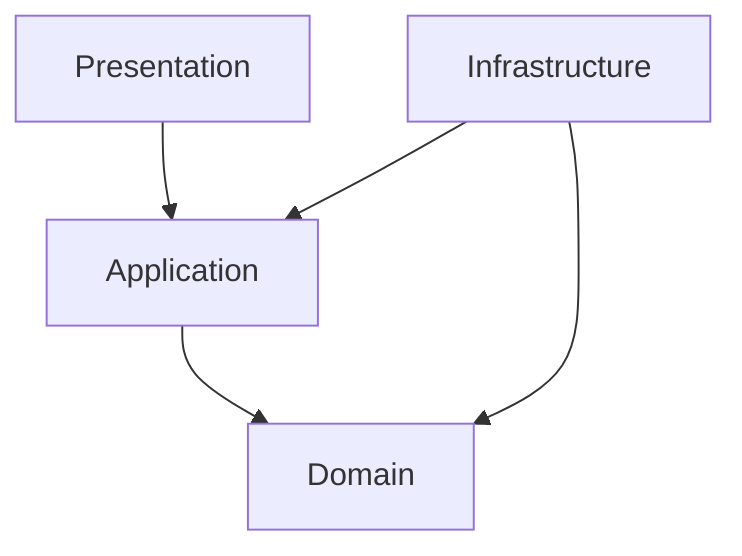

# Project Alice - Frontend Design

## 1. Document Information

| Item | Value |
|---|---|
| Document | `frontend-design.md` |
| Status | Approved |
| Target | Phase 1 Flutter Frontend Detailed Design |
| Last Updated | 2026-08-17 JST |

本ドキュメントは、Project Alice Phase 1のSmartphone Applicationについて、内部Architecture、状態管理、Backend API / SSE接続、画面状態、SecurityおよびTest実装規則を定義する。

本ドキュメントのTechnology Baselineは2026-08-16 JSTにユーザー承認済みであり、Phase 1 Frontend ImplementationのSource of Truthとして扱う。

---

## 2. Related Documents and Ownership

| Document | Ownership |
|---|---|
| `requirements.md` | Phase 1機能・非機能要件 |
| `mvp.md` | Phase Scope |
| `alice-architecture.md` | System Boundary |
| `api-design.md` | HTTP / JSON / SSE Contract |
| `security-design.md` | Network、Secret、Logging、Local Data |
| `test-design.md` | Test Level、Environment、Command、CI Gate |
| `development-environment.md` | SDK導入・Local起動方法 |
| `decisions.md` | Accepted Architecture Decision |

API Field、Event、Error、PaginationまたはSecurity Boundaryを本ドキュメント側で変更しない。矛盾がある場合は実装前にSource of Truthを整合させる。

---

## 3. Phase 1 Scope

### 3.1 In Scope

- iOS Smartphone Application
- Single Conversation Screen
- Text Message入力・送信
- Alice ResponseのSSE Streaming表示
- Conversation History初期表示・過去Page読込
- Safe RetryとTerminal Result Replay
- Error表示・再接続操作
- Unit、Widget、Integration Test

### 3.2 Out of Scope

- Android、Web、Desktop正式対応
- Conversation一覧、切替、削除
- Personal Memory UI
- Tool、Agent、PC、Browser、Voice UI
- Authentication / Authorization
- Push Notification
- Conversation Contentの端末永続化
- Offline Message Queue

Phase 1では将来用の空Feature、Route、PortまたはPackageを作成しない。

---

## 4. Confirmed Technology Baseline

| Item | Decision | Reason |
|---|---|---|
| Flutter | `3.47.0` Stable | Phase 1実装開始時点のStableを固定する |
| Dart | `3.13.0`（Flutter同梱） | Flutter SDKと組み合わせを固定する |
| Target Platform | iOS Smartphone | ユーザーのPhase 1対象Platform Decision |
| Minimum iOS Version | iOS 15 | Flutter 3.47以降の公式Support Matrixに合わせる |
| Default Development Device | iOS Simulator | Loopback Backendへ安全かつ再現可能に接続できる |
| State Management | `flutter_riverpod 3.4.2` | UIと状態遷移を分離し、DependencyをTestで差し替える |
| HTTP Client | `http 1.6.0` | `Client.send()`でStreaming Responseを扱え、Client注入が容易 |
| UUID | `uuid 4.6.0` | `Idempotency-Key`用UUID v4生成 |
| Markdown Renderer | `flutter_markdown_plus 1.0.12` | Alice Messageを安全なGFMとして表示し、Text Selection、TableおよびCode Blockを扱う |
| Unit / Widget Test | Flutter SDK `flutter_test` | Flutter標準Test |
| Application Integration Test | Flutter SDK `integration_test` | Flutter標準のApp Integration Test |

Phase 1ではRiverpod Code Generation、Freezed、JSON Code GenerationおよびSSE専用Packageを導入しない。DTO数と状態数が少ないため、Plain Dartと小さな独自SSE Parserで十分である。反復的なBoilerplateが実際の保守問題になった場合のみ再評価する。

`pubspec.lock`をCommitし、CIとLocalで同じDependency Versionを利用する。Flutter / Dart / Package Versionを変更する場合は、実装前にCompatibility、MigrationおよびTest結果を確認する。

---

## 5. Frontend Architecture

Phase 1はFeature-based Structure + Layer Separationを採用する。

```text
frontend/lib/
├── app/
│   ├── alice_app.dart
│   ├── app_configuration.dart
│   └── app_providers.dart
├── conversation/
│   ├── presentation/
│   ├── application/
│   ├── domain/
│   └── infrastructure/
└── shared/
    ├── error/
    └── logging/
```

### 5.1 Presentation

- Screen、Widget、入力Controller
- Riverpod Provider / Notifier
- UI State描画
- User ActionをApplicationへ委譲
- Error Codeからユーザー向け表示へのMapping

Business Rule、HTTP処理、JSON解析またはSSE解析をWidgetへ置かない。

### 5.2 Application

- Conversation開始時の初期読込
- Message送信Flow
- SSE Eventから画面状態への遷移
- Retry / Replay Flow
- Pagination Flow

HTTP Package固有Typeを公開しない。

### 5.3 Domain

- `Conversation`
- `Message`
- `MessageRole`
- `OutgoingMessage`
- Domain Error / Result

Plain Dartとし、Flutter、Riverpod、HTTP、JSONへ依存しない。

### 5.4 Infrastructure

- Backend HTTP Client
- API DTO / JSON Mapping
- SSE Parser
- API Error Mapping
- Runtime Configuration読込

OpenAI APIを直接呼び出さず、OpenAI API KeyまたはAWS Credentialを保持しない。

### 5.5 Dependency Direction



Application側が`ConversationGateway`を所有し、Infrastructureの`BackendConversationClient`が実装する。

---

## 6. Core Models

```text
Conversation
- id: String
- createdAt: DateTime
- updatedAt: DateTime

Message
- id: String
- role: MessageRole
- content: String
- createdAt: DateTime

OutgoingMessage
- idempotencyKey: String
- content: String
```

API DTOとDomain Modelを分離する。未知のOptional JSON Fieldは無視し、Required Fieldの欠落・型不一致・未知の`role`はContract Errorとする。

Backendから受信する日時は`api-design.md`に従うJST Offset付き文字列を`DateTime.parse`で解析する。FrontendはTimestampをRequestへ送信しない。表示時はJSTへ変換し、端末Timezoneにより意味が変わらないようにする。

---

## 7. State Design

### 7.1 Screen State

| State | Meaning | Main UI |
|---|---|---|
| `initialLoading` | 起動時History取得中 | Loading表示 |
| `ready` | 入力可能 | History + Input |
| `loadingOlder` | 過去Page取得中 | 上端Progress |
| `sending` | Request開始〜最初のDelta待機 | User Message +生成開始表示 |
| `streaming` | Delta受信中 | Temporary Assistant Message |
| `sendFailed` | Terminal Failureまたは接続結果不明 | Error +許可された再試行Action |
| `initialLoadFailed` | 初期取得失敗 | Error +再読込Action |

一つのState Objectに、Canonical Messages、Temporary Assistant Text、Pagination、Pending SendおよびErrorを保持する。UIは個別Booleanを独立管理して矛盾状態を作ってはならない。

### 7.2 Concurrent Send

Phase 1 BackendのConversation Busy制約に合わせ、`sending`または`streaming`中は新規送信を無効化する。過去Page読込とMessage送信を同時に開始しない。

---

## 8. Initial Load and Pagination

1. App起動時に`GET /api/v1/conversation`を呼ぶ
2. `404 CONVERSATION_NOT_FOUND`は正常な未作成状態として扱う
3. `GET /api/v1/conversation/messages?limit=50`を呼ぶ
4. Responseの`messages`を古い順から新しい順のまま表示する
5. `hasMore=true`の場合のみ`nextCursor`を保持する
6. 上方向Scrollで同じ`nextCursor`を変更せず送信する
7. 追加Pageを既存Listの先頭へ結合し、Message IDで重複を除外する

Cursorを解析、生成、記録またはLogへ出力しない。Page読込失敗時は既存Historyを維持し、そのPageだけを同じCursorで再試行できるようにする。

---

## 9. Send Message and Idempotency

### 9.1 New User Action

1. Trim相当の判定で空白のみかをValidationする。ただし送信Content自体はTrim、正規化または改変しない
2. Userが送信を確定した時点でUUID v4を一度だけ生成する
3. `OutgoingMessage`へContentとKeyを保持する
4. `POST /api/v1/conversation/messages`を開始する
5. 同じLogical SendがTerminal Resultへ到達するまでKeyを変更しない

### 9.2 Retry Rule

- 接続結果が不明な場合は、同じContentと同じ`Idempotency-Key`で再試行する
- HTTP Libraryの自動POST Retryを使用しない
- Retry操作で新しいKeyを生成しない
- `assistant.completed`または`stream.failed`受信後はPending Sendを破棄する
- Userが内容を編集して改めて送信した場合は、新しいLogical Sendとして新しいKeyを生成する

Pending SendはPhase 1ではMemory内だけに保持する。App Process再起動後は自動再送せず、BackendからCanonical Historyを再取得する。これによりConversation ContentやIdempotency Keyを端末へ不要に永続化しない。

---

## 10. SSE Processing

### 10.1 Parser Boundary

HTTP Byte StreamをUTF-8 Decoderへ渡し、Chunk境界に依存せずSSE Frameへ組み立てる。空行でEventを確定し、`event:`と`data:`を解析する。Comment / Heartbeat行（`:`開始）は無視する。

複数の`data:`行がある場合は改行で連結してからJSON解析する。Backend Contractは一つのEventにつき一つのJSON Payloadを送る。

### 10.2 Event State Machine

正常系:

```text
stream.started
→ assistant.delta (0回以上)
→ assistant.completed
→ connection close
```

失敗系:

```text
stream.started
→ assistant.delta (0回以上)
→ stream.failed
→ connection close
```

| Event | Frontend Action |
|---|---|
| `stream.started` | Request IDを内部Traceへ関連付け、生成待機状態へ移行 |
| `assistant.delta` | `delta`をTemporary Assistant Text末尾へ追加 |
| `assistant.completed` | Canonical User / Assistant MessageでTemporary表示を置換 |
| `stream.failed` | Temporary表示を失敗状態へ移し、Error CodeをUIへMapping |
| Unknown Event | Payloadを解釈せず無視し、後続Event処理を継続 |

Terminal Eventは一度だけ受理する。Terminal後のEvent、重複TerminalまたはContract外順序はProtocol Errorとして扱い、Canonical Historyを再取得する。

Replay Responseでは`assistant.delta`が0回でも正しい。FrontendはReplay時にAI生成を期待せず、`assistant.completed`または`stream.failed`を通常のTerminal Resultとして処理する。

---

## 11. Error Handling

FrontendはRFC 9457 Responseの`code`を安定した機械判定値として使う。`detail`文字列を条件分岐へ使用しない。

| Category | UI Behavior |
|---|---|
| Validation Error | 入力欄付近へ修正可能な内容を表示 |
| Conversation Busy | 入力を保持し、短時間後の再試行を案内 |
| Idempotency Conflict | 自動で別Keyを作らず、処理を停止してHistory再取得 |
| Provider / Persistence Failure | Errorを表示し、API Contractに従う再試行Actionを提示 |
| Network Result Unknown | 同じKeyでの再試行を提示 |
| Protocol / Decode Error | Streamを破棄し、Canonical Historyを再取得 |

Provider固有Error、Stack TraceまたはBackendのInternal Detailをユーザーへ表示しない。

---

## 12. HTTP Client and Configuration

- `http.Client`をApplication Lifecycle単位で一つ生成し、Provider経由で注入する
- App終了時にClientをCloseする
- Connection / Request Timeoutは`api-design.md`および`ai-design.md`のBackend処理時間より短く設定しない
- POSTへ汎用Automatic Retry Middlewareを適用しない
- Base URLは`--dart-define=ALICE_API_BASE_URL=...`から取得する
- Repositoryへ実Network Address、CredentialまたはSecretをHard Codeしない

iOS Simulatorから同じMac上のBackendへ接続するLocal既定候補は`http://127.0.0.1:8080`とする。BackendのLoopback Bindを変更する必要はない。

実機iPhoneの`127.0.0.1`はiPhone自身を指すため、Developer Machine上のBackendへは接続できない。実機検証を行う場合は、MacのPrivate LAN Addressを使用し、`security-design.md`で定義したLAN Access例外条件を満たして関連Documentを更新する。その承認前にBackendを`0.0.0.0`へBindしてはならない。

iOSのApp Transport Security（ATS）に対しては、Local Development Configurationだけで`NSAllowsLocalNetworking = true`を使用できる。`NSAllowsArbitraryLoads = true`で全HTTP通信を許可してはならない。Release ConfigurationへLocal HTTP例外を含めず、Cloud / Remote接続時はHTTPSを必須とする。

### 12.1 AppConfiguration Contract

`AppConfiguration`は`lib/app/app_configuration.dart`へ配置し、Backend接続先を型付きの`Uri`として保持する。

- `ALICE_API_BASE_URL`は`String.fromEnvironment`でBuild-time Configurationから取得する
- 未指定、空文字、Whitespaceのみ、または前後にWhitespaceを含む値はStartup Errorとする
- 暗黙のDefault URLをSource Codeへ持たない
- Configurationは`runApp`より前に生成・検証し、Invalid時はApplicationを起動しない
- Validation Errorへ入力値、Host、CredentialまたはSecretを含めない
- TestではEnvironmentへ依存せずRaw ValueとLocal HTTP許可有無を明示して検証できるFactoryを設ける

URL Validation Rule:

1. Absolute URIであり、SchemeとHostを持つ
2. Schemeは`http`または`https`だけを許可する
3. `http`はDebug BuildかつHostが完全一致で`127.0.0.1`の場合だけ許可する
4. Profile / Release Buildでは`http`を拒否し、`https`だけを許可する
5. User Info、QueryおよびFragmentを禁止する
6. Pathは空または`/`だけを許可し、内部では末尾Slashを持たないOriginへ正規化する
7. API固有PathはBackend Client側で構築し、Base URLへ含めない

このValidationはPhase 1標準Security Boundaryを実装する。LAN Accessを許可するためにHost Ruleを一般化してはならず、実機検証要件が発生した場合は`security-design.md`等を先に更新する。

### 12.2 Xcode Local Configuration

Xcode UIのRun操作でも`ALICE_API_BASE_URL`を渡せるよう、Debug Configurationは次を使用する。

```text
ios/Flutter/
├── Debug.xcconfig
├── Local.xcconfig.example
└── Local.xcconfig
```

- `Debug.xcconfig`は`Local.xcconfig`をOptional Includeする
- `Local.xcconfig`は`DART_DEFINES`へBase64 Encoding済みの`ALICE_API_BASE_URL=...`を追加する
- `Local.xcconfig`はGit管理対象外とする
- `Local.xcconfig.example`は実Addressを含めず、設定形式だけをGit管理する
- Profile / Release Configurationは`Local.xcconfig`を読み込まない
- Base URLはSecretではないが、実Network AddressをRepositoryへHard Codeしない

Local Developmentの標準入力値は`http://127.0.0.1:8080`とする。これは各Developer MachineのGit管理外Configurationへ設定する。

### 12.3 HTTP Client Provider Lifecycle

- `flutter_riverpod 3.4.2`と`http 1.6.0`を承認済みVersionで追加する
- `ProviderScope`をApplication Rootへ一つ配置する
- 検証済み`AppConfiguration`をProvider OverrideでApplicationへ渡す
- `http.Client`はProvider生成時に一つだけ作成する
- 同一Provider Container内では同じClient Instanceを再利用する
- Provider破棄時は`ref.onDispose`から`Client.close()`を一度呼ぶ
- TestはTracking Fake Clientを注入し、再利用とCloseを実Networkなしで確認する

FIP-002ではBackend API Request、JSON、SSE、Conversation GatewayまたはAutomatic Retryを実装しない。

### 12.4 Development-only ATS

- Debug用Info Property Listだけに`NSAppTransportSecurity` / `NSAllowsLocalNetworking = true`を設定する
- Profile / Releaseが使用するInfo Property ListへLocal HTTP例外を含めない
- すべてのConfigurationで`NSAllowsArbitraryLoads`を禁止する
- Xcode Build Settingの`INFOPLIST_FILE`をConfiguration別に設定し、DebugだけがDevelopment用Property Listを参照する

### 12.5 FIP-002 Verification

最低限次を検証する。

- Debug相当で`http://127.0.0.1:8080`を受理する
- `https` Originを受理する
- Missing、Empty、Whitespace、Relative URIおよびUnsupported Schemeを拒否する
- Non-loopback HTTPを拒否する
- Profile / Release相当でLoopback HTTPを拒否する
- User Info、Query、FragmentおよびAPI Pathを拒否する
- Root Slashを正規化する
- ProviderがClientを再利用し、破棄時にCloseする
- Debug用Property Listだけが`NSAllowsLocalNetworking`を持つ
- Profile / Release用Property ListにLocal HTTP例外がない
- `NSAllowsArbitraryLoads`が存在しない

---

## 13. Security and Privacy

- OpenAI API Key、AWS Credential、Authentication TokenをAppへ配置しない
- Conversation Content、SSE Delta、Cursor、Idempotency Keyを通常Logへ出力しない
- Request ID、Error Category、処理時間等の非機密Metadataだけを必要範囲で記録する
- Conversation HistoryまたはPending Sendを端末Storageへ永続化しない
- TLS Certificate検証を無効化するCodeを追加しない
- Phase 1のHTTPはLocal Development Boundaryだけで使用する
- Local HTTP用ATS設定をDevelopment Configurationだけへ限定する
- `NSAllowsArbitraryLoads = true`を使用しない
- Screenshot、Clipboard、Backup等の追加保護はRequirement発生時にSecurity Designで決定する

---

## 14. Accessibility and UX Rules

- Streaming中も既に受信したTextを読み取れる
- Errorを色だけで表現しない
- Send Button、Retry ButtonおよびMessage RoleへSemantic Labelを付ける
- Text Scale変更で主要操作が欠落しない
- Screen ReaderへDelta単位で過剰通知せず、完了時にまとまった通知を行う
- Message入力の空白のみ送信を拒否し、上限10,000 Unicode Code PointをBackendと一致させる

---

## 15. Screen Design Timing and Ownership

### 15.1 Decision Timing

Phase 1の画面デザインは、次の順序でPhase 0中に決定する。

1. `frontend-design.md`のTechnology Baselineを承認する（完了）
2. `frontend-ui-design.md`を新規作成する
3. Wireframe、Visual Designおよび全画面状態をレビュー・承認する
4. Phase 1 Detailed Design横断再レビューを実施する
5. Phase 1 Implementationへ進む

したがって、画面デザインを決めるタイミングは「Frontend Architecture確定後、Phase 1横断再レビューより前」とする。画面デザインをAI実装時の判断へ委ねない。

### 15.2 Document Ownership

| Document | Ownership |
|---|---|
| `frontend-design.md` | Frontend Architecture、State、API / SSE、Security、Test Boundary |
| `frontend-ui-design.md` | User Flow、Wireframe、Layout、Visual Style、Component、Interaction、画面状態 |

画面設計を別Documentとする理由は、Architecture Contractと視覚・操作仕様を分離し、AI Coding Assistantがどちらも明確に参照できるようにするためである。

### 15.3 Phase 1 UI Design Scope

`frontend-ui-design.md`では最低限、次を実装前に確定する。

- Single Conversation ScreenのWireframe
- Message List、User / Alice Message、入力欄、Send / Retry操作
- Initial Loading、Empty、Ready、Sending、Streaming、Failure、Older Page Loading
- Keyboard表示、Safe Area、Scroll、入力欄拡張時のBehavior
- iPhoneの代表的な画面幅でのLayout
- Color、Typography、Spacing、Icon、AliceらしいVisual Tone
- Dark ModeをPhase 1で対応するか否か
- VoiceOver、Dynamic Type、Contrast、Touch Target
- Error Messageと再試行導線

実装中の軽微なSpacing調整は可能だが、画面構造、操作、状態遷移またはAccessibility方針の変更はDesign更新後に行う。

---

## 16. Test Design

| Test Level | Main Target |
|---|---|
| Dart Unit | DTO Mapping、Domain Model、SSE Parser、Event Reducer、Retry State、Pagination Merge |
| Flutter Widget | Loading、Empty、History、Streaming、Failure、Accessibility、Input Validation |
| Contract Fixture | API JSON、RFC 9457、全SSE Event、未知Optional Field / Event |
| Integration | iOS SimulatorでのApp起動、送信、Streaming完了、History再読込、Same-key Replay |

Unit / Widget Testは`flutter test`、Static Analysisは`flutter analyze`、App Integration TestはFlutter SDKの`integration_test`を使用する。正確なCI CommandとEnvironmentは`test-design.md`をSource of Truthとする。

Real OpenAI APIをFrontend Testから呼び出さない。Backend ITまたはFake Transportで決定論的に検証する。

---

## 17. Requirements Traceability

| Requirement ID | Frontend Design / Test |
|---|---|
| `P1-FR-001` | Text Input、Send Action、Conversation Screen、Widget / E2E Test |
| `P1-FR-002` | Single Conversation Route、Conversation一覧なし |
| `P1-FR-003`, `NFR-001` | Backend APIだけを利用し、Provider情報をFrontendへ公開しない |
| `P1-FR-004` | Canonical Alice ResponseをRole付きで表示 |
| `P1-FR-005` | SSE Parser、Temporary Message、Canonical Completion |
| `P1-FR-006`, `P1-FR-007`, `NFR-002` | BackendをHistoryのSource of Truthとし、初期読込・Paginationを実装 |
| `P1-FR-008`, `NFR-006` | UUID v4 Lifecycle、Same-key Retry、Replay State Machine |
| `NFR-003` | Secret非保持、Content非Logging、Local Network Boundary |
| `NFR-004`, `NFR-005` | Phase 1最小PackageとFeature Boundary |
| `NFR-007` | Client注入、Pure Parser / Reducer、Fake Transport |
| `NFR-008` | Request IDとError Categoryによる非機密Trace |
| `NFR-009` | Flutter / Dart / Package Version固定と`pubspec.lock` |

---

## 18. AI Coding Assistant Rules

AI Coding Assistantは次を独自変更してはならない。

- Single Conversation Scope
- Layer BoundaryとDependency Direction
- API Endpoint、Field、SSE EventまたはError Code
- SSE Event順序とTerminal Rule
- Idempotency Key Lifecycle
- Conversation Content非永続化方針
- Secret非保持・非Logging方針
- Approved後のFlutter / Dart / Package Version
- Phase 1 Target Platform

局所的なWidget分割、private Method名および標準的なMapping実装は、他Documentと矛盾しない範囲で合理的に決定してよい。

Theme Detailについては`frontend-ui-design.md`をSource of Truthとする。AI Coding Assistantが合理的に決定してよいのは同Documentで指定されていない局所的なFlutter表現だけであり、確定済みのSemantic Color、Typography、Spacing、Radius、Dark-only Theme、Component Layout、Alice Core表現またはAccessibility Requirementを変更してはならない。

---

## 19. Approval Record

| Item | Value |
|---|---|
| Approval Date | 2026-08-16 JST |
| Result | Approved |
| Target | iOS Smartphone |
| Flutter / Dart | Flutter `3.47.0` / Dart `3.13.0` |
| Minimum Deployment Target | iOS 15 |
| State Management | `flutter_riverpod 3.4.2` |
| HTTP / UUID | `http 1.6.0` / `uuid 4.6.0` |
| Markdown Renderer | `flutter_markdown_plus 1.0.12` |
| Default Integration Device | iOS Simulator |
| Phase 1 Exclusions | SSE専用Package、Code Generation、Conversation Content / Pending Sendの端末永続化 |

上記Technology Baselineを変更する場合は、Compatibility、Migration、SecurityおよびTestへの影響を確認し、実装より先に本Documentと関連Documentを更新する。
