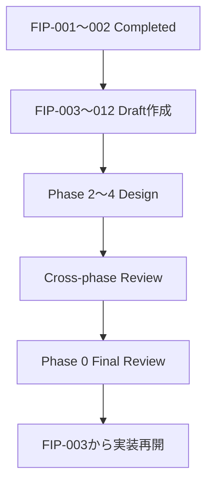

# Project Alice - Phase 1 Frontend Implementation Plan

## 1. Document Information

| Item | Value |
|---|---|
| Document | `frontend-implementation-plan.md` |
| Status | Approved — Phase 0 Planning Mode |
| Target | Phase 1 iOS Frontend |
| Last Updated | 2026-08-19 JST |

本ドキュメントは、承認済みのPhase 1 Frontend Detailed DesignをAI Coding Assistantが実装へ投入するための作業順序、変更単位、入力文書、成果物およびGateを定義する。

Architecture、API、UIまたはSecurityの新しいDecisionを本ドキュメントで追加しない。未決定事項が実装結果を変える場合は、実装前に該当するSource of Truthへ戻して確定する。

### 1.1 Current Execution Status

| FIP | Status | Implementation |
|---|---|---|
| FIP-001 | Completed / Approved | Completed |
| FIP-002 | Completed / Approved | Completed |
| FIP-003〜FIP-012 | Draft documents to be created sequentially | Not Started |
| FIP-013〜FIP-014 | Deferred until Phase 1 implementation resumes | Not Started |

FIP-002は2026-08-19 JSTに、Configuration Test、Static Check、Xcode Debug Configuration経由の起動、およびiPhone 16 Pro Simulatorでの`Alice`表示確認をもって完了した。

---

## 2. Purpose

Implementation Preparationの目的は、設計書を単に一覧化することではない。

- AIが一度に広すぎる変更を行わないよう実装を小さなSliceへ分ける
- 各Sliceで参照する設計書と禁止事項を明示する
- LayerとFeature Boundaryを実際のDirectoryへ接続する
- Testを後付けにせず、各Sliceの完了条件へ含める
- Backend未完成でもFakeを使ってFrontend開発を進められるようにする
- 実装時にAIへArchitecture Decisionを委ねない

### 2.1 Phase 0 Planning Mode

FIP-002完了後はPhase 1 Frontendのソースコード実装を停止する。FIP-003〜FIP-012では実装計画ドキュメントだけを順番に作成し、ソースコード、Test Code、Dependency、AssetまたはXcode設定を変更しない。検証コードもユーザーの明示的な許可なしに作成しない。

FIP-003〜FIP-012の各文書は、作成時点では次の状態とする。

```text
Status: Draft
Implementation: Not Started
Review Required After Phase 2-4 Design: Yes
```

これらはPhase 1 Frontendの完成形と実装順序を明確にするためのDraftであり、Phase 2〜4の具体仕様を先取りして確定するものではない。

---

## 3. Source of Truth Bundle

AI Coding Assistantへは、対象Taskに必要な文書だけでなく、最低限次を同時に入力する。

| Document | Implementation Input |
|---|---|
| `requirements.md` | Phase 1 Requirement / Success Criteria |
| `mvp.md` | Phase 1 Scope / Exclusion |
| `frontend-design.md` | Architecture、State、API Client、SSE、Security Boundary |
| `frontend-ui-design.md` | Screen、Component、Visual Token、Interaction、Accessibility |
| `api-design.md` | Endpoint、JSON、SSE、Error、Retry Contract |
| `security-design.md` | Local Network、ATS、Logging、Client Data Rule |
| `test-design.md` | Test Level、Fixture、Golden、E2E、Gate |
| `development-environment.md` | Flutter / Xcode / Simulator / Command |
| `decisions.md` | Accepted Architecture Decision |

Document間に矛盾が見つかった場合、AIは一方を選んで実装せず、該当Documentを先に修正する。

---

## 4. Confirmed Implementation Baseline

| Item | Decision |
|---|---|
| Flutter | `3.47.0` |
| Dart | `3.13.0` |
| Target | iOS Smartphone、Portrait |
| Minimum iOS | iOS 15 |
| State Management | `flutter_riverpod 3.4.2` |
| HTTP | `http 1.6.0` |
| iOS Native Dependency Management | Swift Package Manager（Flutter 3.47 Default） |
| UUID | `uuid 4.6.0` |
| Markdown | `flutter_markdown_plus 1.0.12` |
| Test | `flutter_test` / `integration_test` |
| Core Asset | `assets/images/alice_core/alice_core_base.png` |
| Flutter Project Name | `alice` |
| iOS Display Name | `Alice` |
| iOS Bundle Identifier | `com.projectalice.assistant` |
| Phase 1 Signing | iOS Simulatorを標準とし、実機利用開始時にDevelopment Teamを設定する |

Phase 1ではCode Generation、Freezed、Riverpod Generator、SSE専用Package、Rive、Shader、Video、Local Databaseまたは追加Navigation Packageを導入しない。

---

## 5. Target Directory Structure

空Directoryを先行作成せず、各Implementation Sliceで必要になったFileだけを追加する。

```text
frontend/
├── pubspec.yaml
├── pubspec.lock
├── analysis_options.yaml
├── assets/
│   └── images/
│       └── alice_core/
│           └── alice_core_base.png
├── lib/
│   ├── main.dart
│   ├── app/
│   │   ├── alice_app.dart
│   │   ├── app_configuration.dart
│   │   └── app_providers.dart
│   ├── conversation/
│   │   ├── presentation/
│   │   ├── application/
│   │   ├── domain/
│   │   └── infrastructure/
│   └── shared/
│       ├── error/
│       └── logging/
├── test/
└── integration_test/
```

`memory/`、`tool/`、`agent/`、`voice/`、Desktop Screenまたは将来用Renderer InterfaceをPhase 1で作成しない。

---

## 6. Implementation Slice Strategy

一つのSliceは、Review可能でTest可能な一つの目的へ限定する。複数Layerへまたがる場合も、同一User Behaviorを完成させるために必要な範囲だけを変更する。

| Order | Slice | Main Deliverable | Required Gate |
|---:|---|---|---|
| 1 | FIP-001 Project Scaffold | Flutter iOS Project、Version固定、Analyzer、Portrait / iOS 15設定 | Completed / Approved |
| 2 | FIP-002 App Configuration | `ALICE_API_BASE_URL`、Development ATS、Client Lifecycle | Completed / Approved |
| 3 | FIP-003 Domain Foundation | Conversation、Message、Role、OutgoingMessage、Domain Error | Draft Document Only |
| 4 | FIP-004 API Contract Foundation | DTO、Problem Details、Mapping、SSE Parser、Fixture | Draft Document Only |
| 5 | FIP-005 Application State | Gateway Port、Screen State、Reducer、Retry / Pagination Rule | Draft Document Only |
| 6 | FIP-006 Visual Foundation | Theme Token、Typography、Spacing、Alice Core Asset / Painter | Draft Document Only |
| 7 | FIP-007 Screen Shell | Header、Core Region、Message Viewport、Composer | Draft Document Only |
| 8 | FIP-008 Initial History | Initial Load、Empty、History、Initial Failure | Draft Document Only |
| 9 | FIP-009 Send and Streaming | Validation、UUID Lifecycle、POST、SSE、Canonical Completion | Draft Document Only |
| 10 | FIP-010 Retry and Failure | Result Unknown、Same-key Retry、Partial Failure、Replay | Draft Document Only |
| 11 | FIP-011 Pagination and Scroll | Older Page、Anchor、Follow-latest、Keyboard | Draft Document Only |
| 12 | FIP-012 Accessibility and Visual Gate | Semantics、Dynamic Type、Reduce Motion、Golden | Draft Document Only |
| 13 | FIP-013 Local Integration | Flutter → Local Backend → Fake AI → DynamoDB Local | Deferred |
| 14 | FIP-014 Implementation Review | Scope、Dependency、Security、Test、Design Drift Review | Deferred |

現在はFIP-003〜FIP-012をドキュメントとしてのみ作成する。FIP-012のDraft完成後はPhase 1 Frontend作業を停止し、Phase 2、Phase 3、Phase 4の設計およびPhase 1〜4横断レビューへ移る。Phase 0 Final Design Review完了後、FIP-003から実装を再開する。

### 6.1 Required Contents of Each FIP Draft

各FIP-003〜FIP-012は最低限、次を明示する。

- Purpose / Goal
- Scope / Out of Scope
- 前提条件と関連する設計書
- 実装対象と想定File構成
- Widget / Class / Componentの責務
- State / Data Flow
- APIおよび他LayerとのBoundary
- 実装手順
- Test方針
- Acceptance Criteria / 完了条件
- 前後FIPとの依存関係
- Phase 2〜4設計後に再確認する事項

Personal Memory、Tool Calling、Agent、Voice、Permission / Approvalおよび将来のSecurity要件は、必要な拡張点または懸念として記録するに留め、FIP Draft内で具体仕様を確定しない。

---

## 7. Slice Dependency



FIP-003〜FIP-012は、Phase 2〜4設計後にArchitecture、Memory、Tool Calling、Agent / Voice、Security / Permission、API、State Managementおよび拡張性の観点で再レビューする。必要な修正後、`Draft → Cross-phase Review → Approved → Implementation Ready`の順に昇格させる。

---

## 8. Test-first Boundary（Implementation Resume後）

各Sliceでは、少なくとも次の順序を守る。

1. Source of Truthから対象Behaviorと禁止事項を抽出する
2. Test FixtureまたはFake Contractを先に定義する
3. 最小実装を追加する
4. 対象Test、`flutter analyze`を実行する
5. Scope外File、Dependency、Loggingが追加されていないことを確認する
6. DesignとDiffを照合する

Testだけを先に大量作成せず、実装Sliceと同じBehavior単位で追加する。Golden更新はVisual変更としてReviewし、失敗を消す目的で無条件に再生成しない。

このSectionはPhase 0 Final Design Review後にFIP-003から実装を再開した時点で適用する。Draft作成期間中にはTest Codeを作成しない。

---

## 9. AI Coding Assistant Task Contract

各Task Promptへ最低限次を含める。

```text
Task ID:
Purpose:
Allowed Files / Packages:
Source of Truth Sections:
Required Behavior:
Prohibited Changes:
Required Tests:
Completion Command:
```

AI Coding Assistantは次を行ってはならない。

- PackageまたはVersionの独自変更
- 新しいArchitecture、共通Moduleまたは将来Featureの追加
- API Field、SSE Event、Error CodeまたはRetry Ruleの変更
- WidgetからHTTP / JSON / SSEを直接処理する
- Conversation Content、Delta、CursorまたはIdempotency KeyをLogへ出力する
- 端末StorageへConversation ContentまたはPending Sendを保存する
- Golden Testを通すために確定Visual Tokenを独自変更する
- Failureを隠すFallback Asset、空Catchまたは無条件Retryを追加する

AIが未指定事項を発見した場合は、実装を停止し、対象、選択肢、影響および推奨案を報告する。

---

## 10. Pull Request / Change Unit

一つのChange Unitは原則として一つのFIP Sliceとする。

変更説明には次を含める。

- 対象FIP ID
- 対応Requirement / UI Decision
- 変更LayerとFile
- 実行したCommand / Test結果
- 未実施のManual Test
- Designとの差分有無
- Security / Privacy確認結果

Refactorと新Behaviorを同じChangeへ混在させない。設計外の改善を見つけても、現在Sliceに必要でなければ別Task候補として記録する。

---

## 11. Definition of Ready for FIP-003 Implementation

Frontend実装開始前に次を満たす。

- [x] `frontend-design.md` Approved
- [x] `frontend-ui-design.md` Approved
- [x] `api-design.md` Approved
- [x] `security-design.md` Approved
- [x] `test-design.md` Approved
- [x] `alice_core_base.png`生成・検証済み
- [ ] 実際のRepositoryへ最新版Documentを反映済み
- [x] Flutter `3.47.0`とDart `3.13.0`をLocalで確認済み
- [x] Flutter導入後にXcode、Swift Package Manager、iOS Simulatorを最終確認済み
- [x] iOS Simulator Runtime `iOS 18.4` / Device Model `iPhone 16 Pro`を記録済み
- [x] Flutter Project Name `alice`を確定済み
- [x] iOS Display Name `Alice`を確定済み
- [x] iOS Bundle Identifier `com.projectalice.assistant`を確定済み
- [x] Phase 1はSimulatorを標準とし、実機利用開始時にDevelopment Teamを設定する方針を確定済み
- [x] FIP-001用Task Promptをレビュー済み
- [ ] FIP-003〜FIP-012 Draft作成済み
- [ ] Phase 2〜4設計完了
- [ ] Phase 1〜4横断レビュー完了
- [ ] FIP-003〜FIP-012再レビュー・必要修正完了
- [ ] Phase 0 Final Design Review完了
- [ ] FIP-003がApproved / Implementation Ready

上記のPhase 0関連項目が未完了の状態でFIP-003以降を実装しない。

---

## 12. Blocking Decisions Before FIP-001

| Item | Recommended Baseline | Reason |
|---|---|---|
| Flutter Project Name | `alice` — Accepted | Dart Package名として簡潔で小文字規則に合う |
| iOS Display Name | `Alice` — Accepted | Product表示名と一致する |
| iOS Bundle Identifier | `com.projectalice.assistant` — Accepted | 個人名を含めずProject Identityだけを使用する |
| Simulator Runtime / Model | `iOS 18.4` / `iPhone 16 Pro` — Fixed | Localで利用可能なRuntimeとDeviceを使用する |
| Signing | Simulator優先、実機利用開始時にDevelopment Teamを設定 — Accepted | Phase 1 Default DeviceはSimulator |

Project IdentityとSigning方針は2026-08-17 JSTにユーザー承認済みである。Local ToolchainとSimulator情報をFIP-001開始前に確認する。

### 12.1 Local Toolchain Observation

2026-08-17 JSTの確認結果は次のとおり。

| Tool | Observed | Readiness |
|---|---|---|
| Host | macOS `15.2` / Apple Silicon `arm64` | Available |
| Flutter | `3.47.0` Stable、Framework `4cf2416426` | Ready |
| Dart | `3.13.0` Stable | Ready |
| DevTools | `2.60.0` | Ready |
| Xcode | `16.3`（Build `16E140`） | Ready |
| iOS Simulator Runtime | `iOS 18.4` | Available |
| Default Simulator | `iPhone 16 Pro` | Fixed for FIP-001 / E2E |
| Swift Package Manager | Flutter `3.47.0` Default | Active |
| CocoaPods | `1.17.0` | Installed as fallback; current project has no Podfile |
| Android SDK | Not installed | Non-blocking — Phase 1 iOS Scope外 |
| Network Resources | Available | Ready |

Xcode、Swift Package ManagerおよびiOS開発環境の確認は完了した。現在のProjectはSwift Package Manager構成であり、Podfileを新規作成しない。Android Toolchain ErrorはPhase 1 Completionを妨げない。

---

## 13. FIP-001 / FIP-002 Execution Record

最初の実装TaskはFlutter Project Scaffoldだけに限定する。

対象:

- `frontend/`へFlutter iOS Projectを作成する
- Flutter / Dart Versionを確認する
- iOS 15 Minimum Deployment Targetを設定する
- PortraitだけをSupported Orientationとする
- `pubspec.yaml`へ承認済みDependencyとAssetを登録する
- `pubspec.lock`を生成・Commit対象とする
- Development用`ALICE_API_BASE_URL`の入口だけを作る
- Default Counter Appを削除し、最小の`AliceApp`起動確認まで行う
- `flutter analyze`と初期Widget Testを成功させる

FIP-001ではConversation Model、API Client、SSE Parser、Riverpod State、Conversation ScreenまたはAlice Core Painterを実装しない。

### 13.1 FIP-001 Execution Status

2026-08-17 JST時点の実行結果:

- `frontend/`へiOS限定Flutter Projectを生成済み
- Flutter Project Nameは`alice`
- iOS Display Nameは`Alice`
- Bundle Identifierは`com.projectalice.assistant`
- `flutter analyze`成功
- Xcodeから`iOS 18.4` / `iPhone 16 Pro` SimulatorへBuild・Install・自動起動成功
- 初期画面で`Hello World!`表示を確認済み

FIP-001 Final Gate:

- [x] iOS Deployment Target `15.0`をXcodeで設定
- [x] Portrait onlyをXcodeで設定
- [x] 最小`AliceApp`構成へ整理
- [x] `main.dart`をEntry Pointだけに限定
- [x] 初期Widget Testを追加
- [x] `dart format lib test`成功
- [x] `flutter analyze`成功
- [x] `flutter test`成功
- [x] `iPhone 16 Pro` Simulatorで中央に`Alice`を表示
- [x] `main.dart`、`alice_app.dart`、`alice_app_test.dart`のCode Review完了

FIP-001 Review Result: **APPROVED**

FIP-001は2026-08-17 JSTに完了した。

### 13.2 FIP-002 Accepted Task Baseline

2026-08-17 JSTに次を承認済み。

- `ALICE_API_BASE_URL`はBuild-time必須値とし、暗黙Defaultを持たない
- Debugの`http`は`127.0.0.1`だけ許可する
- Profile / Releaseは`https`だけ許可する
- Base URLはOriginだけを許可し、User Info、Query、FragmentおよびAPI Pathを拒否する
- Git管理外`Local.xcconfig`によりXcode UIへ`DART_DEFINES`を渡す
- Development-only Info Property Listへ`NSAllowsLocalNetworking = true`を限定する
- `NSAllowsArbitraryLoads`を禁止する
- `http.Client`はRiverpod Provider単位で再利用し、破棄時にCloseする
- Configuration Unit Test、Client Lifecycle TestおよびATS Static CheckをGateとする

FIP-002 Task Promptは`fip-002-app-configuration-prompt.md`を使用する。

### 13.3 FIP-002 Execution Status

FIP-002は2026-08-19 JSTに完了した。

- `AppConfiguration`のValidation / Normalization実装済み
- `String.fromEnvironment`をCompile-time値として取得するため`const`を適用済み
- RiverpodによるConfigurationおよびHTTP Client Lifecycle管理を実装済み
- Debug限定のLocal HTTP / ATS設定を実装済み
- `Local.xcconfig`をGit管理対象外として設定済み
- `dart format lib test`成功
- `flutter analyze`成功
- `flutter test`全26件成功
- Xcode Debug起動およびiPhone 16 Pro Simulatorで`Alice`表示確認済み

FIP-002 Review Result: **APPROVED**

次の作業はFIP-003の実装ではなく、FIP-003 Domain FoundationのDraft実装計画書作成とする。

---

## 14. Phase 0 Frontend Planning Completion Criteria

次をすべて満たした場合、Phase 0におけるFrontend Implementation Planningを完了とする。

- Implementation Sliceと依存順序が承認されている
- Blocking Decisionが確定している
- Local Toolchain確認結果が記録されている
- FIP-001およびFIP-002がCompleted / Approvedである
- FIP-003〜FIP-012 Draftが順番に作成されている
- 各Draftが本ドキュメントの必須項目を満たしている
- 各DraftにPhase 2〜4設計後の再レビュー要否が明記されている
- AI Coding Assistantへ渡すSource of Truth Bundleが最新版である
- Repositoryへ`alice_core_base.png`が正しいPathで配置されている
- Phase 1 Scope外機能を実装Taskへ含めていない

FIP-012 Draft完成後はPhase 1 Frontend作業を停止し、Phase 2〜4設計へ移る。Phase 0 Final Design Review完了後にFIP-003から実装を再開する。
