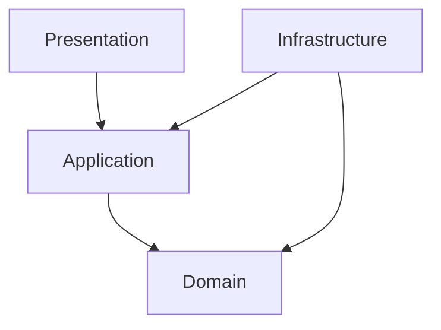

# Project Alice - Frontend Design

## 1. Document Information

| Item | Value |
|---|---|
| Document | `frontend-design.md` |
| Version | 8 |
| Status | Phase 1–2 Approved |
| Target | Phase 1–2 Flutter / Desktop-compatible Frontend Detailed Design |
| Last Updated | 2026-09-02 JST |

本ドキュメントは、Project Alice Phase 1のSmartphone Applicationについて、内部Architecture、状態管理、Backend API / SSE接続、画面状態、SecurityおよびTest実装規則を定義する。

本ドキュメントのTechnology Baselineは2026-08-16 JSTにユーザー承認済みであり、Phase 1 Frontend ImplementationのSource of Truthとして扱う。

---

## 2. Related Documents and Ownership

| Document | Ownership |
|---|---|
| `requirements.md` | Phase 1機能・非機能要件 |
| `mvp.md` | Phase Scope |
| `alice-architecture.md` | System Boundary |
| `api-design.md` | HTTP / JSON / SSE Contract |
| `security-design.md` | Network、Secret、Logging、Local Data |
| `test-design.md` | Test Level、Environment、Command、CI Gate |
| `phase2-frontend-ui-design.md` | Phase 2 Memory画面、Navigation、状態、操作およびAccessibility |
| `development-environment.md` | SDK導入・Local起動方法 |
| `decisions.md` | Accepted Architecture Decision |

API Field、Event、Error、PaginationまたはSecurity Boundaryを本ドキュメント側で変更しない。矛盾がある場合は実装前にSource of Truthを整合させる。

---

## 3. Phase 1 Scope

### 3.1 In Scope

- iOS Smartphone Application
- Single Conversation Screen
- Text Message入力・送信
- Alice ResponseのSSE Streaming表示
- Conversation History初期表示・過去Page読込
- Safe RetryとTerminal Result Replay
- Error表示・再接続操作
- Unit、Widget、Integration Test

### 3.2 Out of Scope

- Android、Web、Desktop正式対応
- Conversation一覧、切替、削除
- Personal Memory UI
- Tool、Agent、PC、Browser、Voice UI
- Authentication / Authorization
- Push Notification
- Conversation Contentの端末永続化
- Offline Message Queue

Phase 1では将来用の空Feature、Route、PortまたはPackageを作成しない。

---

## 4. Confirmed Technology Baseline

| Item | Decision | Reason |
|---|---|---|
| Flutter | `3.47.0` Stable | Phase 1実装開始時点のStableを固定する |
| Dart | `3.13.0`（Flutter同梱） | Flutter SDKと組み合わせを固定する |
| Target Platform | iOS Smartphone | ユーザーのPhase 1対象Platform Decision |
| Minimum iOS Version | iOS 15 | Flutter 3.47以降の公式Support Matrixに合わせる |
| Default Development Device | iOS Simulator | Loopback Backendへ安全かつ再現可能に接続できる |
| State Management | `flutter_riverpod 3.4.2` | UIと状態遷移を分離し、DependencyをTestで差し替える |
| HTTP Client | `http 1.6.0` | `Client.send()`でStreaming Responseを扱え、Client注入が容易 |
| UUID | `uuid 4.6.0` | `Idempotency-Key`用UUID v4生成 |
| Markdown Renderer | `flutter_markdown_plus 1.0.12` | Alice Messageを安全なGFMとして表示し、Text Selection、TableおよびCode Blockを扱う |
| Unit / Widget Test | Flutter SDK `flutter_test` | Flutter標準Test |
| Application Integration Test | Flutter SDK `integration_test` | Flutter標準のApp Integration Test |

Phase 1ではRiverpod Code Generation、Freezed、JSON Code GenerationおよびSSE専用Packageを導入しない。DTO数と状態数が少ないため、Plain Dartと小さな独自SSE Parserで十分である。反復的なBoilerplateが実際の保守問題になった場合のみ再評価する。

`pubspec.lock`をCommitし、CIとLocalで同じDependency Versionを利用する。Flutter / Dart / Package Versionを変更する場合は、実装前にCompatibility、MigrationおよびTest結果を確認する。

---

## 5. Frontend Architecture

Phase 1はFeature-based Structure + Layer Separationを採用する。

```text
frontend/lib/
├── app/
│   ├── alice_app.dart
│   ├── app_configuration.dart
│   └── app_providers.dart
├── conversation/
│   ├── presentation/
│   ├── application/
│   ├── domain/
│   └── infrastructure/
└── shared/
    ├── error/
    └── logging/
```

### 5.1 Presentation

- Screen、Widget、入力Controller
- Riverpod Provider / Notifier
- UI State描画
- User ActionをApplicationへ委譲
- Error Codeからユーザー向け表示へのMapping

Business Rule、HTTP処理、JSON解析またはSSE解析をWidgetへ置かない。

### 5.2 Application

- Conversation開始時の初期読込
- Message送信Flow
- SSE Eventから画面状態への遷移
- Retry / Replay Flow
- Pagination Flow

HTTP Package固有Typeを公開しない。

### 5.3 Domain

- `Conversation`
- `Message`
- `MessageRole`
- `OutgoingMessage`
- Domain Error / Result

Plain Dartとし、Flutter、Riverpod、HTTP、JSONへ依存しない。

### 5.4 Infrastructure

- Backend HTTP Client
- API DTO / JSON Mapping
- SSE Parser
- API Error Mapping
- Runtime Configuration読込

OpenAI APIを直接呼び出さず、OpenAI API KeyまたはAWS Credentialを保持しない。

### 5.5 Dependency Direction



Application側が`ConversationGateway`を所有し、Infrastructureの`BackendConversationClient`が実装する。

---

## 6. Core Models

```text
Conversation
- id: String
- createdAt: DateTime
- updatedAt: DateTime

Message
- id: String
- role: MessageRole
- content: String
- createdAt: DateTime

OutgoingMessage
- idempotencyKey: String
- content: String
```

API DTOとDomain Modelを分離する。未知のOptional JSON Fieldは無視し、Required Fieldの欠落・型不一致・未知の`role`はContract Errorとする。

Backendから受信する日時は`api-design.md`に従うJST Offset付き文字列を`DateTime.parse`で解析する。FrontendはTimestampをRequestへ送信しない。表示時はJSTへ変換し、端末Timezoneにより意味が変わらないようにする。

---

## 7. State Design

### 7.1 Screen State

| State | Meaning | Main UI |
|---|---|---|
| `initialLoading` | 起動時History取得中 | Loading表示 |
| `ready` | 入力可能 | History + Input |
| `loadingOlder` | 過去Page取得中 | 上端Progress |
| `sending` | Request開始〜最初のDelta待機 | User Message +生成開始表示 |
| `streaming` | Delta受信中 | Temporary Assistant Message |
| `sendFailed` | Terminal Failureまたは接続結果不明 | Error +許可された再試行Action |
| `initialLoadFailed` | 初期取得失敗 | Error +再読込Action |

一つのState Objectに、Canonical Messages、Temporary Assistant Text、Pagination、Pending SendおよびErrorを保持する。UIは個別Booleanを独立管理して矛盾状態を作ってはならない。

### 7.2 Concurrent Send

Phase 1 BackendのConversation Busy制約に合わせ、`sending`または`streaming`中は新規送信を無効化する。過去Page読込とMessage送信を同時に開始しない。

---

## 8. Initial Load and Pagination

1. App起動時に`GET /api/v1/conversation`を呼ぶ
2. `404 CONVERSATION_NOT_FOUND`は正常な未作成状態として扱う
3. `GET /api/v1/conversation/messages?limit=50`を呼ぶ
4. Responseの`messages`を古い順から新しい順のまま表示する
5. `hasMore=true`の場合のみ`nextCursor`を保持する
6. 上方向Scrollで同じ`nextCursor`を変更せず送信する
7. 追加Pageを既存Listの先頭へ結合し、Message IDで重複を除外する

Cursorを解析、生成、記録またはLogへ出力しない。Page読込失敗時は既存Historyを維持し、そのPageだけを同じCursorで再試行できるようにする。

---

## 9. Send Message and Idempotency

### 9.1 New User Action

1. Trim相当の判定で空白のみかをValidationする。ただし送信Content自体はTrim、正規化または改変しない
2. Userが送信を確定した時点でUUID v4を一度だけ生成する
3. `OutgoingMessage`へContentとKeyを保持する
4. `POST /api/v1/conversation/messages`を開始する
5. 同じLogical SendがTerminal Resultへ到達するまでKeyを変更しない

### 9.2 Retry Rule

- 接続結果が不明な場合は、同じContentと同じ`Idempotency-Key`で再試行する
- HTTP Libraryの自動POST Retryを使用しない
- Retry操作で新しいKeyを生成しない
- `assistant.completed`または`stream.failed`受信後はPending Sendを破棄する
- Userが内容を編集して改めて送信した場合は、新しいLogical Sendとして新しいKeyを生成する

Pending SendはPhase 1ではMemory内だけに保持する。App Process再起動後は自動再送せず、BackendからCanonical Historyを再取得する。これによりConversation ContentやIdempotency Keyを端末へ不要に永続化しない。

---

## 10. SSE Processing

### 10.1 Parser Boundary

HTTP Byte StreamをUTF-8 Decoderへ渡し、Chunk境界に依存せずSSE Frameへ組み立てる。空行でEventを確定し、`event:`と`data:`を解析する。Comment / Heartbeat行（`:`開始）は無視する。

複数の`data:`行がある場合は改行で連結してからJSON解析する。Backend Contractは一つのEventにつき一つのJSON Payloadを送る。

### 10.2 Event State Machine

正常系:

```text
stream.started
→ assistant.delta (0回以上)
→ assistant.completed
→ connection close
```

失敗系:

```text
stream.started
→ assistant.delta (0回以上)
→ stream.failed
→ connection close
```

| Event | Frontend Action |
|---|---|
| `stream.started` | Request IDを関連付け、保存済みCanonical User MessageでPending表示を置換し、生成待機状態へ移行 |
| `assistant.delta` | `delta`をTemporary Assistant Text末尾へ追加 |
| `assistant.completed` | Started時のCanonical Userを再検証し、Canonical Assistant MessageでTemporary表示を置換 |
| `stream.failed` | Temporary表示を失敗状態へ移し、Error CodeをUIへMapping |
| Unknown Event | Payloadを解釈せず無視し、後続Event処理を継続 |

Terminal Eventは一度だけ受理する。Terminal後のEvent、重複TerminalまたはContract外順序はProtocol Errorとして扱い、Canonical Historyを再取得する。

Replay Responseでは`assistant.delta`が0回でも正しい。FrontendはReplay時にAI生成を期待せず、`assistant.completed`または`stream.failed`を通常のTerminal Resultとして処理する。

`stream.started.userMessage`はBackendのStart Transactionで保存済みのCanonical User Messageである。FrontendはPending Contentとの完全一致を確認し、本文、位置または時刻の近似でMessageを推測対応させない。Terminal `stream.failed`へ到達した場合も、このCanonical User MessageはHistory表示へ残す。

### 10.3 Response and SSE Resource Limits

Frontendは`api-design.md`と一致する次の上限を強制する。

| Target | Limit |
|---|---:|
| Conversation JSON Response | 64 KiB |
| Message History JSON Response | 16 MiB |
| Problem Details Response | 64 KiB |
| Single SSE Frame | 1 MiB |
| Single `assistant.delta` JSON Data | 64 KiB |
| Accumulated Temporary Assistant Text | 50,000 Unicode Code Point |
| Entire SSE Stream | 8 MiB |
| Non-comment SSE Event Count | 10,000 Events |

実装Rule:

1. `Content-Length`が存在し上限を超える場合はBody読込前に中止する
2. `Content-Length`の有無にかかわらず、実際の受信Byte数を加算する
3. Byte上限内の場合だけUTF-8 Decode、SSE Frame化およびJSON Parseを継続する
4. SSE Frame、Event Countおよび累積Textを段階ごとに確認する
5. 上限超過時はStream購読をCancelし、それ以上Bufferへ追加しない
6. Partial ResponseをCanonical Messageへ昇格させない

Flutter内部Categoryは次とする。

| Category | Condition |
|---|---|
| `responseTooLarge` | JSON / Problem Details Body上限超過 |
| `sseFrameTooLarge` | 単一Frameが1 MiB超過、または単一`assistant.delta` JSON Dataが64 KiB超過 |
| `sseStreamTooLarge` | SSE全体が8 MiB超過 |
| `assistantContentTooLong` | Temporary Textが50,000 Code Point超過 |
| `tooManySseEvents` | 非Comment Eventが10,000件超過 |

上限超過は自動Retryしない。送信結果を確認できない場合は同じIdempotency Keyを保持し、FIP-010でHistory再取得またはSame-key RetryをUserへ提示する。新しいKeyを自動生成しない。

---

## 11. Error Handling

FrontendはRFC 9457 Responseの`code`を安定した機械判定値として使う。`detail`文字列を条件分岐へ使用しない。

| Category | UI Behavior |
|---|---|
| Validation Error | 入力欄付近へ修正可能な内容を表示 |
| Conversation Busy | 入力を保持し、短時間後の再試行を案内 |
| Idempotency Conflict | 自動で別Keyを作らず、処理を停止してHistory再取得 |
| Provider / Persistence Failure | Errorを表示し、API Contractに従う再試行Actionを提示 |
| Network Result Unknown | 同じKeyでの再試行を提示 |
| Protocol / Decode Error | Streamを破棄し、Canonical Historyを再取得 |
| Response / Stream Limit | 読込を停止し、部分内容を確定せずHistory再取得またはSame-key Retryを提示 |

Provider固有Error、Stack TraceまたはBackendのInternal Detailをユーザーへ表示しない。

---

## 12. HTTP Client and Configuration

- `http.Client`をApplication Lifecycle単位で一つ生成し、Provider経由で注入する
- App終了時にClientをCloseする
- Connection / Request Timeoutは`api-design.md`および`ai-design.md`のBackend処理時間より短く設定しない
- POSTへ汎用Automatic Retry Middlewareを適用しない
- Base URLは`--dart-define=ALICE_API_BASE_URL=...`から取得する
- Repositoryへ実Network Address、CredentialまたはSecretをHard Codeしない

iOS Simulatorから同じMac上のBackendへ接続するLocal既定候補は`http://127.0.0.1:8080`とする。BackendのLoopback Bindを変更する必要はない。

実機iPhoneの`127.0.0.1`はiPhone自身を指すため、Developer Machine上のBackendへは接続できない。実機検証を行う場合は、MacのPrivate LAN Addressを使用し、`security-design.md`で定義したLAN Access例外条件を満たして関連Documentを更新する。その承認前にBackendを`0.0.0.0`へBindしてはならない。

iOSのApp Transport Security（ATS）に対しては、Local Development Configurationだけで`NSAllowsLocalNetworking = true`を使用できる。`NSAllowsArbitraryLoads = true`で全HTTP通信を許可してはならない。Release ConfigurationへLocal HTTP例外を含めず、Cloud / Remote接続時はHTTPSを必須とする。

### 12.1 AppConfiguration Contract

`AppConfiguration`は`lib/app/app_configuration.dart`へ配置し、Backend接続先を型付きの`Uri`として保持する。

- `ALICE_API_BASE_URL`は`String.fromEnvironment`でBuild-time Configurationから取得する
- 未指定、空文字、Whitespaceのみ、または前後にWhitespaceを含む値はStartup Errorとする
- 暗黙のDefault URLをSource Codeへ持たない
- Configurationは`runApp`より前に生成・検証し、Invalid時はApplicationを起動しない
- Validation Errorへ入力値、Host、CredentialまたはSecretを含めない
- TestではEnvironmentへ依存せずRaw ValueとLocal HTTP許可有無を明示して検証できるFactoryを設ける

URL Validation Rule:

1. Absolute URIであり、SchemeとHostを持つ
2. Schemeは`http`または`https`だけを許可する
3. `http`はDebug BuildかつHostが完全一致で`127.0.0.1`の場合だけ許可する
4. Profile / Release Buildでは`http`を拒否し、`https`だけを許可する
5. User Info、QueryおよびFragmentを禁止する
6. Pathは空または`/`だけを許可し、内部では末尾Slashを持たないOriginへ正規化する
7. API固有PathはBackend Client側で構築し、Base URLへ含めない

このValidationはPhase 1標準Security Boundaryを実装する。LAN Accessを許可するためにHost Ruleを一般化してはならず、実機検証要件が発生した場合は`security-design.md`等を先に更新する。

### 12.2 Xcode Local Configuration

Xcode UIのRun操作でも`ALICE_API_BASE_URL`を渡せるよう、Debug Configurationは次を使用する。

```text
ios/Flutter/
├── Debug.xcconfig
├── Local.xcconfig.example
└── Local.xcconfig
```

- `Debug.xcconfig`は`Local.xcconfig`をOptional Includeする
- `Local.xcconfig`は`DART_DEFINES`へBase64 Encoding済みの`ALICE_API_BASE_URL=...`を追加する
- `Local.xcconfig`はGit管理対象外とする
- `Local.xcconfig.example`は実Addressを含めず、設定形式だけをGit管理する
- Profile / Release Configurationは`Local.xcconfig`を読み込まない
- Base URLはSecretではないが、実Network AddressをRepositoryへHard Codeしない

Local Developmentの標準入力値は`http://127.0.0.1:8080`とする。これは各Developer MachineのGit管理外Configurationへ設定する。

### 12.3 HTTP Client Provider Lifecycle

- `flutter_riverpod 3.4.2`と`http 1.6.0`を承認済みVersionで追加する
- `ProviderScope`をApplication Rootへ一つ配置する
- 検証済み`AppConfiguration`をProvider OverrideでApplicationへ渡す
- `http.Client`はProvider生成時に一つだけ作成する
- 同一Provider Container内では同じClient Instanceを再利用する
- Provider破棄時は`ref.onDispose`から`Client.close()`を一度呼ぶ
- TestはTracking Fake Clientを注入し、再利用とCloseを実Networkなしで確認する

FIP-002ではBackend API Request、JSON、SSE、Conversation GatewayまたはAutomatic Retryを実装しない。

### 12.4 Development-only ATS

- Debug用Info Property Listだけに`NSAppTransportSecurity` / `NSAllowsLocalNetworking = true`を設定する
- Profile / Releaseが使用するInfo Property ListへLocal HTTP例外を含めない
- すべてのConfigurationで`NSAllowsArbitraryLoads`を禁止する
- Xcode Build Settingの`INFOPLIST_FILE`をConfiguration別に設定し、DebugだけがDevelopment用Property Listを参照する

### 12.5 FIP-002 Verification

最低限次を検証する。

- Debug相当で`http://127.0.0.1:8080`を受理する
- `https` Originを受理する
- Missing、Empty、Whitespace、Relative URIおよびUnsupported Schemeを拒否する
- Non-loopback HTTPを拒否する
- Profile / Release相当でLoopback HTTPを拒否する
- User Info、Query、FragmentおよびAPI Pathを拒否する
- Root Slashを正規化する
- ProviderがClientを再利用し、破棄時にCloseする
- Debug用Property Listだけが`NSAllowsLocalNetworking`を持つ
- Profile / Release用Property ListにLocal HTTP例外がない
- `NSAllowsArbitraryLoads`が存在しない

---

## 13. Security and Privacy

- OpenAI API Key、AWS Credential、Authentication TokenをAppへ配置しない
- Conversation Content、SSE Delta、Cursor、Idempotency Keyを通常Logへ出力しない
- Size上限超過時はError Categoryと設定上限だけを記録し、Raw Body、実ContentまたはDeltaを記録しない
- Request ID、Error Category、処理時間等の非機密Metadataだけを必要範囲で記録する
- Conversation HistoryまたはPending Sendを端末Storageへ永続化しない
- TLS Certificate検証を無効化するCodeを追加しない
- Phase 1のHTTPはLocal Development Boundaryだけで使用する
- Local HTTP用ATS設定をDevelopment Configurationだけへ限定する
- `NSAllowsArbitraryLoads = true`を使用しない
- Phase 2 Memory本文、Restore Preview、TokenおよびPassphraseには`security-design.md` Sections 35、42のClient Privacy Ruleを適用する

---

## 14. Accessibility and UX Rules

- Streaming中も既に受信したTextを読み取れる
- Errorを色だけで表現しない
- Send Button、Retry ButtonおよびMessage RoleへSemantic Labelを付ける
- Text Scale変更で主要操作が欠落しない
- Screen ReaderへDelta単位で過剰通知せず、完了時にまとまった通知を行う
- Message入力の空白のみ送信を拒否し、上限10,000 Unicode Code PointをBackendと一致させる

---

## 15. Screen Design Timing and Ownership

### 15.1 Decision Timing

Phase 1の画面デザインは、次の順序でPhase 0中に決定する。

1. `frontend-design.md`のTechnology Baselineを承認する（完了）
2. `frontend-ui-design.md`を新規作成する
3. Wireframe、Visual Designおよび全画面状態をレビュー・承認する
4. Phase 1 Detailed Design横断再レビューを実施する
5. Phase 1 Implementationへ進む

したがって、画面デザインを決めるタイミングは「Frontend Architecture確定後、Phase 1横断再レビューより前」とする。画面デザインをAI実装時の判断へ委ねない。

### 15.2 Document Ownership

| Document | Ownership |
|---|---|
| `frontend-design.md` | Frontend Architecture、State、API / SSE、Security、Test Boundary |
| `frontend-ui-design.md` | User Flow、Wireframe、Layout、Visual Style、Component、Interaction、画面状態 |

画面設計を別Documentとする理由は、Architecture Contractと視覚・操作仕様を分離し、AI Coding Assistantがどちらも明確に参照できるようにするためである。

### 15.3 Phase 1 UI Design Scope

`frontend-ui-design.md`では最低限、次を実装前に確定する。

- Single Conversation ScreenのWireframe
- Message List、User / Alice Message、入力欄、Send / Retry操作
- Initial Loading、Empty、Ready、Sending、Streaming、Failure、Older Page Loading
- Keyboard表示、Safe Area、Scroll、入力欄拡張時のBehavior
- iPhoneの代表的な画面幅でのLayout
- Color、Typography、Spacing、Icon、AliceらしいVisual Tone
- Dark ModeをPhase 1で対応するか否か
- VoiceOver、Dynamic Type、Contrast、Touch Target
- Error Messageと再試行導線

実装中の軽微なSpacing調整は可能だが、画面構造、操作、状態遷移またはAccessibility方針の変更はDesign更新後に行う。

---

## 16. Test Design

| Test Level | Main Target |
|---|---|
| Dart Unit | DTO Mapping、Domain Model、SSE Parser、Size Guard、Event Reducer、Retry State、Pagination Merge |
| Flutter Widget | Loading、Empty、History、Streaming、Failure、Accessibility、Input Validation |
| Contract Fixture | API JSON、RFC 9457、全SSE Event、未知Optional Field / Event、各Size Boundary |
| Integration | iOS SimulatorでのApp起動、送信、Streaming完了、History再読込、Same-key Replay |

Unit / Widget Testは`flutter test`、Static Analysisは`flutter analyze`、App Integration TestはFlutter SDKの`integration_test`を使用する。正確なCI CommandとEnvironmentは`test-design.md`をSource of Truthとする。

Real OpenAI APIをFrontend Testから呼び出さない。Backend ITまたはFake Transportで決定論的に検証する。

---

## 17. Requirements Traceability

| Requirement ID | Frontend Design / Test |
|---|---|
| `P1-FR-001` | Text Input、Send Action、Conversation Screen、Widget / E2E Test |
| `P1-FR-002` | Single Conversation Route、Conversation一覧なし |
| `P1-FR-003`, `NFR-001` | Backend APIだけを利用し、Provider情報をFrontendへ公開しない |
| `P1-FR-004` | Canonical Alice ResponseをRole付きで表示 |
| `P1-FR-005` | SSE Parser、Temporary Message、Canonical Completion |
| `P1-FR-006`, `P1-FR-007`, `NFR-002` | BackendをHistoryのSource of Truthとし、初期読込・Paginationを実装 |
| `P1-FR-008`, `NFR-006` | UUID v4 Lifecycle、Same-key Retry、Replay State Machine |
| `NFR-003` | Secret非保持、Content非Logging、Local Network Boundary |
| `NFR-004`, `NFR-005` | Phase 1最小PackageとFeature Boundary |
| `NFR-007` | Client注入、Pure Parser / Reducer、Fake Transport |
| `NFR-008` | Request IDとError Categoryによる非機密Trace |
| `NFR-009` | Flutter / Dart / Package Version固定と`pubspec.lock` |

---

## 18. AI Coding Assistant Rules

AI Coding Assistantは次を独自変更してはならない。

- Single Conversation Scope
- Layer BoundaryとDependency Direction
- API Endpoint、Field、SSE EventまたはError Code
- SSE Event順序とTerminal Rule
- Idempotency Key Lifecycle
- Conversation Content非永続化方針
- Secret非保持・非Logging方針
- Approved後のFlutter / Dart / Package Version
- Phase 1 Target Platform

局所的なWidget分割、private Method名および標準的なMapping実装は、他Documentと矛盾しない範囲で合理的に決定してよい。

Theme Detailについては`frontend-ui-design.md`をSource of Truthとする。AI Coding Assistantが合理的に決定してよいのは同Documentで指定されていない局所的なFlutter表現だけであり、確定済みのSemantic Color、Typography、Spacing、Radius、Dark-only Theme、Component Layout、Alice Core表現またはAccessibility Requirementを変更してはならない。

---

## 19. Approval Record

| Item | Value |
|---|---|
| Approval Date | 2026-08-16 JST |
| Result | Approved |
| Target | iOS Smartphone |
| Flutter / Dart | Flutter `3.47.0` / Dart `3.13.0` |
| Minimum Deployment Target | iOS 15 |
| State Management | `flutter_riverpod 3.4.2` |
| HTTP / UUID | `http 1.6.0` / `uuid 4.6.0` |
| Markdown Renderer | `flutter_markdown_plus 1.0.12` |
| Default Integration Device | iOS Simulator |
| Phase 1 Exclusions | SSE専用Package、Code Generation、Conversation Content / Pending Sendの端末永続化 |

上記Technology Baselineを変更する場合は、Compatibility、Migration、SecurityおよびTestへの影響を確認し、実装より先に本Documentと関連Documentを更新する。

---

## 20. Phase 2 Secure Client and Restore Confirmation Boundary

### 20.1 Status

| Item | Value |
|---|---|
| Status | Accepted |
| Source Decisions | API2-161〜API2-172 |
| Platforms | iOS Phase 2、将来のmacOS / Windows Desktop |

### 20.2 Security Profile Configuration

FrontendはBackend Base URLとSecurity Profileを一つのValidated Configurationとして扱う。

| Profile | Client Rule |
|---|---|
| `LOOPBACK_ONLY` | Loopback Hostだけを許可し、Device Tokenを送信しない |
| `PRIVATE_LAN_SECURE` | `https`、Trusted CertificateおよびDevice Tokenを必須とする |

Private LAN Hostへ`http`で接続しない。TLS検証失敗、Credential取得失敗またはProfile不一致ではRequestを送信せずStartup / Connection Configuration Errorを表示する。Clientが自動的にLoopbackやHTTPへFallbackしない。

### 20.3 Credential Storage Port

```text
CredentialStoragePort
├── readDeviceToken()
├── saveDeviceToken(token)
└── deleteDeviceToken()
```

Application LogicはKeychainやCredential Manager APIへ直接依存しない。Infrastructure AdapterをPlatformごとに差し替える。

| Platform | Adapter |
|---|---|
| iOS | Keychain Adapter |
| macOS | Keychain Adapter |
| Windows | Credential Manager Adapter |

TokenをRiverpod Stateの永続化対象、Shared Preferences、SQLite、Application Log、Analytics、Crash ReportまたはClipboardへ保存しない。Memory API Clientは`PRIVATE_LAN_SECURE`のRequest送信直前にTokenを取得し、`Authorization: Bearer`へ設定する。Token文字列をError ObjectやDebug表示へ含めない。

`401 DEVICE_AUTHENTICATION_REQUIRED`と`recoveryAction = REAUTHENTICATE_DEVICE`では自動Retry Loopを停止し、Token削除を自動確定せず、端末Credential再設定Actionを表示する。`403 SECURE_TRANSPORT_REQUIRED`では接続設定を修正するまでRequestを再送しない。

### 20.4 Desktop Compatibility

Memory画面、API RepositoryおよびAuthentication Use CaseはMobile / Desktop共通とし、Platform Secure Storage、Window LayoutおよびFile PickerだけをAdapter / Presentationで分離する。同じMac上でBackendへ接続するDesktop版は`LOOPBACK_ONLY`、別Machineから接続するDesktop版は`PRIVATE_LAN_SECURE`を使用する。

Desktop対応のためにiOS Keychain型、UIKit型またはMobile専用Navigation型をApplication層へ公開しない。

### 20.5 Restore Deletion-history Warning UX

`deletionHistoryAssessment = UNAVAILABLE`かつ`deletionHistoryWarningAcknowledged = false`の場合、次を明示する。

- 現在環境には完全な削除履歴がなく、古いArchiveに削除済み内容が含まれるか判定できないこと
- Restoreを削除履歴の復元または安全性保証として扱えないこと
- 続行するには専用確認が必要なこと

専用Controlは初期未選択とし、画面表示、Scroll、全体Restore確認、`reintroductionConfirmed`または他のResolutionから確認済みを推測しない。User操作で確認した場合だけ、最新Plan ETagを使って`deletionHistoryWarningAcknowledged = true`をPATCHする。

Plan Responseが`null`なら警告Controlを表示しない。`false`ならExecuteを無効化し、`true`でも他の未解決ActionがあればExecuteを有効化しない。PATCH後は新しいPlan ETagを使用し、旧Tokenを破棄する。新Tokenは最終実行確認後に専用Confirm Endpointから取得する。

### 20.6 Phase 2 Client Privacy

- Memory本文、Search Result、Usage TraceおよびRestore PreviewをShared Preferences、SQLite、Application Backupまたは独自永続Cacheへ保存しない。
- Backup PassphraseとConfirmation TokenはRequest / Review Scopeだけで保持し、Crash Report、Analytics、Session Replay、Remote LogまたはClipboardへ保存しない。
- Memory本文やPassphraseを自動でClipboardへCopyしない。明示Copy時はOS Clipboard Boundaryへ移ることをSensitive操作として扱う。
- Crash Reporting、Session Replay、AnalyticsおよびRemote Log UploadはPhase 2 Defaultで無効とする。
- Screenshot防止をSecurity保証とみなさず、OS Screenshot、Screen Recording、Notification PreviewおよびAccessibility Serviceの境界を利用者向け説明へ含める。
- Reconnect後はAuthoritative Resource、PlanおよびUsage Traceを再取得し、古いETag、TokenまたはMemory Snapshotから成功状態を推測しない。

同じRuleをiOS、macOSおよびWindowsへ適用する。Platform差を理由にMobile / DesktopのSecurity Contractを分岐させない。

---

## 21. Phase 2 Plan Review and Final Confirmation UX

### 21.1 Status

| Item | Value |
|---|---|
| Status | Accepted |
| Source Decisions | API2-173〜API2-184 |
| Platforms | iOS Phase 2、将来のmacOS / Windows / Linux Desktop |

Deletion / Restore Plan画面は`reviewExpiresAt`に基づく固定4時間の残りReview時間を表示する。画面再表示、Page移動、PATCH、PollingまたはApplication再起動で期限を延長したように表示しない。

Userが最終実行確認を行った直後に、最新Strong ETagで専用Confirm Endpointを呼び、15分Tokenを取得してExecuteする。Plan ResourceやPATCH ResponseにTokenが含まれる前提を持たない。Token期限切れではPlan内容を破棄せず`RECONFIRM_PLAN`を提示し、Review期限切れでは新Plan作成へ誘導する。

Page Cursor期限切れでは同じPlanの先頭Pageへ戻る。Restore Resolution更新後も不変Action SetへBindingされたCursorで次Pageへ進めるが、各ActionのSelectionは現在Planから再表示する。Plan Version / ETagとAction Set Version / Cursorを同じClient Stateとして扱わない。

Network切断後はPlan GETで`EXECUTING`またはTerminal Stateを確認する。未実行かつReview期限内なら再確認できる。これらはMobile / Desktop共通Application Ruleとし、Timer、Window Lifecycle、File PickerまたはNavigation差だけをPlatform Adapter / Presentationへ分離する。

---

## 22. Phase 2 Backup File Size Boundary

### 22.1 Status

| Item | Value |
|---|---|
| Status | Accepted |
| Source Decisions | API2-185〜API2-192、MD-109〜MD-113 |
| Platforms | iOS / Android / macOS / Windows / Linux |

Flutterは全PlatformでEncrypted Archive上限268,435,456 Byteを使用する。Exportでは`Content-Length`が上限超過なら保存開始前に拒否し、実受信Byte数がHeaderと不一致または上限超過なら正常Fileとして確定しない。RestoreではFile Pickerで選択したFileが上限超過ならUpload前に拒否する。

Client検証をSecurity Boundaryとせず、Backendの再検証を必須とする。Decrypted Payload上限267,386,880 ByteとMultipart上限269,484,032 ByteはBackend Contractとして認識するが、ClientでArchiveを復号・解析しない。

Byte定数はMobile / Desktop共通Contract Fixtureから取得し、OSのDecimal MB表示、Filesystem APIまたはFile Picker差によって変更しない。Platform固有処理はFile Picker、保存先、Atomic RenameおよびPermission Adapterへ限定する。

---

## 23. Phase 2 Active Restore Plan UX

| Item | Value |
|---|---|
| Status | Accepted |
| Source Decisions | API2-193〜API2-205、MD-114〜MD-122 |

Restore Plan作成RequestごとにUUID Idempotency-Keyを生成し、通信結果不明時は同じKeyで再送する。Passphrase修正または別Archive選択は新しいUser Operationとして新Keyを使用する。

`ACTIVE_RESTORE_PLAN_EXISTS`では新Archiveを自動再送せず、既存Planの再開と明示Cancelを提示する。新しいFileを選択しただけで既存PlanをCancelしない。Cancelは最新ETagと専用Idempotency-Keyを使い、`NEEDS_REVIEW` / `READY`でだけ実行する。

`EXECUTING`ではCancel Controlを無効化し、Plan GETで結果を照合する。Cleanup失敗またはTemporary Storage unavailableでは成功・空き容量回復と表示せず、Retry可能状態として案内する。

Mobile / Desktopで同じApplication Stateを使用し、File Picker、Window LifecycleおよびBackground移行差だけをAdapter / Presentationへ分離する。Application終了をCancel意思として扱わない。

---

## 24. Phase 2 Memory Relation Review UX

| Item | Value |
|---|---|
| Status | Accepted |
| Source Decisions | API2-206〜API2-220、MD-123〜MD-133 |
| Platforms | iOS Phase 2、将来のDesktop共通Application State |

`MEMORY_RELATION_REVIEW_REQUIRED`を受信した場合、ClientはProblemの関連IDを推測利用せず`relationReviewUri`からReviewを取得する。Candidate、関連Memory、Relation Type、固定30分期限およびAllowed Resolutionを比較可能に表示し、`UPDATE_TARGET`、`ADD_AS_NEW`、`SKIP`のいずれかをUserが明示選択するまで送信しない。

- Recommended Resolutionは説明用であり初期選択や自動送信にしない。
- `UPDATE_TARGET`はReviewが許可したTargetだけを選択可能とし、任意Memory ID入力を設けない。
- `ADD_AS_NEW`は独立した事実として保存する意味を明示する。
- `SKIP`は保存・更新を行わずReviewを終了する意味を明示する。
- Resolveは最新Strong ETagとOperationごとのUUID Idempotency-Keyを使用し、結果不明時は同じKeyで照合する。
- `EXPIRED` / `INVALIDATED`は元操作の再評価へ、`UNKNOWN`は同一Operation照合へ誘導する。

同じState Machine、Repository ContractおよびResolution表示語彙をMobile / Desktopで共有し、画面幅とNavigationだけをPresentationで差し替える。

---

## 25. Phase 2 Standard Memory Management UI

### 25.1 Status and Ownership

| Item | Value |
|---|---|
| Status | Accepted / Integrated |
| Source Decisions | FUI2-001〜FUI2-030 |
| Detailed Source | `phase2-frontend-ui-design.md` Version 2 |
| Test Registry | `test-design.md` Section 45、P2-FUI-TC-001〜012 |

`phase2-frontend-ui-design.md`をPhase 2 Memory Presentation ContractのSource of Truthとする。本DocumentはFrontend Architecture、Repository、StateおよびPlatform Boundaryを所有し、API FieldやDomain Ruleを再定義しない。

### 25.2 Navigation and Screen Boundary

Conversation画面へ専用の`メモリーを管理` Actionを追加し、Top-level Tabではなく従属Navigation Stackを使用する。Phase 2 Screenは次の九つとする。

1. Memory List
2. Memory Detail
3. Memory Editor
4. Memory Preferences
5. Memory Usage
6. Deletion Plan Review
7. Backup / Restore Hub
8. Restore Plan Review
9. Relation Review

通常の戻る操作、Deep Link、削除済みResourceおよび認証失敗時も、Memory本文をStale Cacheから成功状態として表示しない。

### 25.3 Shared Application State

各Data画面はInitial Loading、Content、Empty、Refreshing、Loading MoreおよびFailureを明示的に区別する。Clientは`totalCount`を推測せず、Server CursorをPaginationのSource of Truthとする。Mutation、FilterまたはSearch条件変更後はCursorを破棄して先頭PageからAuthoritative Stateを再取得する。

List / Searchは最大20件の初期Page、`updatedAt`降順、明示Submit SearchおよびCategory、State、Capture Type、Sensitivity、ConfirmationのFilterを使用する。内部ID、Score、Fingerprint、Prompt、Revision本文、Deletion Fenceその他の内部情報をPresentation Modelへ含めない。

### 25.4 Mutation and Confirmation

Create、Edit、Confirm、Preferences、Delete、RestoreおよびRelation ResolveはServerのAuthoritative Resultを受信するまで成功表示しない。UpdateはStrong ETagを使用し、Conflict時は揮発性Draftを保持して最新Resourceを再取得するが、自動Mergeまたは上書きを行わない。

個別削除は対象ContentとCategoryを示す確認を要求し、Swipeだけで完了させない。複数・Filter範囲・全削除とRestoreはPlan、Preview、専用Confirm、Execute、Result照合を使用し、Partial / Unknownを独立Stateとして保持する。

Memory PreferencesのAutomatic CaptureとAnswer-time Useは独立Controlとし、OFF操作で既存Memoryを削除しない。Memory UsageはIncluded MemoryとCurrent Statusを示すが、Chain-of-thought、Hidden Promptまたは内部Rankingを表示しない。

### 25.5 Privacy, Accessibility, and Desktop Compatibility

Section 20のClient PrivacyとSecure Storage Boundaryを全九画面へ適用する。Passphrase、Memory本文、Usage TraceおよびPreviewをAnalytics、Crash Report、Session Replay、Notification Previewまたは通常の永続UI Cacheへ保存しない。

Statusを色だけで表現せず、Accessible Name、Dynamic Textおよび44 × 44 point以上のTouch Targetを必須とする。Desktop版はSplit View等のLayoutへ差し替え可能だが、同じRoute、Application State、Concurrency、ConfirmationおよびPrivacy Contractを維持する。Desktop対応のためのAPIまたはDomain変更は不要である。

### 25.6 Approval Record

| Item | Value |
|---|---|
| Approval Date | 2026-09-02 JST |
| Result | FUI2-001〜FUI2-030 Accepted |
| Review Finding | P2-FINAL-CR-001 Resolved |
| Final Review | `phase2-detailed-design-final-review.md` Version 2 — Passed |

---

## Phase 4 Cross-Phase Frontend Architecture Integration — 2026-09-04

**Status:** Accepted / Integrated
**Source:** UI-XP-001, AGENT4-098-R〜104-R, P4-FR-109〜121

- Frontend owns render, user input collection, approval decision submission, permission action, cancel/stop request, and detail request.
- Frontend does not decide Risk, Permission, Execution Authority, or Success-from-timeout.
- Primary experience: Ambient / Voice and Conversation.
- Contextual presentation: Tool Result, Agent Status, Approval, Permission Request, Unknown Outcome.
- Subordinate presentation: Memory Management, Permission Management, Execution Detail, Trusted Devices, Safety / Settings, Audit / History.
- `AliceCoreState` is mapped through a Presentation Contract rather than exposing Domain enums directly.
- Capability growth must not force permanent top-level navigation growth.
- Phase 1 does not pre-implement future routes / packages / interfaces solely for Phase 4.


---

## Visual Source-of-Truth Integration Resolution — 2026-09-05

**Status:** Accepted / Integrated  
**Source:** UI-BL-001 / UI-VIS-SOT-001 / accepted Visual Detailed Design / CVD / Golden View decisions

Normative visual hierarchy for all implementation and review work:

`UI-BL-001 → UI-VIS-SOT-001 → accepted CVD / Golden View → UI-XP-001 / UI-012 → Phase-specific UI → Component / FIP → Implementation → Generated Mockup`

Rules:
- Conversation + Alice Core remain the primary Alice experience.
- Alice Core represents Presence, never execution authority.
- `AliceCoreState → Presentation Contract → AliceCoreRenderer → Visual Expression`.
- Renderer technology remains Presentation-only and replaceable.
- Application / Domain logic must not depend on particle, shader, asset, geometry, animation-controller, or canvas implementation details.
- Phase 1 does not pre-implement speculative Phase 2–4 renderer frameworks. Replaceability is achieved through Presentation isolation and dependency direction within the implemented scope.
- Capability Growth must not become permanent Dashboard / Primary Navigation Growth.
- Generated mockups never override the accepted visual Source of Truth.
- Any visual mismatch is Visual Drift and blocks UI approval until corrected or explicitly superseded by a new user-approved baseline decision.
