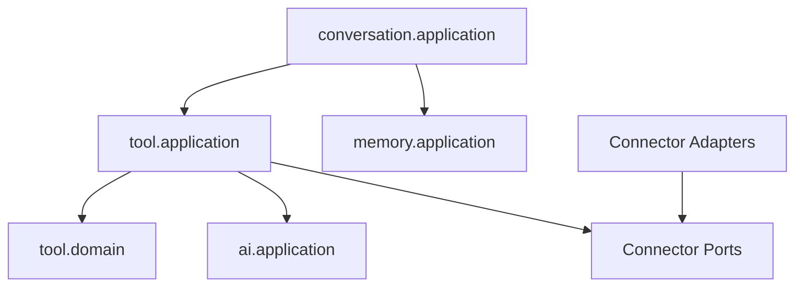
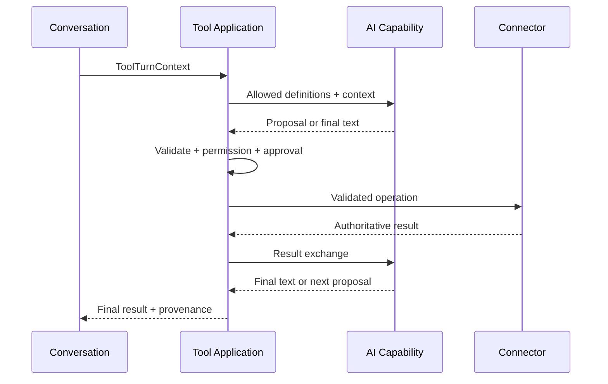
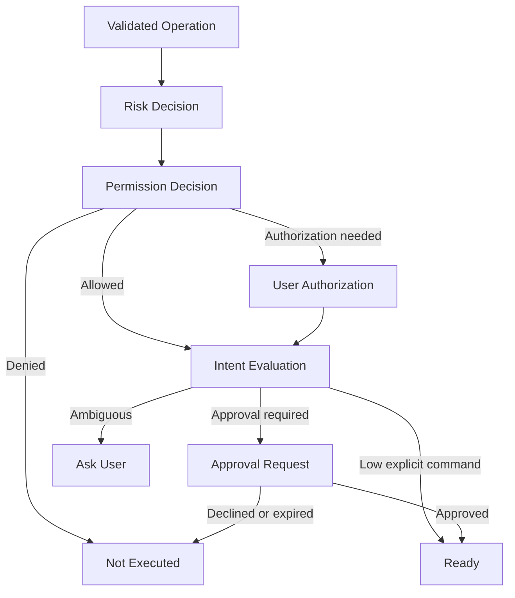
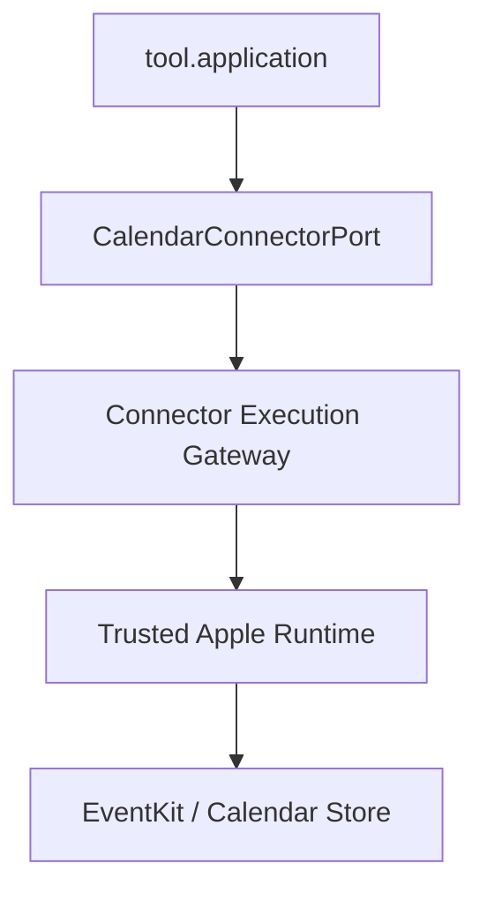

# Project Alice — Phase 3 Tool Architecture Design

## 1. Document Information

| Item | Value |
|---|---|
| Document | `phase3-tool-design.md` |
| Version | 5 |
| Date | 2026-09-02 JST |
| Status | Design Complete |
| Requirements | `requirements.md` Version 12、P3-FR-001〜061、P3-NFR-001〜010 Approved |
| Implementation | Not Started |

本DocumentはPhase 3 Tool / ConnectorのArchitecture、Feature Ownership、依存方向およびRegistry Boundaryを定義するSource of Truthである。API、Database、Credential方式、Apple Calendar接続方式およびUI詳細は後続設計で確定する。

---

## 2. Purpose

Conversationから必要なExternal Capabilityを安全に利用できるよう、Tool Selection、Validation、Permission / Approval、Execution、Result、ProvenanceおよびAuditをAlice固有のApplication Boundaryへ配置する。

重要な分離は次のとおりである。

- AIはTool Callを提案するが、実行を決定しない。
- ToolはAlice側のCapabilityとPolicyを表す。
- ConnectorはExternal Service固有の通信を担当する。
- Credentialは専用Portの背後で管理し、Conversation / Memory / AI Contextへ渡さない。
- Conversationは会話と履歴を所有し、Tool実行結果を会話へ統合する。

---

## 3. Phase 3 Feature Boundary

Phase 3で独立した`tool` Featureを追加する。



矢印は利用方向を表す。`ai`、`memory`およびConnector Adapterから`conversation`または`tool`の内部Modelへ逆依存しない。

### 3.1 `conversation` Ownership

- Current User MessageとConversation Context
- 通常会話かTool-assisted Turnかを開始する入口
- Personal Memoryを利用する場合の`memory.application`呼出し
- Tool実行後の最終Assistant Response
- Conversation Historyへの確定Message保存
- User-visible Streaming / Response Lifecycle

ConversationはTool Registry、Permission、Approval、Connector CredentialまたはExternal Resultの正しさを所有しない。

### 3.2 `tool` Ownership

- Tool DefinitionとRegistry
- Tool Selection Policyと候補Toolの絞り込み
- AIが返したTool Call ProposalのSchema / Semantic Validation
- Connector Enablement状態
- Permission / Approval / Risk評価
- Tool Execution Orchestration
- Idempotency、CancellationおよびResult Reconciliationの共通Policy
- Tool Result、Source / ProvenanceおよびAudit Eventの生成
- Connector Capability Port

### 3.3 `ai` Ownership

- Provider-independent Tool Calling Capability
- Tool DefinitionからProvider RequestへのMapping
- Provider ResponseからTool Call ProposalへのMapping
- Tool Resultを次のModel Turnへ渡すProvider Boundary

AIはToolの存在、Enablement、Permission、Approval、Risk、ArgumentのBusiness ValidityまたはExecution Successを判断しない。LLM Tool Callは常にProposalである。

### 3.4 Connector Adapter Ownership

- Apple Calendar、GitHub、Web / Search、AWS等のService API / SDK呼出し
- Service固有Authentication Protocolとの接続
- Service固有Request / ResponseとAlice Port ModelのMapping
- Service Error、Rate Limit、VersionおよびCurrent Stateの取得
- Serviceが提供するIdempotency、CancellationおよびConcurrency機能の利用

Service SDK型、OAuth型、HTTP Client型またはOS Framework型を`tool.application` / `tool.domain`へ返さない。

---

## 4. Conceptual Package Structure

実装時は採用されたCapabilityだけを追加し、将来用の空Packageを作成しない。

```text
tool/
├── presentation/
├── application/
│   ├── usecase/
│   └── port/
├── domain/
│   ├── definition/
│   ├── permission/
│   ├── approval/
│   └── execution/
└── infrastructure/
    ├── registry/
    ├── persistence/
    ├── credential/
    └── connector/
        └── applecalendar/
```

これは責務配置のConceptであり、全DirectoryをPhase 1 Repositoryへ先行作成する指示ではない。Phase 3実装開始時も、最初のVertical Sliceに必要なPackageだけを作る。

Calendar、GitHub、Web / SearchおよびAWSを最初から独立Top-level Featureへ分割しない。まず`tool` Feature内のCapability-specific Domain / Port / Adapterとして扱い、独立したLifecycleや複数Consumerが現れた場合にだけFeature昇格を再検討する。

---

## 5. Dependency Rules

### 5.1 Allowed Dependencies

| From | To | Purpose |
|---|---|---|
| `conversation.application` | `tool.application` | Tool-assisted Turnを依頼し結果を受け取る |
| `conversation.application` | `memory.application` | 適格なMemory Contextを取得する |
| `tool.application` | `tool.domain` | Tool PolicyとState Transitionを使用する |
| `tool.application` | `ai.application` | 許可候補からTool Call Proposal / Final Textを生成する |
| `tool.application` | Application-owned Ports | Registry、Permission、Credential、Execution、Auditを利用する |
| Connector Adapter | Connector Port | External ServiceをAlice Modelへ適合させる |
| Persistence Adapter | Repository Port | Tool Stateを永続化する |

### 5.2 Prohibited Dependencies

- `tool`からConversation Repositoryへの直接依存
- `tool`またはConnectorからMemory Repositoryへの直接依存
- `ai`からTool Registry、Permission RepositoryまたはConnectorへの直接依存
- ConversationからApple Calendar / GitHub / AWS SDKへの直接依存
- Domain / ApplicationからSpring、AWS SDK、Apple Framework、GitHub SDKまたはOpenAI SDKへの依存
- Connector Adapterから別Connector Adapterへの直接呼出し
- Phase 3 Connector失敗からPhase 4 PC / Browser Agentへの自動Fallback

複数Connectorを組み合わせるGoalは、一つのConnectorが別Connectorを呼ぶのではなく`tool.application`のExecution Orchestrationが順序付ける。

---

## 6. Conversation and Memory Context Boundary

Conversationは、Current User Message、必要なConversation Contextおよび`memory.application`が返した適格Memory Viewから、Provider非依存の`ToolTurnContext`を構築して`tool.application`へ渡す。

```text
ToolTurnContext
├── userGoal
├── currentUserMessage
├── relevantConversationContext
├── eligibleMemoryContext
├── userSpecifiedService
├── locale / timeZone
└── correlationContext
```

`eligibleMemoryContext`はPhase 2の8 Memories、1,500 estimated tokens、12 KiBの同時上限を維持する。Tool FeatureがMemory全件を検索したり、Memory Repositoryを直接読むことは禁止する。

MemoryはTool候補選択、Target候補またはProposal説明へ利用できるが、次を決定しない。

- Connector Enablement
- Permission
- Approval / Execution Intent
- Credential
- Current External State
- External Resource Version

Tool ResultからMemory Candidateを作る場合は、Conversation側の通常Capture FlowへUser-grounded情報だけを渡し、Phase 2 Ruleを再利用する。Tool Featureが直接Personal Memoryを書き込まない。

---

## 7. Tool, Connector, and Operation Identity

### 7.1 Tool

ToolはAliceが理解する安定したCapability Contractである。例:

- `calendar_search_events`
- `calendar_find_free_time`
- `calendar_create_event`
- `calendar_update_event`
- `calendar_delete_event`

Tool NameはProject内で一意なLower Snake Caseとし、Service名を必須Prefixにしない。`apple_calendar_create_event`ではなく共通Calendar Toolを定義し、Connector BindingでApple Calendarへ解決する。

### 7.2 Connector

ConnectorはTool Operationを一つ以上実装するService-specific Adapterである。Connector IDは安定した内部識別子とし、表示名やAccount名と分離する。

```text
Calendar Tool
└── Apple Calendar Connector
    └── Authorized Calendar Accounts / Scopes
```

将来Google Calendar Connectorを追加しても、Calendar Tool Input / Resultの意味をApple固有へ変更しない。Service能力差はUnsupported OperationまたはCapability Metadataとして明示する。

### 7.3 Operation

Operationは一回の具体的実行単位であり、少なくともTool Name、Connector Binding、Target Scope、Validated Arguments、Risk、Permission Evidence、Approval Evidence、Idempotency IdentityおよびCorrelationを持つ。

AI Proposal、User Approval、Tool Operation、Connector RequestおよびConversation Responseを同じものとして扱わず、安定したIDで関連付ける。

---

## 8. Tool Registry

### 8.1 Registry Responsibilities

Registryは次を提供する。

- Tool Nameから`ToolDefinition`を一意に解決する
- Current EnvironmentでSupportされているTool一覧を返す
- Connector Capabilityとの適合を確認する
- AIへ提示可能な最小Definitionを生成する材料を返す
- ToolごとのOperation Type、Risk Baseline、Input / Result ContractおよびHard Limitを提供する
- Unknown、DuplicateまたはInvalid DefinitionでStartupを失敗させる

### 8.2 Tool Definition

```text
ToolDefinition
├── toolName
├── capabilityGroup
├── operationType
├── inputSchemaReference
├── resultContractReference
├── riskBaseline
├── approvalPolicyKey
├── requiredConnectorCapability
├── idempotencySupport
├── cancellationSupport
├── timeoutLimit
└── resultSizeLimit
```

具体的Schema、数値LimitおよびRisk Matrixは後続設計で確定する。DescriptionはAI向け説明であり、Permissionや実行権限を付与しない。

### 8.3 Support, Enablement, Permission Separation

次を別Stateとして扱う。

| State | Meaning |
|---|---|
| Supported | Aliceの現在BuildがTool / Connector Codeを知っている |
| Enabled | UserがConnectorを利用可能にしている |
| Authenticated | 有効なCredential Sessionを取得可能である |
| Permitted | OperationとScopeがPermission Policy内である |
| Approved | 今回の具体的Operationを実行してよい |
| Available | Service / Environmentが現在実行可能である |

Supportedであるだけでは実行できない。EnabledでもPermissionやApprovalを省略しない。Authenticatedでも任意ScopeへAccessできるとは限らない。

### 8.4 Initial Registration Strategy

Phase 3初期RegistryはApplication Buildに含まれる明示的Allowlistから構成する。Runtimeに未知CodeをDownload / Load / ExecuteするPlugin Loaderは採用しない。

Runtime変更可能なのはEnablement、Connector Account Binding、Permissionおよび運用Configurationであり、未対応Tool DefinitionやExecutable CodeをAlice / LLMが追加しない。将来Dynamic Pluginを検討する場合はCode Trust、Signature、Sandbox、Permission、UpgradeおよびRollbackを含む新規Architecture Reviewを必須とする。

---

## 9. Application Capability Boundary

Phase 3ではMethod Signatureをまだ固定しないが、`tool.application`は最低限次のCapabilityを外部へ提供する。

| Capability | Consumer | Responsibility |
|---|---|---|
| Tool-assisted Turn | Conversation | Tool選択から最終ResultまでのBounded Loopを実行する |
| Connector Discovery | Conversation / Frontend | Goalに対応するSupported / Enabled状態を説明する |
| Connector Enablement | Conversation / Frontend | Scope選択とAuthentication Flowを開始・照合する |
| Permission Management | Conversation / Frontend | Permissionを取得・変更・Revokeする |
| Approval Resolution | Conversation / Frontend | 特定OperationのApprovalを解決する |
| Operation Status | Conversation / Frontend | Partial / Unknownを含むAuthoritative Resultを照合する |
| Connector Disable / Disconnect | Conversation / Frontend | 新規実行停止とCredential Lifecycle処理を行う |

UIと自然言語操作は同じApplication CapabilityとDomain Ruleを使用する。Presentation種別をPermission、ApprovalまたはExecution Domainへ持ち込まない。

---

## 10. Tool-assisted Conversation Flow



Flow Rule:

1. RegistryとEnablementからAIへ提示可能なToolを絞る。
2. AIのProposalをRegistry Definitionへ解決する。
3. Input SchemaとBusiness RuleをAlice側で再検証する。
4. Risk、Permission、Approval / Explicit Intentを評価する。
5. 実行可能な場合だけConnector Portを呼ぶ。
6. Connector ResultをSuccess / Failure / Partial / Unknownへ正規化する。
7. ResultをUntrusted DataとしてAIへ渡し、最終Responseまたは次のProposalを得る。
8. 最大Iteration、DeadlineまたはApproval待ちで安全に停止する。
9. ConversationへFinal Result、Provenanceおよび継続Stateを返す。

Phase 3初期値は既存AI Designどおり、AI一回のModel TurnにつきProposal最大1件、Parallel Tool Call無効、Tool Iteration最大5回とする。一つのUser Goalで複数Toolを使う場合も順次実行する。これらの数値を変更する場合はAI / Tool / Test Designを同じ変更単位で更新する。

---

## 11. Permission, Approval, and Credential Placement

Phase 3ではPermission、Approval、Risk、ExecutionおよびAuditを`tool` FeatureのDomain / Application責務として開始する。Phase 4でも同じConceptを利用することだけを理由に、現時点で独立`permission`、`approval`または`execution` Common Featureを作成しない。

Phase 4設計時に複数Featureの実利用、Lifecycle、Ownershipおよび依存方向を確認し、共通Capabilityへ昇格するか判断する。昇格する場合も、Phase 3の意味とStable IDをMigration可能にする。

Credentialの平文値はInfrastructureのSecure Credential Adapterだけが扱う。Application / DomainはConnector Credential Reference、AvailabilityおよびLifecycle Resultだけを扱い、AI Context、Memory、Conversation Historyまたは一般AuditへCredentialを渡さない。詳細なStorage、Encryption、RotationおよびRecoveryはSecurity / Database設計で確定する。

---

## 12. Phase 4 Boundary

`tool.application`はConnectorで実現不能なGoalを`AGENT_CANDIDATE`等のCapability Resultとして返せるが、Phase 4 Agentを直接起動しない。

Conversationは次をユーザーへ説明する。

- Connectorでは実現できない理由
- Phase 4 Capabilityが必要になること
- 増加するPermission / Risk
- 現在Phaseで実行していないこと

Phase 4実装後も、Agentへの移行は新しいExecution Method Decisionとして扱い、Connector用PermissionまたはApprovalを流用しない。

---

## 13. Initial Connector Direction

設計優先順は次とする。

1. 共通Calendar Tool Model
2. Apple Calendar Connector
3. Web / Search Connector
4. GitHub Connector
5. AWS Connector / Engineering Support

これは設計優先順であり、未設計Connectorの空AdapterやMockを先行実装する指示ではない。Apple Calendarの接続方式を決定するまで、EventKit、CalDAV、iCloud、OAuthその他の方式をArchitecture層で固定しない。

---

## 14. Requirement Traceability

| Requirement Group | Architecture Coverage |
|---|---|
| P3-FR-001〜008 | Tool / Connector Boundary、Execution Policy |
| P3-FR-009〜015 | Conversation入口、Selection、Bounded Orchestration、Phase 4 Boundary |
| P3-FR-016〜022 | Registry、Support / Enablement分離、Connector Lifecycle |
| P3-FR-023〜032 | Common Calendar ToolとApple Connector分離 |
| P3-FR-033〜038 | Capability-specific Connector PortとProvenance |
| P3-FR-039〜046 | Tool-owned PermissionとSecure Credential Port |
| P3-FR-047〜053 | Tool-owned Risk / Approval / Explicit Intent Boundary |
| P3-FR-054〜061 | Operation、Result、Idempotency、Cancellation、Audit、Correlation |
| P3-NFR-001〜010 | Dependency Rule、Adapter分離、Bounded Loop、Failure Isolation |

---

## 15. Proposed Decisions

| ID | Decision | Status |
|---|---|---|
| TOOL3-001 | Phase 3で独立した`tool` Featureを追加する | Accepted |
| TOOL3-002 | Conversationは`tool.application` Capabilityを利用し、Tool内部Repositoryへ依存しない | Accepted |
| TOOL3-003 | LLM Tool CallをProposalとして扱い、`tool`がValidation・Permission・Approval・Executionを所有する | Accepted |
| TOOL3-004 | `ai`はProvider-independent Tool Callingを所有するがTool PolicyやExecutorを所有しない | Accepted |
| TOOL3-005 | External Service固有処理をConnector Adapterへ隔離しSDK型をCoreへ漏らさない | Accepted |
| TOOL3-006 | 複数Connectorの組合せをConnector間呼出しではなく`tool.application`が順序付ける | Accepted |
| TOOL3-007 | ConversationがMemory Capabilityから適格Contextを取得し、ToolはMemory Repositoryへ依存しない | Accepted |
| TOOL3-008 | Tool ResultからPersonal Memoryへ直接書き込まずPhase 2 Capture Ruleを再利用する | Accepted |
| TOOL3-009 | Tool、ConnectorおよびOperation Identityを分離する | Accepted |
| TOOL3-010 | RegistryでSupported、Enabled、Authenticated、Permitted、Approved、Availableを分離する | Accepted |
| TOOL3-011 | 初期RegistryをBuild内Allowlistとし、未知CodeのRuntime Plugin Loadingを採用しない | Accepted |
| TOOL3-012 | Calendar等を`tool`内Capabilityとして開始し、独立Feature昇格は実利用責務で判断する | Accepted |
| TOOL3-013 | Permission・Approval・Executionを`tool`所有で開始し、Phase 4共通化を先行しない | Accepted |
| TOOL3-014 | Connectorで実現不能なGoalをAgent Candidateとして返せるがPhase 4 Agentを自動起動しない | Accepted |
| TOOL3-015 | 初期Tool Loopを一Model Turn一Proposal、Sequential、最大5 Iterationとする | Accepted |

---

## 16. Next Design Topics

TOOL3-001〜015の承認後、次の順で詳細化する。

1. Tool Definition、Operation、Result、ProvenanceおよびRegistry Model
2. User Intent、Permission、ApprovalおよびRisk Model
3. Execution Lifecycle、Idempotency、CancellationおよびAudit
4. Calendar Domain Model
5. Apple Calendar Connector方式比較と接続Boundary
6. Web / Search、GitHub、AWS Capability
7. API、Database、Security、AI、FrontendおよびTest Design

このArchitecture承認だけでは実装Packageを作成しない。

---

## 17. Tool Definition Model

### 17.1 Definition Boundary

`ToolDefinition`は、Aliceが一つのTool Operationを認識、提示、検証および実行するためのCode-owned Metadataである。User、LLM、External Service ResponseまたはRuntime ConfigurationがDefinitionそのものを追加・変更しない。

```text
ToolDefinition
├── toolName
├── definitionVersion
├── capabilityGroup
├── operationKind
├── descriptionKey
├── inputContract
├── resultContract
├── requiredConnectorCapability
├── riskProfile
├── approvalPolicyKey
├── executionPolicy
└── lifecycleStatus
```

| Field | Rule |
|---|---|
| `toolName` | Project全体で一意なLower Snake Case。Service名ではなく安定したCapabilityを表す |
| `definitionVersion` | Definition Contractの単調増加Version。OperationとAuditへSnapshotをBindingする |
| `capabilityGroup` | `CALENDAR`、`WEB_SEARCH`、`GITHUB`、`AWS`等の説明・選択用Group |
| `operationKind` | `READ`、`CREATE`、`UPDATE`、`DELETE`、`EXTERNAL_COMMIT`のいずれか |
| `descriptionKey` | User / AI向け説明の安定Key。説明文自体をPermission Ruleに使用しない |
| `inputContract` | Provider非依存のField、型、必須性、Format、Sizeおよび意味Validation |
| `resultContract` | Structured Result、Target OutcomeおよびProvenanceの許可Schema |
| `requiredConnectorCapability` | 実行可能なConnectorを解決するCapability Key |
| `riskProfile` | Operation固有のBaseline RiskとHard Approval条件 |
| `approvalPolicyKey` | Risk / Intent評価Policyの安定Key。Booleanだけで表現しない |
| `executionPolicy` | Timeout、Result Size、Retry、Idempotency、Cancellationの上限とCapability |
| `lifecycleStatus` | `ACTIVE`または`RETIRED`。未知StatusはStartup Failure |

`operationKind`はRiskそのものではない。例えばCreateは低Riskになり得るが、第三者を招待するCreateは追加Riskを持つ。DefinitionのBaseline Riskと具体的Arguments / Targetから最終Riskを評価する。

### 17.2 Input Contract

AIへ提示するJSON SchemaとAlice側のBusiness Validationを分離する。

```text
ToolInputContract
├── providerSchemaView
├── canonicalFieldDefinitions
├── syntacticValidators
├── semanticValidatorKey
├── maximumEncodedBytes
└── unknownFieldPolicy = REJECT
```

ProviderがStrict Schema準拠を報告しても、Alice側で再Validationする。Provider JSONをそのままConnectorへ渡さず、検証済みCanonical Inputへ変換する。Secret、Credential、Permission、Approval、Connector内部IDまたは任意Executable CodeをAI生成Fieldとして受け付けない。

Validation順序は次のとおりとする。

1. Tool Name / Definition Version解決
2. Encoded SizeとParser Safety
3. JSON Schema / Unknown Field
4. Field Format / Range
5. Cross-field Semantic Rule
6. Connector Capability / Target Resolution
7. Risk Classification
8. Permission
9. Approval / Explicit Intent Binding
10. Execution直前のCurrent State / Deadline再確認

前段で拒否が確定した場合、Credential取得やExternal Service呼出しを行わない。

### 17.3 Definition Compatibility

- 説明文やLocalizationだけの変更は同じContract Versionを維持できる。
- Optional Field追加は既存Client / ConnectorがUnknown Fieldを送信しない限りCompatibleとできる。
- Required Field、Field Meaning、Operation Kind、Result MeaningまたはRiskを弱める変更はBreaking Changeとして扱う。
- Active Operation、ApprovalおよびAuditは開始時のDefinition VersionへBindingし、途中で最新Definitionへ置換しない。
- Retired Definitionへの新規Operationを拒否するが、既存OperationのResult照合・Auditは継続できる。

---

## 18. Tool Run and Operation Model

### 18.1 Tool Run

`ToolRun`は一つのUser Requestに対するTool-assisted Turn全体を表す。複数Toolを使う場合も、一つのRun内で順次Operationを作成する。

```text
ToolRun
├── toolRunId
├── conversationId / userRequestId
├── goalSnapshot
├── contextDigest
├── status
├── iterationCount
├── currentOperationId
├── operationIds
├── deadline
├── createdAt / updatedAt
└── finalResultReference
```

`goalSnapshot`はUser Intentの監査可能な最小表現であり、Full ConversationやMemory全文を複製しない。`contextDigest`は利用Contextの相関・改変検出用であり、元Contentを復元できる用途に使用しない。

Tool Run Status:

```text
SELECTING
├── Proposalなし → COMPLETED
├── Valid Proposal → RUNNING
├── Permission / Approval必要 → WAITING_FOR_USER
├── Result照合必要 → RECONCILING
├── Deadline / User Cancel → CANCELLED
└── 継続不能 → FAILED

RUNNING
├── 次のProposal → SELECTING
├── Final Response → COMPLETED
├── User待ち → WAITING_FOR_USER
├── Unknown Operation → RECONCILING
└── Failure / Cancel → FAILED / CANCELLED
```

Runの`COMPLETED`は、最終Conversation Response候補と全Operationの扱いが確定したことを示す。各External Operationの成功を意味しない。PartialまたはFailureを正しく説明した最終ResponseでもRunは`COMPLETED`になり得る。

### 18.2 Proposed Tool Call

AI Providerからの出力は`ProposedToolCall`として隔離する。

```text
ProposedToolCall
├── proposalId
├── toolRunId / iteration
├── providerCallId
├── proposedToolName
├── proposedArguments
├── receivedAt
└── validationStatus
```

`providerCallId`はAI Capability内のOpaque Correlation値であり、Tool Operation IDやIdempotency Keyとして使用しない。未検証Argumentsは短命Dataとし、通常Audit、Application LogまたはConversation Historyへ保存しない。

### 18.3 Tool Operation Aggregate

Schema / Semantic Validation後、実行候補を`ToolOperation`として作成する。

```text
ToolOperation
├── operationId / version
├── toolRunId / iteration
├── toolName / definitionVersion
├── connectorId / connectorBindingVersion
├── operationKind
├── validatedInput
├── targetSnapshot
├── riskDecision
├── permissionEvidence
├── approvalEvidence
├── idempotencyIdentity
├── status
├── attemptState
├── deadline
├── result
├── provenance
└── createdAt / updatedAt
```

Operation IDはAliceが発行する推測不能なOpaque IDとする。External Service ID、Provider Call IDまたは会話上の連番を流用しない。

### 18.4 Operation Lifecycle

```text
VALIDATING
├── Invalid / Unsupported → NOT_EXECUTED
├── Permission不足 → WAITING_PERMISSION
├── Approval必要 → WAITING_APPROVAL
└── 実行可能 → READY

WAITING_PERMISSION / WAITING_APPROVAL
├── 許可・承認 + 再検証 → READY
├── 拒否 / 期限切れ → NOT_EXECUTED
└── Target・Arguments変化 → INVALIDATED

READY
├── Durable Intent確定 → EXECUTING
└── Cancel / Deadline → CANCELLED

EXECUTING
├── 成功 → SUCCEEDED
├── 一部成功 → PARTIAL
├── 確定失敗 → FAILED
├── 結果不明 → UNKNOWN
└── Service確認済みCancel → CANCELLED

UNKNOWN
└── 同一Operation照合 → SUCCEEDED / PARTIAL / FAILED / CANCELLED / UNKNOWN
```

`NOT_EXECUTED`はExternal Side Effectが開始されていないことをAlice側で確認できる場合だけ使用する。`UNKNOWN`を`FAILED`または`NOT_EXECUTED`へ推測変換しない。

WAITING状態から再開する際はDefinition、Connector Binding、Target、Current State、Permission、Approval、DeadlineおよびOperation Versionを再確認する。一つでもMaterialに変化した場合、古いEvidenceで実行しない。

---

## 19. Tool Execution Result Model

### 19.1 Canonical Outcome

Connector固有Resultを次のCanonical Outcomeへ正規化する。

| Outcome | Meaning |
|---|---|
| `SUCCEEDED` | 対象OperationのSide EffectまたはRead結果がAuthoritativeに確認できた |
| `PARTIAL` | 複数Targetの一部だけ確定成功し、残りがFailureまたはUnknown |
| `FAILED` | 対象Operationが成功しなかったことをAuthoritativeに確認できた |
| `UNKNOWN` | 実行開始後の結果を安全に確定できない |
| `CANCELLED` | ServiceまたはAliceの実行境界でSide Effect停止が確認できた |
| `NOT_EXECUTED` | Validation、Permission、Approval、Availability等によりExternal実行を開始していない |

### 19.2 Result Structure

```text
ToolExecutionResult
├── operationId / operationVersion
├── outcome
├── outcomeCategory
├── userSafeSummary
├── structuredResult
├── targetOutcomes
├── externalResourceReferences
├── provenance
├── retryGuidance
├── reconciliationGuidance
├── completedAt / observedAt
└── resultContractVersion
```

- `userSafeSummary`を唯一のSource of Truthにせず、OutcomeとStructured ResultからPresentationする。
- `structuredResult`はTool DefinitionのResult ContractへValidationする。
- `targetOutcomes`はTargetごとの`SUCCEEDED`、`FAILED`または`UNKNOWN`を保持し、Partialを単一Errorへ潰さない。
- `externalResourceReferences`は後続照合に必要なOpaque Referenceだけを保持し、Credentialや不要なPersonal Dataを含めない。
- `retryGuidance`は`SAFE_SAME_OPERATION`、`RECONCILE_FIRST`、`USER_ACTION_REQUIRED`、`DO_NOT_RETRY`等の方針を表し、自動Retry命令そのものではない。
- Connectorの生Response、Error Body、Stack TraceまたはSecretをDomain Resultへ保持しない。

### 19.3 Read Result Freshness

Read Resultは`observedAt`、Source、対象ScopeおよびConnectorが提供できるVersion / Freshness情報を保持する。取得時刻とDataが表す時点を区別できる場合は両方を保持する。

期限切れ判定を全Tool共通の固定時間だけで行わず、Calendar、Web、GitHub、AWS等のCapability-specific Currentness Policyで評価する。古さを判定できない場合は`CURRENT`と断定しない。

### 19.4 Failure Categories

最低限次を区別し、Connector固有Error CodeをPublic Contractへ漏らさない。

- `VALIDATION_FAILED`
- `UNSUPPORTED_TOOL_OR_CAPABILITY`
- `CONNECTOR_DISABLED`
- `AUTHENTICATION_REQUIRED`
- `PERMISSION_REQUIRED`
- `APPROVAL_REQUIRED`
- `APPROVAL_DECLINED`
- `TARGET_AMBIGUOUS`
- `TARGET_CHANGED`
- `RATE_LIMITED`
- `SERVICE_UNAVAILABLE`
- `DEADLINE_EXCEEDED`
- `RESULT_TOO_LARGE`
- `EXECUTION_FAILED`
- `RESULT_UNKNOWN`
- `CANCELLED`

Error Mapping、Retryable、HTTP StatusおよびUser Messageは後続API Designで確定する。

---

## 20. Source and Provenance Model

`ToolProvenance`はTool Resultの出所と時点を説明・照合するためのDataであり、結果の真偽を自動保証するものではない。

```text
ToolProvenance
├── sourceType
├── connectorId
├── serviceNameKey
├── accountReference
├── sourceScope
├── sourceResourceReferences
├── retrievedAt
├── sourceObservedAt
├── sourceVersion
├── freshnessStatus
└── attribution
```

| Field | Rule |
|---|---|
| `sourceType` | `DEDICATED_CONNECTOR`、`WEB_SEARCH`等の取得方式 |
| `connectorId` | 実行したConnectorの安定ID。Credential IDではない |
| `serviceNameKey` | User表示用Service名のLocalization Key |
| `accountReference` | Userが識別できる非Secret Alias / Opaque Reference。Email等の表示は最小化する |
| `sourceScope` | Calendar、Repository、Account、Region等の許可済みScopeの安全な表現 |
| `sourceResourceReferences` | 再取得・照合・表示に必要なResource Reference |
| `retrievedAt` | Aliceが結果を取得した時刻 |
| `sourceObservedAt` | Sourceが示す観測・更新時刻。取得不能なら空 |
| `sourceVersion` | ETag、Revision等を安全に正規化した値。利用不能なら空 |
| `freshnessStatus` | `CURRENT`、`STALE`、`UNKNOWN`。Tool-specific Policyで決定 |
| `attribution` | UserへSourceを説明するための安全なLabel / URI Reference |

Credential、Authorization Header、Session ID、Secret Query、Provider Error BodyまたはPrivate URL全文をProvenanceへ含めない。Web Source URIを保持する場合もCredential / Tracking Parameterを除去し、許可された表示Boundaryを通す。

複数Sourceを利用したResponseではProvenanceをSourceごとに保持する。単一の「Tool使用済み」Flagへ潰さず、どの主張がどのSourceに依存したかを後続Response Composition / UI設計で関連付ける。

---

## 21. Registry Detailed Model

### 21.1 Registry Separation

Registryを一つのMutable Mapとして扱わず、次を分離する。

| Component | Source of Truth | Responsibility |
|---|---|---|
| Definition Registry | Application Build | Tool Contract、Risk Baseline、Limit、Version |
| Connector Capability Registry | Application Build + Adapter Startup Probe | Connectorが実装するCapabilityとCompatibility |
| Connector Binding Store | Runtime Persistence | Userが有効化したConnector / Account / Scope Binding |
| Permission Store | Runtime Persistence | Operation / Scope Permission |
| Availability View | Runtime Observation | Authentication、Health、Rate Limit等の現在状態 |

DefinitionとConnector CapabilityはBuild Allowlistであり、User Dataではない。Binding、PermissionおよびAvailabilityをDefinitionへ書き戻さない。

### 21.2 Registry Resolution

Tool実行時は次の順序で解決する。

1. Active DefinitionをTool Nameで一意に取得する。
2. Required Connector Capabilityを実装するSupported Connectorを取得する。
3. User指定Service、PreferenceおよびEnabled Bindingを評価する。
4. Operation Scopeに合うConnector Bindingを一意に解決する。
5. Definition VersionとConnector Binding VersionをOperationへ固定する。
6. Authentication / Availabilityを確認する。
7. Permission / Approval評価へ渡す。

Bindingが複数ありUser PreferenceまたはScopeから一意に選べない場合、LLMに推測させずUser確認を要求する。Connectorが一件もない場合はUnsupported、対応済みだが無効ならEnablement Proposal、認証切れならRe-authenticationへ分岐する。

### 21.3 AI-visible Registry View

AIへ提示する`AiToolDefinition`はActive Definitionから生成した最小Viewとし、次を含めない。

- Permission設定の内部表現
- Approval Token / Evidence
- Credential状態やCredential Reference
- Connector Account内部ID
- Audit / Operation内部ID
- Retry SecretまたはIdempotency Record
- 利用者に不要なInfrastructure情報

通常のTool SelectionではSupportedかつEnabledなToolだけをExecutable候補としてAIへ提示する。対応済みだがDisabledなConnectorのDiscoveryは、User Goalと安全なCapability CatalogをApplication側で照合して提案する。未対応ToolをAI Descriptionだけで存在するように見せない。

### 21.4 Startup Validation

次のいずれかがあればTool Capabilityを有効化せずStartupまたはCapability-specific Startup Gateを失敗させる。

- Duplicate Tool Name + Version
- Active Definitionの重複
- Unknown Operation Kind / Risk / Policy Key
- Input / Result Contractが不正または上限なし
- Required Connector Capabilityが未定義
- Connector AdapterのContract Version非互換
- Write ToolにIdempotency / Unknown Outcome Policyがない
- Delete / High-impact ToolにHard Approval Policyがない
- DefinitionとAI Schema Viewが不一致

一つの任意Connector不備で無関係なConversationや正常Connectorまで停止するかは、Security影響とDependencyを考慮して後続Startup / Degraded State設計で確定する。ただし不正な該当CapabilityをFail Openで公開しない。

### 21.5 Registry Change Rule

Runtimeで変更可能なのはBinding、Permissionおよび運用Configurationだけである。Definition変更はSource Code / Configuration ArtifactのReview、TestおよびDeploymentを必要とする。

LLM、User Prompt、Tool ResultまたはConnector Responseが次を変更してはならない。

- Tool Definition
- Input / Result Contract
- Risk Baseline
- Approval Policy
- Hard Limit
- Connector Capability宣言
- Executable Adapter Binding Class

---

## 22. Proposed Detailed Decisions

| ID | Decision | Status |
|---|---|---|
| TOOL3-016 | Tool DefinitionをCode-owned Versioned MetadataとしRuntime入力による変更を禁止する | Accepted |
| TOOL3-017 | Operation KindをRead / Create / Update / Delete / External Commitへ分類し最終Riskとは分離する | Accepted |
| TOOL3-018 | AI SchemaとAlice Business Validationを分離しProvider出力を必ず再検証する | Accepted |
| TOOL3-019 | Validation、Capability、Risk、Permission、Approval、Current Stateの評価順序を固定する | Accepted |
| TOOL3-020 | Breaking Definition変更をVersion管理しActive Operationを開始時VersionへBindingする | Accepted |
| TOOL3-021 | 一User Request全体をToolRun、個別Connector実行をToolOperationとして分離する | Accepted |
| TOOL3-022 | Provider Call ID、Proposal ID、Operation ID、Idempotency Identityを分離する | Accepted |
| TOOL3-023 | Operation LifecycleでNot Executed、Succeeded、Partial、Failed、Unknown、Cancelledを明確に区別する | Accepted |
| TOOL3-024 | Unknown Outcomeを推測変換せず同一OperationとしてReconcileする | Accepted |
| TOOL3-025 | Tool ResultをCanonical Outcome、Structured Result、Target Outcome、Retry / Reconciliation Guidanceで表現する | Accepted |
| TOOL3-026 | Read Resultに取得時刻、観測時刻、Source VersionおよびTool-specific Freshnessを保持する | Accepted |
| TOOL3-027 | Tool ProvenanceをConnector、Scope、Resource、時点およびAttributionの非Secret情報として保持する | Accepted |
| TOOL3-028 | Definition、Connector Capability、Binding、Permission、AvailabilityのRegistry Sourceを分離する | Accepted |
| TOOL3-029 | AIへSupportedかつEnabledな最小Tool Viewだけを提示しDisabled DiscoveryはApplication側で扱う | Accepted |
| TOOL3-030 | Registry Startupで重複、不正Contract、上限欠落、Write保護欠落およびAdapter非互換をFail Closedにする | Accepted |
| TOOL3-031 | RuntimeからDefinition、Risk、Approval Policy、LimitまたはExecutable Adapterを変更させない | Accepted |
| TOOL3-032 | Connector Bindingが一意でなければLLMに推測させずUser確認を要求する | Accepted |

---

## 23. Updated Next Design Topics

TOOL3-016〜032の承認後、次はUser Intent、Permission、ApprovalおよびRisk Modelを設計する。その後、ExecutionのIdempotency、Cancellation、ReconciliationおよびAuditを具体化する。

Tool Input / Resultの各Field上限、Retention、Public API表現、DynamoDB Schema、暗号化方式、Apple Calendar接続方式およびFrontend表示は、それぞれの後続Source of Truthで確定する。

---

## 24. User Intent Model

### 24.1 Purpose

User Intentは「ユーザーが何を望んだか」を表し、PermissionまたはTool Execution Successとは分離する。LLMの推測、Memory、Tool ResultおよびAliceの提案だけからExecution Authorityを作らない。

```text
UserIntentEvidence
├── intentEvidenceId
├── sourceType
├── userRequestId
├── normalizedGoal
├── requestedOperationKind
├── targetReference / targetDigest
├── argumentDigest
├── materialImpactDigest
├── ambiguityStatus
├── capturedAt
├── expiresAt
└── consumedByOperationId
```

`sourceType`は次を区別する。

| Source Type | Meaning | Execution Authority |
|---|---|---|
| `INFORMATION_REQUEST` | 情報取得を明示的に依頼 | Permission内の低Risk Readを開始可能 |
| `EXPLICIT_COMMAND` | 特定Writeを命令形等で明示 | Section 27の条件をすべて満たす低Risk Operationに限定してApproval Evidenceになり得る |
| `CONFIRMED_PROPOSAL` | Aliceが提示した具体的Operationをユーザーが確認 | BindingされたOperationだけを承認可能 |
| `PREAUTHORIZED_AUTOMATION` | 別途承認済みAutomation Policyに基づく | Phase 3初期実装では実行Sourceとして使用しない |
| `AMBIGUOUS` | Goal、Target、Actionまたは主要影響が一意でない | 実行不可。User Inputを要求 |
| `NONE` | 実行意思の根拠がない | 実行不可 |

`PREAUTHORIZED_AUTOMATION`は将来拡張用のConceptであり、この設計だけでAutomationを有効化しない。Automation要件、Schedule、Scope、停止、通知およびAuditを別途承認するまで使用禁止とする。

### 24.2 Intent Extraction and Confirmation

AIはIntent候補を構造化できるが、`tool.application`がCurrent User Message、Conversation StateおよびTarget Resolutionから確定する。次の情報が不足または競合する場合は`AMBIGUOUS`とする。

- 実行するAction
- 対象Resourceまたは対象を一意に解決する条件
- 必須Arguments
- Time ZoneやAccount等、結果をMaterialに変えるContext
- Userが理解すべき主要なExternal Impact

「それで」「はい」等の短い確認は、Active Approval Requestが一件であり、そのApproval ID、Operation Version、Targetおよび期限へ会話状態から一意にBindingできる場合だけ`CONFIRMED_PROPOSAL`として扱う。複数候補がある場合は推測しない。

### 24.3 Intent Invalidation

次の変更では古いIntent Evidenceを再利用しない。

- Tool、Connector、AccountまたはOperation Kindの変更
- TargetまたはTarget集合の変更
- 必須Argument、時刻、範囲または件数の変更
- Risk Levelまたは主要Impactの上昇
- User Requestの取消・訂正
- Evidence期限切れ

文言のLocalizationや非Materialな表示順変更だけでは無効化しなくてよい。Material Change判定は後続Tool-specific DesignでField単位に定義する。

---

## 25. Permission Model

### 25.1 Permission Aggregate

Permissionは「そのConnector OperationをAliceが利用可能か」を表す持続的Policyであり、今回のOperation実行意思を表さない。

```text
ToolPermissionRule
├── permissionRuleId / version
├── connectorId
├── connectorBindingId
├── operationSelector
├── resourceScope
├── effect
├── validity
├── status
├── createdBy
├── createdAt / updatedAt
└── revokedAt
```

| Field | Rule |
|---|---|
| `connectorId` | Connector種別を固定する |
| `connectorBindingId` | Account / Connectionを固定する。全Binding対象は明示的にのみ許可 |
| `operationSelector` | Tool NameまたはOperation Kindの許可範囲 |
| `resourceScope` | Calendar、Repository、Account、Region、Service等のCapability-specific Scope |
| `effect` | `ALLOW`、`DENY`または`ASK` |
| `validity` | `SESSION`、固定`UNTIL`または`PERSISTENT`。無期限を暗黙Defaultにしない |
| `status` | `ACTIVE`、`EXPIRED`または`REVOKED` |
| `createdBy` | Phase 3では`USER`だけ。Alice / LLM / Connectorを許可しない |

Operation一回だけの許可は持続的Permission Ruleではなく、OperationへBindingしたPermission / Approval Evidenceとして扱う。これにより「今回だけ」を誤って将来のStanding Permissionへ変換しない。

### 25.2 Default and Precedence

明示RuleがないExternal Accessは`DENY_BY_DEFAULT`とする。Permission評価は次の優先順位を固定する。

1. System / Product Hard Prohibition
2. Revoked / Expired Connector Binding
3. 対象に一致するExplicit `DENY`
4. 対象に一致するよりSpecificな`ASK`
5. 対象に一致するよりSpecificな`ALLOW`
6. Connector / OperationのDefault Policy
7. `DENY_BY_DEFAULT`

同じSpecificityで矛盾するRuleを作成しない。既存Data、MigrationまたはRaceで矛盾を検出した場合は`DENY`としてFail Closedし、Userに修正を要求する。

Broad `ALLOW`はNarrow `DENY`または`ASK`を上書きしない。例えばCalendar全体Read Allowがあっても、Work Calendar Denyを迂回してはならない。

### 25.3 Permission Decision

```text
PermissionDecision
├── decisionId
├── operationId / operationVersion
├── outcome
├── matchedRuleIds / versions
├── evaluatedScopeDigest
├── reasonCodes
├── decidedAt
└── expiresAt
```

Outcome:

- `ALLOWED`
- `DENIED`
- `AUTHORIZATION_REQUIRED`
- `PERMISSION_CONFLICT`
- `CONNECTOR_UNAVAILABLE`

Permission DecisionはOperation、Connector Binding、Target ScopeおよびRule VersionへBindingする。Execution直前に再評価し、Rule更新、Revoke、ExpiryまたはScope変更があれば古いDecisionを使用しない。

### 25.4 Grant, Change, Revoke, Disable

新しいPermission GrantまたはScope拡張は、Connector、Account、Operation、Scope、Lifetimeおよび主要Data Accessを表示し、専用User Authorizationを要求する。Tool実行のCommandやApprovalからPersistent Permissionを推測作成しない。

Scope縮小、`DENY`追加、Revoke、DisableまたはDisconnectは新規Operationへ即時適用する。Durable Execution Intent確定前のOperationは停止する。既にExternal Serviceへ送信済みのOperationは巻き戻したとみなさず、Outcomeを照合する。

Revoke後も、Side Effectを増やさない同一OperationのStatus照合は安全なReconciliation Capabilityとして許可できる。ただし新規Write、Argument変更またはReverse Operationは新しいPermission評価を必要とする。

---

## 26. Risk Model

### 26.1 Separation from Operation Kind

Operation Kindと最終Risk Levelを分離する。既存AI Designの`READ_ONLY`、`REVERSIBLE_WRITE`および`IRREVERSIBLE_OR_HIGH_IMPACT`はDefinition側のBaseline Categoryとして扱い、Tool Domainが具体的Contextを評価した最終Riskを次で表現する。

| Risk Level | Meaning | Default Handling |
|---|---|---|
| `LOW` | Narrow、明確、低Sensitivity、影響限定 | ReadはPermission内で実行可。WriteはSection 27.2のExplicit Command条件を満たす場合だけ追加確認省略可 |
| `MEDIUM` | Sensitive / Broad Read、Update、複数Target、影響が限定的だが追加理解が必要 | Operation-specific Approval必須 |
| `HIGH` | Delete、Third-party Effect、External Commit、Irreversibleまたは大きな影響 | Strong Explicit Approval必須 |
| `CRITICAL` | Payment、Transfer、Contract、Security回避等、Phase 3初期で禁止 | 実行禁止 |

### 26.2 Risk Dimensions

`ToolRiskDecision`は少なくとも次を評価する。

```text
ToolRiskDecision
├── riskDecisionId / policyVersion
├── operationId / operationVersion
├── baselineCategory
├── finalRiskLevel
├── sideEffect
├── reversibility
├── targetAmbiguity
├── scopeBreadth
├── targetCount
├── dataSensitivity
├── thirdPartyEffect
├── externalCommit
├── currentStateConfidence
├── escalationReasons
└── decidedAt
```

Riskは単一Scoreと閾値だけで決めない。Hard Escalation Ruleを先に適用し、必要に応じてTool-specific Policyを追加する。

### 26.3 Hard Escalation Rules

| Condition | Minimum Result |
|---|---|
| Targetまたは主要Impactが曖昧 | 実行不可、User Input Required |
| Delete | `HIGH` |
| 第三者への招待、投稿、送信または公開変更 | `HIGH` |
| IrreversibleまたはRollback不能 | `HIGH` |
| Credential / Permission Scope拡張 | Operation実行とは別のUser Authorization必須 |
| SensitiveまたはBroad Read | 最低`MEDIUM`、またはTool-specific Deny |
| Phase 3初期対象外のPayment / Transfer / Contract | `CRITICAL`、実行禁止 |
| Permission / Safety回避、未知Executable Code | `CRITICAL`、実行禁止 |

Calendar Createは、対象Calendar、Title、開始・終了、Time Zoneが一意で、Attendee / Invitationなし、狭い単一Target、Permission済みかつ明示Commandの場合に`LOW`となり得る。Attendee追加、共有Calendarへの影響、複数Eventまたは外部通知がある場合はRiskを上げる。

Calendar Updateは変更内容と影響に応じ原則`MEDIUM`以上、Calendar Deleteは`HIGH`とする。GitHub Commentや公開Issue変更はThird-party External Commitとして`HIGH`とする。AWS Readは対象範囲とData Sensitivityにより`LOW`または`MEDIUM`とする。

---

## 27. Approval Model

### 27.1 Approval Aggregate

```text
ToolApproval
├── approvalId / version
├── operationId / operationVersion
├── toolName / definitionVersion
├── connectorBindingId / version
├── targetDigest / userVisibleTarget
├── argumentDigest / userVisibleAction
├── impactDigest / userVisibleImpact
├── riskDecisionId / policyVersion
├── permissionDecisionId
├── evidenceType
├── status
├── createdAt / expiresAt
├── decidedAt
└── consumedAt
```

Approval Status:

```text
PENDING
├── User Approve → APPROVED
├── User Decline → DECLINED
├── Time Limit → EXPIRED
└── Material Change / Revoke → INVALIDATED

APPROVED
├── Durable Intentへ一回使用 → CONSUMED
├── Material Change / Revoke → INVALIDATED
└── Time Limit → EXPIRED
```

一つのApprovalを複数Operationへ使用しない。ApprovalはTool Category、Connector全体または将来の類似操作への包括許可ではない。

### 27.2 Explicit Command as Approval Evidence

`EXPLICIT_COMMAND`を追加確認なしのApproval Evidenceとして使用できるのは、次をすべて満たす場合だけである。

1. Final Risk Levelが`LOW`
2. Operation KindがCreateその他Tool-specific Policyで許可されたReversible Write
3. Targetが一意
4. 必須Argumentsと主要ImpactがCurrent User Messageから明確
5. Third-party Effect、External Commit、DeleteまたはSensitive Scope拡張がない
6. Persistent Permissionの追加・拡張を必要としない
7. Command後にTarget、Arguments、Connector、AccountまたはImpactが変化していない
8. 同じUser Request内でEvidenceをOperationへBindingできる

これは「Approval不要」ではない。Userの明示Commandを当該Operation限定のApproval Evidenceとして記録する方式である。

例:

| Request | Handling |
|---|---|
| 「明日15時に個人Calendarへ歯医者を1時間入れて」 | 全条件が明確でPermission済み、通知なしなら追加確認省略候補 |
| 「明日、歯医者入れて」 | 時刻・長さ等が不足するため確認 |
| 「チーム全員を招待して会議を入れて」 | Third-party Effectのため明示Approval |
| 「歯医者を16時に変更して」 | Updateかつ対象・変更影響を再確認するため原則Approval |
| 「歯医者を消して」 | DeleteのためStrong Approval |

### 27.3 Confirmation Approval

Approval Requestは最低限、User-visible Target、Action、主要Impact、Connector / Account、Riskに応じた警告および期限を提示する。内部ID、Credential、Hidden Prompt、Chain-of-thoughtまたはRisk Scoreを表示しない。

Userが承認した時点で、表示したTarget / Arguments / ImpactのDigestとOperation VersionをBindingする。実行直前に同じ値を再確認し、差異があれば`INVALIDATED`として再Approvalする。

Risk `HIGH`では、曖昧な会話上の肯定だけに依存せず、対象と影響を再表示したDedicated Confirmationを要求する。Strong Approvalの具体的UI / Authentication要件はSecurity / Frontend Designで確定する。

### 27.4 Approval Decline and Expiry

Decline、ExpiryまたはInvalidationではExternal Executionを開始しない。Operationを`NOT_EXECUTED`として理由を記録し、同じApproval Requestを自動再表示し続けない。

Userが後から再実行を希望した場合はCurrent State、Permission、RiskおよびArgumentsを再評価し、新しいOperation / Approvalとして扱う。Expired Approvalだけを再有効化しない。

---

## 28. Permission and Approval Evaluation Flow



Execution直前に次を再確認する。

- Tool Definition VersionがActive / Compatible
- Connector BindingとCredential Availability
- TargetとCurrent State
- Permission Rule VersionとScope
- Risk DecisionにMaterial Changeなし
- Intent / ApprovalのTarget・Arguments・Impact Binding
- Approval未消費・未失効
- DeadlineとCancellation State

検証完了後、WriteではDurable Execution IntentとApproval Consumptionを、重複実行を防げる境界で確定してからConnectorへ送信する。AtomicityとPersistence方式は次のExecution / Database設計で決定する。

---

## 29. Audit and Privacy Boundary

Intent、Permission、RiskおよびApprovalのAuditには、判断を説明するためのCode、Version、Scope Digest、OutcomeおよびTimestampを記録する。次を記録しない。

- Credential、Token、Authorization Header
- Full Conversation、Full MemoryまたはHidden Prompt
- Sensitive Tool Arguments / Result全文
- Chain-of-thought
- Provider Error Body
- Userに不要な内部Score

User-visible SummaryとAudit Source of Truthを分離する。Application LogをApproval / Permission AuditのSource of Truthとして使用しない。Retention、Integrity、EncryptionおよびAccess ControlはSecurity / Database Designで確定する。

---

## 30. Proposed Intent, Permission, Approval, and Risk Decisions

| ID | Decision | Status |
|---|---|---|
| TOOL3-033 | User IntentをPermission・Approval・Execution Resultから分離したEvidenceとして管理する | Accepted |
| TOOL3-034 | Intent SourceをInformation Request、Explicit Command、Confirmed Proposal、将来Automation、Ambiguous、Noneへ分類する | Accepted |
| TOOL3-035 | 短い肯定をActive Approvalへ一意にBindingできる場合だけConfirmationとして扱う | Accepted |
| TOOL3-036 | Target、Arguments、Impact、ConnectorまたはRiskのMaterial ChangeでIntent Evidenceを無効化する | Accepted |
| TOOL3-037 | PermissionをConnector × Binding × Operation × Resource ScopeのVersion付きRuleとして表現する | Accepted |
| TOOL3-038 | Permission EffectをAllow / Deny / AskとしDefault Denyを適用する | Accepted |
| TOOL3-039 | Hard Prohibition、Binding失効、Specific Deny / Ask / Allowの固定優先順位で評価する | Accepted |
| TOOL3-040 | 今回だけの許可をPersistent Permissionへ変換せずOperation-bound Evidenceとして扱う | Accepted |
| TOOL3-041 | Persistent Permission追加・拡張に専用User Authorizationを要求する | Accepted |
| TOOL3-042 | Revoke / Disableを新規・未実行Operationへ即時適用し送信済みOperationはOutcome照合する | Accepted |
| TOOL3-043 | Revoke後もSide Effectを増やさない同一Operation Reconciliationだけを許可可能とする | Accepted |
| TOOL3-044 | Operation KindとRiskを分離し最終RiskをLow / Medium / High / Criticalで表現する | Accepted |
| TOOL3-045 | Riskを単一Scoreだけで決めずHard Escalation Ruleと多軸Decisionで評価する | Accepted |
| TOOL3-046 | Delete、Third-party Effect、External Commit、Irreversibleを最低High Riskとする | Accepted |
| TOOL3-047 | Payment、Transfer、Contract、Security回避および未知Executable CodeをPhase 3初期でCritical / Prohibitedとする | Accepted |
| TOOL3-048 | ApprovalをOperation、Version、Target、Arguments、Impact、RiskおよびPermissionへBindingする | Accepted |
| TOOL3-049 | 条件を満たすLow Risk Explicit Commandを当該Operation限定Approval Evidenceとして扱える | Accepted |
| TOOL3-050 | Medium以上、Delete、Third-partyまたは曖昧Writeに追加のOperation-specific Approvalを要求する | Accepted |
| TOOL3-051 | Approvalを単回使用としMaterial Change、Revoke、Expiryで無効化する | Accepted |
| TOOL3-052 | High Riskで対象と影響を再表示するDedicated Strong Approvalを要求する | Accepted |
| TOOL3-053 | Pre-authorized Automationを別途要件・設計承認されるまで実行Sourceとして禁止する | Accepted |
| TOOL3-054 | Intent / Permission / Risk / Approval AuditからSecret、全文ContextおよびChain-of-thoughtを除外する | Accepted |

---

## 31. Updated Design Sequence

TOOL3-033〜054の承認後、次はExecution Lifecycle、Durable Intent、Idempotency、Retry、Cancellation、Unknown ReconciliationおよびAudit Resultを詳細設計する。

Permission / Approval API、DynamoDB Schema、Credential暗号化、Strong Approval UIおよびRetentionは後続のAPI、Database、Security、Frontend Designで確定する。Phase 4設計まで独立Common Featureへ昇格しない。

---

## 32. Execution Lifecycle Refinement

### 32.1 Execution Phases and Outcome

進行状態と最終Outcomeを混同しない。`EXECUTING`は成功を意味せず、`CANCEL_REQUESTED`は取消完了を意味しない。

```text
READY
├── Durable Execution Intent確定 → PREPARED
└── Cancel / Deadline → CANCELLED

PREPARED
├── Execution Fence取得 → DISPATCHING
└── 未送信を確認してCancel → CANCELLED

DISPATCHING
├── Connector受付確認 → DISPATCHED
├── Authoritative Result → SUCCEEDED / PARTIAL / FAILED / CANCELLED
└── 通信断・Process停止・Timeout → UNKNOWN

DISPATCHED
├── Result確認 → SUCCEEDED / PARTIAL / FAILED / CANCELLED
├── Cancel要求 → CANCEL_REQUESTED
└── Result未確認 → UNKNOWN

CANCEL_REQUESTED
├── Cancel確認 → CANCELLED
├── 完了確認 → SUCCEEDED / PARTIAL / FAILED
└── 状態確認不能 → UNKNOWN

UNKNOWN
└── Reconciliation → SUCCEEDED / PARTIAL / FAILED / CANCELLED / UNKNOWN
```

`PREPARED`まではExternal I/Oを開始していない。`DISPATCHING`へ遷移した後は、Connectorへの送信有無をAliceのProcess Stateだけから断定しない。Terminal OutcomeはSection 19のCanonical Outcomeを使用する。

### 32.2 Durable Execution Intent

WriteをExternal Serviceへ送信する前に、次をDurableに固定する。

```text
DurableExecutionIntent
├── executionIntentId / version
├── operationId / operationVersion
├── toolName / definitionVersion
├── connectorBindingId / bindingVersion
├── canonicalInputDigest
├── targetDigest / impactDigest
├── riskDecisionId / policyVersion
├── permissionDecisionId / ruleVersions
├── intentEvidenceId
├── approvalId / approvalVersion
├── idempotencyIdentity
├── executionFence
├── state
├── preparedAt / expiresAt
└── dispatchedAt
```

Durable Intent確定時に、Operation Version、Target、Arguments、Impact、Permission、RiskおよびApprovalを再検証する。Approvalの単回消費、Execution Intent作成およびOperationの`PREPARED`遷移は、重複Executorが同時成立しない一つのConcurrency Boundaryで行う。具体的なDynamoDB Transaction / Conditional WriteはDatabase Designで確定する。

`executionFence`は単調増加する。Fenceを取得したExecutorだけがDispatchおよび結果更新を行え、古いFenceを持つWorkerの送信・結果更新を拒否する。Lease期限切れだけを根拠に同じWriteを再送しない。

ReadはSide Effectを持たないため、全ReadへWriteと同じDurable Intentを必須化しない。ただしOperation、Attempt、Deadline、CancellationおよびAudit Correlationは保持する。

---

## 33. Idempotency Model

### 33.1 Identity

```text
IdempotencyIdentity
├── idempotencyIdentityId
├── operationId / operationVersion
├── toolName / definitionVersion
├── connectorBindingId
├── canonicalInputDigest
├── targetDigest
├── providerIdempotencyKeyReference
├── targetKeys
├── createdAt
└── expiresAt
```

Idempotency IdentityはAliceがOperation単位で発行し、RetryとRecoveryでは同じIdentityを使用する。User Request ID、AI Provider Call ID、Conversation ID、時刻だけから生成しない。TargetまたはMaterial Argumentが変わる場合は同じKeyを再利用せず、新しいOperationとしてPermission、RiskおよびApprovalを再評価する。

ProviderがNative Idempotency Keyを提供する場合、Connector AdapterがAlice IdentityをProvider許容形式へ安全にMappingする。Provider KeyそのものをAI Context、Public APIまたは一般Logへ公開しない。

### 33.2 Connector Capability Levels

| Level | Capability | Write Retry Rule |
|---|---|---|
| `NATIVE_IDEMPOTENCY` | Providerが同一Keyの重複Commitを防止 | 同一Operation・同一Key・同一Payloadに限定してRetry可能 |
| `STATUS_RECONCILABLE` | Request / Resource Referenceから結果照合可能 | Reconciliationを先に行い、未実行がAuthoritativeに確定した場合だけRetry可能 |
| `PRECONDITION_GUARDED` | ETag、Version、Unique External ID等で重複・stale Writeを防止 | Current StateとPreconditionを再検証してRetry可能 |
| `NON_IDEMPOTENT` | 重複防止・結果照合を保証できない | 送信開始後の自動Retry禁止。UnknownとしてUserへ報告 |

Write Tool Definitionは対応Capability、Key有効期間、Payload一致条件およびReconciliation方式を明示する。宣言が欠けるWrite CapabilityはRegistry Startupで有効化しない。

複数Target OperationではTargetごとのIdempotency KeyとOutcomeを保持する。`SUCCEEDED` TargetをBatch Retryへ含めず、`UNKNOWN` Targetは照合を優先し、Authoritativeに`FAILED / NOT_APPLIED`と確認できたTargetだけを再試行対象にする。

---

## 34. Execution Attempt and Retry

### 34.1 Attempt Model

```text
ToolExecutionAttempt
├── attemptId / attemptNumber
├── operationId / operationVersion
├── executionFence
├── idempotencyIdentityId
├── attemptType
├── connectorRequestReference
├── startedAt / endedAt
├── dispatchEvidence
├── observedOutcome
├── failureCategory
└── nextAction
```

`attemptType`は`INITIAL`、`SAFE_RETRY`、`RECONCILIATION`または`CANCEL`を区別する。AttemptはOperationを置換せず、同じOperationの履歴として追加する。Connector Request / Resource Referenceは照合に必要なOpaque値に限定する。

### 34.2 Retry Gate

RetryはError Codeだけで決めず、次をすべて評価する。

1. User Cancel、DeadlineまたはPermission Revokeがない。
2. 同じOperation Version、TargetおよびCanonical Inputである。
3. Retry BudgetとConnector Rate Limit内である。
4. 先行Attemptの受付・Side Effect状態を安全に分類できる。
5. Idempotency Capabilityが重複Side Effectを防げる。
6. Current State、Precondition、CredentialおよびConnector Availabilityが有効である。

Readは一時的なNetwork / Rate Limit / Service Unavailableに対して、Definitionで定めた回数・経過時間・Backoff上限内で自動Retryできる。Writeは次の場合だけ自動Retryできる。

- External ServiceがRequestを受理していないことをAuthoritativeに確認できる。
- `NATIVE_IDEMPOTENCY`で同一Key・同一Payloadの重複Commit防止が保証される。
- Reconciliation後、未適用がAuthoritativeに確認され、Preconditionがまだ成立する。

送信後Timeout、Connection Reset、Process Crashまたは不明な5xxを単純なFailureとしてWrite Retryしない。Retry Budget超過は`FAILED`を意味せず、送信可能性があれば`UNKNOWN`とする。

---

## 35. Cancellation, Stop, and Deadline

### 35.1 Cancellation Semantics

Cancel Requestは「新しい処理を開始しない」というUser Intentであり、External Side Effectの取消完了ではない。

| Timing | Handling |
|---|---|
| Durable Intent確定前 | External I/Oを開始せず`CANCELLED` |
| `PREPARED`かつ未送信をFenceで確認可能 | Dispatchを禁止して`CANCELLED` |
| `DISPATCHING / DISPATCHED` | 新規Attemptを止め、Connectorが対応すればCancel要求。結果確定までは`CANCEL_REQUESTED`または`UNKNOWN` |
| Terminal Outcome後 | Cancel不可。必要なら別のReverse / Compensating Operationを提案 |

ToolRunのStopは未開始Operationと次のTool Selectionを停止する。既に完了したOperationをRollbackしたと扱わず、実行中Operationは各ConnectorのCancellation Capabilityに従う。Reverse OperationにはCurrent State、Permission、Risk、Approvalおよび新しいIdempotency Identityが必要である。

### 35.2 Deadline

Deadlineは新規Dispatch / Retry / Reconciliationの開始制御に使用する。External Serviceへ送信する前に期限切れなら実行しない。送信後にDeadlineを超えた場合、`FAILED`または`CANCELLED`へ自動変換せず、受付・結果が不明なら`UNKNOWN`とする。

User Response待ちでApproval期限が切れたOperationを自動Resumeしない。Background実行や長期Reconciliationの上限・通知は後続API / Frontend / Operations Designで確定する。

---

## 36. Unknown Outcome Reconciliation

### 36.1 Reconciliation Rule

Reconciliationは新しいWriteではなく、同じOperationの結果をSide Effectを増やさず観測する処理である。

```text
UNKNOWN
├── Provider Request StatusでCommit確認 → SUCCEEDED / PARTIAL
├── Provider Resultで拒否確認 → FAILED
├── Provider Cancel確認 → CANCELLED
├── Authoritative Non-existence + Observation範囲充足 → FAILED / NOT_APPLIED
└── Evidence不足 → UNKNOWN
```

単なる検索結果なし、Cache Miss、Eventual Consistency期間内または権限不足を`NOT_APPLIED`の証拠にしない。照合は次の優先順位で行う。

1. Provider Idempotency / Request Status
2. Providerが返したOpaque Operation Reference
3. External Resource ID + Version / ETag
4. Tool-specific Unique MarkerとAuthoritative Query
5. UserによるCurrent State確認

結果を確定できない場合は、Definitionの回数・経過時間上限内でBackoff付き照合を行う。上限後も`UNKNOWN`を維持し、対象、実行した可能性、確認済み事項、再実行RiskおよびUserが確認できる手順を提示する。Aliceが都合のよいOutcomeへ変換しない。

### 36.2 Recovery after Process Restart

Startup / Recovery Workerは`PREPARED`、`DISPATCHING`、`DISPATCHED`、`CANCEL_REQUESTED`および`UNKNOWN`を走査する。

- `PREPARED`: Fence、期限、Permission、Approval Bindingおよび未送信証拠を再確認する。
- `DISPATCHING / DISPATCHED`: 再送よりReconciliationを優先する。
- `CANCEL_REQUESTED`: Cancel結果とOriginal Operation結果の両方を確認する。
- `UNKNOWN`: 同じOperationへReconciliation Attemptを追加する。

Recovery Workerは新しいFenceを取得し、古いWorkerの更新を拒否する。High Risk Operationは、Durable Intentが未確定、Approvalが失効、Material Changeがある、または送信状態を特定できない場合に黙って新規Dispatchしない。

---

## 37. Execution Audit and Result Commitment

### 37.1 Audit Event

Execution AuditはAppend-only Domain Eventとして、少なくとも次を記録する。

```text
ToolExecutionAuditEvent
├── auditEventId / sequence
├── toolRunId / operationId / operationVersion
├── eventType
├── actorType
├── previousState / newState
├── reasonCodes
├── definition / policy / binding Versions
├── target / argument / impact Digests
├── attemptId / executionFence
├── correlationReferences
└── occurredAt / recordedAt
```

主なEvent Type:

- `OPERATION_CREATED`
- `VALIDATION_COMPLETED`
- `RISK_DECIDED`
- `PERMISSION_DECIDED`
- `APPROVAL_REQUESTED / DECIDED / CONSUMED`
- `EXECUTION_INTENT_PREPARED`
- `DISPATCH_STARTED / ACCEPTED`
- `ATTEMPT_FAILED`
- `CANCEL_REQUESTED / OBSERVED`
- `RECONCILIATION_STARTED / OBSERVED`
- `OUTCOME_COMMITTED`

Audit EventにはSection 29のPrivacy Boundaryを適用し、Raw Credential、Authorization Header、全文Input / Result、Provider Error Body、Conversation / Memory全文およびChain-of-thoughtを保存しない。

### 37.2 Commit Boundary

External Write前にDurable Execution Intentと必須Audit Eventを保存できなければ、Writeを開始せずFail Closedとする。Result確定時はOperation Outcome、Target Outcome、Provenanceおよび`OUTCOME_COMMITTED`を、相互に矛盾しないConcurrency Boundaryで確定する。

External Serviceへ送信した後にResult保存が失敗した場合、External Operationを未実行と扱わない。同じOperationを`UNKNOWN / RECOVERY_REQUIRED`として照合対象にし、Connector Responseだけを根拠に別Operationとして再送しない。

User-visible Execution HistoryはAudit Eventから作るProjectionであり、Auditの全内部情報を表示しない。Projection障害でAudit Source of Truthを失わず、Application LogをAuditの代替にしない。

---

## 38. Phase 4 Compatibility Boundary

Phase 4はGoal、Plan、複数ActionおよびBackground Recoveryを追加できるが、Phase 3の`ToolOperation`を無制限Execution Authorityへ昇格させない。Phase 4 AgentがToolを利用する場合も、各OperationでIntent、Permission、Risk、Approval、Durable Intent、IdempotencyおよびAuditを評価する。

現時点では`ToolOperation`、`ToolApproval`および`DurableExecutionIntent`を`tool` Featureが所有する。Phase 4設計でPC / Browser / Application Actionにも同じInvariantが必要と確認した時点で、共通Contractまたは上位Execution Featureへの昇格をArchitecture Reviewする。将来利用だけを理由に空Common Packageを作らない。

---

### 38.1 Phase 4 Resolution — Accepted 2026-09-04

AGENT4-001のAcceptedにより、Phase 3で`tool` Featureが所有していた共通Execution InvariantのうちPermission、Approval、Risk、Execution Authority、Durable Execution Intent、Execution Fence、Outcome、Cancellation、Recovery、AuditはPhase 4以降shared `execution` contractへ昇格する。

Tool Definition、Registry、Connector Binding、Connector-specific validation / capability / provenanceは引き続き`tool` Featureが所有する。

この昇格はPhase 3の既存Permission / Approval / Risk / Durable Intent / Idempotency / Unknown Outcome semanticsを変更しない。Phase 3の`ToolOperation`を無制限Agent Authorityへ昇格しない。

Stable Identity Migration Contract:

- `ToolOperation.operationId / operationVersion`はPhase 4 shared execution昇格後もTool OperationのStable Identityとして保持する。
- `AgentAction.actionId / actionVersion`と`ToolOperation.operationId / operationVersion`は別のIdentityであり、相互に置換しない。
- AgentActionがToolOperationを起動する場合はCorrelation Referenceで関連付け、Permission / Approval / Durable Intent / Idempotency / Attempt / Auditは対象ToolOperationのStable Identityを失わない。
- Material Changeは既存ToolOperation Identityを再解釈せず、新Operation / 新Versionとして再評価する。

---

## 39. Proposed Execution Decisions

| ID | Decision | Status |
|---|---|---|
| TOOL3-055 | Write前にOperation、Target、Arguments、権限根拠およびIdempotencyをDurable Execution Intentへ固定する | Accepted |
| TOOL3-056 | Approval消費、Durable Intent作成およびPREPARED遷移を一つのConcurrency Boundaryで確定する | Accepted |
| TOOL3-057 | PREPARED、DISPATCHING、DISPATCHEDおよびCANCEL_REQUESTEDを追加し進行状態とOutcomeを分離する | Accepted |
| TOOL3-058 | 単調増加Execution Fenceで重複Executorとstale Workerの送信・更新を拒否する | Accepted |
| TOOL3-059 | DISPATCHING以降のCrash / Timeoutを送信有無不明として扱い安全な根拠なしにNOT_EXECUTEDへ戻さない | Accepted |
| TOOL3-060 | Idempotency IdentityをOperationへ固定しRetry / Recoveryで同じIdentityを使用する | Accepted |
| TOOL3-061 | MaterialなTarget / Argument変更ではIdempotency Keyを再利用せず新Operationとして再評価する | Accepted |
| TOOL3-062 | Native Idempotency、Status Reconciliation、Precondition GuardおよびNon-idempotentをCapabilityとして区別する | Accepted |
| TOOL3-063 | Idempotency / Reconciliation PolicyがないWrite CapabilityをRegistryで有効化しない | Accepted |
| TOOL3-064 | 複数TargetのIdempotencyとOutcomeをTarget単位で保持し成功Targetを再実行しない | Accepted |
| TOOL3-065 | Execution AttemptをOperationから分離しInitial、Safe Retry、Reconciliation、Cancelを履歴化する | Accepted |
| TOOL3-066 | Read Retryを回数・時間・Backoff上限内のTransient Failureに限定する | Accepted |
| TOOL3-067 | Write Retryを未受付のAuthoritative確認または重複防止保証がある同一Operationに限定する | Accepted |
| TOOL3-068 | 送信後Timeout、Connection Reset、Crashおよび不明5xxでWriteを盲目的に再送しない | Accepted |
| TOOL3-069 | Cancel RequestとCancel完了を分離し送信済みOperationは結果確認までUnknownを許容する | Accepted |
| TOOL3-070 | StopとRollbackを分離しReverseを新しいPermission / Approval対象Operationとする | Accepted |
| TOOL3-071 | 送信後Deadline超過をFailureへ推測変換せず受付状態が不明ならUnknownとする | Accepted |
| TOOL3-072 | Unknown Outcomeを同一Operationの副作用なしReconciliationで確定する | Accepted |
| TOOL3-073 | Non-existenceをNot Appliedの証拠にするにはAuthoritative QueryとObservation範囲充足を要求する | Accepted |
| TOOL3-074 | Reconciliation上限後もUnknownを維持し再実行RiskとUser確認手順を提示する | Accepted |
| TOOL3-075 | Recovery Workerが非Terminal OperationをFence付きで再開し再送より照合を優先する | Accepted |
| TOOL3-076 | High Risk Recoveryで権限根拠失効、Material Changeまたは送信状態不明ならSilent Dispatchしない | Accepted |
| TOOL3-077 | Execution AuditをAppend-only EventとしOperation Version、State、Reason、Policy VersionおよびCorrelationを記録する | Accepted |
| TOOL3-078 | External Write前にDurable Intentと必須Auditを保存できなければFail Closedとする | Accepted |
| TOOL3-079 | 送信後のResult保存失敗をUnknown / Recovery Requiredとして扱い別Operationで再送しない | Accepted |
| TOOL3-080 | User-visible Execution HistoryをAudit Source of Truthから分離したProjectionとする | Accepted |
| TOOL3-081 | Phase 4追加前はExecution Modelをtool Featureが所有しCommon Featureへ先行昇格させない | Accepted |

---

## 40. Updated Design Sequence

TOOL3-055〜081の承認後、次はCalendar Tool ModelとApple Calendar Connector Boundaryを詳細設計する。Calendar Event / Query / Free TimeのCanonical Model、複数Calendar、Time Zone、Target Resolution、Create / Update / DeleteのMaterial ChangeおよびApple固有型の隔離を確定する。

Execution API、DynamoDB Table / Transaction、Lease時間、Retry回数、Audit Retention、Encryption、User-visible History UIおよびBackground Worker運用値は、それぞれの後続Source of Truthで確定する。

---

## 41. Calendar Capability Boundary

### 41.1 Tool Definitions

Calendar CapabilityはService非依存の次のTool Definitionから開始する。

| Tool Name | Kind | Purpose |
|---|---|---|
| `calendar_list_calendars` | READ | 利用可能なCalendarとCapabilityを列挙 |
| `calendar_search_events` | READ | 期間・Keyword・属性・Calendar ScopeでEventを取得・検索 |
| `calendar_find_free_time` | READ | 複数CalendarのBusy Intervalから空き候補を計算 |
| `calendar_create_event` | CREATE | 一つのEventを作成 |
| `calendar_update_event` | UPDATE | 一意に解決したEventをExpected Version付きで変更 |
| `calendar_delete_event` | DELETE | 一意に解決したEventをScope付きで削除 |

Provider名をTool Nameへ含めない。Apple Calendar、将来のGoogle Calendarその他Connectorは同じCanonical Input / Resultを実装し、能力差はConnector Capability Metadataで明示する。

### 41.2 Calendar Connector Port

```text
CalendarConnectorPort
├── listCalendars
├── queryEvents
├── getEvent
├── createEvent
├── updateEvent
├── deleteEvent
├── reconcileOperation
└── observeAvailability
```

`calendar_find_free_time`は原則として`tool.application`のCalendar Availability Serviceが`queryEvents`のCanonical Resultから決定論的に計算する。Provider固有Free / Busy APIは、同じ意味・Permission・Provenanceを維持できる場合だけAdapter内の最適化として使用できる。

Connector PortはEventKit、CalDAV、Google APIその他SDK型を返さない。Unsupported Capabilityは空結果や成功へ変換せず、Capability Resultとして返す。

---

## 42. Canonical Calendar Model

### 42.1 Calendar Descriptor

```text
CalendarDescriptor
├── calendarRef
├── connectorBindingId
├── displayName
├── userCategory
├── sourceAccountLabel
├── accessCapabilities
├── isProviderDefault
├── availabilitySupport
├── colorHint
├── observedAt
└── provenance
```

`calendarRef`はConnector Binding内だけで有効なAlice Opaque Referenceであり、Provider Calendar IDをPublic API、AI ContextまたはPermission Ruleへ直接公開しない。`userCategory`は`PERSONAL`、`WORK`または`OTHER`のAlice側Labelであり、Provider名やCalendar名から自動確定しない。

`accessCapabilities`は少なくとも`READ_EVENTS`、`CREATE_EVENTS`、`UPDATE_EVENTS`、`DELETE_EVENTS`および`READ_AVAILABILITY`を個別に表す。OS / ProviderのAccessが広くてもAlice Permission Scopeを自動拡張しない。

### 42.2 Calendar Event

```text
CalendarEvent
├── eventRef
├── calendarRef
├── title
├── temporal
├── location
├── notesSummary
├── urlReference
├── recurrence
├── availability
├── status
├── organizerSummary
├── attendeeSummary
├── versionEvidence
├── observedAt
└── provenance
```

Phase 3初期のCreate / Update InputはTitle、Temporal、Calendar、Location、NotesおよびURLを対象とする。Attendee追加・Invitation送信、Organizer変更、Attachmentおよび会議URL自動発行は初期Write対象外とし、未知Fieldとして黙って無視しない。Readでは必要最小限のOrganizer / Attendee Summaryを返せるが、全参加者情報をAI Contextへ無条件投入しない。

`notesSummary`はAI Context用に安全化した表現であり、Provider本文の完全複製を一般Auditへ保存しない。Full NotesがGoalへ必要な場合はSensitive ReadとしてScopeとRiskを再評価する。

### 42.3 Event Reference and Version Evidence

```text
CalendarEventReference
├── eventRef
├── connectorBindingId
├── calendarRef
├── seriesRef
├── occurrenceKey
└── referenceVersion

CalendarEventVersionEvidence
├── providerVersionReference
├── canonicalSnapshotDigest
├── observedAt
└── confidence
```

Provider IDを永久不変と仮定しない。EventをReferenceで再取得できない場合は、Calendar Scope、期間、Titleその他の安全な条件から候補を再検索し、ゼロ件・複数件・内容変更を区別する。曖昧な候補を元Eventと推測してWriteしない。

Strong ETag等をProviderが提供しない場合、直前に再取得したCanonical Snapshot DigestをExpected Versionとして比較する。ただし非Atomicな比較を強いConcurrency保証と表現せず、Connector Capabilityへ`BEST_EFFORT_PRECONDITION`として明示する。

---

## 43. Calendar Temporal Model

### 43.1 Timed Event

```text
TimedEventTemporal
├── startInstant
├── endInstant
├── timeZoneId
├── originalLocalStart
├── originalLocalEnd
└── resolutionSource
```

Timed EventはUTC InstantだけでなくIANA Time Zone IDと解決元Local Date-Timeを保持する。OS / JVMのDefault Time Zoneを暗黙利用しない。DSTにより存在しないLocal Timeまたは二つのInstantへ解決されるLocal Timeは、推測実行せずUserへ確認する。

Time Zone解決順序は次とする。

1. User Requestで明示されたTime Zone
2. 対象Calendar / Eventの既存Time Zone
3. Userが設定したCalendar Time Zone Preference
4. Conversation Sessionで明示的に確定したTime Zone
5. 未解決としてUser確認

Personal Memoryや端末LocaleだけをWrite権限・確定時刻の根拠にしない。JSTはProject内部表示の標準であっても、外部Calendar EventのTime ZoneをJSTへ強制変換しない。

### 43.2 All-day Event

All-day Eventは`startDateInclusive`と`endDateExclusive`のLocal Date Rangeで表し、午前0時のTimed Eventへ変換しない。一日Eventは`endDateExclusive = startDate + 1 day`とする。All-dayとTimedの変更はMaterial Changeであり、再Approval対象とする。

### 43.3 Recurring Event

Recurring EventのUpdate / Deleteでは少なくとも次を区別する。

- `THIS_OCCURRENCE`
- `THIS_AND_FUTURE`
- `ENTIRE_SERIES`

Connectorが対応しないScopeは実行しない。User Requestと既存Conversation StateからScopeが一意でない場合は必ず確認する。Occurrenceの開始日時、Series ReferenceまたはRecurrence Rule変更はMaterial Changeとして扱う。

---

## 44. Calendar Read, Search, and Free Time

### 44.1 Event Query

```text
CalendarEventQuery
├── rangeStart / rangeEnd
├── queryTimeZoneId
├── calendarRefs
├── keyword
├── attributeFilters
├── includeAllDay
├── resultLimit
└── continuationReference
```

期間は必須かつ有界とし、Calendar Scope、PermissionおよびResult上限を先に適用する。Keyword検索はTitleだけかLocation / Notesも含むかをContractで明示し、Sensitive Notesを暗黙検索対象にしない。ConnectorがNative検索を提供しない場合、許可済み期間内の取得結果へBounded Local Filteringを適用できる。

同一Eventが複数Calendar SourceやRecurring展開で重複する場合、Connector Binding、Event Reference、Occurrence Keyおよび時刻で正規化する。重複排除の確信がないEventを黙って捨てない。

### 44.2 Free Time Request

```text
FreeTimeRequest
├── searchRange
├── requiredDuration
├── calendarRefs
├── dailyWindows
├── timeZoneId
├── minimumBufferBefore / After
├── slotGranularity
└── maximumCandidates
```

Free Time計算は次のRuleを使用する。

1. Permission済みCalendarだけからEventを取得する。
2. `BUSY`、`TENTATIVE`、`UNAVAILABLE`およびBusy扱いのAll-day Eventを塞がった時間とする。
3. 明示的な`FREE` EventはBusy Intervalから除外する。
4. OverlapするIntervalをMergeし、Bufferを適用する。
5. Daily WindowとRequired Durationを満たす候補だけを生成する。
6. 候補を早い順等の明示PolicyでRankingし、上限件数へ制限する。

Calendar本文を返さずBusy Intervalだけで計算できる場合はData Minimizationを優先する。Free Time Resultには使用Calendar Scope、観測時刻、Time Zone、計算Rule Versionおよび除外Calendarを含める。Permission不足や取得失敗Calendarがある場合、完全な空き時間と断定せず`INCOMPLETE`として明示する。

移動時間、勤務時間、祝日、会議間隔等はInputまたは明示設定として将来追加できるが、Phase 2 Memoryだけから自動確定しない。

---

## 45. Calendar Write and Target Resolution

### 45.1 Create

Create前にTitle、Temporal、Calendar、Time Zone、All-day、Recurrence、Location / Notesの主要影響をCanonical化する。対象CalendarがWrite可能か、Alice Permission Scope内か、OS / Provider Accessが有効かを再検証する。

同一User RequestのRetryは同じOperation / Idempotency Identityを使用する。既存Eventとの似たTitleだけを理由に新規作成を拒否しない一方、同一OperationのUnknown Outcomeがある場合は新しいCreateへ進まずReconciliationする。

### 45.2 Update and Delete Target Resolution

対象解決の優先順位は次とする。

1. 同一Conversation / Tool Run内で提示済みのFresh Event Reference
2. Userが選択した候補Reference
3. Calendar、期間、Title、属性によるBounded Search

候補がゼロ件なら`TARGET_NOT_FOUND`、複数件なら`TARGET_AMBIGUOUS`として候補を提示する。一件でも、Execution直前に再取得し、Expected Version、Calendar、Temporal、TitleおよびRecurrence Scopeを確認する。

次はMaterial ChangeとしてApprovalを無効化する。

- Event / Calendar / Connector Bindingの変更
- Start / End、Time Zone、All-dayの変更
- Recurrence ScopeまたはSeriesの変更
- Title、Location、Notesの意味を変える変更
- Attendee / Invitation、Organizer、External Notificationの追加
- 対象数または第三者影響の増加
- Current State変更によりImpactまたはRiskが上がる場合

Delete Approvalでは対象Event、Calendar、日時、Recurring Scopeおよび復元可否を表示する。Delete成功後にEventが見つからないことだけで直ちに成功判定せず、ConnectorのMutation ResultまたはReconciliation Evidenceを使用する。

---

## 46. Default Calendar and Scope Selection

```text
CalendarPreferences
├── connectorBindingId
├── preferredWritableCalendarRef
├── preferredReadCalendarRefs
├── userCategoryMappings
├── defaultTimeZoneId
├── version
└── updatedAt
```

Calendar Preferencesは`tool` Featureの設定DataでありPersonal Memoryへ保存しない。選択順序は次とする。

1. User Requestで明示されたCalendar
2. Goal / Permission Scopeと一致する有効なUser設定Default
3. Permission済みかつWrite可能な候補が一件だけならその候補
4. 複数候補または未設定ならUser確認

Provider Default Calendarは候補情報として利用できるが、AliceのUser設定Defaultを上書きしない。以前利用したCalendar、Calendar名、MemoryまたはAI推測だけでWrite先を決めない。Defaultが削除、Read-only、Permission外またはBinding失効の場合は自動的に別CalendarへFallbackせず再選択する。

---

## 47. Apple Calendar Connector Runtime

### 47.1 Initial Connection Method

Apple Calendarの初期Connector方式としてApple EventKitを採用する。EventKitはApple Platform上の`EKEventStore`を通じてCalendar Eventへアクセスするため、Spring Boot Backend内へApple Frameworkを組み込まない。



Trusted Apple RuntimeはiOSまたはmacOSのAlice Application / Companion内に置くNative Swift Adapterであり、次だけを受け付ける。

- Allowlist済みCalendar Operation
- Canonical Input Contract
- Backendが確定したOperation ID、Version、FenceおよびIdempotency Identity
- Connector BindingへBindingされたAuthenticated Execution Request

任意Swift Code、Script、Shell Command、Provider SDK ObjectまたはAI生成Executable Payloadを受け付けない。BackendとRuntime間Transport、Device Registration、Session Authentication、Replay ProtectionおよびOffline QueueはPhase 3 API / Security Designで確定する。

### 47.2 Platform Compatibility

iOSとmacOSは同じCalendar Connector Contractを実装し、EventKitのPlatform差をAdapter内へ隔離する。将来のmacOS Desktop版は同じConnector Runtime境界を利用できる。Windows / Linux ClientがApple Calendarへ直接EventKit接続することは前提にせず、明示的に登録・Online・Permission済みのApple Runtimeを利用するか、将来承認された別Connectorを追加する。

Apple RuntimeがOffline、Locked、OS Access失効またはVersion非互換の場合は`CONNECTOR_UNAVAILABLE`とする。CalDAV、Web UIまたはPhase 4 Agentへ黙ってFallbackしない。

---

## 48. EventKit Authorization and Capability Mapping

EventKitのOS AuthorizationとAlice Permissionを分離する。

| Layer | Meaning |
|---|---|
| Apple OS Authorization | Alice Runtimeが端末Calendar Storeへアクセスできるか |
| Connector Binding | どのApple Runtime / Calendar SourceをAliceへ接続したか |
| Alice Permission | どのCalendarにどのOperationを許可するか |
| Operation Approval | 今回の具体的Writeを実行してよいか |

Apple Platformが提供するEvent Access APIの差はNative Adapterが吸収する。Read、Search、Free Time、UpdateおよびDeleteにはEventの読取を含むAccessが必要である。Create-only構成でWrite-only Accessを利用できるPlatformでも、そのAccessをRead可能としてRegistryへ公開しない。

OS PromptはNative Runtimeだけが表示し、BackendやAIが承認済みと偽装しない。拒否、制限、未決定、Full Access、Write-onlyその他Platform状態をConnector Capabilityへ正規化する。Info.plist等のPurpose Descriptionは具体的な利用目的を示し、Permission Scope拡張時に再説明する。

OS AccessがCalendar Store全体へ及ぶ場合でも、Alice側はCalendar単位の`ALLOW / ASK / DENY`を維持する。OS Authorization変更はConnector Binding VersionとAvailabilityを更新し、未実行OperationのPermission / Approvalを再評価する。

---

## 49. EventKit State, Change, and Idempotency Boundary

### 49.1 Change Observation

EventKit Storeの変更通知を受信した場合、差分内容を推測せず、影響するCalendar Cache、Event SnapshotおよびAvailability ResultをStaleにする。Update / DeleteのExecution前には必ずEvent Storeから対象を再取得する。

通知は「何かが変更された」Evidenceであり、特定Eventの変更内容、User IntentまたはAlice Operation成功の証拠として使用しない。外部端末やCalendar Appからの変更も同じCurrent State変更として扱う。

### 49.2 Runtime Request Journal

```text
AppleCalendarRuntimeRequest
├── runtimeRequestId
├── operationId / operationVersion
├── executionFence
├── idempotencyIdentityId
├── canonicalInputDigest
├── state
├── eventReference
├── resultDigest
└── createdAt / updatedAt
```

Native RuntimeはEventKit Mutation前にRequest JournalをDurableに保存する。同一Idempotency Identity + 同一Payloadを再受信した場合、確定済みResultをReplayするか、`CALLING_EVENTKIT / UNKNOWN`なら再実行せずReconciliationへ返す。同一Keyで異なるPayloadを受け付けない。

EventKit自体がAlice Operation KeyによるNative Idempotencyを保証すると仮定しない。Mutation呼出し後、JournalへResultを保存する前にRuntimeが停止した場合は`UNKNOWN`とし、Event Reference、対象Snapshot、期間およびTool-specific Evidenceから照合する。類似Eventの存在だけで同一Operation成功と断定せず、安全に確定できないCreateは自動再送しない。

Update / Deleteでは実行直前Snapshot Digestを比較する。EventKit側にAtomic ETag相当の保証がない場合、Capabilityを`BEST_EFFORT_PRECONDITION`として扱い、競合可能性をAudit / Resultへ残す。

---

## 50. Calendar Privacy, Provenance, and Failure

Calendar ResultにはConnector、Apple Runtime、Calendar Scope、観測時刻、Time Zone、Event Reference Versionおよび取得方式をProvenanceとして保持する。User-visible Responseでは必要に応じ「Apple Calendarから取得」したことを説明できるようにする。

次を一般Application Log、Conversation History、Personal Memoryまたは通常Auditへ保存しない。

- Event Notes全文
- Attendee Email / Contact全文
- Private Calendarの全件一覧
- EventKit Object Description
- OS Account内部識別子
- Device Credential、Signing MaterialまたはTransport Token

Conversation Responseへ含めるEvent情報もGoal達成に必要な最小範囲とする。Calendar EventはExternal ServiceがSource of Truthであり、動的な予定をPersonal Memoryへ無条件複製しない。

Calendar固有Failureは共通ErrorへMappingする。

| Condition | Canonical Handling |
|---|---|
| OS Authorization未許可・失効 | `AUTHENTICATION_REQUIRED`または`PERMISSION_REQUIRED`として再接続手順を提示 |
| Calendar Read-only / Operation非対応 | `UNSUPPORTED_TOOL_OR_CAPABILITY`または`PERMISSION_REQUIRED` |
| Event候補複数 | `TARGET_AMBIGUOUS`、候補提示 |
| Event消失・移動・変更 | `TARGET_CHANGED`、再取得・再Approval |
| Apple Runtime Offline | `CONNECTOR_UNAVAILABLE`、Silent Fallbackなし |
| EventKit Mutation結果不明 | `RESULT_UNKNOWN`、同一Operation Reconciliation |
| 一部Calendar取得失敗 | `PARTIAL`またはIncomplete Resultとして対象別に表示 |

---

## 51. Proposed Calendar and Apple Connector Decisions

| ID | Decision | Status |
|---|---|---|
| TOOL3-082 | Calendar List、Search、Free Time、Create、Update、DeleteをService非依存Toolとして定義する | Proposed |
| TOOL3-083 | Calendar Connector PortからEventKitその他Provider固有型を排除する | Proposed |
| TOOL3-084 | Free TimeをCanonical Event / Busy Intervalからtool.applicationが決定論的に計算する | Proposed |
| TOOL3-085 | Calendar ReferenceをConnector Binding内のOpaque ReferenceとしProvider IDをPublic境界へ公開しない | Proposed |
| TOOL3-086 | Calendar Access CapabilityをRead、Create、Update、Delete、Availability単位で分離する | Proposed |
| TOOL3-087 | Phase 3初期WriteからAttendee招待、Organizer変更、Attachmentおよび会議URL発行を除外する | Proposed |
| TOOL3-088 | Event ReferenceとVersion Evidenceを分離しProvider IDを永久不変と仮定しない | Proposed |
| TOOL3-089 | Strong Version非対応ConnectorではSnapshot DigestをBest-effort Preconditionとして明示する | Proposed |
| TOOL3-090 | Timed EventでInstant、IANA Time Zoneおよび元Local Date-Timeを保持する | Proposed |
| TOOL3-091 | Time ZoneをUser明示、既存Event、User設定、確定Sessionの順で解決しOS Defaultへ黙ってFallbackしない | Proposed |
| TOOL3-092 | All-day Eventを終了日ExclusiveのLocal Date Rangeとして扱う | Proposed |
| TOOL3-093 | Recurring WriteでOccurrence、Future、Entire Series Scopeを明示し曖昧なら確認する | Proposed |
| TOOL3-094 | Calendar Queryを有界期間、Scope、PermissionおよびResult上限内で実行する | Proposed |
| TOOL3-095 | Sensitive NotesをKeyword検索またはAI Contextへ無条件投入しない | Proposed |
| TOOL3-096 | Free TimeでBusy、Tentative、UnavailableおよびBusy All-dayを占有として扱う | Proposed |
| TOOL3-097 | 一部Calendarを取得できないFree Time Resultを完全な空きと断定せずIncompleteとする | Proposed |
| TOOL3-098 | Update / Delete対象をFresh Reference、User選択、Bounded Searchの順で一意解決する | Proposed |
| TOOL3-099 | Event、Calendar、時刻、Time Zone、Recurrence、第三者影響等のMaterial Changeで再Approvalする | Proposed |
| TOOL3-100 | Calendar Preferencesをtool設定として管理しPersonal Memoryへ保存しない | Proposed |
| TOOL3-101 | Write先をUser明示、User Default、唯一候補の順で選び複数候補なら確認する | Proposed |
| TOOL3-102 | Provider Default、過去利用、Calendar名またはMemoryだけでWrite先を決定しない | Proposed |
| TOOL3-103 | Apple Calendar初期Connector方式としてEventKitを採用する | Proposed |
| TOOL3-104 | EventKit AdapterをiOS / macOS Trusted Apple Runtimeへ隔離しSpring Boot Coreへ組み込まない | Proposed |
| TOOL3-105 | BackendとApple Runtime間でAllowlist OperationとCanonical Contractだけを許可する | Proposed |
| TOOL3-106 | macOS Desktopも同じConnector Runtime境界を利用し非Apple端末はApple Runtimeへの明示接続を必要とする | Proposed |
| TOOL3-107 | Apple Runtime Offline時にCalDAV、WebまたはPhase 4 AgentへSilent Fallbackしない | Proposed |
| TOOL3-108 | EventKit OS Authorization、Connector Binding、Alice PermissionおよびOperation Approvalを分離する | Proposed |
| TOOL3-109 | OS Accessが広くてもAliceのCalendar単位Permissionを維持する | Proposed |
| TOOL3-110 | Event Store変更通知でCacheをStale化し差分内容やOperation成功を推測しない | Proposed |
| TOOL3-111 | Native RuntimeがMutation前にOperation-bound Request JournalをDurable化する | Proposed |
| TOOL3-112 | EventKitへNative Idempotencyを仮定せずCrash WindowをUnknownとしてReconcileする | Proposed |
| TOOL3-113 | Calendar ResultへSource、Scope、観測時刻、Time ZoneおよびReference VersionのProvenanceを保持する | Proposed |
| TOOL3-114 | 動的Calendar EventをPersonal Memoryへ無条件複製しない | Proposed |

---

## 52. Apple Documentation Basis

- [Accessing the event store](https://developer.apple.com/documentation/eventkit/accessing-the-event-store)
- [Requesting full access to events](https://developer.apple.com/documentation/eventkit/ekeventstore/requestfullaccesstoevents%28completion%3A%29)
- [Requesting write-only access to events](https://developer.apple.com/documentation/eventkit/ekeventstore/requestwriteonlyaccesstoevents%28completion%3A%29)
- [Retrieving events matching a predicate](https://developer.apple.com/documentation/eventkit/ekeventstore/events%28matching%3A%29)
- [Saving events](https://developer.apple.com/documentation/eventkit/ekeventstore/save%28_%3Aspan%3Acommit%3A%29)
- [Updating with EventKit notifications](https://developer.apple.com/documentation/eventkit/updating-with-notifications)

---

## 53. Updated Design Sequence

TOOL3-082〜114の承認後、次はWeb / Search、GitHubおよびAWS Capability Boundaryをまとめて設計する。Read / Write Capability、Source of Truth、Freshness、External Commit、Pagination、Rate Limit、Provider固有型隔離およびPhase 4 Fallback境界を確定する。

Apple Connector Runtime Transport、Device Registration、Public API、DynamoDB Schema、OS Permission UX、Calendar Field上限、Retry / Reconciliation時間および実装対象OS Versionは、Phase 3 API、Database、Security、FrontendおよびTest Designで最終確定する。
