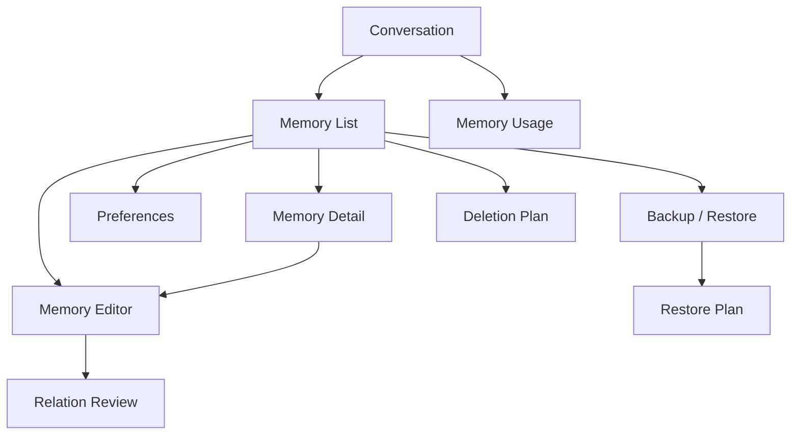

# Project Alice Phase 2 Frontend UI Design

**Version:** 2  
**Date:** 2026-09-02 JST  
**Status:** Accepted / Integrated  
**Scope:** Personal Memory management UI for Phase 2

## 1. Purpose

This document defines the remaining user-facing Phase 2 Personal Memory screens and navigation. It completes the UI contract for P2-FR-036 through P2-FR-043, P2-FR-050, and P2-FR-061 through P2-FR-065 without changing the accepted API, Database, Security, or Memory boundaries.

FUI2-001 through FUI2-030 were approved as one consolidated unit on 2026-09-02 JST. No screen-by-screen review cycle remains open.

## 2. Design Principles

- Conversation remains the primary Alice experience.
- Personal Memory management is a subordinate navigation flow, not a new top-level tab.
- UI actions and natural-language actions invoke the same Application Use Cases and Domain Rules.
- The client never infers success from timeout, disconnect, or stale local state.
- Memory content is user data, not an instruction, authorization, or source of current external truth.
- iOS is the Phase 2 target. Screen state and navigation contracts remain platform-neutral so a later desktop client can reuse them.
- The client does not persist Memory content outside the approved secure client boundary.

## 3. Navigation

The Conversation screen exposes a dedicated trailing action labelled `メモリーを管理`. This is a specific Phase 2 capability and does not introduce a generic application menu.

Navigation rules:

- The standard back action returns to the preceding screen and preserves non-sensitive filter state for the current navigation session.
- A successful create, edit, confirm, delete, restore, or preference update invalidates affected cached views and reloads authoritative server state.
- Deep links may target a Memory Detail only after authentication and allowed-device checks.
- A missing, deleted, or inaccessible Memory opens a non-content state; cached content is not displayed as if current.

## 4. Screen Inventory

| Screen | Primary responsibility |
|---|---|
| Memory List | Browse, filter, search, select, and start creation |
| Memory Detail | Show authoritative content and lifecycle metadata |
| Memory Editor | Explicitly create or edit one Memory |
| Memory Preferences | Control automatic capture and answer-time use independently |
| Memory Usage | Explain which Memories were used for one assistant response |
| Deletion Plan Review | Preview and execute multi-item, filtered, or all-Memory deletion |
| Backup / Restore Hub | Start export or inspect a restore archive |
| Restore Plan Review | Review restore effects and provide final confirmation |
| Relation Review | Resolve duplicate, merge, supersede, or conflict outcomes |

The existing specialized Restore and Relation Review rules in `frontend-design.md` remain authoritative. This document supplies their navigation context and shared screen behavior.

## 5. Shared View State

Every data screen implements these explicit states:

| State | Required behavior |
|---|---|
| Initial loading | Show progress without previously cached Memory content |
| Content | Show only authoritative, validated results |
| Empty | Explain that no item matches and offer the relevant next action |
| Refreshing | Preserve visible content but identify that refresh is in progress |
| Loading more | Keep current items and show progress at the list boundary |
| Failure | Explain recovery action; do not present partial data as complete success |

There is no client-derived `totalCount`. Pagination completion is determined only by the server cursor contract.

## 6. Memory List and Search

### 6.1 Initial list

- Default query includes all authorized active and resolved Memories, including sensitive and unconfirmed items.
- Default ordering is `updatedAt` descending.
- Initial page size is 20.
- An item shows content limited to three visual lines, Category, lifecycle state, sensitivity marker, unconfirmed marker when applicable, and `updatedAt`.
- Internal identifiers, similarity scores, fingerprints, model confidence, revision bodies, and deletion fences are never displayed.

### 6.2 Filters

A filter sheet supports Category, lifecycle state, capture type, sensitivity, and confirmation status. Applied filters are visible as removable controls. `OTHER` is a normal explicit Category filter and is not a fallback for unclassified input.

### 6.3 Search

- Search executes only on explicit submit; typing does not issue a backend request for every keystroke.
- Input follows the accepted API limit of 500 characters and 2 KiB UTF-8.
- Search uses `POST /memories/search`; the query is not written to a URL.
- Results follow the same item rendering and security rules as the list.
- A mutation or filter change discards the current cursor and reloads the first page.

## 7. Memory Detail

The detail screen shows:

- full Memory content;
- Category, capture type, sensitivity, and lifecycle state;
- created, updated, and last explicitly confirmed timestamps;
- edit and delete actions;
- an explicit confirm action when the Memory has not been confirmed or requires reconfirmation.

Confirmation updates confirmation evidence only. It does not change `AUTOMATIC` to `EXPLICIT`, silently rewrite content, or imply approval for a Tool action.

Individual deletion requires a confirmation sheet showing the selected content and Category. Swipe may reveal the delete action but may not complete deletion by itself.

## 8. Memory Editor

### 8.1 Create

The create form contains content, Category, sensitivity, and lifecycle state. Initial values are `NORMAL` sensitivity and `ACTIVE` state, but the server remains authoritative and may reject or require review. Content and Category require explicit user input; `OTHER` is never automatically selected because classification failed.

### 8.2 Edit

The edit form permits changes allowed by the accepted API contract and submits the current `ETag` through `If-Match`. Save is an explicit action; closing with unsaved changes asks whether to discard them.

On a precondition conflict:

1. keep the local draft in volatile screen state;
2. fetch and show the current server version;
3. ask the user to reapply or discard the draft;
4. never auto-merge or overwrite the newer version.

A duplicate, supersede, merge, conflict, or uncertain relationship requiring user judgment routes to Relation Review. The editor does not guess the resolution.

## 9. Memory Preferences

The screen exposes two independent switches:

- automatic Memory capture;
- use of eligible Memory when answering.

Initial values follow the accepted server defaults. Turning either switch off does not delete existing Memory. Updates show progress and commit only after an authoritative success response; optimistic success is not used. An `ETag` conflict reloads current settings and clearly reports that the requested change was not applied.

Each switch includes plain-language impact text, including that sensitive information is not automatically captured and that disabling answer-time use does not disable Memory management.

## 10. Memory Usage Transparency

An assistant response that has trace information exposes `使用したメモリー`. The Memory Usage screen shows:

- retrieval status, including `NOT_RECORDED` when no evidence was recorded;
- the eligible Memories included in the answer context;
- each referenced Memory's current status: unchanged, updated, deleted, or unavailable;
- navigation to the current Memory Detail when still authorized and available.

The screen does not reveal chain-of-thought, hidden prompts, model scores, internal ranking rationale, deleted content, or historical content that the user is no longer allowed to view.

## 11. Multi-item and All-Memory Deletion

Selection mode supports selected Memories, the current filtered scope, and all Memories. These operations never execute immediately:

1. create a deletion plan;
2. show scope, estimated impact, exclusions, and warnings;
3. require final confirmation;
4. execute using the accepted plan and confirmation token;
5. display the authoritative result.

The fixed review window is four hours and the confirmation token lifetime is 15 minutes. An expired or superseded plan must be recreated. Partial, unknown, or reconciliation-required results remain visible as distinct states with a resume or status-check action; they are never collapsed into success or failure by the client.

## 12. Backup and Restore

The Backup / Restore Hub provides two separate actions.

### 12.1 Export

- Explain archive contents, exclusions, and local-file responsibility.
- Ask for a passphrase and confirmation for the current operation only.
- Do not persist, log, auto-fill, or copy the passphrase to the clipboard.
- Show completion only after the encrypted archive is authoritatively available.

### 12.2 Restore

1. select an archive using the platform file picker;
2. enter the passphrase for inspection;
3. inspect archive compatibility and impact;
4. create a restore plan;
5. show selections, conflicts, deletion-history effects, and warnings;
6. request final confirmation;
7. execute and track the authoritative result.

If an active restore plan exists, the client offers resume or cancel according to the accepted API rules. It does not create competing plans silently. Restore warnings and deletion-history confirmation follow `frontend-design.md` Sections 21 through 23.

## 13. Relation Review

Relation Review follows `frontend-design.md` Section 24. It must show the proposed Memory, related current Memories, relation type, permitted resolutions, and the exact effect of each resolution. It binds confirmation to the relation review ID, target Memory ID, and expected version. A generic later `はい` cannot resolve another Memory conflict.

## 14. Errors and Recovery

| Condition | UI response |
|---|---|
| Validation error | Keep user input and focus the first invalid field |
| Authentication or allowed-device failure | Remove protected content and route to the approved authentication flow |
| `If-Match` conflict | Preserve volatile draft, reload current state, require a new explicit save |
| Relation review required | Route to Relation Review with the original draft context |
| Active plan conflict | Offer resume or cancel; do not create a second active plan |
| Partial or unknown operation | Show status and reconciliation action; do not infer completion |
| Service unavailable | Preserve only safe volatile input and offer retry |
| Resource deleted or inaccessible | Show a non-content state and remove stale cached content |

## 15. Privacy, Accessibility, and Desktop Compatibility

- Memory content and passphrases are excluded from analytics, crash reports, diagnostic breadcrumbs, and notification previews.
- Sensitive content is not stored in ordinary persistent UI caches.
- Screen capture risk is explained where secrets or archive passphrases are entered; platform protections are used where supported.
- Status never relies on color alone. Controls have accessible names, dynamic text is supported, and touch targets are at least 44 by 44 points.
- Truncation is limited to list presentation; the full authorized value is available on Detail.
- Desktop may use a split-view presentation later, but it must preserve the same routes, states, concurrency rules, confirmation boundaries, and privacy behavior. No Phase 2 API or Domain change is required for that layout.

## 16. Required UI Test Registry

| Test ID | Scenario |
|---|---|
| P2-FUI-TC-001 | List loading, content, empty, pagination, and failure states |
| P2-FUI-TC-002 | Explicit search submit, limits, filters, and cursor reset |
| P2-FUI-TC-003 | Detail rendering, unconfirmed banner, and confirmation |
| P2-FUI-TC-004 | Create and edit validation, cancellation, and authoritative success |
| P2-FUI-TC-005 | `ETag` conflict preserves volatile draft without auto-overwrite |
| P2-FUI-TC-006 | Relation Review navigation and binding |
| P2-FUI-TC-007 | Independent preference switches and failure rollback |
| P2-FUI-TC-008 | Usage trace unchanged, updated, deleted, unavailable, and `NOT_RECORDED` |
| P2-FUI-TC-009 | Individual deletion confirmation and stale resource handling |
| P2-FUI-TC-010 | Multi/all deletion plan, expiry, partial, and unknown result |
| P2-FUI-TC-011 | Backup passphrase privacy and authoritative completion |
| P2-FUI-TC-012 | Restore inspection, plan, warning, confirmation, resume, and result |

## 17. Decisions

| ID | Decision | Status |
|---|---|---|
| FUI2-001 | Add a dedicated Memory management action to Conversation | Accepted |
| FUI2-002 | Use a subordinate navigation stack, not a new top-level tab | Accepted |
| FUI2-003 | Adopt the nine-screen inventory in Section 4 | Accepted |
| FUI2-004 | Require the six explicit shared view states | Accepted |
| FUI2-005 | Default the list to all authorized current and resolved Memories | Accepted |
| FUI2-006 | Use the list item fields and excluded internal fields in Section 6 | Accepted |
| FUI2-007 | Provide the five-dimension filter sheet | Accepted |
| FUI2-008 | Execute search only on explicit submit | Accepted |
| FUI2-009 | Reset pagination after mutations and query changes | Accepted |
| FUI2-010 | Adopt the authoritative Detail field set | Accepted |
| FUI2-011 | Keep confirmation separate from capture type and content update | Accepted |
| FUI2-012 | Adopt the create/edit fields and safe initial values | Accepted |
| FUI2-013 | Show success only after authoritative server confirmation | Accepted |
| FUI2-014 | Preserve volatile drafts and require reapplication after conflicts | Accepted |
| FUI2-015 | Route relationship judgment to Relation Review | Accepted |
| FUI2-016 | Expose automatic capture and answer-time use independently | Accepted |
| FUI2-017 | Provide response-specific Memory Usage transparency | Accepted |
| FUI2-018 | Exclude internal reasoning, scores, prompts, and deleted content | Accepted |
| FUI2-019 | Require confirmation for individual deletion; no swipe-only delete | Accepted |
| FUI2-020 | Require plan/preview/confirm for multi, filtered, and all deletion | Accepted |
| FUI2-021 | Preserve partial and unknown operation states explicitly | Accepted |
| FUI2-022 | Provide a combined navigation hub with separate export and restore actions | Accepted |
| FUI2-023 | Keep archive passphrases operation-scoped and non-persistent | Accepted |
| FUI2-024 | Adopt inspect/plan/review/confirm/execute for restore | Accepted |
| FUI2-025 | Resume or cancel an active plan instead of silently competing | Accepted |
| FUI2-026 | Retain the accepted Relation Review presentation and binding rules | Accepted |
| FUI2-027 | Apply the existing Phase 2 client privacy boundary to every new screen | Accepted |
| FUI2-028 | Apply accessible naming, scaling, non-color status, and touch sizing | Accepted |
| FUI2-029 | Keep state and navigation contracts reusable by a future desktop layout | Accepted |
| FUI2-030 | Add P2-FUI-TC-001 through P2-FUI-TC-012 to the required test registry | Accepted |

## 18. Approval Effect

FUI2-001 through FUI2-030 were accepted on 2026-09-02 JST and integrated into `frontend-design.md`, `test-design.md`, the Phase 2 Traceability Matrix, and `memory-design.md`. P2-FINAL-CR-001 is resolved. No further Phase 2 design review is required unless an accepted Requirement or a Critical/High boundary changes.
